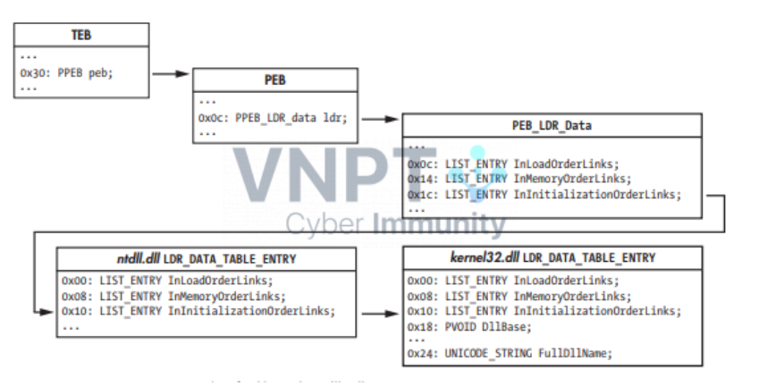

# Tuần 2
## Code Helloworld sử dụng PEB để resolve API.
 
### Giới thiệu tổng quan resolve API

Thông thường các chương trình code C/ASM sử dụng các API Windows bằng cách gọi các hàm từ các thư viện như kernel32.dll, user32.dll. ntdll.dll. 
Resolve API là việc:
  - Tự tìm địa chỉ hàm trong bộ nhớ và thực thi.
  - Thường được dùng trong malware để tránh bị phân tích.
  - Một trong những cách thức resolve API là sử dụng PEB, PEB là cấu trúc dữ liệu trong bộ nhớ chứa thông tin về môi trường của tiến trình, các thông tin về DLL đã được tải và địa chỉ của chúng.
  - Phương pháp: Một trong các cách tiếp cận phổ biến là lấy địa chỉ của PEB từ TEB (Thread Environment Block), sau đó tìm bảng Ldr trong PEB, tiếp theo là bảng InMemoryOrderModuleList chứa danh sách các DLL đã được nạp vào bộ nhớ. Sau khi xác định được các DLL, ta có thể tra cứu các API thông qua các bảng Export của DLL đó.
Quá trình cơ bản có thể được mô tả như sau:

- **TEB** (Thread Environment Block)  
  *Mỗi thread đều có một TEB*  
  - **PEB** (Process Environment Block)  
    `FS:[0x30]` trên x86, `GS:[0x60]` trên x64  
    - **Ldr** (`PEB_LDR_DATA`)  
      *Cấu trúc mô tả các DLL được load*  
      - **InMemoryOrderModuleList**  
        *Danh sách liên kết các module theo thứ tự load*  
        - **LDR_DATA_TABLE_ENTRY**  
          *Mỗi entry tương ứng với 1 DLL (vd: kernel32.dll)*  
          - **DllBase**  
            *Địa chỉ base của DLL trong memory (ImageBase)*  
            - `+0x3C` → **PE Header**  
              *`e_lfanew` – offset đến PE header*  
              - **Optional Header**
                - **Data Directory**
                  - **Export Table** (`IMAGE_EXPORT_DIRECTORY`)
                    - `AddressOfFunctions[]`  
                      *Mảng chứa RVA của các hàm*  
                    - `AddressOfNames[]`  
                      *Mảng chứa RVA tên hàm (string)*  
                    - `AddressOfNameOrdinals[]`  
                      *Mảng chứa index đến `AddressOfFunctions`*


### Từ TEB đến PEB

TEB là cấu trúc lưu thông tin về từng thread (luồng hiện đang chạy).  
[Link nguồn](https://learn.microsoft.com/en-us/windows/win32/api/winternl/ns-winternl-teb)


TEB chứa một con trỏ tới PEB.


Trên Windows 32-bit (x86)
- Thanh ghi FS chứa TEB
- PEB nằm tại offset 0x30 trong TEB


Trên Windows 64-bit (x64)
- Thanh ghi GS chứa TEB
- PEB nằm tại offset 0x60 trong TEB

Trong bài này em sẽ trình bày trên Windows-32bit (x86)
Mỗi thread sẽ có một cấu trục TEB riêng. Địa chỉ của cấu trúc TEB được lưu trong thanh ghi FS. Trong cấu trúc này chúng ta quan tâm đến trường ProcessEnvironmentBlock. Đây là con trỏ đến cấu trúc Process Environment Block (PEB). Mỗi process (tiến trình) cũng sẽ có một cấu trúc PEB riêng để lưu thông tin về process. Con trỏ đến PEB có offset 0x30 trong cấu trúc TEB. Dưới đây là cấu trúc PEB:
[Link nguồn](https://learn.microsoft.com/en-us/windows/win32/api/winternl/ns-winternl-peb)


Trong PEB, chúng ta lại quan tâm đến trường Ldr, đây là con trỏ trỏ đến cấu trúc PEB_LDR_DATA cấu trúc này chứa thông tin về dll đã được tải vào bộ nhớ, nằm tại offset 0x0c trong PEB:
[Link nguồn](https://learn.microsoft.com/en-us/windows/win32/api/winternl/ns-winternl-peb_ldr_data)

Trong cấu trúc này chứa một trường quan trọng là InMemoryOrderModuleList (nằm tại offset 0x14 trong PEB_LDR_DATA) trỏ đến cấu trúc LDR_DATA_TABLE_ENTRY, trường này chứa danh sách các dll theo thứ tự trong vùng nhớ

Cấu trúc LIST_ENTRY là một danh sách liên kết đôi trỏ đến phần tử trước và sau.


Cấu trúc LDR_TABLE_ENTRY chứa thông tin về dll đã được load. Trong đó, có một số quan trọng cần chú ý là InMemoryOrderLinks(trỏ tới LIST_ENTRY), DllBase(Địa chỉ của Dll), FullDllName(Tên của Dll ) 


Ví dụ sơ đồ tóm tắt quả trình kernel32.dll



Quá trình này chính là lấy base address của kernel32.dll. Xong bước này chúng ta sẽ đến với Parse PE Header để tìm Export Table.

### PARSE PE HEADER → LẤY EXPORT TABLE

[Tài liệu tìm hiểu về PE file một cách tổng quát khá chi tiết đầy đủ](https://hackmd.io/@Wh04m1/r1Pzr-M96)

Tìm RVA của PE Header.

RVA (Relative Virtual Address) : RVA là địa chỉ ảo tương đối, tính từ điểm bắt đầu của module (DLL hoặc EXE) khi nó được nạp vào bộ nhớ. 
Từ địa chỉ DllBase dùng e_lfanew tại offset +0x3c để tìm đến PE Header đây là RVA của PE Header, cộng thêm với địa chỉ cơ sở kernel32 base là chúng ta sẽ thu được địa thực tế của PE Header.

Từ RVA của PE Header + 78h là chúng ta sẽ đến với RVA của Export Dictionary/Table. Chúng ta lại tính địa chỉ thực tế bằng cách cộng địa chỉ cơ sở của kernel32.dll là xong.

Ví dụ ở đây của em đang là 0xB8 thì RVA Export Directory sẽ có là 0xB8 + 0x78 = 0x130


Cấu trúc Export Dictionary mô tả minh họa như hình: 


Từ đó chúng ta sẽ lấy các thông tin lấy số lượng hàm xuất tại địa chỉ thực tế ExportTable + 0x14 là ra số lượng hàm xuất của kernel32.dll. 

Lấy RVA của bảng địa chỉ hàm tại AddressOfFunctions:
Tại địa chỉ thực tế của ExportTable + 0x1c là ra được địa chỉ thực tế của bảng địa chỉ hàm.

Lấy RVA của bảng tên hàm tại AddressOfNames:
Tại địa chỉ thực tế của ExportTable + 0x20 là ra được địa chỉ thực tế của bảng tên hàm.

Lấy RVA của bảng thứ tự tên tại AddressOfOrdinals:
Tại địa chỉ thực tế của ExportTable + 0x24 là ra được địa chỉ thực tế của bảng thứ tự tên.

Sau khi có các bảng này chúng ta sẽ tiến hành tìm kiếm theo tên và trả về được địa chỉ hàm mà chúng ta mong muốn.

Bằng cách duyệt so sánh tên chúng ta sẽ có thứ tự của hàm rồi sao đó tìm lại được RVA và cuối cùng là địa chỉ thật của hàm đó.

Lưu ý bảng địa chỉ mỗi cái cách 4 bytes còn bảng thứ tự thì cách 2 bytes dùng để tính RVA cho chuẩn.


```ASM
.386 ; Chỉ định sử dụng bộ xử lí Intel 80386 trở lên
.model flat, stdcall ; Mô hình bộ nhớ phẳng và quy ước gọi hàm stdcall
.stack 4096 ; Dành riêng 4096 bytes cho ngăn xếp.
assume fs:nothing ; Cho trình biên dịch biết không đưa giả định gì về thanh ghi FS      

.data ; Phần dữ liệu đã khởi tạo                  
    helloworld db "Hello World", 0 ; Định nghĩa chuỗi Hello World kết thúc bằng null    
    helloworld_len dd $-helloworld ; Tính độ dài của helloworld ($ = địa chỉ hiện tại nên $-helloworld = độ dài)          
    bytesWritten dd 0 ; Biến để lưu số byte đã được ghi bởi WriteConsole         

.data? ; Phần dữ liệu chưa được khởi tạo
    hStdOut dd ? ; Biến để lưu handle đầu ra chuẩn (console)
.code ; Bắt đầu phần mã
    main proc ; Thủ tục hàm chính 
        call getHandle ; Gọi thủ tục để lấy handle console
        call printHello ; Gọi thủ tục để in ra "Hello World"
        call exitProcess ; Gọi để thoái chương trình.     
    main endp ; Kết thúc thủ tục chính.

    get_address proc ; Thủ tục để tìm động các hàm API Windows
        push ebp ; Lưu con trỏ cơ sở cũ
        mov ebp, esp ; Thiết lập khung ngăn xếp mới
        xor eax, eax ; Xoá thanh ghi EAX đặt lại thành 0
        mov [ebp - 4h], eax    ; [ebp-4] = Số lượng hàm xuất 
        mov [ebp - 8h], eax    ; [ebp-8] = Địa chỉ bảng địa chỉ hàm 
        mov [ebp - 0ch], eax    ; [ebp-12] = Địa chỉ bảng tên hàm 
        mov [ebp - 10h], eax    ; [ebp-16] = Địa chỉ bảng thứ tự tên 
        mov [ebp - 14h], eax    ; [ebp-20] = Sẽ lưu tên hàm cần tìm (con trỏ đến chuỗi tên hàm)
        mov [ebp - 14h], esi ; Lưu giá trị tại thanh ghi ESI vào biến cục bộ tại [ebp - 20] (tức là ebp-14h chứa offset tới chuỗi hàm chúng ta muốn thực thi)
        
        ; Mã này điều hướng qua các cấu trúc nội bộ của Windows để tìm địa chỉ cơ sở của kernel32.dll
        ; https://en.wikipedia.org/wiki/Win32_Thread_Information_Block
        ; https://sec.vnpt.vn/2023/07/tim-dia-chi-kernel32-dll-va-cac-ham-api/
        
        mov eax, [fs:30h] ; fs:[0x30] chứa con trỏ đến PEB (Process Environment Block)
        ; Thanh ghi FS trong Windows 32-bit trỏ đến TEB
        ; Offset 0x30 trong TEB chứa con trỏ đến PEB của tiến trình hiện tại

        mov eax, [eax + 0ch] ; PEB + 0x0C = PEB_LDR_DATA (Chứa thông tin về module đã nạp)

        mov eax, [eax + 14h] ; PEB_LDR_DATA + 0x14 = InMemoryOrderModuleList (danh sách module theo thứ tự nạp vào bộ nhớ)
        
        mov eax, [eax] ; Di chuyển đến module ntdll.dll
        mov eax, [eax] ; Di chuyển đến kernel32.dll

        mov eax, [eax + 10h] 
        ; Truy cập đến kernel32.DllBase (10h = -8h + 18h)
        ; Truy cập trường DllBase trong cấu trúc LDR_DATA_ENTRY
        ; eax đang trỏ đến trường InMemoryOrderLinks về đầu cấu trúc 
        ; -8h lùi lại 8 bytes để điều chỉnh từ InMemoryLinks về đầu cấu trúc
        ; + 18h: Tiến lên 0x18 = 24 để đến trường DllBase
        ; Lấy địa chỉ cơ sở của kernel32.dll
        ; DllBase chứa địa chỉ cơ sở nơi kernel32.dll được nạp vào bộ nhớ.

        ; https://hackmd.io/@Wh04m1/r1Pzr-M96
        mov ebx, eax ; Lưu địa chỉ cơ sở kernel32.dll trong ebx để tái sử dụng
        mov eax, [ebx + 3ch] 
        ; EBX + 0x3c = RVA(Relative Virtual Address đến PE header)
        ; Offset 0x3c trong header DOS chứa con trỏ đến PE header
        ; RVA (Relative Virtual Address) : RVA là địa chỉ ảo tương đối, tính từ điểm bắt đầu của module (DLL hoặc EXE) khi nó được nạp vào bộ nhớ. Đây là một offset từ địa chỉ cơ sở của module.
        add eax, ebx ; Tính địa chỉ thực tế của PE header = địa chỉ cơ sở + RVA = VA

        mov eax, [eax + 78h] ; PE header + 0x78 = RVA của bảng xuất (Export Directory)
        add eax, ebx ; Tính địa chỉ thực tế của bảng xuất = địa chỉ cơ sở + RVA

        mov ecx, [eax + 14h] ; Chứa giá trị số lượng hàm của kernel32.dll
        mov [ebp - 4h], ecx ; Lưu địa chỉ hàm vào biến cục bộ

        mov ecx, [eax + 1ch] ; Export Directory + 0x1c = RVA của AddressOfFuntions (mảng địa chỉ hàm)
        add ecx, ebx ; Tính địa chỉ thực tế
        mov [ebp - 8h], ecx ; Lưu địa chỉ hàm vào biến cục bộ

        mov ecx, [eax + 20h] ; Export Directory + 0x20 = RVA của AddressOfNames (mảng tên hàm)
        add ecx, ebx ; Tính địa chỉ thực tế
        mov [ebp - 0ch], ecx ; Lưu lại vừa biến cực bộ

        mov ecx, [eax + 24h] ; Export Directory + 0x24 = RVA của AddressOfOrdinals (mảng thứ tự tên)
        add ecx, ebx ; Tính địa chỉ thực té
        mov [ebp - 10h], ecx ; Lưu lại vào biến cục bộ
    
        mov eax, 0 ; Xóa eax 
        mov ecx, 0 ; Xóa ecx
            
        findFunc: ; Bắt đầu vòng lặp tìm theo tên 
            mov esi, [ebp - 14h] ; Nạp con trỏ đến tên hàm cần tìm esi, esi trỏ đến chuỗi nguồn trong lệnh so sánh chuỗi
            mov edi, [ebp - 0ch] ; Nạp địa chỉ mảng tên hàm vào EDI, EDI điều chỉnh đến tên hàm hiện tại 
            cld
            ; Xóa cờ hướng (Direction Flag) - xử lý chuỗi từ trái sang phải
            ; Đảm bảo lệnh cmpsb so sánh theo thứ tự tăng dần địa chỉ
            mov edi, [edi + eax*4] ; Lấy RVA của tên hàm hiện tại (mỗi phần tử trong mảng tên là 4 bytes)
            add edi, ebx ; Tính địa chỉ thực tế 
            mov cx, 8 ; so sánh tối đa 8 kí tự (đủ cho hầu hết các hàm API)
            repe cmpsb 
            ; So sánh chuỗi từng byte một (ESI với EDI), giảm cx sau mỗi lần so sánh
            ; Lệnh này sẽ dừng khi tìm thấy 1 byte khác hoặc CX = 0  
            ; repe = repeat while equal - lặp lại khi các byte bằng nhau    
            jz Found ; Nếu ZF = 1 nhảy đến FunctionFound
            inc eax ; Tăng bộ đếm hàm
            cmp eax, [ebp - 4h] ; So sánh với tổng số hàm
            jne findFunc ; Nếu chưa kiểm tra hết thì tiếp tục vòng lặp

        Found: 
        ; Đã tìm thấy tên hàm phù hợp
        ; eax chứa chỉ số của hàm trong bảng tên
            mov ecx, [ebp - 10h] ; Nạp địa chỉ bảng thứ tự tên.
            mov edx, [ebp - 8h] ; Nạp địa chỉ bảng địa chỉ hàm.
        ; Qúa trình chuyển đổi Tên hàm -> Thứ tự -> Địa chỉ hàm
            mov ax, [ecx + eax * 2] ; Lấy thứ tự cho hàm (mỗi phần tử trong mảng thứ tự là 2 bytes)
         
            mov eax, [edx + eax * 4] ; Lấy RVA của hàm từ bảng địa chỉ (mỗi phần tử là 4 bytes)
            add eax, ebx ; Tính địa chỉ thực tế
        mov esp,ebp  ; Giaỉ phóng 20 bytes biến cục bộ trên stack
        pop ebp ; Khôi phục con trỏ khung cơ sở cũ
        ret ; trả về với địa chỉ hàm trong eax
    get_address endp

    GetStdHandle proc              ; Thủ tục để lấy địa chỉ của API GetStdHandle
        push ebp                   ; Lưu con trỏ khung cơ sở cũ
        mov ebp, esp               ; Thiết lập khung ngăn xếp mới
        
        ; Đẩy tên hàm "GetStdHandleA" lên stack theo từng phần 4 byte (đảo ngược do little-endian)
        push 0041h                 ; Đẩy "A\0\0\0" (A + 3 byte null)
        push 656c646eh             ; Đẩy "ndle" (hex: 6e 64 6c 65)
        push 61486474h             ; Đẩy "tdHa" (hex: 74 64 48 61)
        push 53746547h             ; Đẩy "GetS" (hex: 47 65 74 53)
                                   ; Bây giờ "GetStdHandleA" đã nằm trên ngăn xếp
        mov esi, esp               ; Trỏ ESI đến tên hàm trên ngăn xếp
        call get_address           ; Gọi thủ tục để tìm địa chỉ hàm
        mov esp,ebp              ; Dọn dẹp 16 byte trên ngăn xếp (xóa tên hàm)
        pop ebp                    ; Khôi phục con trỏ khung cơ sở cũ
        ret                        ; Trả về với địa chỉ hàm trong EAX
    GetStdHandle endp

    getHandle proc                 ; Thủ tục để lấy handle đầu ra console
        push ebp                   ; Lưu con trỏ khung cơ sở cũ
        mov ebp, esp               ; Thiết lập khung ngăn xếp mới
        call GetStdHandle          ; Lấy địa chỉ của API GetStdHandle (kết quả trong EAX)
        push -11                   ; Đẩy hằng số STD_OUTPUT_HANDLE (-11) làm tham số
        call eax                   ; Gọi GetStdHandle(-11) để lấy handle console
        mov hStdOut, eax           ; Lưu handle vào biến toàn cục hStdOut
        pop ebp                    ; Khôi phục con trỏ khung cơ sở cũ
        ret                        ; Trả về
    getHandle endp

    WriteConsoleA proc             ; Thủ tục để lấy địa chỉ của API WriteConsoleA
        push ebp                   ; Lưu con trỏ khung cơ sở cũ
        mov ebp, esp               ; Thiết lập khung ngăn xếp mới
        
        ; Đẩy tên hàm "WriteConsoleA" lên stack theo từng phần 4 byte (đảo ngược do little-endian)
        push 0041h                 ; Đẩy "A\0\0\0" (A + 3 byte null)
        push 656c6f73h             ; Đẩy "sole" (hex: 73 6f 6c 65)
        push 6e6f4365h             ; Đẩy "eCon" (hex: 65 43 6f 6e)
        push 74697257h             ; Đẩy "Writ" (hex: 57 72 69 74)
                                   ; Bây giờ "WriteConsoleA" đã nằm trên ngăn xếp
        mov esi, esp               ; Trỏ ESI đến tên hàm trên ngăn xếp
        call get_address           ; Gọi thủ tục để tìm địa chỉ hàm
        mov esp,ebp              ; Dọn dẹp 16 byte trên ngăn xếp
        pop ebp                    ; Khôi phục con trỏ khung cơ sở cũ
        ret                        ; Trả về với địa chỉ hàm trong EAX
    WriteConsoleA endp

    printHello proc                ; Thủ tục để in "Hello World"
        push ebp                   ; Lưu con trỏ khung cơ sở cũ
        mov ebp, esp               ; Thiết lập khung ngăn xếp mới
        call WriteConsoleA         ; Lấy địa chỉ của API WriteConsoleA (kết quả trong EAX)
        
        ; Đẩy các tham số cho WriteConsoleA theo thứ tự ngược (do quy ước stdcall)
        push 0                     ; Tham số thứ 5: lpReserved - phải là 0
        push offset bytesWritten   ; Tham số thứ 4: lpNumberOfCharsWritten - địa chỉ để lưu số byte đã ghi
        push helloworld_len              ; Tham số thứ 3: nNumberOfCharsToWrite - độ dài chuỗi cần ghi
        push offset helloworld           ; Tham số thứ 2: lpBuffer - địa chỉ của chuỗi cần ghi
        push hStdOut               ; Tham số thứ 1: hConsoleOutput - handle console
        call eax                   ; Gọi WriteConsoleA với các tham số đã đẩy
        pop ebp                    ; Khôi phục con trỏ khung cơ sở cũ
        ret                        ; Trả về
    printHello endp

    ExitProcessFunc proc           ; Thủ tục để lấy địa chỉ của API ExitProcess
        push ebp                   ; Lưu con trỏ khung cơ sở cũ
        mov ebp, esp               ; Thiết lập khung ngăn xếp mới
        
        ; Đẩy tên hàm "ExitProcess" lên stack theo từng phần 4 byte (đảo ngược do little-endian)
        push 00737365h             ; Đẩy "ess\0" (hex: 65 73 73 00)
        push 636f7250h             ; Đẩy "Proc" (hex: 50 72 6f 63)
        push 74697845h             ; Đẩy "Exit" (hex: 45 78 69 74)
                                   ; Bây giờ "ExitProcess" đã nằm trên ngăn xếp
        mov esi, esp               ; Trỏ ESI đến tên hàm trên ngăn xếp
        call get_address           ; Gọi thủ tục để tìm địa chỉ hàm
        mov esp,ebp               ; Dọn dẹp 12 byte trên ngăn xếp
        pop ebp                    ; Khôi phục con trỏ khung cơ sở cũ
        ret                        ; Trả về với địa chỉ hàm trong EAX
    ExitProcessFunc endp

    exitProcess proc               ; Thủ tục để thoát chơng trình
        push ebp                   ; Lưu con trỏ khung cơ sở cũ
        mov ebp, esp               ; Thiết lập khung ngăn xếp mới
        call ExitProcessFunc       ; Lấy địa chỉ của API ExitProcess (kết quả trong EAX)
        push 0                     ; Đẩy tham số: mã thoát 0 (thành công)
        call eax                   ; Gọi ExitProcess(0) - kết thúc chương trình
    exitProcess endp

    end main                       ; Kết thúc chương trình, chỉ định điểm vào là thủ tục main
```