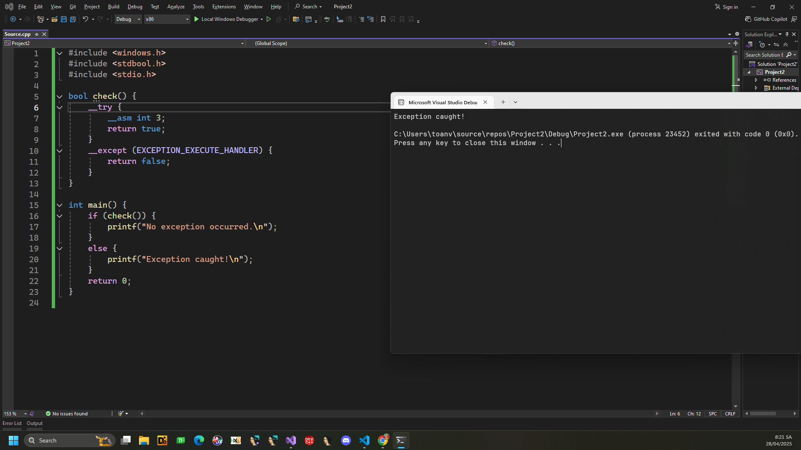
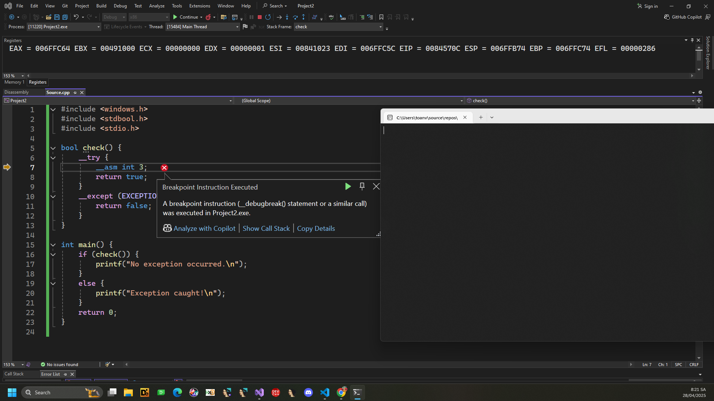
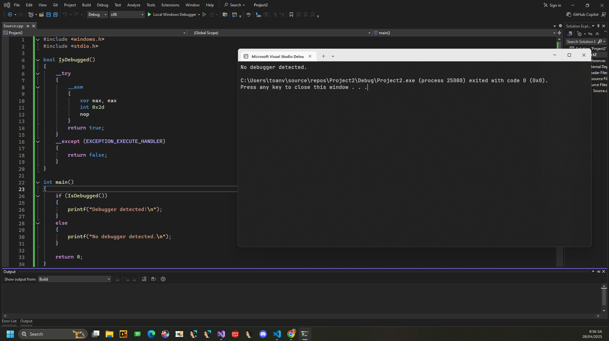
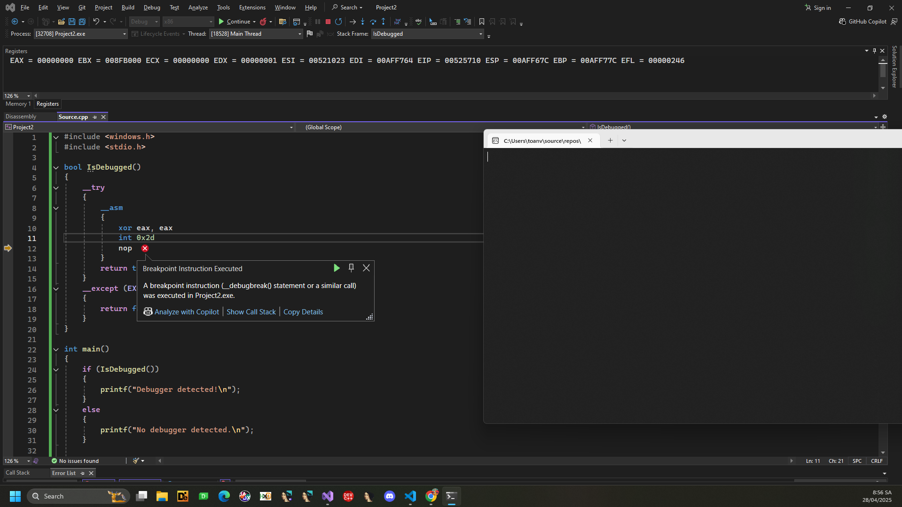

# Anti-Debug: Assembly instructions

## Assembly instructions

Các kỹ thuật sau đây nhằm mục đích phát hiện sự hiện diện của trình gỡ lỗi dựa trên các trình gỡ lỗi hoạt động khi CPU thực thi một số lệnh nhất định.

### 1. INT 3

Lệnh ```INT3``` là một lện ngắt sử dụng như một điểm dừng phần mềm (software breakpoint). Trong trường hợp không có debugger, câu lệnh này sẽ raise EXCEPTION_BREAKPOINT (0x80000003) exception và một exception handler sẽ được gọi.

Nếu có debugger, luồng điều khiển sẽ không được đưa tới exception handler để xử lý.

```C
#include <windows.h>
#include <stdbool.h>
#include <stdio.h>

bool check() {
    __try {
        __asm int 3; 
        return true;
    }
    __except (EXCEPTION_EXECUTE_HANDLER) {
        return false;
    }
}

int main() {
    if (check()) {
        printf("No exception occurred.\n");
    }
    else {
        printf("Exception caught!\n");
    }
    return 0;
}

```

Khi không debug



Có debug




Ngoài dạng ngắn của lệnh INT3 (opcode 0xCC), còn có một dạng dài của lệnh này: opcode CD 03.

Khi ngoại lệ EXCEPTION_BREAKPOINT xảy ra, Windows sẽ giảm thanh ghi EIP xuống vị trí được giả định chứa opcode 0xCC và chuyển quyền điều khiển cho trình xử lý ngoại lệ. Tuy nhiên, trong trường hợp dạng dài của lệnh INT3, EIP sẽ trỏ vào giữa lệnh (tức là trỏ vào byte 0x03). Vì vậy, EIP cần được chỉnh sửa trong trình xử lý ngoại lệ nếu ta muốn tiếp tục thực thi sau lệnh INT3 (nếu không, rất có thể sẽ xảy ra lỗi EXCEPTION_ACCESS_VIOLATION). Nếu không cần tiếp tục thực thi, ta có thể bỏ qua việc chỉnh sửa con trỏ lệnh.


### 2. INT 2D

Giống như lệnh INT3, khi lệnh INT 2D được thực thi một ngoại lệ ```EXCEPTION BREAKPOINT``` cũng được kích hoạt. Tuy nhiên, với INT 2D, Windows sử dụng thanh ghi EIP làm địa chỉ ngoại lệ, sau đó tự động tăng giá trị EIP lên. Đồng thời, Windows cũng kiểm tra giá trị của thanh ghi EAX trong lúc thực thi INT 2D.

Nếu giá trị EAX là 1,3 hoặc 4 trên tất cả các phiên bản Windows, hoặc là 5 trên Windows Vista trở lên, thì địa chỉ ngoại lệ (EIP) sẽ được tăng thêm 1 byte nữa.

Gây vấn đề cho debugger vì sau khi EIP bị tăng, byte nằm ngay sau lệnh INT 2D sẽ bị bỏ qua, chương trình có thể thực thi 1 lệnh đã bị hỏng. 

Trong ví dụ người ta đặt một lệnh NOP dài 1 byte ngay sau khi INT 2D để đảm bảo luôn bỏ qua byte đóng trong mọi trường hợp. Nếu chương trình được thực thi mà không có debugger, quyền điều khiển sẽ được chuyển tới exception handler.

```C
#include <windows.h>
#include <stdio.h>

bool IsDebugged()
{
    __try
    {
        __asm
        {
            xor eax, eax
            int 0x2d
            nop
        }
        return true;
    }
    __except (EXCEPTION_EXECUTE_HANDLER)
    {
        return false;
    }
}

int main()
{
    if (IsDebugged())
    {
        printf("Debugger detected!\n");
    }
    else
    {
        printf("No debugger detected.\n");
    }

    return 0;
}

```
Không debug 




Có debug



### 3. DebugBreak

[DebugBreak](https://learn.microsoft.com/en-us/windows/win32/api/debugapi/nf-debugapi-debugbreak)

Gây ra một ngoại lệ breakpoint trong tiến trình hiện tại. Điều này cho phép luồng gọi thông báo cho trình gỡ lỗi ngoại lệ đó.

Nếu chương trình được thực thi mà không có debugger, quyền điều khiển sẽ được chuyển đến bộ xử lý ngoại lệ. Ngược lại, nếu có debugger, quá trình thực thi sẽ bị chặn lại và chuyển giao cho debugger.

```C
__try{
    DebugBreak();
}
__except(EXCEPTION_BREAKPOINT){
    return false;
}

return true;

```

### 4. ICE

Là một trong các lệnh không được tài liệu hóa của Intel. Mã opcode của nó là 0xF1. Nó có thể được sử dụng để phát hiện liệu chương trình có đang bị theo dõi (traced) hay không.

Khi lệnh ICE được thực thi, ngoại lệ EXCEPTION_SINGLE_STEP (0x80000004) sẽ được tạo ra.

Tuy nhiên , nếu chương trình đã được theo dõi, trình gỡ lỗi sẽ coi ngoại lệ này là bình thường được tạo ra bởi việc thực thi lệnh với bit SingleStep trong thanh ghi Flags đã được bật. Do đó, dưới một trình gỡ lỗi, bộ xử lý ngoại lệ sẽ không được gọi và chương trình sẽ tiếp tục thực thi sau lệnh ICE.

Do đó, dưới một trình gỡ lỗi, bộ xử lý ngoại lệ sẽ không được gọi và chương trình sẽ tiếp tục thực thi sau lệnh ICE.

```C
bool IsDebugged()
{
    __try
    {
        __asm __emit 0xF1;
        return true;
    }
    __except(EXCEPTION_EXECUTE_HANDLER)
    {
        return false;
    }
}
```

### 5. Stack Segment Register

Đây là một thủ thuật được sử dụng để phát hiện xem chương trình có bị theo dõi không, bằng cách truy tìm chỗi instructions sau 


```ASM
push ss 
pop ss 
pushf
```

Sau khi thực hiện step-by-step qua đoạn mã này, Trap Flag sẽ được set. Nhưng debugger thường tự động xóa Trap Flag, nên ta phải push EFLAGS lên stack để tự kiểm tra.
[Trap Flag](https://en.wikipedia.org/wiki/Trap_flag)

```C
bool IsDebugged() {
    bool bTraced = false;

    __asm {
        push ss
        pop ss
        pushf
        test byte ptr [esp+1], 1 // kiểm tra Trap Flag
        jz movss_not_being_debugged
    }

    bTraced = true; // Nếu trap flag set => đang bị debug

movss_not_being_debugged:
    __asm popf; // phục hồi EFLAGS
    return bTraced;
}
```
### 6. Counting

Sử dụng trình gỡ lỗi cho EXCEPTION_SINGLE_STEP.

Cách làm làm là:
- Tạo mỗi chuỗi các lệnh nop
- Đặt hardware breakpoint vào từng lệnh nop.
- Mỗi lần breakpoint bị hit, vectored exception handler sẽ tăng bộ đếm (EAX)và nhảy sang lệnh tiếp theo.
- Nếu số lượng không đúng như mong đợi thì chương trình đang bị debug.

### 7. POPF và Trap Flag

Set trực tiếp Trap Flag bằng cách sửa EFLAGS.

Nếu Trap Flag thực sự được bật thì chương trình sẽ gây ra EXCEPTION_SINGLE_STEP.

Nếu không thấy exception => đang bị debugger (vì debugger đã clear Trap Flag).


### 8.Instruction Prefixes

Lợi dụng debugger khi gặp các prefixes. 

Một số debugger như OllyDbg xử lý không chuẩn các prefix byte như 0xF3 (REP) hoặc 0x64 (FS: segment override).
Thực tế, lệnh ```F3 64 F1 là```:

```F3``` (prefix REP)

```64``` (prefix FS override)

```F1``` (lệnh INT1 - tạo interrupt)


Nếu debugger bỏ qua prefix thì nó sẽ không gây exception => Phát hiện bị debug.

## Mitigation 

Khi debug bằng tay: Patch những đoạn kiểm tra này thành NOP để bỏ qua.

Chạy chương trình: Đặt breakpoint sau đoạn kiểm tra, rồi chạy tới đó thay vì từng bước (step-by-step).

