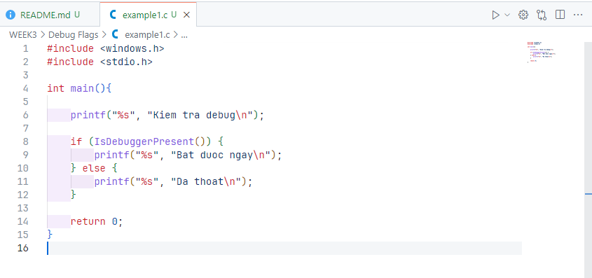
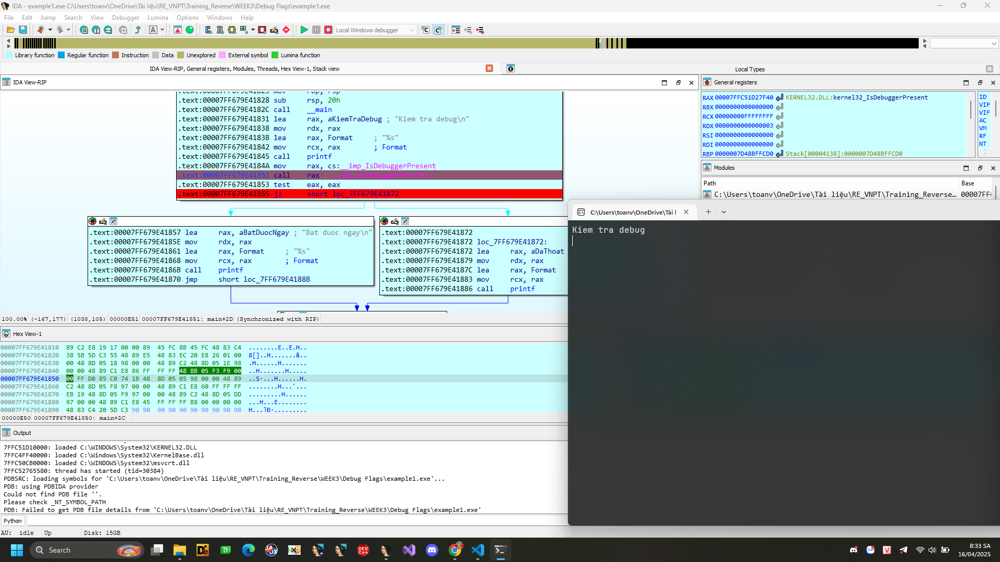
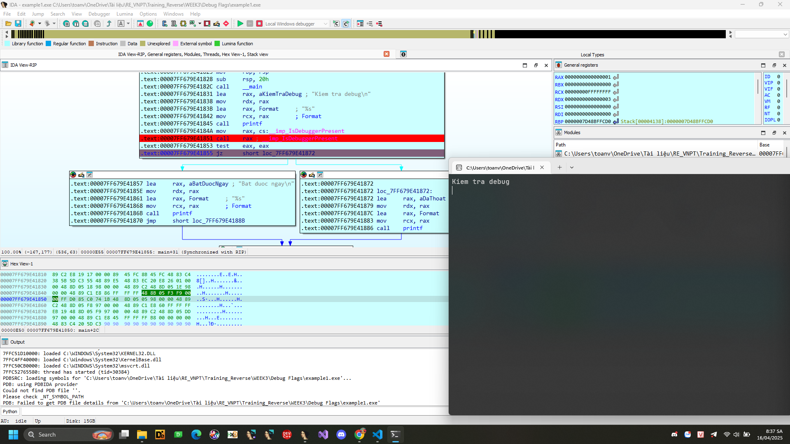
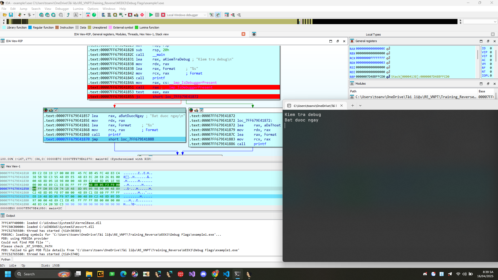
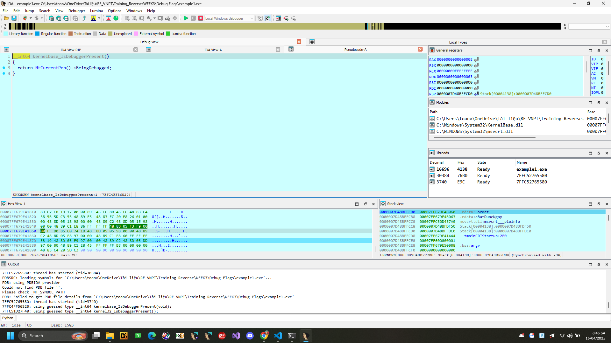
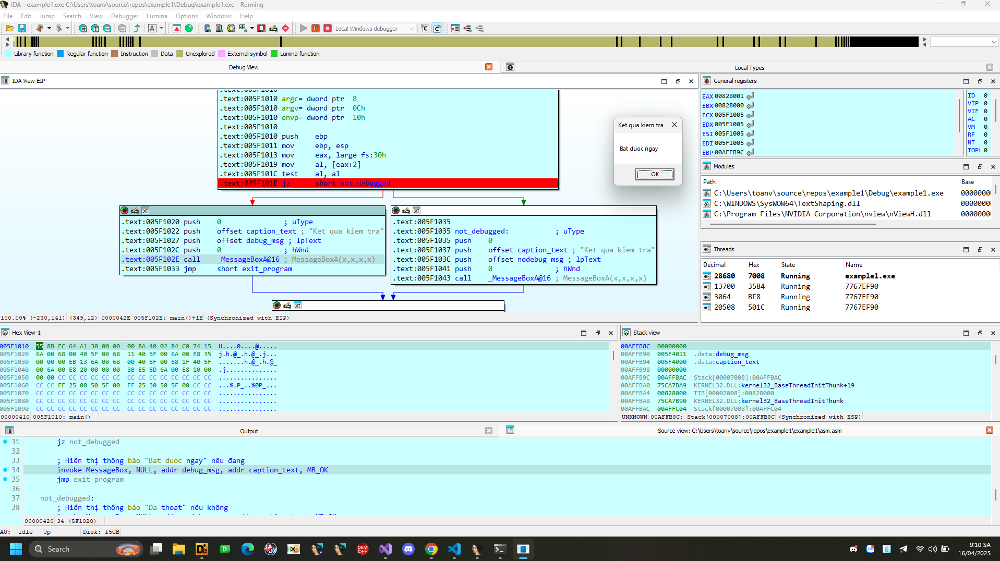
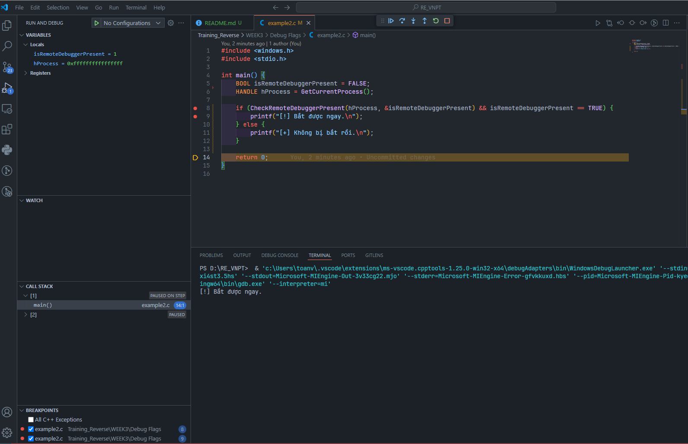
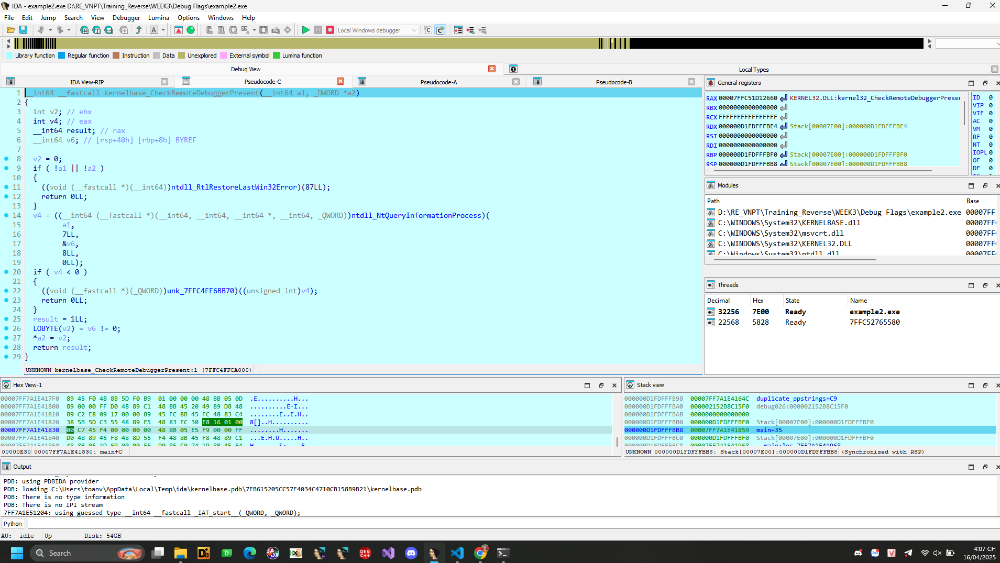
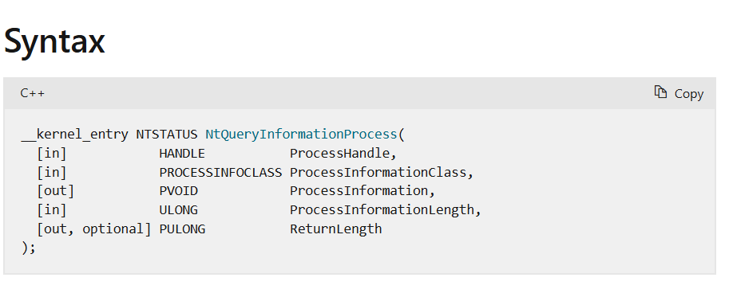

# Anti-Debug: Debug Flags

## Nội dung

## Debug Flags (Cờ gỡ lỗi)
Trong phần này có khái niệm bảng hệ thống: 
**System tables** (các bảng hệ thống) là các cấu trúc dữ liệu trong bộ nhớ do hệ điều hành quản lý, chứa thông tin về tiến trình, luồng, và trạng thái hệ thống.
Ví dụ:

**PEB**: lưu thông tin tiến trình, có cờ BeingDebugged để kiểm tra tiến trình có đang bị debug.

**TEB**: lưu thông tin luồng, chứa con trỏ đến **PEB**.

Các cờ đặc biệt trong bảng hệ thống, nằm trong bộ nhớ tiến trình và được hệ điều hành thiết lập, có thể được sử dụng để chỉ ra rằng một tiến trình đang bị gỡ lỗi. Trạng thái của các cờ này có thể được kiểm tra thông qua việc sử dụng các hàm API cụ thể hoặc bằng cách kiếm tra trực tiếp các bảng hệ thống trong bộ nhớ.

Đây là kĩ thuật được phần mềm độc hại hay sử dụng nhất.

## 1.Using Win32 API (Sử dụng Win32 API)

Các kĩ thuật sau đây sử dụng các hàm API có sẵn (WinAPI hoặc NativeAPI) để kiểm tra các cấu trúc hệ thống trong bộ nhớ tiến trình nhằm tìm các cờ (flags) đặc biệt cho thấy chương trình đang bị gỡ lỗi.


### 1.1 IsDebuggerPresent()

Hàm **kernel32!IsDebuggerPresent(**) xác định xem tiến trình hiện tại có đang bị gỡ lỗi bởi chế độ người dùng (user-mode) như OllyDbg or x64dbg. Thông thường, hàm này chỉ kiểm tra cờ **BeingDebugged** trong môi trường khối tiến trình (PEB - Process Environment Block) 


Đoạn mã sau có khả năng chấm dứt tiến trình nếu nó đang bị gỡ lỗi.
[Source code](./example1.c)


Ném thử vào trong IDA, thử 



Oke như vậy chúng ta thấy đã load địa chỉ của KERNEL32.DLL:kernel32_IsDebuggerPresent vào RAX rồi gọi. Sau khi gọi xong nó lưu kết quả lại eax. Oke clear.







Oke thử code bằng MASM lấy giá trị BeingDebugger trong PEB thử.
[Source code](./example1.asm)

```ASM
.386 ; Chỉ định sử dụng bộ xử lí Intel 80386 trở lên
.model flat, stdcall ; Mô hình bộ nhớ phẳng và quy ước gọi hàm stdcall
option casemap:none ; Phân biệt chữ hoa chữ thường

; Khai báo thư viện Windows API
include \masm32\include\windows.inc
include \masm32\include\kernel32.inc
include \masm32\include\user32.inc
includelib \masm32\lib\kernel32.lib
includelib \masm32\lib\user32.lib

.data
    caption_text db "Ket qua kiem tra", 0
    debug_msg db "Bat duoc ngay", 0
    nodebug_msg db "Da thoat", 0

.stack 4096 ; Dành riêng 4096 bytes cho ngăn xếp.
assume fs:nothing ; Cho trình biên dịch biết không đưa giả định gì về thanh ghi FS    

.code ; Bắt đầu phần mã
    main proc ; Thủ tục hàm chính 
        push ebp ; Lưu con trỏ cơ sở cũ
        mov ebp, esp ; Thiết lập khung ngăn xếp mới
        
        ; Truy cập Process Environment Block để kiểm tra BeingDebugged
        mov eax, [fs:30h] ; fs:[0x30] chứa con trỏ đến PEB (Process Environment Block)
        mov al, byte ptr [eax + 02h] ; Truy cập BeingDebugged flag (offset 0x02 trong PEB)
        
        ; Kiểm tra giá trị BeingDebugged
        test al, al
        jz not_debugged
        
        ; Hiển thị thông báo "Bat duoc ngay" nếu đang bị debug
        invoke MessageBox, NULL, addr debug_msg, addr caption_text, MB_OK
        jmp exit_program
        
    not_debugged:
        ; Hiển thị thông báo "Da thoat" nếu không bị debug
        invoke MessageBox, NULL, addr nodebug_msg, addr caption_text, MB_OK
        
    exit_program:
        ; Dọn dẹp và trả về
        mov esp, ebp ; Khôi phục stack pointer
        pop ebp ; Khôi phục ebp cũ
        
        ; Kết thúc chương trình
        invoke ExitProcess, 0
    main endp ; Kết thúc thủ tục chính.
end main ; Kết thúc chương trình, chỉ định điểm vào là thủ tục main
```
 

Logic tương tự phần trước như code C. Dễ ràng có thể bypass bằng cách chỉnh cờ, lệnh hoặc giá trị trả về.

### 1.2. CheckRemoteDebuggerPresent()

Hàm **kernel32!CheckRemoteDebuggerPresent()** kiểm tra xem có trình gỡ lỗi (debugger) nào đang được gắn vào tiến trình hiện tại từ một tiến trình khác trên cùng một máy hay không.


Ví dụ sử dụng code C
[Source code](./example2.c)


Thả vào IDA xem thử bên trong nó là gì ? 



Trong đây chúng ta quan tâm đến ntdll_NtQueryInformationProcess có vẻ lời gọi hàm này chính là để kiểm tra kết quả là chương trình có đang bị debug hay không ?. Cũng tìm hiểu phần sau thử. 

### 1.3. NtQueryInformationProcess()
[Link tài liệu](https://learn.microsoft.com/en-us/windows/win32/api/winternl/nf-winternl-ntqueryinformationprocess)
Hàm ntdll!NtQueryInformationProcess() có thể được sử dụng để lấy nhiều loại thông tin khác nhau từ một tiến trình. 
Nó nhận 1 tham số ProcessInfomationClass, tham số này xác định loại thông tin bạn muốn lấy và đồng thời xác định kiểu dữ liệu đầu ra của tham số ProcessInformation.




#### 1.3.1. ProcessDebugPort
Có thể lấy được số cổng (port) của trình gỡ lỗi (debugger) cho tiến trình bằng cách sử dụng hàm ntdll!NtQueryInformationProcess(). 

Có một lớp (class) được tài liệu hóa tên là ProcessDebugPort, lớp này trả về một giá trị DWORD bằng 0xFFFFFFFF (thập phân là -1) nếu tiến trình đang bị gỡ lỗi.


[Source code](./example3.c)


```C
#include <windows.h>
#include <winternl.h>
#include <stdio.h>
typedef NTSTATUS (NTAPI *TNtQueryInformationProcess)(
    HANDLE           ProcessHandle,
    PROCESSINFOCLASS ProcessInformationClass,
    PVOID            ProcessInformation,
    ULONG            ProcessInformationLength,
    PULONG           ReturnLength
);

int main()
{
    HMODULE hNtdll = LoadLibraryA("ntdll.dll");
    if (!hNtdll) {
        fprintf(stderr, "Failed to load ntdll.dll\n");
        return 1;
    }

    TNtQueryInformationProcess pfnNtQueryInformationProcess = 
        (TNtQueryInformationProcess)GetProcAddress(hNtdll, "NtQueryInformationProcess");

    if (!pfnNtQueryInformationProcess) {
        fprintf(stderr, "Failed to get NtQueryInformationProcess\n");
        return 1;
    }

    ULONG_PTR debugPort = 0;
    ULONG returnedLength = 0;

    NTSTATUS status = pfnNtQueryInformationProcess(
        GetCurrentProcess(),
        (PROCESSINFOCLASS)7, 
        &debugPort,
        sizeof(debugPort),
        &returnedLength
    );

    if (NT_SUCCESS(status)) {
        printf("ProcessDebugPort: 0x%p\n", (PVOID)debugPort);

        if (debugPort == (ULONG_PTR)-1) {
            printf("Debugger detected via ProcessDebugPort!\n");
            ExitProcess(-1);
        }
    } else {
        fprintf(stderr, "NtQueryInformationProcess failed: 0x%08X\n", status);
    }
    return 0;
}
```
#### 1.3.2. ProcessDebugFlags

Một cấu trúc có tên là [EPROCESS](https://www.nirsoft.net/kernel_struct/vista/EPROCESS.html) đại diện cho một đối tượng tiến trình (project object), chứa trường NoDebugInherit.Giá trị đảo ngược này có thể được truy xuất bằng cách sử dụng một lớp không được công bố (undocumented class) có tên là ProcessDebugFlags (0x1F). Do đó nếu giá trị trả về là 0 điều đó cho thấy đang có trình gỡ lỗi (debugger) hiện diện.

[Source code](./example4.c)


```C
#include <windows.h>
#include <winternl.h>
#include <stdio.h>

typedef NTSTATUS (NTAPI *TNtQueryInformationProcess)(
    HANDLE ProcessHandle,
    PROCESSINFOCLASS ProcessInformationClass,
    PVOID ProcessInformation,
    ULONG ProcessInformationLength,
    PULONG ReturnLength OPTIONAL
);

int main() {
    HMODULE hNtDll = GetModuleHandleA("ntdll.dll");
    if (!hNtDll) {
        printf("Khong the tai ntdll.dll\n");
        return 1;
    }

    TNtQueryInformationProcess NtQueryInformationProcess =
        (TNtQueryInformationProcess)GetProcAddress(hNtDll, "NtQueryInformationProcess");
    if (!NtQueryInformationProcess) {
        printf("Khong the lay dia chi NtQueryInformationProcess\n");
        return 1;
    }

    ULONG debugFlags = 0;

    NTSTATUS status = NtQueryInformationProcess(
        GetCurrentProcess(),        
        (PROCESSINFOCLASS)0x1F,    
        &debugFlags,                
        sizeof(debugFlags),         
        NULL                        
    );

    if (status == 0 ) {
        if (debugFlags == 0) {
            printf("[!] Da phat hien debugger (debugFlags = 0)\n");
        } else {
            printf("[+] Khong phat hien debugger (debugFlags = %lu)\n", debugFlags);
        }
    } else {
        printf("Loi khi goi NtQueryInformationProcess: 0x%X\n", status);
    }

    return 0;
}
```
#### 1.3.3. ProcessDebugObjectHandle

Trong khi quá trình gỡ lỗi bắt đầu, một đối tượng kernel có tên là "debug object" (đối tượng gỡ lỗi) sẽ được tạo ra. Ta có thể truy vấn giá trị của handle (trình xử lí) đến tối tượng này bằng 1 lớp không được công bố ProcessDebugObjectHandle (0x1e)

```C
#include <windows.h>
#include <winternl.h>
#include <stdio.h>

typedef NTSTATUS (NTAPI *TNtQueryInformationProcess)(
    HANDLE ProcessHandle,
    DWORD ProcessInformationClass,
    PVOID ProcessInformation,
    ULONG ProcessInformationLength,
    PULONG ReturnLength
);

int main()
{
    HMODULE hNtdll = LoadLibraryA("ntdll.dll");
    if (hNtdll)
    {
        TNtQueryInformationProcess pfnNtQueryInformationProcess = 
            (TNtQueryInformationProcess)GetProcAddress(hNtdll, "NtQueryInformationProcess");

        if (pfnNtQueryInformationProcess)
        {
            DWORD dwReturned = 0;
            HANDLE hProcessDebugObject = NULL;
            const DWORD ProcessDebugObjectHandle = 0x1E;

            NTSTATUS status = pfnNtQueryInformationProcess(
                GetCurrentProcess(),
                ProcessDebugObjectHandle,
                &hProcessDebugObject,
                sizeof(HANDLE),
                &dwReturned);

            if (status == 0 && hProcessDebugObject != NULL)
            {
                MessageBoxA(NULL, "Bi be r", "Status", MB_OK);
                ExitProcess(-1);
            }
        }
    }

    MessageBoxA(NULL, "Khong bi be", "Status", MB_OK);
    return 0;
}

```
## 1.4. RtlQueryProcessHeapInformation()

Hàm **ntdll!RtlQueryProcessHeapInformation()** có thể được sử dụng để đọc các cờ (flags) của heap từ bộ nhớ tiến trình của tiến trình hiện tại.

```C
bool Check()
{
    ntdll::PDEBUG_BUFFER pDebugBuffer = ntdll::RtlCreateQueryDebugBuffer(0, FALSE);
    if (!SUCCEEDED(ntdll::RtlQueryProcessHeapInformation((ntdll::PRTL_DEBUG_INFORMATION)pDebugBuffer)))
        return false;

    ULONG dwFlags = ((ntdll::PRTL_PROCESS_HEAPS)pDebugBuffer->HeapInformation)->Heaps[0].Flags;
    return dwFlags & ~HEAP_GROWABLE;
}
```
## 1.5. RtlQueryProcessDebugInformation()

Hàm **ntdll!RtlQueryProcessDebugInformation()** có thể được sử dụng để đọc một số trường nhất định trong bộ nhớ tiến trình của tiến trình được yêu cầu, bao gồm cả các cờ heap (heap flags).

```C
bool Check()
{
    ntdll::PDEBUG_BUFFER pDebugBuffer = ntdll::RtlCreateQueryDebugBuffer(0, FALSE);
    if (!SUCCEEDED(ntdll::RtlQueryProcessDebugInformation(GetCurrentProcessId(), ntdll::PDI_HEAPS | ntdll::PDI_HEAP_BLOCKS, pDebugBuffer)))
        return false;

    ULONG dwFlags = ((ntdll::PRTL_PROCESS_HEAPS)pDebugBuffer->HeapInformation)->Heaps[0].Flags;
    return dwFlags & ~HEAP_GROWABLE;
}
```
## 1.6 NtQuerySystemInformation()

Hàm **ntdll!NtQuerySystemInformation()** chấp nhận 1 tham số là lớp thông tin truy vấn. Hầu hết các giá trị này không được tài liệu hóa. Điều này bao gồm lớp **SystemKernelDebuggerInformation (0x23)** đã tồn tại từ Windows NT. Lớp **SystemKernelDebuggerInformation** trả về giá trị của hai cờ: KdDebuggerEnabled trong thanh ghi **al**, và **KdDebuggerNotPresent** trong thanh ghi **ah**. Do đó nếu có trình gỡ lỗi (kernel debugger) đang hoạt động, thì giá trị trả về trong **ah** sẽ bằng 0.


```C
enum { SystemKernelDebuggerInformation = 0x23 };

typedef struct _SYSTEM_KERNEL_DEBUGGER_INFORMATION { 
    BOOLEAN DebuggerEnabled; 
    BOOLEAN DebuggerNotPresent; 
} SYSTEM_KERNEL_DEBUGGER_INFORMATION, *PSYSTEM_KERNEL_DEBUGGER_INFORMATION; 

bool Check()
{
    NTSTATUS status;
    SYSTEM_KERNEL_DEBUGGER_INFORMATION SystemInfo;
    
    status = NtQuerySystemInformation(
        (SYSTEM_INFORMATION_CLASS)SystemKernelDebuggerInformation,
        &SystemInfo,
        sizeof(SystemInfo),
        NULL);

    return SUCCEEDED(status)
        ? (SystemInfo.DebuggerEnabled && !SystemInfo.DebuggerNotPresent)
        : false;
}
```
## Mitigations (Biện pháp giảm thiểu)

Đối với ``IsDebuggerPresent()``: Thiết lập cờ ``BeingDebugged`` thành 0.

Đối với ``CheckRemoteDebuggerPresent`` và ``NtQueryInformationProcess``:
Vì ``CheckRemoteDebuggerPresent()`` thực chất gọi ``NtQueryInformationProcess()`` nên cách giảm thiểu là hook hàm ``NtQueryInformationProcess()`` và chỉnh sửa các giá trị trả về trong buffer như sau:
- Trả về 0 (hoặc bất kỳ giá trị nào khác -1) nếu truy vấn là ``ProcessDebugPort`` 
- Trả về giá trị khác 0 nếu truy vấn là ``ProcessDebugFlags`` 
- Trả về 0 nếu truy vấn là ``ProcessDebugObjectHandle``

Đối với các hàm ``RtlQueryProcessHeapInformation()``, ``RtlQueryProcessDebugInformation()`` và ``NtQuerySystemInformation()`` cách duy nhất để giảm thiểu các kiểm tra này là hook các hàm đó thay đổi giá trị trả về như sau:
Trong truy vấn từ ``RtlQueryProcessHeapInformation()`` và ``RtlQueryProcessDebugInformation()`` thay giá trị Flags trong ``RTL_PROCESS_HEAPS::HeapInformation::Heaps[0]`` thành ``HEAP_GROWABLE``

Trong truy vấn từ ``NtQuerySystemInformation()`` với loại ``SystemKernelDebuggerInformation:`` với loại SystemKernelDebuggerInformation.
-> Đặt ``DebuggerEnabled`` thành 0.
-> Đặt ``DebuggerNotPresent`` thành 1.


## 2. Manual checks

Các phương pháp sau đưuọc sử dụng để xác minh các cờ gỡ lỗi trong các cấu trúc hệ thống. Chúng kiểm tra bộ nhớ tiến trình một cách thử công maà không sử dụng các hàm API gỡ lỗi đặc biệt.

### 2.1. PEB!BeingDebugged Flag

Phương pháp này chỉ là một cách khác để kiểm ``BeingDebugged`` trong PEB mà không cần gọi ``IsDebuggerPresent``.

**32Bit Process**

```ASM
mov eax, fs:[30h]
cmp byte ptr [eax+2], 0
jne being_debugged
```
**64Bit Process**
```ASM
mov rax, gs:[60h]
cmp byte ptr [rax+2], 0
jne being_debugged
```

**WOW64 Process**

```ASM
mov eax, fs:[30h]
cmp byte ptr [eax+1002h], 0
```

```C++
#ifndef _WIN64
PPEB pPeb = (PPEB)__readfsdword(0x30);
#else
PPEB pPeb = (PPEB)__readgsqword(0x60);
#endif // _WIN64
 
if (pPeb->BeingDebugged)
    goto being_debugged;
```

### 2.2. NtGlobalFlag

Trường ``NtGlobalFlag`` trong PEB có offset là (0x68 trên hệ điều hành Windows 32-bit và 0xBC trên Windows 64-bit) có giá trị mặc định là 0. Việc gắn trình gỡ lỗi vào tiến trình sẽ không thay đổi giá trị của trường NtGlobalFlag.

Tuy nhiên nếu tiến trình được tạo ra bởi một trình gỡ lỗi, các cờ sau đây sẽ được thiết lập:

``FLG_HEAP_ENABLE_TAIL_CHECK (0x10)``
``FLG_HEAP_ENABLE_FREE_CHECK (0x20)``
``FLG_HEAP_VALIDATE_PARAMETERS (0x40)``

**32Bit Process**

```ASM
mov eax, fs:[30h]
mov al, [eax+68h]
and al, 70h
cmp al, 70h
jz  being_debugged
```
**64Bit Process**

```ASM
mov rax, gs:[60h]
mov al, [rax+BCh]
and al, 70h
cmp al, 70h
jz  being_debugged
```

```ASM
mov eax, fs:[30h]
mov al, [eax+10BCh]
and al, 70h
cmp al, 70h
jz  being_debugged
```

```C++
#define FLG_HEAP_ENABLE_TAIL_CHECK   0x10
#define FLG_HEAP_ENABLE_FREE_CHECK   0x20
#define FLG_HEAP_VALIDATE_PARAMETERS 0x40
#define NT_GLOBAL_FLAG_DEBUGGED (FLG_HEAP_ENABLE_TAIL_CHECK | FLG_HEAP_ENABLE_FREE_CHECK | FLG_HEAP_VALIDATE_PARAMETERS)

#ifndef _WIN64
PPEB pPeb = (PPEB)__readfsdword(0x30);
DWORD dwNtGlobalFlag = *(PDWORD)((PBYTE)pPeb + 0x68);
#else
PPEB pPeb = (PPEB)__readgsqword(0x60);
DWORD dwNtGlobalFlag = *(PDWORD)((PBYTE)pPeb + 0xBC);
#endif // _WIN64
 
if (dwNtGlobalFlag & NT_GLOBAL_FLAG_DEBUGGED)
    goto being_debugged;
```

