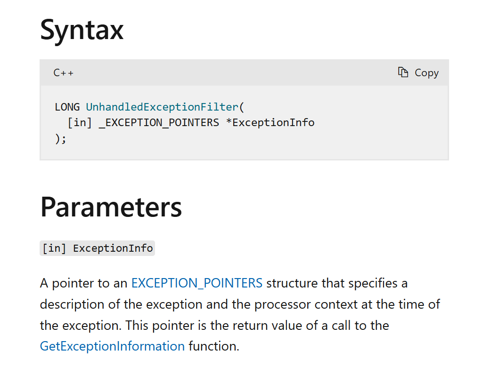
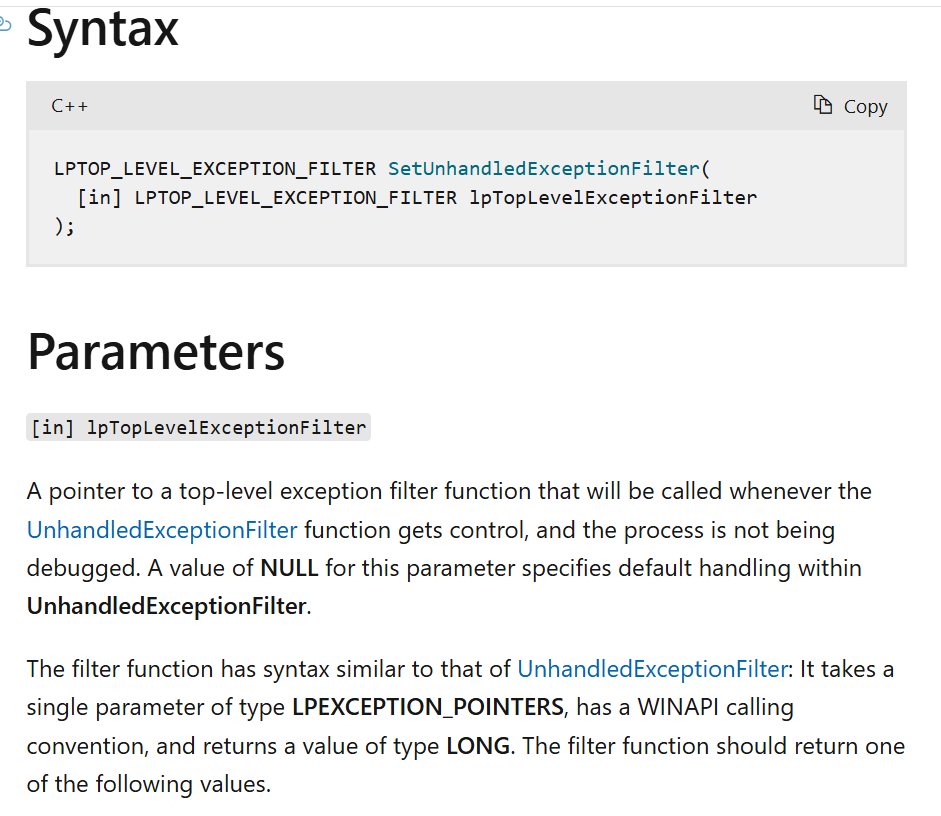
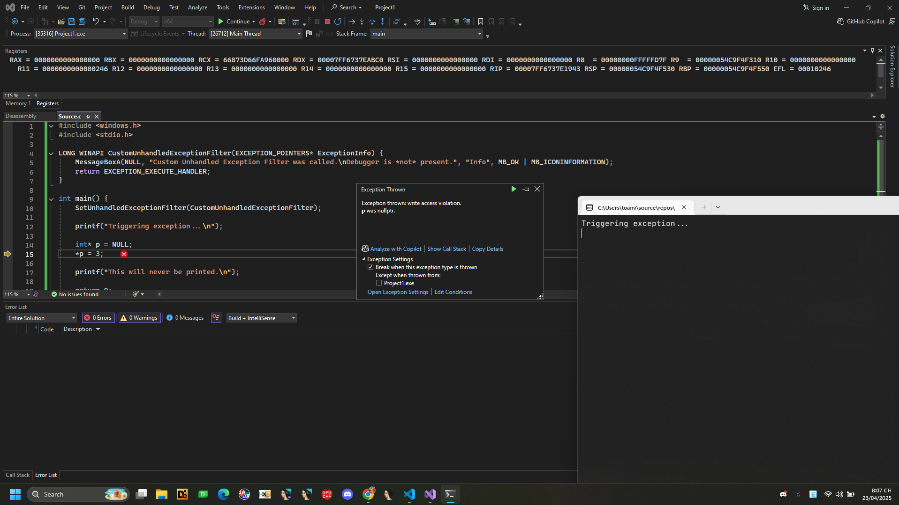

# Anti-Debug: Exceptions

## Exceptions

Các phương thức sau đây cố tình gây ra lỗi (exception) để kiểm tra xem hành vi tiếp theo có khác thường hay không, nếu tiến trình không đang chạy dưới sự giám sát của trình gỡ lỗi (debugger).

## 1. UnhandledExceptionFilter()

Nếu có một ngoại lệ (exception) xảy ra mà không có xử lý ngoại lệ nào được đăng kí (hoặc có đăng kí nhưng không xử lý được ngoại lệ đó) thì hàm ```kernel32!UnhandledExceptionFilter()``` sẽ được gọi.

Người lập trình có thể đăng ký một hàm xử lý ngoại lệ chưa được xử lý (unhandled exception) tùy chỉnh thông qua ```kernel32!SetUnhandledExceptionFilter()``` 

Tuy nhiên nếu chương trình đang chạy dưới sự giám sát của trình gỡ lỗi (debugger) thì hàm xử lý tùy chỉnh này sẽ không được gọi, thay vào đó, ngoại lệ sẽ được chuỷen trực tiếp cho debugger xử lý.


Vì vậy, nếu hàm xử lý ngoại lệ chưa được xử lý (unhandled exception filter) tùy chỉnh được gọi, điều đó có nghĩa là chương trình không đang chạy cùng với debugger.

[UnhandledExceptionFilter()](https://learn.microsoft.com/en-us/windows/win32/api/errhandlingapi/nf-errhandlingapi-unhandledexceptionfilter)

[SetUnhandledExceptionFilter()](https://learn.microsoft.com/en-us/windows/win32/api/errhandlingapi/nf-errhandlingapi-setunhandledexceptionfilter)

Đây là một hàm do lập trình viên định nghĩa, dùng để xử lý ngoại lệ chưa được xử lý (unhandled exceptions). 
Nếu chương trình đang được debug (gỡ lỗi), ngoại lệ sẽ được chuyển tới trình gỡ lỗi.
Nếu không, hệ thống có thể hiện hộp thoại lỗi và chuyển việc xử lý cho handler mà lập trình viên đã định nghĩa.
Hàm này chỉ được gọi trong phần điều kiện của khối xử lý ngoại lệ (__except).






```ASM
include 'win32ax.inc'

.code

start:
    jmp begin          ; Bỏ qua not_debugged, nhảy đến begin

not_debugged:
    invoke MessageBox, HWND_DESKTOP, "Not Debugged", "", MB_OK
    invoke ExitProcess, 0

begin:
    invoke SetUnhandledExceptionFilter, not_debugged
    int 3              ; Gây ra một breakpoint exception
    jmp being_debugged ; Nếu không có debugger thì exception xảy ra và control sẽ không đến đây

being_debugged:
    invoke MessageBox, HWND_DESKTOP, "Debugged", "", MB_OK
    invoke ExitProcess, 0

.end start

```


```C
#include <windows.h>
#include <stdio.h>

LONG WINAPI CustomUnhandledExceptionFilter(EXCEPTION_POINTERS* ExceptionInfo) {
    MessageBoxA(NULL, "Custom Unhandled Exception Filter was called.\nDebugger is *not* present.", "Info", MB_OK | MB_ICONINFORMATION);
    return EXCEPTION_EXECUTE_HANDLER;
}

int main() {
    SetUnhandledExceptionFilter(CustomUnhandledExceptionFilter);

    printf("Triggering exception...\n");

    int* p = NULL;
    *p = 3;  

    printf("This will never be printed.\n");

    return 0;
}


```



## 2. RaiseException()

Trong Windows, có một số loại ngoại lệ đặc biệt như ```DBG_CONTROL_C ``` hoặc ```DBG_RIPEVENT```. Những ngoại lệ này sẽ không được xử lý bời chương tình , mà sẽ bị trình debug chặn lại và xử lý riêng. 
Vì thế chúng ta có thể kiểm tra chương trình có đang bị debug không bằng cách.
1. Cố tình tạo ra một ngoại lệ đặc biệt bằng cách gọi ```RaiseException``` 
2. Kiểm tra xem chương trình có nhận và xử lý được ngoại lệ đó không:
- Nếu chương trình xử lý được ngoại lệ -> không có trình debug theo dõi.
- Nếu chương trình không được xử lý ngoại lệ - > rất có thể đang có trình debug can thiệp.

```C
#include <windows.h>
#include <stdio.h>

bool Check()
{
    __try
    {
        RaiseException(DBG_CONTROL_C, 0, 0, NULL);
        return true; 
    }
    __except(DBG_CONTROL_C == GetExceptionCode()
        ? EXCEPTION_EXECUTE_HANDLER 
        : EXCEPTION_CONTINUE_SEARCH)
    {
        
        return false;
    }
}

int main()
{
    if (Check())
    {
        printf("No debugger detected.\n");
    }
    else
    {
        printf("Debugger detected!\n");
    }

    return 0;
}

```
## 3. Hiding Control Flow with Exception Handlers
Đây là một phương pháp để ẩn dòng điều khiển trong chương trình bằng cách sử dụng các trình xử lý ngoại lệ. Thay vì kiểm tra sự hiện diện của trình gỡ lỗi, phương pháp này ẩn dòng điều khiển của chương trình bằng cách tạo một chuỗi các trình xử lý ngoại lệ.

Sử dụng Structured Exception Handlers (SEH):


Trong đoạn mã dưới đây, chương trình tạo ra một chuỗi các ngoại lệ được xử lý bởi các trình xử lý ngoại lệ. Mỗi trình xử lý sẽ kích hoạt một ngoại lệ mới, và chuỗi ngoại lệ này cuối cùng sẽ dẫn đến hàm mà ta muốn ẩn (ví dụ, MaliciousEntry).


```C
#include <Windows.h>

void MaliciousEntry()
{
}

void Trampoline2()
{
    __try
    {
        __asm int 3;  
    }
    __except (EXCEPTION_EXECUTE_HANDLER)
    {
        MaliciousEntry();  
    }
}

void Trampoline1()
{
    __try 
    {
        __asm int 3;  
    }
    __except (EXCEPTION_EXECUTE_HANDLER)
    {
        Trampoline2(); 
    }
}

int main(void)
{
    __try
    {
        __asm int 3;  
    }
    __except (EXCEPTION_EXECUTE_HANDLER) {}
    {
        Trampoline1(); 
    }

    return 0;
}

```

Trong đoạn mã trên, mỗi ngoại lệ sẽ dẫn đến việc gọi một hàm tiếp theo trong chuỗi, cuối cùng đến ```MaliciousEntry()```, hàm mà ta muốn ẩn dòng điều khiển đến.


Sử dụng Vectored Exception Handlers (VEH):
Vectored Exception Handlers cho phép đăng ký các trình xử lý ngoại lệ theo một cách khác so với SEH, giúp ẩn dòng điều khiển bằng cách tạo chuỗi các ngoại lệ theo một cách khác.

```C
#include <Windows.h>

PVOID g_pLastVeh = nullptr;

void MaliciousEntry()
{
}

LONG WINAPI ExeptionHandler2(PEXCEPTION_POINTERS pExceptionInfo)
{
    MaliciousEntry(); 
    ExitProcess(0);
}

LONG WINAPI ExeptionHandler1(PEXCEPTION_POINTERS pExceptionInfo)
{
    if (g_pLastVeh)
    {
        RemoveVectoredExceptionHandler(g_pLastVeh); 
        g_pLastVeh = AddVectoredExceptionHandler(TRUE, ExeptionHandler2);  xử lý ngoại lệ mới
        if (g_pLastVeh)
            __asm int 3;  
    }
    ExitProcess(0);
}

int main(void)
{
    g_pLastVeh = AddVectoredExceptionHandler(TRUE, ExeptionHandler1);  /ngoại lệ đầu tiên
    if (g_pLastVeh)
        __asm int 3;  

    return 0;
}

```

Trong đoạn mã trên, ```ExeptionHandler1``` đăng ký một trình xử lý ngoại lệ mới (```ExeptionHandler2```), và khi một ngoại lệ xảy ra, nó sẽ gọi ```MaliciousEntry```.

## Mitigations

Trong quá trình gỡ lỗi:

Để tránh phát hiện trình gỡ lỗi, bạn có thể thay thế các kiểm tra sự hiện diện của trình gỡ lỗi bằng các lệnh ```NOP``` (Không làm gì)

Đối với việc ẩn dòng điều khiển (control flow):
Bạn sẽ phải theo dõi và truy vết chương trình để hiểu được cách các ngoại lệ này hoạt động cho đến khi payload được thực thi.

Để phát triển công cụ chống lại anti-debugging:
Các công cụ chống lại gỡ lỗi phải xử lý các ngoại lệ theo cách mà trình gỡ lỗi sẽ không thu thập hoặc xử lý chúng như bình thường. Điều này yêu cầu bạn phát triển các plugin riêng cho mỗi trình gỡ lỗi và thay đổi cách thức xử lý các sự kiện khi các ngoại lệ xảy ra.