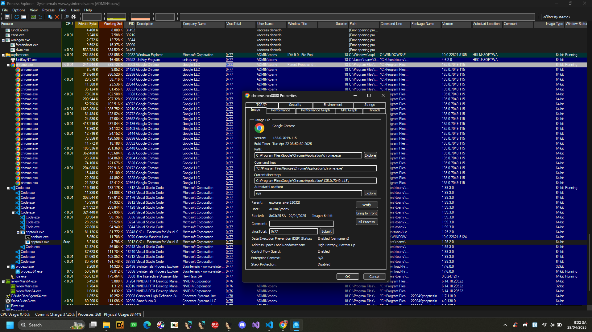
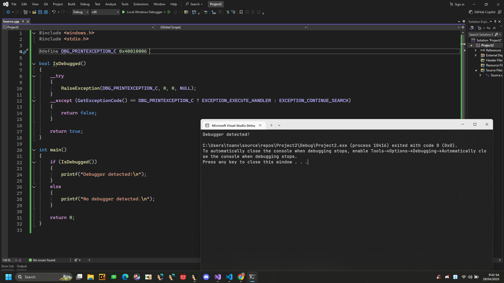

# Anti-Debug: Misc

## 1. FindWindow()

Kỹ thuật này liệt kê các cửa sổ (window) đang chạy trong hệ thống, sau đó so sánh với các tên lớp (class name) của các cửa sổ đó với các lớp cửa sổ đã biết cửa trình gỡ lỗi (debugger) như OllyDbg, x64dbg, IDA...

Nếu phát hiện có cửa số có tên trùng với cửa sổ của debugger -> biết rằng debugger đang mở -> có thể từ chối cho chạy, hay thực hiện các biện pháp chống phân tích.

Các hàm API của Windows có thể dùng để kiểm tra:

```FindWindowW()```
```FindWindowA()```
```FindWindowExW()```
```FindWindowExA()```

Chúng đều thuộc thư viện ```user32.dll``` và có chức năng tìm cửa sổ theo tên lớp (class name) hoặc tên cửa sổ (window name).

```C
#include <windows.h>
#include <stdbool.h>
#include <stdio.h>

const char* vWindowClasses[] = {
    "antidbg",
    "ID",               // Immunity Debugger
    "ntdll.dll",        // Peculiar window class name
    "ObsidianGUI",
    "OLLYDBG",
    "Rock Debugger",
    "SunAwtFrame",
    "Qt5QWindowIcon",
    "WinDbgFrameClass", // WinDbg
    "Zeta Debugger",
    "The Interactive Disassembler" // IDA

};

#define NUM_WINDOW_CLASSES (sizeof(vWindowClasses) / sizeof(vWindowClasses[0]))

bool IsDebugged()
{
    for (size_t i = 0; i < NUM_WINDOW_CLASSES; ++i)
    {
        if (FindWindowA(vWindowClasses[i], NULL) != NULL)
            return true;
    }
    return false;
}

int main()
{
    if (IsDebugged())
    {
        printf("Debugger detected!\n");
    }
    else
    {
        printf("No debugger detected.\n");
    }
    return 0;
}

```
## 2. Parent Process Check

Thông thường, một tiến trình ở chế độ người dùng được thực thi bằng cách nhấp đúp chuột vào biểu tượng tệp. Nếu tiến trình được thực thi theo cách này, tiến trình cha của nó sẽ là tiến trình shell (“explorer.exe”). Ý chính của hai phương pháp sau đây là so sánh PID của tiến trình cha với PID của “explorer.exe”.

Sử dụng công cụ [Process Explorer](https://learn.microsoft.com/en-us/sysinternals/downloads/process-explorer)

Sẽ thấy tiến trình được hiển thị dạng cây (tree view):
Parent (cha) ở trên
Con (child) thụt vào bên dưới.




Bấm chuột phải vào một tiến trình → Properties → tab Image → sẽ thấy chi tiết:

Parent: ai spawn ra process này

Command line, PPID...

### 2.1. NtQueryInformationProcess()

Phương pháp này bao gồm việc lấy handle của cửa sổ tiến trình shell bằng cách sử dụng [user32!GetShellWindow()](https://learn.microsoft.com/en-us/windows/win32/api/winuser/nf-winuser-getshellwindow) và lấy ID tiến trình (Process ID) của nó bằng cách gọi [user32!GetWindowThreadProcessId()](https://learn.microsoft.com/en-us/windows/win32/api/winuser/nf-winuser-getwindowthreadprocessid).

Sau đó, ID tiến trình cha (Parent Process ID) có thể được lấy từ cấu trúc PROCESS_BASIC_INFORMATION bằng cách gọi [ntdll!NtQueryInformationProcess()](ntdll!NtQueryInformationProcess()) với lớp thông tin [ProcessBasicInformation](https://learn.microsoft.com/en-us/windows/win32/api/winternl/nf-winternl-ntqueryinformationprocess#process_basic_information).

```C
bool IsDebugged()
{
    HWND hExplorerWnd = GetShellWindow();
    if (!hExplorerWnd)
        return false;

    DWORD dwExplorerProcessId;
    GetWindowThreadProcessId(hExplorerWnd, &dwExplorerProcessId);

    ntdll::PROCESS_BASIC_INFORMATION ProcessInfo;
    NTSTATUS status = ntdll::NtQueryInformationProcess(
        GetCurrentProcess(),
        ntdll::PROCESS_INFORMATION_CLASS::ProcessBasicInformation,
        &ProcessInfo,
        sizeof(ProcessInfo),
        NULL);
    if (!NT_SUCCESS(status))
        return false;

    return (DWORD)ProcessInfo.InheritedFromUniqueProcessId != dwExplorerProcessId;
}

```

### 2.2. CreateToolhelp32Snapshot()

ID của tiến trình cha và tên của tiến trình cha có thể được lấy bằng cách sử dụng các hàm ```kernel32!CreateToolhelp32Snapshot()``` và ```kernel32!Process32Next()```

```C
DWORD GetParentProcessId(DWORD dwCurrentProcessId)
{
    DWORD dwParentProcessId = -1;
    PROCESSENTRY32W ProcessEntry = { 0 };
    ProcessEntry.dwSize = sizeof(PROCESSENTRY32W);

    HANDLE hSnapshot = CreateToolhelp32Snapshot(TH32CS_SNAPPROCESS, 0);
    if(Process32FirstW(hSnapshot, &ProcessEntry))
    {
        do
        {
            if (ProcessEntry.th32ProcessID == dwCurrentProcessId)
            {
                dwParentProcessId = ProcessEntry.th32ParentProcessID;
                break;
            }
        } while(Process32NextW(hSnapshot, &ProcessEntry));
    }

    CloseHandle(hSnapshot);
    return dwParentProcessId;
}

bool IsDebugged()
{
    bool bDebugged = false;
    DWORD dwParentProcessId = GetParentProcessId(GetCurrentProcessId());

    PROCESSENTRY32 ProcessEntry = { 0 };
    ProcessEntry.dwSize = sizeof(PROCESSENTRY32W);

    HANDLE hSnapshot = CreateToolhelp32Snapshot(TH32CS_SNAPPROCESS, 0);
    if(Process32First(hSnapshot, &ProcessEntry))
    {
        do
        {
            if ((ProcessEntry.th32ProcessID == dwParentProcessId) &&
                (strcmp(ProcessEntry.szExeFile, "explorer.exe")))
            {
                bDebugged = true;
                break;
            }
        } while(Process32Next(hSnapshot, &ProcessEntry));
    }

    CloseHandle(hSnapshot);
    return bDebugged;
}

```

## 3. Selectors

Các giá trị của ```Selectors``` có thể có vẻ ổn định nhưng thực tế chúng không ổn định trong một số trường hợp nhất định và cũng tùy thuộc vào phiên bản Windows.

## 4. DbgPrint()
Các hàm debug như [ntdll!DbgPrint()](https://learn.microsoft.com/en-us/windows-hardware/drivers/ddi/wdm/nf-wdm-dbgprint) và kernel32!OutputDebugStringW() sẽ gây ra ngoại lệ DBG_PRINTEXCEPTION_C (0x40010006).
Nếu một chương trình được thực thi với debugger (trình gỡ lỗi) đã gắn kèm, thì debugger sẽ xử lý ngoại lệ này.
Nhưng nếu không có debugger nào đang chạy, và nếu chương trình có đăng ký một exception handler (bộ xử lý ngoại lệ), thì ngoại lệ này sẽ được bộ xử lý đó bắt.

```C
#include <windows.h>
#include <stdio.h>

#define DBG_PRINTEXCEPTION_C 0x40010006 

bool IsDebugged()
{
    __try
    {
        RaiseException(DBG_PRINTEXCEPTION_C, 0, 0, NULL);
    }
    __except (GetExceptionCode() == DBG_PRINTEXCEPTION_C ? EXCEPTION_EXECUTE_HANDLER : EXCEPTION_CONTINUE_SEARCH)
    {
        return false; 
    }

    return true; 
}

int main()
{
    if (IsDebugged())
    {
        printf("Debugger detected!\n");
    }
    else
    {
        printf("No debugger detected.\n");
    }

    return 0;
}

```



## 5. DbgSetDebugFilterState()

Các hàm ntdll!DbgSetDebugFilterState() và ntdll!NtSetDebugFilterState() chỉ đơn giản là thiết lập một cờ (flag) mà trình gỡ lỗi ở chế độ kernel (kernel-mode debugger) sẽ kiểm tra nếu có mặt.
Vì vậy:

Nếu hệ thống có gắn trình gỡ lỗi kernel, thì các hàm này sẽ thành công.

Tuy nhiên, ngay cả khi không có kernel debugger, đôi khi chúng cũng thành công do các hiệu ứng phụ từ trình gỡ lỗi ở user-mode (ví dụ như debugger bình thường bạn chạy trong Windows).

Lưu ý: Các hàm này yêu cầu quyền quản trị viên (administrator privileges) để gọi.

## Mitigations
Trong khi debug:
Nếu gặp các cơ chế kiểm tra chống debug hoặc chống theo dõi (anti-debug/anti-trace), hãy thay các lệnh đó bằng NOP để vô hiệu hóa chúng.


