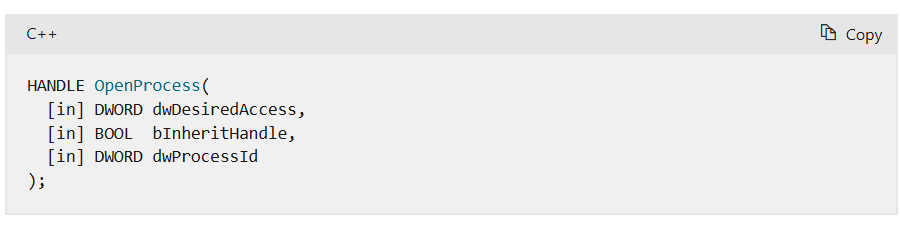

# Anti-Debug: Object Handles


## Object Handles

Phần này nói về các kỹ thuật dùng để kiểm tra xem có trình gỡ lỗi (debugger) đang chạy hay không, bằng cách sử dụng các handle của đối tượng trong hệ thống (handle là cách hệ điều hành quản lý các tài nguyên như file, tiến trình).

Một số hàm trong Windows (WinAPI) khi được gọi với những handle này có thể hoạt động khác thường nếu chương trình đang bị debug, hoặc gây ra những thay đổi đặc biệt do cách debugger hoạt động.

Ngoài ra, khi một chương trình bắt đầu bị debug, hệ điều hành cũng tạo ra một số đối tượng đặc biệt — việc phát hiện ra những đối tượng này cũng giúp xác định xem có debugger hay không.


### 1. OpenProcess()

Một số tiến trình gỡ lỗi có thể được phát hiện bằng cách sử dụng hàm kernel32!OpenProcess() trên tiến trình csrss.exe. Lệnh gọi này chỉ thành công nếu người dùng đang chạy tiến trình là thành viên administrators và có đặc quyền gỡ lỗi debug privilege.
[OpenProcess](https://learn.microsoft.com/en-us/windows/win32/api/processthreadsapi/nf-processthreadsapi-openprocess)



[SeDebugPrivilege](https://learn.microsoft.com/en-us/windows/security/threat-protection/security-policy-settings/debug-programs)


#### Chi tiết kĩ thuật 

csrss.exe là một tiến trình hệ thống quan trọng trong Win chịu trách nghiệm quản lý console windows và các chức năng hệ thống khác.

Trong điều kiện bình thường, Windows bảo vệ tiến trình csrss.exe không cho ơhép các chương trình mở handle đến nó.

Khi một chương trình được chạy dưới trình gỡ lỗi, nó cho phép cung cấp dến đặc quyền debug (SeDebugPrivilege) cho phép nó mở handle đến hầu hết các tiến trình hệ thống.
 
Malware thường kiểm tra xem có khả năng mở handle đến csrss.exe hay không để xác định xem nó có đang chạy dưới trình gỡ lỗi hay không.


#### Cách triển khai 

1. Tìm Process ID (PID) của csrss.exe

2. Gọi OpenProcess() với PID dó.

3. Nếu thành công (trả về handle hợp lệ), có thể kết luận rằng chương trình đang chạy với đặc quyền debug.
[Source Code](./OpenProcess_AntiDebug.c)
```C
#include <Windows.h>
#include <stdio.h>
#include <stdbool.h>
typedef DWORD (WINAPI *TCsrGetProcessId)(VOID);

bool Check()
{
    HMODULE hNtdll = LoadLibraryA("ntdll.dll");
    if (!hNtdll)
    {
        printf("Failed to load ntdll.dll\n");
        return false;
    }
    
    TCsrGetProcessId pfnCsrGetProcessId = (TCsrGetProcessId)GetProcAddress(hNtdll, "CsrGetProcessId");
    if (!pfnCsrGetProcessId)
    {
        printf("Failed to get address of CsrGetProcessId\n");
        return false;
    }

    DWORD processId = pfnCsrGetProcessId();
    HANDLE hCsr = OpenProcess(PROCESS_ALL_ACCESS, FALSE, processId);
    if (hCsr != NULL)
    {
        CloseHandle(hCsr);
        return true;
    }
    else
    {
        printf("Failed to open process with ID %lu\n", processId);
        return false;
    }
}

int main()
{
    if (Check())
    {
        printf("Process opened successfully!\n");
    }
    else
    {
        printf("Failed to open process.\n");
    }
    return 0;
}

```
### CreateFile()    


#### Chi tiết kĩ thuật

Khi sự kiện CREATE_PROCESS_DEBUG_EVENT xảy ra, handle của file đang được debug lưu trữ trong cấu trúc CREATE_PROCESS_DEBUG_INFO. Do các trình gỡ lỗi có thể đọc thông tin debug từ file này. Nếu handle này không được đóng bởi trình gỡ lỗi, file sẽ không thể được mở với quyền truy cập độc quyền. Một số trình gỡ lỗi có thể quên đóng handle này. 

Kỹ thuật này sử dụng kernel32!CreateFileW() (hoặc kernel32!CreateFileA()) để mở file của tiến trình hiện tại với quyền truy cập độc quyền. Nếu lệnh gọi thất bại, chúng ta có thể coi rằng tiến trình hiện tại đang được chạy dưới sự giám sát của trình gỡ lỗi.

[CreateFileA ](https://learn.microsoft.com/en-us/windows/win32/api/fileapi/nf-fileapi-createfilea)

[CREATE_PROCESS_DEBUG_INFO](https://learn.microsoft.com/en-us/windows/win32/api/minwinbase/ns-minwinbase-create_process_debug_info)

#### Cách triển khai

1. Lấy đường dẫn đầy đủ của file thực thi hiện tại.
2. Gọi CreateFile() với cờ GENERIC_READ và cờ FILE_SHARE_READ | FILE_SHARE_WRITE bị xóa (đề yêu cầu quyền truy cập độc quyền).
3. Nếu lệnh gọi thất bại (trả về INVALID_HANDLE_VALUE), có thể kết luận rằng chương trình đang chạy với trình gỡ lỗi.

[Source Code](./CreateFile_AntiDebug.c)
```C
#include <Windows.h>
#include <stdio.h>
#include <stdbool.h>

bool Check()
{
    char szFileName[MAX_PATH];
    
    if (GetModuleFileNameA(NULL, szFileName, MAX_PATH) == 0)
    {
        printf("Failed to get module filename\n");
        return false;
    }
    
    HANDLE hFile = CreateFileA(szFileName, GENERIC_READ, 0, NULL, OPEN_EXISTING, 0, NULL);
    
    if (hFile == INVALID_HANDLE_VALUE)
    {
        printf("Failed to open file exclusively, debugger might be present\n");
        return true; 
    }
    
    CloseHandle(hFile);
    return false; 
}

int main()
{
    if (Check())
    {
        printf("Debugger detected!\n");
    }
    else
    {
        printf("No debugger detected.\n");
    }
    return 0;
}
```
### CloseHandle()

Nếu như một tiến trình đang gỡ lỗi và một handle không hợp lệ được truyền vào hàm ```ntdll!NtClose()``` hoặc ```kernel32!CloseHandle()```, hệ thống sẽ ném ra một lỗi gọi là ```EXCEPTION_INVALID_HANDLE (0xC0000008)```. Lỗi này có thể được xử lý bởi bộ xử lý ngoại lệ. Nếu exception bị bắt thành công → chương trình biết đang bị debug.

[CloseHandle](https://learn.microsoft.com/en-us/windows/win32/api/handleapi/nf-handleapi-closehandle)
```C
#include <windows.h>
#include <stdio.h>
#include <stdbool.h>

bool Check()
{
    __try
    {
        CloseHandle((HANDLE)0xDEADBEEF);
        return false; 
    }
    __except (EXCEPTION_INVALID_HANDLE == GetExceptionCode()
        ? EXCEPTION_EXECUTE_HANDLER
        : EXCEPTION_CONTINUE_SEARCH)
    {
        return true;
    }
}

int main()
{
    if (Check())
        
    {
        printf("YES\n");
    }
    else
    {
        printf("NO\n");

    }

    return 0;
}

```
Hình ảnh minh họa khi debug có exception xảy ra chương trình chuyển hướng sang exception rồi trả về true xác nhận đang bị debug.


### 4. LoadLibrary()

Khi một tập tin được nạp vào bộ nhớ tiến trình bằng hàm ```kernel32!LoadLibraryW()``` hoặc ```kernel32!LoadLibraryA()``` có một sự kiện tên là ```LOAD_DLL_DEBUG_EVENT``` sẽ xảy ra. Handle của tập tin đã được nạp sẽ lưu trữ trong cấu trúc ```LOAD_DLL_DEBUG_INFO```. Nhờ đó, trình gỡ lỗi (debugger) có thể đọc thông tin debug từ tập tin này. Nếu trình gỡ lỗi không đóng handle đó, thì tập tin này sẽ không được mở với quyền truy cập độc quyền. Một số trình gỡ lỗi có thể quên không đóng handle này.
Để kiểm tra sự có mặt của trình gỡ lỗi, ta có thể nạp một tập tin bất kỳ bằng ```kernel32!LoadLibraryA()``` và sau đó cố gắng mở độc quyền bằng ```kernel32!CreateFileA()```. Nếu lời gọi ```CreateFileA()``` thất bại, điều đó cho thấy trình gỡ lỗi đang hoạt động.


[LOAD_DLL_DEBUG_INFO](https://learn.microsoft.com/en-us/windows/win32/api/minwinbase/ns-minwinbase-load_dll_debug_info)
```C
#include <windows.h>
#include <stdio.h>

BOOL Check()
{
    CHAR szBuffer[] = "C:\\Windows\\System32\\calc.exe";
    
    LoadLibraryA(szBuffer);

    HANDLE hFile = CreateFileA(
        szBuffer,          // File name
        GENERIC_READ,      // Desired access
        0,                 // Share mode
        NULL,              // Security attributes
        OPEN_EXISTING,     // Creation disposition
        0,                 // Flags and attributes
        NULL               // Template file
    );

    return (hFile == INVALID_HANDLE_VALUE);
}

int main()
{
    if (Check()) {
        printf("File could not be opened.\n");
    } else {
        printf("File opened successfully.\n");
    }
    return 0;
}

```

### 5. NtQueryObject() 


Khi một chương trình gỡ lỗi (debugging session) bắt đầu một đối tượng có tên là ```debug object```. Bằng cách sử dụng hàm ```ntdll!NtQueryObject()``` người ta có thể truy vấn danh sách các đội tượng hiện có và kiểm tra số lượng handles được liên kết với bất kì debug object nào đang tồn tại.
Tuy nhiên, kỹ thuật này không thể xác định chắc chắn rằng quá trình hiện tại đang bị gỡ lỗi ngay lúc này. Nó chỉ cho biết rằng debugger có đang chạy trên hệ thống kể từ khi khởi động máy.


```C
typedef struct _OBJECT_TYPE_INFORMATION
{
    UNICODE_STRING TypeName;
    ULONG TotalNumberOfHandles;
    ULONG TotalNumberOfObjects;
} OBJECT_TYPE_INFORMATION, *POBJECT_TYPE_INFORMATION;

typedef struct _OBJECT_ALL_INFORMATION
{
    ULONG NumberOfObjects;
    OBJECT_TYPE_INFORMATION ObjectTypeInformation[1];
} OBJECT_ALL_INFORMATION, *POBJECT_ALL_INFORMATION;

typedef NTSTATUS (WINAPI *TNtQueryObject)(
    HANDLE                   Handle,
    OBJECT_INFORMATION_CLASS ObjectInformationClass,
    PVOID                    ObjectInformation,
    ULONG                    ObjectInformationLength,
    PULONG                   ReturnLength
);

enum { ObjectAllTypesInformation = 3 };

#define STATUS_INFO_LENGTH_MISMATCH 0xC0000004

bool Check()
{
    bool bDebugged = false;
    NTSTATUS status;
    LPVOID pMem = nullptr;
    ULONG dwMemSize;
    POBJECT_ALL_INFORMATION pObjectAllInfo;
    PBYTE pObjInfoLocation;
    HMODULE hNtdll;
    TNtQueryObject pfnNtQueryObject;
    
    hNtdll = LoadLibraryA("ntdll.dll");
    if (!hNtdll)
        return false;
        
    pfnNtQueryObject = (TNtQueryObject)GetProcAddress(hNtdll, "NtQueryObject");
    if (!pfnNtQueryObject)
        return false;

    status = pfnNtQueryObject(
        NULL,
        (OBJECT_INFORMATION_CLASS)ObjectAllTypesInformation,
        &dwMemSize, sizeof(dwMemSize), &dwMemSize);
    if (STATUS_INFO_LENGTH_MISMATCH != status)
        goto NtQueryObject_Cleanup;

    pMem = VirtualAlloc(NULL, dwMemSize, MEM_COMMIT, PAGE_READWRITE);
    if (!pMem)
        goto NtQueryObject_Cleanup;

    status = pfnNtQueryObject(
        (HANDLE)-1,
        (OBJECT_INFORMATION_CLASS)ObjectAllTypesInformation,
        pMem, dwMemSize, &dwMemSize);
    if (!SUCCEEDED(status))
        goto NtQueryObject_Cleanup;

    pObjectAllInfo = (POBJECT_ALL_INFORMATION)pMem;
    pObjInfoLocation = (PBYTE)pObjectAllInfo->ObjectTypeInformation;
    for(UINT i = 0; i < pObjectAllInfo->NumberOfObjects; i++)
    {

        POBJECT_TYPE_INFORMATION pObjectTypeInfo =
            (POBJECT_TYPE_INFORMATION)pObjInfoLocation;

        if (wcscmp(L"DebugObject", pObjectTypeInfo->TypeName.Buffer) == 0)
        {
            if (pObjectTypeInfo->TotalNumberOfObjects > 0)
                bDebugged = true;
            break;
        }

        // Get the address of the current entries
        // string so we can find the end
        pObjInfoLocation = (PBYTE)pObjectTypeInfo->TypeName.Buffer;

        // Add the size
        pObjInfoLocation += pObjectTypeInfo->TypeName.Length;

        // Skip the trailing null and alignment bytes
        ULONG tmp = ((ULONG)pObjInfoLocation) & -4;

        // Not pretty but it works
        pObjInfoLocation = ((PBYTE)tmp) + sizeof(DWORD);
    }

NtQueryObject_Cleanup:
    if (pMem)
        VirtualFree(pMem, 0, MEM_RELEASE);

    return bDebugged;
}
```

### Mitigations

Cách đơn giản nhất để vượt qua các kiểm tra này là truy vết chương trình đến đoạn kiểm tra và bỏ qua nó (ví dụ patch bằng NOPS, thay đổi intruction pointer) hoặc thay đổi cờ ZF.

Nếu bạn viết một giải pháp chống chống gỡ lỗi (anti-anti-debug), bạn cần hook các hàm sau và thay đổi giá trị trả về sau khi phân tích đầu vào:

```ntdll!OpenProcess``` :  Trả về NULL nếu đối số thứ ba là handle của csrss.exe.

```ntdll!NtClose``` : Bạn có thể kiểm tra xem có thể truy xuất thông tin từ handle đầu vào không bằng

```ntdll!NtQueryObject()``` và không ném ngoại lệ nếu handle không hợp lệ.

```ntdll!NtQueryObject``` Lọc bỏ debug objects khỏi kết quả nếu đang truy vấn ObjectAllTypesInformation


Các kỹ thuật sau nên xử lý mà không cần hook:

```kernel32!LoadLibraryW/A```: Không có cách phòng tránh.


```ntdll!NtCreateFile```: Quá tổng quát để xử lý. Tuy nhiên, nếu bạn viết một plugin cho debugger cụ thể, bạn có thể đảm bảo rằng handle của file đang bị debug được đóng.