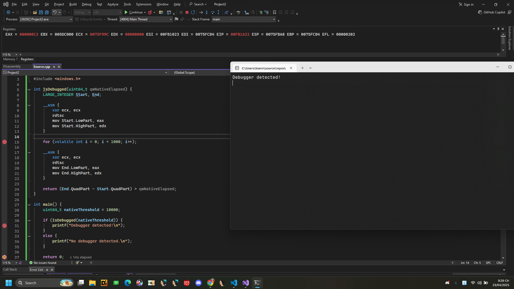

# Anti-Debug: Timing


## Timing

Khi một tiến trình (process) được theo dõi bằng trình gỡ lỗi (debugger), sẽ có độ trễ lớn giữa các lệnh và việc thực thi thực tế. Ta có thể đo độ trễ bình thường (tức là khi không bị can thiệp bởi debugger) giữa các phần của ẫm, sau đó so sánh với độ trễ thực tế khi đang bị theo dõi. Có nhiều cách khác nhau để thực hiện việc so sánh này.


## 1. RDPMC/RDTSC

Cả ```RDPMC``` và ```RDTSC``` là các lệnh dùng để đo thời gian chính xác ở mức CPU.

Lệnh ```RDPMC``` (Read Performance Monitoring Counters) chỉ dùng được trong Kernel Mode (chế độ nhân hệ điều hành).

- Ngoài ra, để sử dụng lệnh này, cần bật cờ PCE trong thanh ghi CR4 của CPU.

Lệnh ```RDTSC``` (Read Time Stamp Counter) có thể dùng trong User Mode, nên thích hợp hơn khi viết chương trình người dùng (user-space).


Khi vượt quá thời gian cho phép thì nhận diện là đang bị debug



```C
#include <stdio.h>
#include <stdint.h>
#include <windows.h>

int IsDebugged(uint64_t qwNativeElapsed) {
    LARGE_INTEGER Start, End;

    __asm {
        xor ecx, ecx
        rdtsc
        mov Start.LowPart, eax
        mov Start.HighPart, edx
    }

    for (volatile int i = 0; i < 1000; i++);  

    __asm {
        xor ecx, ecx
        rdtsc
        mov End.LowPart, eax
        mov End.HighPart, edx
    }

    return (End.QuadPart - Start.QuadPart) > qwNativeElapsed;
}

int main() {
    uint64_t nativeThreshold = 10000; 

    if (IsDebugged(nativeThreshold)) {
        printf("Debugger detected!\n");
    }
    else {
        printf("No debugger detected.\n");
    }

    return 0;
}

```

## 2. GetLocalTime()

```C
#include <windows.h>
#include <stdio.h>

bool IsDebugged(DWORD64 qwNativeElapsed)
{
    SYSTEMTIME stStart, stEnd;
    FILETIME ftStart, ftEnd;
    ULARGE_INTEGER uiStart, uiEnd;

    GetLocalTime(&stStart);
    Sleep(1000);
    GetLocalTime(&stEnd);

    if (!SystemTimeToFileTime(&stStart, &ftStart))
        return false;
    if (!SystemTimeToFileTime(&stEnd, &ftEnd))
        return false;

    uiStart.LowPart = ftStart.dwLowDateTime;
    uiStart.HighPart = ftStart.dwHighDateTime;
    uiEnd.LowPart = ftEnd.dwLowDateTime;
    uiEnd.HighPart = ftEnd.dwHighDateTime;

    return (uiEnd.QuadPart - uiStart.QuadPart) > qwNativeElapsed;
}

int main()
{
    DWORD64 qwNativeElapsed = 10000000;

    if (IsDebugged(qwNativeElapsed))
    {
        printf("Debugger detected!\n");
    }
    else
    {
        printf("No debugger detected.\n");
    }

    return 0;
}

```

.png)

Hàm IsDebugged đo thời gian chạy của một đoạn mã ngắn. Nếu thời gian đo được lớn hơn giá trị giới hạn ```qwNativeElapsed```, thì có thể chương trình đang bị debug (vì debugger có thể làm chậm quá trình chạy).

GetLocalTime: Trả về thời gian hiện tại theo múi giờ của hệ thống (có thể thay đổi nếu người dùng chỉnh múi giờ).
## 3. GetSystemTime()

```C
bool IsDebugged(DWORD64 qwNativeElapsed)
{
    SYSTEMTIME stStart, stEnd;
    FILETIME ftStart, ftEnd;
    ULARGE_INTEGER uiStart, uiEnd;

    GetSystemTime(&stStart);
    // ... some work
    GetSystemTime(&stEnd);

    if (!SystemTimeToFileTime(&stStart, &ftStart))
        return false;
    if (!SystemTimeToFileTime(&stEnd, &ftEnd))
        return false;

    uiStart.LowPart  = ftStart.dwLowDateTime;
    uiStart.HighPart = ftStart.dwHighDateTime;
    uiEnd.LowPart  = ftEnd.dwLowDateTime;
    uiEnd.HighPart = ftEnd.dwHighDateTime;
    return (uiEnd.QuadPart - uiStart.QuadPart) > qwNativeElapsed;
}
```
.png)


```GetSystemTime```: Trả về thời gian hiện tại theo giờ UTC (thời gian chuẩn toàn cầu), ổn định hơn và không bị ảnh hưởng bởi múi giờ.

Hàm ```IsDebugged``` này được dùng để kiểm tra xem chương trình có đang bị debug (gỡ lỗi) hay không, bằng cách đo thời gian thực thi của một đoạn code rồi so sánh với một giá trị thời gian chuẩn (```qwNativeElapsed```).


## 4. GetTickCount()


Hàm ```IsDebugged``` trong đoạn mã C/C++ này được sử dụng để phát hiện xem chương trình có đang bị debug (gỡ lỗi) hay không, dựa trên thời gian thực thi.

```C
bool IsDebugged(DWORD dwNativeElapsed)
{
    DWORD dwStart = GetTickCount();
    // ... some work
    return (GetTickCount() - dwStart) > dwNativeElapsed;
}
```

```GetTickCount()``` trả về số milliseconds kể từ khi hệ thống bắt đầu chạy.

Nếu chương trình bị debug (ví dụ bị breakpoint tạm dừng), thời gian thực tế sẽ dài hơn so với thời gian thực thi bình thường.


## 5. ZwGetTickCount() / KiGetTickCount()

Hàm ```IsDebugged``` này nhằm mục đích kiểm tra xem chương trình có đang bị debug hay không, bằng cách đo thời gian thực thi một đoạn code thông qua các hàm tick count ở mức kernel. Nếu thời gian thực thi lớn hơn thời gian chuẩn cho trước (```qwNativeElapsed```), thì có thể chương trình đang bị debug (do bị breakpoint hoặc bị dừng bởi trình gỡ lỗi).

```C
bool IsDebugged(DWORD64 qwNativeElapsed)
{
    ULARGE_INTEGER Start, End;
    __asm
    {
        int  2ah
        mov  Start.LowPart, eax
        mov  Start.HighPart, edx
    }
    // ... some work
    __asm
    {
        int  2ah
        mov  End.LowPart, eax
        mov  End.HighPart, edx
    }
    return (End.QuadPart - Start.QuadPart) > qwNativeElapsed;
}
```

## 6. QueryPerformanceCounter()
```C
bool IsDebugged(DWORD64 qwNativeElapsed)
{
    LARGE_INTEGER liStart, liEnd;
    QueryPerformanceCounter(&liStart);
    // ... some work
    QueryPerformanceCounter(&liEnd);
    return (liEnd.QuadPart - liStart.QuadPart) > qwNativeElapsed;
}
```
Kiểm tra xem chương trình có đang bị debug hay không, dựa trên thời gian thực thi một đoạn mã ngắn. Nếu thời gian vượt quá ngưỡng cho phép (```qwNativeElapsed```), thì có thể suy luận rằng chương trình đang bị can thiệp (ví dụ như bị debugger làm chậm lại).

```QueryPerformanceCounter``` là một hàm Windows dùng để lấy bộ đếm hiệu năng có độ chính xác cao.

## 7. timeGetTime()

```C
bool IsDebugged(DWORD dwNativeElapsed)
{
    DWORD dwStart = timeGetTime();
    // ... some work
    return (timeGetTime() - dwStart) > dwNativeElapsed;
}
```
Hàm IsDebugged lần này sử dụng timeGetTime() để đo thời gian thực thi.
timeGetTime() trả về thời gian (tính bằng milliseconds) kể từ khi hệ thống khởi động.


## Mitigations

Trong quá trình debug: Chỉ cần chèn các lệnh ```NOP``` vào chỗ kiểm tra thời gian và đặt kết quả của các kiểm tra này về giá trị phù hợp.


Khi phát triển giải pháp chống lại anti-debug: Không thực sự cần thiết phải làm gì nhiều với các kiểm tra thời gian, vì chúng không đáng tin cậy lắm. Tuy nhiên, bạn vẫn có thể hook các hàm đo thời gian và tăng tốc khoảng thời gian giữa các lần gọi.