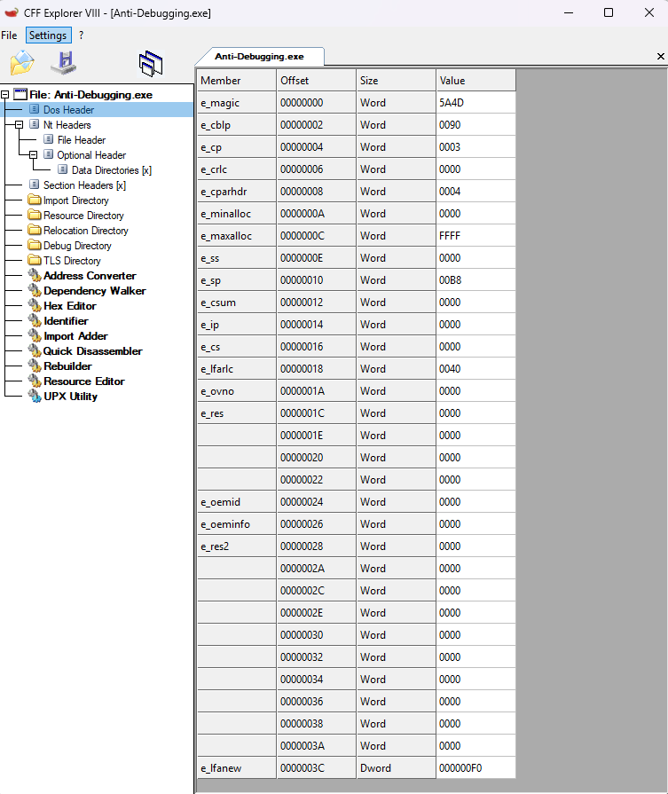
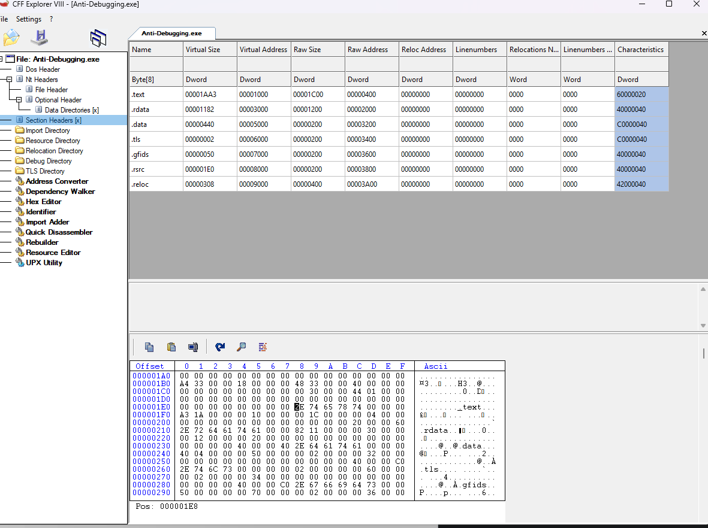
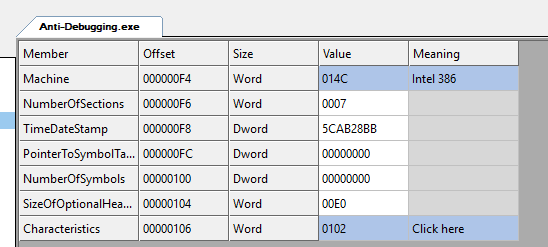
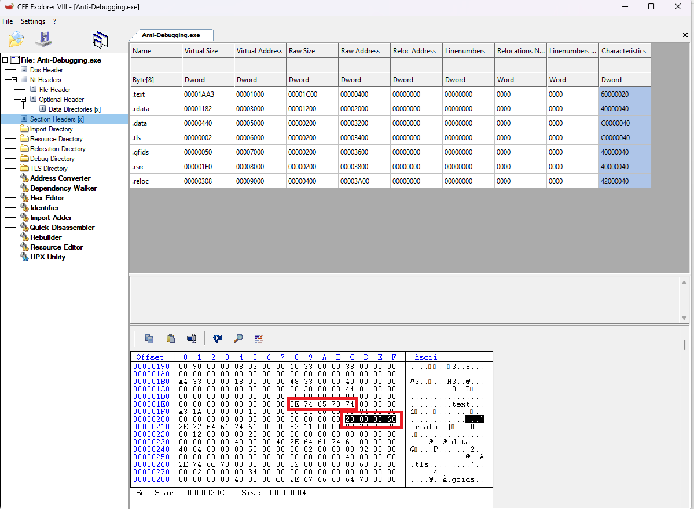
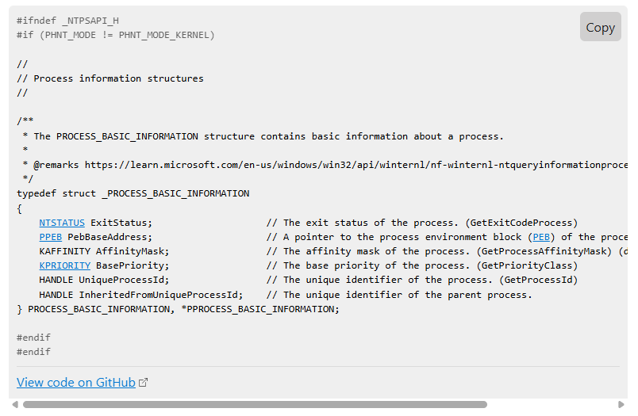
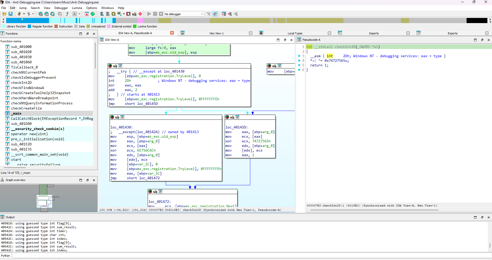

# Anti-Debugging

File PE 32 bit tiến hành ném vào IDA.

Tại hàm main

```
int __cdecl main(int argc, const char **argv, const char **envp)
{
  int i; // [esp+0h] [ebp-48h]
  int j; // [esp+0h] [ebp-48h]
  DWORD ThreadId[8]; // [esp+4h] [ebp-44h] BYREF
  HANDLE Handles[8]; // [esp+24h] [ebp-24h] BYREF

  MessageBoxA(0, "Crack me!", "Gh057", 0);
  hMutex = CreateMutexA(0, 0, 0);
  for ( i = 0; i < 8; ++i )
    Handles[i] = CreateThread(0, 0, CallCatchBlock, 0, 0, &ThreadId[i]);
  WaitForMultipleObjects(8u, Handles, 1, 0xFFFFFFFF);
  for ( j = 0; j < 8; ++j )
    CloseHandle(Handles[j]);
  CloseHandle(hMutex);
  MessageBoxA(0, "Let's find the flag!", "Gh057", 0);
  return 0;
}
```

Thấy có TlsCallback_0()

```
int __stdcall TlsCallback_0(int a1, int a2, int a3)
{
  unsigned __int64 v3; // rax
  unsigned __int64 v4; // rax
  int result; // eax
  int v6; // [esp+18h] [ebp-28h]
  int v7; // [esp+28h] [ebp-18h]
  unsigned int j; // [esp+2Ch] [ebp-14h]
  int i; // [esp+30h] [ebp-10h]
  int k; // [esp+30h] [ebp-10h]
  unsigned __int8 v11; // [esp+3Dh] [ebp-3h]
  unsigned __int8 v12; // [esp+3Eh] [ebp-2h]
  unsigned __int8 v13; // [esp+3Fh] [ebp-1h]

  ++byte_405428;
  v12 = 0;
  v11 = 0;
  if ( !dword_405424 )
  {
    v3 = __rdtsc();
    dword_405424 = v3;
  }
  if ( (unsigned __int8)byte_405428 >= 0x12u )
  {
    if ( dword_40541C == dword_40542C )
    {
      sub_401060("Flag: %s", (char)dword_405018);
      MessageBoxA(0, "Congratulations!", "Gh057", 0);
    }
    else
    {
      MessageBoxA(0, "You lose!", "Gh057", 0);
    }
    exit(0);
  }
  v7 = a1 + *(_DWORD *)(a1 + 60) + 248;
  for ( i = 0; i < *(unsigned __int16 *)(*(_DWORD *)(a1 + 60) + a1 + 6) && *(_DWORD *)(v7 + 40 * i + 36) != 1610612768; ++i )
    ;
  for ( j = 0; j < *(_DWORD *)(v7 + 40 * i + 8); ++j )
  {
    v13 = *(_BYTE *)(j + *(_DWORD *)(v7 + 40 * i + 12) + a1);
    if ( (v13 ^ 0x55) == 0x99 )
      ++v12;
    if ( (v13 ^ 0xF0) == 0x60 )
      ++v11;
  }
  v4 = __rdtsc();
  result = v4 - dword_405424;
  dword_405424 = result;
  for ( k = 0; k < 8; ++k )
  {
    dword_405018[k] ^= (v11 << 16) ^ v12;
    if ( (unsigned int)dword_405424 <= 0xDEADBEEF )
      v6 = -559038737;
    else
      v6 = dword_405424;
    dword_405018[k] ^= v6;
    result = k + 1;
  }
  return result;
}
```

Oke nếu chạy thử chương trình thì thấy in ra You lose! như trên thì ta thấy in ra flag tại Tls ở đây.


```
int __stdcall TlsCallback_0(int a1, int a2, int a3)
{
  unsigned __int64 v3; // rax
  unsigned __int64 v4; // rax
  int result; // eax
  unsigned int v6; // [esp+18h] [ebp-28h]
  int v7; // [esp+28h] [ebp-18h]
  unsigned int j; // [esp+2Ch] [ebp-14h]
  int i; // [esp+30h] [ebp-10h]
  int k; // [esp+30h] [ebp-10h]
  unsigned __int8 v11; // [esp+3Dh] [ebp-3h]
  unsigned __int8 v12; // [esp+3Eh] [ebp-2h]
  unsigned __int8 v13; // [esp+3Fh] [ebp-1h]

  ++cnt;

  v12 = 0;
  v11 = 0;
  if ( !timer )
  {
    v3 = __rdtsc();
    timer = v3;
  }
  if ( cnt >= 0x12u )
  {
    if ( sum_result == index )
    {
      sub_401060("Flag: %s", flag);
      MessageBoxA(0, "Congratulations!", "Gh057", 0);
    }
    else
    {
      MessageBoxA(0, "You lose!", "Gh057", 0);
    }
    exit(0);
  }
  v7 = a1 + *(a1 + 0x3C) + 0xF8;
  for ( i = 0; i < *(*(a1 + 0x3C) + a1 + 6) && *(v7 + 0x28 * i + 0x24) != 0x60000020; ++i )
    ;
  for ( j = 0; j < *(v7 + 0x28 * i + 8); ++j )
  {
    v13 = *(j + *(v7 + 0x28 * i + 0xC) + a1);
    if ( (v13 ^ 0x55) == 0x99 )
      ++v12;
    if ( (v13 ^ 0xF0) == 0x60 )
      ++v11;
  }
  v4 = __rdtsc();
  result = v4 - timer;
  timer = result;
  for ( k = 0; k < 8; ++k )
  {
    flag[k] ^= (v11 << 16) ^ v12;
    if ( timer <= 0xDEADBEEF )
      v6 = 0xDEADBEEF;
    else
      v6 = timer;
    flag[k] ^= v6;
    result = k + 1;
  }
  return result;
}
``` 
Số lần chạy hàm tls này phải lớn hơn hoặc bằng 18 thì mới nhảy vào được chỗ in flag
Đổi tên lại cho dễ hiểu, chúng ta thấy đoạn dưới có hàm xử lý flag. Các giá trị mà chúng ta chưa biết đang là v11 và v12 còn v6 là cái để check timer ta dễ dàng thấy giá trị đúng ở đây phải là v6 = 0xDEADBEEF.


Vậy còn cái v11 và v12 kia là gì.


Xref thấy nó chỉ bị biến đổi ở đoạn trong tls.

Rồi trong đoạn này chúng ta để ý đến thằng v7.

a1 là ImageBase địa chỉ của base của tiến trình trong bộ nhớ. 

*(a1 + 0x3C) trỏ đến trường ```e_lfanew``` trong DOS header - offset đến PE header.




Vậy a1 + *(a1 + 0x3C) là trỏ đến nơi bắt đầu PE header có giá trị 0xF0 sau đó cộng với thằng 0xF8 = 0x1E8




Vậy v7 là con trỏ đến section header đầu tiên.

```
Section_Headers = a1 + *(a1 + 0x3C) + 0xF8;
  for ( i = 0; i < *(*(a1 + 0x3C) + a1 + 6) && *(Section_Headers + 0x28 * i + 0x24) != 0x60000020; ++i )
    ;
  for ( j = 0; j < *(Section_Headers + 0x28 * i + 8); ++j )
  {
    v13 = *(j + *(Section_Headers + 0x28 * i + 0xC) + a1);
    if ( (v13 ^ 0x55) == 0x99 )
      ++v12;
    if ( (v13 ^ 0xF0) == 0x60 )
      ++v11;
  }
```

Thằng này *(*(a1 + 0x3C) + a1 + 6) là 0xF0 + 0x6 = 0xF6 này là số lượng section có 




Rồi sau đó từng vòng lặp tăng i lên kiểm tra 
0xF0 + 0xF8 + 0x24 = ???? 
 Hóa ra là nó kiểm tra cái Characteristics của từng section đến khi gặp section text oke. Tìm lại ví trị của section text trong section headers. Cái 0x28 là khoảng cách giữa từng section còn 0x24 là đến giá trị Characteristics. 

Rồi sau đó.

```
for ( j = 0; j < *(Section_Headers + 0x28 * i + 8); ++j )
{
    v13 = *(j + *(Section_Headers + 0x28 * i + 0xC) + a1);
    if ( (v13 ^ 0x55) == 0x99 )
        ++v12;
    if ( (v13 ^ 0xF0) == 0x60 )
        ++v11;
}
```
Nó duyệt qua tất cả các byte trong section text ở đây v12 là đếm 0xcc còn v13 là đếm 0x90.

```
int __stdcall TlsCallback_0(int a1, int a2, int a3)
{
  unsigned __int64 v3; // rax
  unsigned __int64 v4; // rax
  int result; // eax
  unsigned int v6; // [esp+18h] [ebp-28h]
  int Section_Headers; // [esp+28h] [ebp-18h]
  unsigned int j; // [esp+2Ch] [ebp-14h]
  int i; // [esp+30h] [ebp-10h]
  int k; // [esp+30h] [ebp-10h]
  unsigned __int8 numOf0x90; // [esp+3Dh] [ebp-3h]
  unsigned __int8 numOf0xcc; // [esp+3Eh] [ebp-2h]
  unsigned __int8 v13; // [esp+3Fh] [ebp-1h]

  ++cnt;

  numOf0xcc = 0;
  numOf0x90 = 0;
  if ( !timer )
  {
    v3 = __rdtsc();
    timer = v3;
  }
  if ( cnt >= 0x12u )
  {
    if ( sum_result == index )
    {
      sub_401060("Flag: %s", flag);
      MessageBoxA(0, "Congratulations!", "Gh057", 0);
    }
    else
    {
      MessageBoxA(0, "You lose!", "Gh057", 0);
    }
    exit(0);
  }
  Section_Headers = a1 + *(a1 + 0x3C) + 0xF8;
  for ( i = 0; i < *(*(a1 + 0x3C) + a1 + 6) && *(Section_Headers + 0x28 * i + 0x24) != 0x60000020; ++i )
    ;
  for ( j = 0; j < *(Section_Headers + 0x28 * i + 8); ++j )
  {
    v13 = *(j + *(Section_Headers + 0x28 * i + 0xC) + a1);
    if ( (v13 ^ 0x55) == 0x99 )
      ++numOf0xcc;
    if ( (v13 ^ 0xF0) == 0x60 )
      ++numOf0x90;
  }
  v4 = __rdtsc();
  result = v4 - timer;
  timer = result;
  for ( k = 0; k < 8; ++k )
  {
    flag[k] ^= (numOf0x90 << 16) ^ numOf0xcc;
    if ( timer <= 0xDEADBEEF )
      v6 = 0xDEADBEEF;
    else
      v6 = timer;
    flag[k] ^= v6;
    result = k + 1;
  }
  return result;
}
```
Oke viết 1 đoạn code python để đếm thôi

```
import pefile

def count_bytes_in_text_section(exe_path):
    try:
        # Load the PE file
        pe = pefile.PE(exe_path)
        
        # Initialize counters
        count_0x90 = 0
        count_0xcc = 0
        
        # Find the .text section
        for section in pe.sections:
            if section.Name.decode().strip('\x00').lower() == '.text':
                # Get the raw data of the .text section
                section_data = section.get_data()
                
                # Count occurrences of 0x90 and 0xcc
                count_0x90 = section_data.count(b'\x90')
                count_0xcc = section_data.count(b'\xcc')
                
                break
        else:
            print("No .text section found in the executable.")
            return
        
        # Print results
        print(f"Number of 0x90 bytes (NOP): {count_0x90}")
        print(f"Number of 0xcc bytes (INT3): {count_0xcc}")
        
    except pefile.PEFormatError:
        print("Error: Invalid PE file format.")
    except FileNotFoundError:
        print("Error: File not found.")
    except Exception as e:
        print(f"Error: {str(e)}")

if __name__ == "__main__":
    import sys
    if len(sys.argv) != 2:
        print("Usage: python script.py <path_to_exe>")
    else:
        count_bytes_in_text_section(sys.argv[1])

PS C:\Users\toanv\Music> python main.py
Usage: python script.py <path_to_exe>
PS C:\Users\toanv\Music> python main.py Anti-Debugging.exe
Number of 0x90 bytes (NOP): 7
Number of 0xcc bytes (INT3): 129
```
Tiếp tục quay lại main.

```
int __cdecl main(int argc, const char **argv, const char **envp)
{
  int i; // [esp+0h] [ebp-48h]
  int j; // [esp+0h] [ebp-48h]
  DWORD ThreadId[8]; // [esp+4h] [ebp-44h] BYREF
  HANDLE Handles[8]; // [esp+24h] [ebp-24h] BYREF

  MessageBoxA(0, "Crack me!", "Gh057", 0);
  hMutex = CreateMutexA(0, 0, 0);
  for ( i = 0; i < 8; ++i )
    Handles[i] = CreateThread(0, 0, CallCatchBlock, 0, 0, &ThreadId[i]);
  WaitForMultipleObjects(8u, Handles, 1, 0xFFFFFFFF);
  for ( j = 0; j < 8; ++j )
    CloseHandle(Handles[j]);
  CloseHandle(hMutex);
  MessageBoxA(0, "Let's find the flag!", "Gh057", 0);
  return 0;
}
```

Chương trình tạo 8 luồng thực thi hàm CallCatchBlock mỗi này luồng mới được tạo tls lại được gọi. Theo tham khảo của em thì nó có thể như này:


Khi chương trình bắt đầu (entrypoint trước ```main```) → ```DLL_PROCESS_ATTACH``` → 1 lần
Khi 8 threads được tạo → mỗi thread mới sẽ gọi TLS callback với ```DLL_THREAD_ATTACH``` → 8 lần
Khi 8 threads kết thúc → gọi ```DLL_THREAD_DETACH``` → 8 lần
Khi chương trình kết thúc → ```DLL_PROCESS_DETACH``` → 1 lần

Oke vậy có thể nó sẽ chạy được đủ 18 lần để chạy vào đoạn in flag.

```
DWORD __stdcall CallCatchBlock(LPVOID lpThreadParameter)
{
  HMODULE ModuleHandleA; // eax
  HANDLE CurrentThread; // eax
  int *v4; // [esp+10h] [ebp-54h]
  int *v5; // [esp+14h] [ebp-50h]
  int *v6; // [esp+18h] [ebp-4Ch]
  int *v7; // [esp+1Ch] [ebp-48h]
  int *v8; // [esp+20h] [ebp-44h]
  int *v9; // [esp+24h] [ebp-40h]
  int *v10; // [esp+28h] [ebp-3Ch]
  int *v11; // [esp+2Ch] [ebp-38h]
  DWORD v12; // [esp+3Ch] [ebp-28h]
  FARPROC NtSetInformationThread; // [esp+44h] [ebp-20h]
  int v14; // [esp+48h] [ebp-1Ch]

  ModuleHandleA = GetModuleHandleA("ntdll.dll");
  NtSetInformationThread = GetProcAddress(ModuleHandleA, "NtSetInformationThread");
  if ( !NtSetInformationThread )
    return 1;
  CurrentThread = GetCurrentThread();
  if ( (NtSetInformationThread)(CurrentThread, 17, 0, 0) )
    return 1;
  while ( 1 )
  {
    v12 = WaitForSingleObject(hMutex, 0xFFFFFFFF);
    if ( !v12 )
      break;
    if ( v12 != 128 )
      return 0;
  }
  switch ( (index + rand()) % 8 )
  {
    case 0:
      v11 = &flag[index++];
      v14 = checkIsDebuggerPresent(v11);
      break;
    case 1:
      v10 = &flag[index++];
      v14 = checkCreateToolhelp32Snapshot(v10);
      break;
    case 2:
      v9 = &flag[index++];
      v14 = checkFindWindowA(v9);
      break;
    case 3:
      v8 = &flag[index++];
      v14 = checkHardWareBreakpoint(v8);
      break;
    case 4:
      v7 = &flag[index++];
      v14 = checkNtQueryInformationProcess(v7);
      break;
    case 5:
      v6 = &flag[index++];
      v14 = checkNtCurrentPeb(v6);
      break;
    case 6:
      v5 = &flag[index++];
      v14 = checkInt2D(v5);
      break;
    default:
      v4 = &flag[index++];
      v14 = checkCreateFile(v4);
      break;
  }
  sum_result += v14;
  ReleaseMutex(hMutex);
  return 0;
}
```
Nhìn vào đây nó check flag thành 8 block để xử lí.


### Block 0
```
int __stdcall checkIsDebuggerPresent(_DWORD *a1)
{
  HANDLE hProcess; // [esp+Ch] [ebp-Ch]
  BOOL pbDebuggerPresent; // [esp+10h] [ebp-8h] BYREF

  if ( !IsDebuggerPresent() )
    return 0;
  pbDebuggerPresent = 0;
  hProcess = GetCurrentProcess();
  CheckRemoteDebuggerPresent(hProcess, &pbDebuggerPresent);
  if ( !pbDebuggerPresent )
    return 0;
  OutputDebugStringA("ahihi!");
  if ( GetLastError() )
    return 0;
  *a1 ^= 0x676F6E65u;
  return 1;
}
```
Đoạn này đơn giản chỉ check các hàm IsDebuggerPresent() và CheckRemoteDebuggerPresent() nếu không có gì thì flag sẽ được xor 0x676F6E65u.

### Block 1

```
BOOL __stdcall checkCreateToolhelp32Snapshot(_DWORD *a1)
{
  HANDLE hSnapshot; // [esp+14h] [ebp-134h]
  int v3; // [esp+18h] [ebp-130h]
  PROCESSENTRY32 pe; // [esp+1Ch] [ebp-12Ch] BYREF

  v3 = 0;
  hSnapshot = CreateToolhelp32Snapshot(2u, 0);
  if ( hSnapshot != -1 )
  {
    pe.dwSize = 296;
    if ( Process32First(hSnapshot, &pe) )
    {
      do
      {
        if ( sub_401000(pe.szExeFile, "windbg") )
        {
          ++v3;
          *a1 ^= 0x77u;
        }
        if ( sub_401000(pe.szExeFile, "ollydbg") )
        {
          *a1 ^= 0x6F00u;
          ++v3;
        }
        if ( sub_401000(pe.szExeFile, "ida") )
        {
          *a1 ^= 0x690000u;
          ++v3;
        }
        if ( sub_401000(pe.szExeFile, "x32dbg") )
        {
          *a1 ^= 0x78000000u;
          ++v3;
        }
      }
      while ( Process32Next(hSnapshot, &pe) );
    }
    CloseHandle(hSnapshot);
  }
  return v3 == 4;
}
```


Kiểm tra tất cả các cửa sổ đang mở bằng cách sử dụng ```CreateToolhelp32Snapshot()``` vậy ở đây muốn chính xác chúng ta phải mở cả 4 cái trên giá trị xor đúng sẽ là

0x77 ^ 0x6F00 ^ 0x690000 ^ 0x78000000 = 0x78696f77


### Block 2

```
int __stdcall checkFindWindowA(_DWORD *a1)
{
  if ( FindWindowA("WinDbgFrameClass", 0) == HWND_MESSAGE|0x2 )
    return 0;
  *a1 ^= 0x57u;
  if ( FindWindowA("OLLYDBG", 0) == HWND_MESSAGE|0x2 )
    return 0;
  *a1 ^= 0x4F00u;
  if ( FindWindowA("QtQWindowIcon", 0) != HWND_MESSAGE|0x2 )
    return 0;
  *a1 ^= 0x490000u;
  if ( FindWindowA("X64DBG", 0) == HWND_MESSAGE|0x2 )
    return 0;
  *a1 ^= 0x58000000u;
  return 1;
}
```
Check các cửa sổ không có thì mới xor giá trị đúng sẽ là

0x57 ^ 0x4F00 ^ 0x490000 ^  0x58000000 = 0x58494f57

### Block 3

```
int __stdcall checkHardWareBreakpoint(_DWORD *a1)
{
  HANDLE hThread; // [esp+10h] [ebp-2D4h]
  CONTEXT Context; // [esp+14h] [ebp-2D0h] BYREF

  memset(&Context, 0, sizeof(Context));
  Context.ContextFlags = 65552;
  hThread = GetCurrentThread();
  if ( !GetThreadContext(hThread, &Context) )
    return 0;
  if ( !Context.Dr0 || !Context.Dr1 || !Context.Dr2 || !Context.Dr3 )
    return 0;
  *a1 ^= 0x68617264u;
  return 1;
}
```

Tất cả mấy cái cờ kia phải bằng 1 thì mới chạy qua được. Key xor đúng 0x68617264

### Block 4 

```
BOOL __stdcall checkNtQueryInformationProcess(_DWORD *a1)
{
  NTSTATUS (__stdcall *NtQueryInformationProcess)(HANDLE, PROCESSINFOCLASS, PVOID, ULONG, PULONG); // [esp+Ch] [ebp-28h]
  HWND hWnd; // [esp+10h] [ebp-24h]
  HMODULE hModule; // [esp+18h] [ebp-1Ch]
  _DWORD *v5; // [esp+20h] [ebp-14h]
  int v6; // [esp+28h] [ebp-Ch] BYREF
  DWORD dwProcessId; // [esp+2Ch] [ebp-8h] BYREF

  v5 = operator new(0x18u);
  *v5 = 0;
  v5[1] = 0;
  v5[2] = 0;
  v5[3] = 0;
  v5[4] = 0;
  v5[5] = 0;
  v6 = 0;
  hModule = LoadLibraryA("NtDll.dll");
  NtQueryInformationProcess = GetProcAddress(hModule, "NtQueryInformationProcess");
  FreeLibrary(hModule);
  hWnd = GetShellWindow();
  GetWindowThreadProcessId(hWnd, &dwProcessId);
  NtQueryInformationProcess(-1, ProcessBasicInformation, v5, 24, &v6);
  *a1 ^= dwProcessId ^ v5[5];
  return v5[5] == dwProcessId;
}
```

v5 dùng làm buffer cho ```PROCESS_BASIC_INFORMATION``` chứa thông tin về tiến trình hiện tại



```NtQueryInformationProcess``` là API nội bộ không có sẵn trong headers Windows thông thường.

Được dùng để truy vấn thông tin tiến trình mà không qua API thông thường (như ```GetCurrentProcessId()```).

```
  hWnd = GetShellWindow();               //  Lấy handle tới shell window (explorer.exe)
  GetWindowThreadProcessId(hWnd, &dwProcessId); //  Lấy PID của process đang giữ shell window
```

Lấy PID của ```explorer.exe```

GetWindowThreadProcessId() → từ HWND, lấy được PID của tiến trình tạo ra shell.

Trong môi trường Windows bình thường, process đó chính là explorer.exe

```  NtQueryInformationProcess(-1, ProcessBasicInformation, v5, 24, &v6); // Lấy PID của tiến trình hiện tại```

v5[5] = PID hiện tại
dwProcessId = PID của explorer.exe

```*a1 ^= dwProcessId ^ v5[5];```

Bị XOR với (dwProcessId ^ v5[5]) tuy nhiên PID của Thread hiện tại không cố định 


### Block 5 

```
int __stdcall checkNtCurrentPeb(_DWORD *a1)
{
  struct _PEB *v2; // [esp+Ch] [ebp-8h]

  v2 = NtCurrentPeb();
  if ( !v2->BeingDebugged )
    return 0;
  if ( LOBYTE(v2->NtGlobalFlag) != 112 )
    return 0;
  if ( !*(v2->ProcessHeap + 4) )
    return 0;
  *a1 ^= 0x70656221u;
  return 1;
}
```
Kiểm tra debug bằng các hàm nếu không có thì xor với 0x70656221u.

### Block 6



Hàm này gây exception bằng INT 2D.
Nếu có debug thì sẽ xor với 0x74727565 còn không xor với 0x6E756C6C

### Block 7


```
BOOL __stdcall checkCreateFile(_DWORD *a1)
{
  unsigned int FileA; // eax
  CHAR Filename[260]; // [esp+14h] [ebp-108h] BYREF

  GetModuleFileNameA(0, Filename, 0x104u);
  FileA = CreateFileA(Filename, 0x80000000, 0, 0, 3u, 0, 0);
  *a1 ^= FileA;
  return FileA == -1;
}
```

Lệnh ```FileA = CreateFileA(Filename, 0x80000000, 0, 0, 3u, 0, 0);``` 

CreateFileA sẽ mở file EXE hiện tại với quyền đọc, không cho phép chia sẻ.
Giá trị trả về FileA là HANDLE (một số nguyên 32-bit):

Nếu mở file thành công, đây sẽ là một HANDLE hợp lệ (số nguyên dương).

Nếu thất bại, trả về INVALID_HANDLE_VALUE (thường là -1 hoặc ```0xFFFFFFFF```)


Cách đơn giản để solve bài này là lấy block flag đem đi xor rồi kiểm tra rồi xem cái nào có nghĩa thì ghép thành flag.


```
flag = [
  0x6A, 0xB4, 0xA0, 0xC7, 0x72, 0xB7, 0xB7, 0xD4, 0x34, 0x9D, 
  0xA1, 0xDA, 0x3A, 0x94, 0xEC, 0xC4, 0xE5, 0x70, 0x0A, 0x45, 
  0x38, 0xB2, 0xB0, 0x80, 0x66, 0x94, 0xA3, 0xB3, 0x17, 0x9F, 
  0x8B, 0xA3]

key_tls = [0x6E,0xBE,0xAA,0xDE]

key_case0 = [0x65, 0x6E, 0x6F, 0x67]
key_case1 = [0x78, 0x69, 0x6f, 0x77][::-1]
key_case2 = [0x58, 0x49, 0x4f, 0x57][::-1]
key_case3 = [ 0x64, 0x72, 0x61, 0x68][::-1]
key_case4 = [0,0,0,0]
key_case5 = [0x21, 0x62, 0x65, 0x70]
key_case6 = [0x65, 0x75, 0x72, 0x74]
key_case6_1 = [0x6C, 0x6C, 0x75, 0x6E][::-1]
key_case7 = [0xFF,0XFF,0XFF,0XFF]
for i in range(len(flag)):
    flag[i] ^= key_tls[i % len(key_tls)]
    flag[i] ^= key_case7[i % len(key_case7)]
    try:
        print(chr(flag[i]),end="")
    except:
        print("")
    
# Case0: 3bu9
# Case1: seca
# Case2: _e@5
# Case3: thon
# Case4: y!!}
# Case5: {Ant
# Case6: 1_4n
# Case6_1: 
# Case7: t1_d


# secathon{Ant1_4nt1_d3bu9_e@5y!!}
```