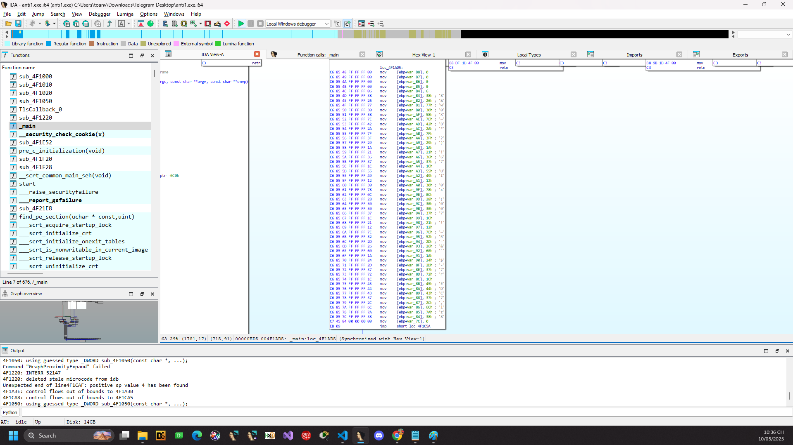

# anti1

Ném vào IDA ta có (có thể bị lỗi gì đó e ấn U rồi mới P lại thì mới có được mã giả như trên)


```C
int __cdecl main(int argc, const char **argv, const char **envp)
{
  int v4; // [esp+0h] [ebp-114h] BYREF
  int pExceptionObject; // [esp+54h] [ebp-C0h] BYREF
  int v6; // [esp+58h] [ebp-BCh]
  char inp[100]; // [esp+9Ch] [ebp-78h] BYREF
  int *v8; // [esp+104h] [ebp-10h]
  int v9; // [esp+110h] [ebp-4h]

  v8 = &v4;
  sub_4F1020((int)"Input the flag: ", v4);
  v9 = 0;
  v6 = 15;
  memset(inp, 0, sizeof(inp));
  if ( !sub_4F1050("%s", inp) )
    return 0;
  if ( v6 < 18 )
  {
    pExceptionObject = v6;
    _CxxThrowException(&pExceptionObject, (_ThrowInfo *)&_TI1H);
  }
  return 0;
}
```

Ta thấy v6 = 15 do đó điều kiện v6 < 18 là luôn đúng. Chương trình sẽ ném ngoại lệ và đi vào catch.


Thấy nó truyền chuỗi BKSEECCCC!!! là tham số đầu tiên rồi đến địa chỉ vùng nhớ input của chúng ta sau đó là số lượng byte cần sử lý.

Tức là ở đây chương trình thực hiện việc xor input của chúng ta với chuỗi ```BKSEECCCC!!!```. Oke.

Ta thấy chương trình nạp địa chỉ loc_4F1AD5 vào eax nhưng sau đó không có gì mà lại nhảy tiếp đến 1 vòng lặp vô hạn.


Thử nop thử đến thì thấy graph được gen ra gọi đến loc_4F1AD5 nhưng bị dối quá nop để dễ nhìn hơn. Tóm lại có lẽ logic chương trình được sử lý tiếp ở đó.




Oke clear việc của chúng ta bây giờ là extract hết đống enc rồi xor lại thử thôi.

```Python3
enc = [
    0x00, 0x00, 0x00, 0x00,     
    0x06, 0x38, 0x26, 0x77,    
    0x30, 0x58, 0x7E, 0x42,     
    0x2A, 0x7F, 0x3F, 0x29,     
    0x1A, 0x21, 0x36, 0x37,
    0x1C, 0x55, 0x49, 0x12,
    0x30, 0x78, 0x0C, 0x28,
    0x30, 0x30, 0x37, 0x1C,
    0x21, 0x12, 0x7E, 0x52,
    0x2D, 0x26, 0x60, 0x1A,
    0x24, 0x2D, 0x37, 0x72,
    0x1C, 0x45, 0x44, 0x43,
    0x37, 0x2C, 0x6C, 0x7A,
    0x38
]
print(len(enc))
key = "BKSEECCCC!!!"
key = list(key)
key = [ord(x) for x in key]

for i in range(len(enc)):
    enc[i] ^= key[i % len(key)]
print("".join(chr(x) for x in enc))
```

```BKSEC{e4sy_ch4ll_but_th3r3_must_b3_som3_ant1_debug??}```