# Anti3


Chạy thử chương trình chỉ đơn giản là yêu cầu nhập vào flag nhưng phải chạy bằng quyền admin.

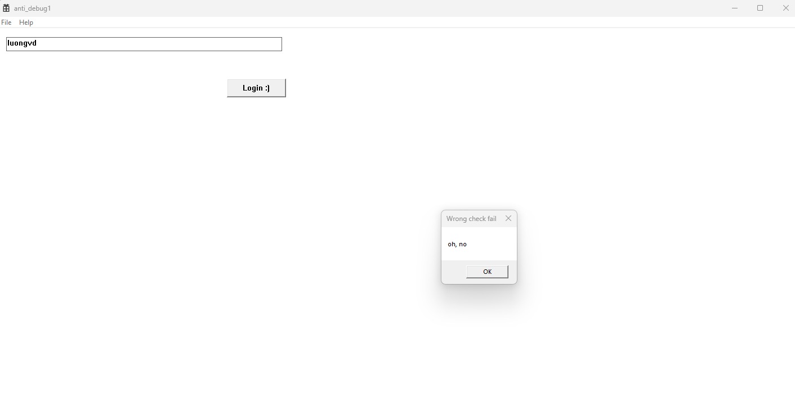
File PE 32 bit ném vào IDA.


Chương trình có hàm TLS nên chúng ta phân tích từ đây trước.
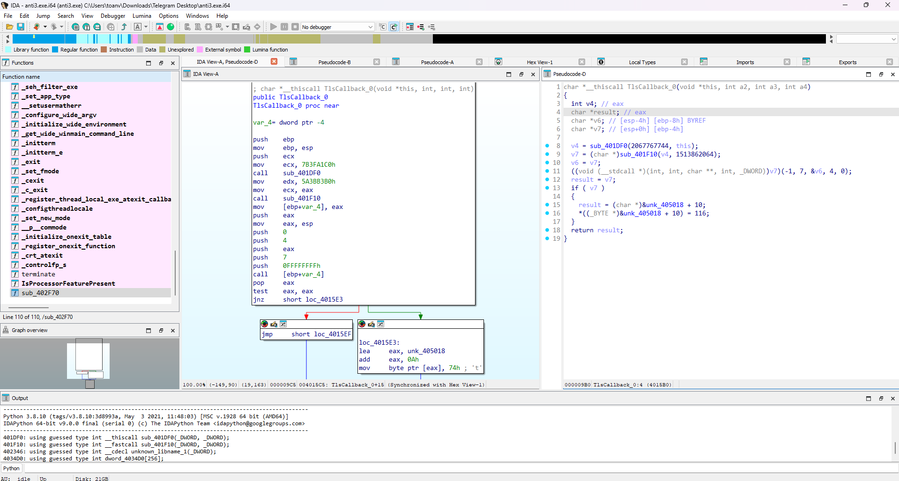

Chúng ta thấy nó call thằng v7 kia khả năng đây là resolve api.


Phân tích hàm ```sub_9C1DF0```

```
struct _LIST_ENTRY *__thiscall sub_9C1DF0(void *this)
{
  struct _PEB *v1; // eax
  struct _PEB_LDR_DATA *Ldr; // esi
  char *v3; // ebx
  struct _LIST_ENTRY *Flink; // eax
  signed int v5; // esi
  signed int i; // edi
  signed int v7; // edx
  unsigned int v8; // eax
  signed int j; // esi
  char v10; // cl
  struct _LIST_ENTRY *p_InLoadOrderModuleList; // [esp+Ch] [ebp-18h]
  struct _LIST_ENTRY **p_Flink; // [esp+18h] [ebp-Ch]
  size_t PtNumOfCharConverted; // [esp+1Ch] [ebp-8h] BYREF

  v1 = NtCurrentPeb();
  if ( !v1 ) return 0;
  Ldr = v1->Ldr;
  if ( !Ldr ) return 0;
  v3 = unknown_libname_1(1024);
  Flink = Ldr->InLoadOrderModuleList.Flink;
  p_InLoadOrderModuleList = &Ldr->InLoadOrderModuleList;
  p_Flink = &Flink->Flink;
  if ( Flink == &Ldr->InLoadOrderModuleList ) return 0;
  while ( 1 )
  {
    wcstombs_s(&PtNumOfCharConverted, v3, 0x400u, Flink[6].Flink, 0x3FFu);
    v5 = strlen(v3);
    for ( i = 0; i < v5; ++i )
      v3[i] = tolower(v3[i]);
    v7 = strlen(v3);
    v8 = -1;
    for ( j = 0; j < v7; v8 = dword_9C34D0[(v8 ^ v10)] ^ (v8 >> 8) )
      v10 = v3[j++];
    if ( abs32(~v8) == this ) break;
    Flink = *p_Flink;
    p_Flink = &Flink->Flink;
    if ( Flink == p_InLoadOrderModuleList ) return 0;
  }
  return p_Flink[6];
}
```
Hàm này lấy thông tin từ PEB từ PEB lấy Ldr (PEB_LDR_DATA) chứa danh sách các module đã tải.
Sử dụng InLoadOrderModuleList (danh sách liên kết đôi của các module) để duyệt qua từng module đã tải.
Với mỗi module chuyển tên thành lowercase tính CRC32 của tên.
So sánh mới hash sau đó nếu đúng thì trả về địa trị base của module đó


```
if (abs32(~v8) == this)
  return p_Flink[6];  // p_Flink[6] thường là DllBase (base address của module)

```


Hàm tiếp là 

```
int __fastcall sub_9C1F10(int a1, int a2)
{
  _DWORD *v2; // eax
  int v3; // edx
  unsigned int v4; // ebx
  const char *v5; // edi
  signed int v6; // edx
  unsigned int v7; // eax
  signed int i; // esi
  char v9; // cl
  int v11; // [esp+Ch] [ebp-18h]
  int v12; // [esp+10h] [ebp-14h]
  int v13; // [esp+14h] [ebp-10h]
  unsigned int v14; // [esp+18h] [ebp-Ch]
  int v16; // [esp+20h] [ebp-4h]

  v2 = (a1 + *(*(a1 + 60) + a1 + 120));
  v16 = a1;
  v12 = a1 + v2[9];
  v3 = a1 + v2[8];
  v11 = a1 + v2[7];
  v4 = 0;
  v13 = v3;
  v14 = v2[6];
  if ( !v14 )
    return 0;
  while ( 1 )
  {
    v5 = (a1 + *(v3 + 4 * v4));
    v6 = strlen(v5);
    v7 = -1;
    for ( i = 0; i < v6; v7 = dword_9C34D0[(v7 ^ v9)] ^ (v7 >> 8) )
      v9 = v5[i++];
    if ( a2 == abs32(~v7) )
      break;
    a1 = v16;
    ++v4;
    v3 = v13;
    if ( v4 >= v14 )
      return 0;
  }
  return v16 + *(v11 + 4 * *(v12 + 2 * v4));
}
```
Hàm này truy cập Export Directory tìm hàm trong module rồi trả về địa chỉ của hàm đó.

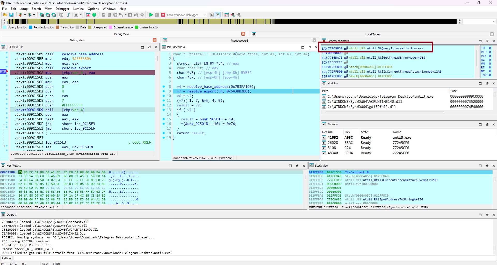

Như vậy v7 ở đây là hàm NtQueryInformationProcess() với tham số tương ứng là để check debug
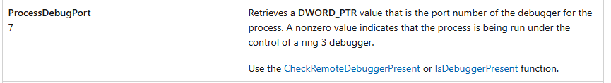

Nếu có debug thì giá trị như trên hình sẽ bị thay đổi 

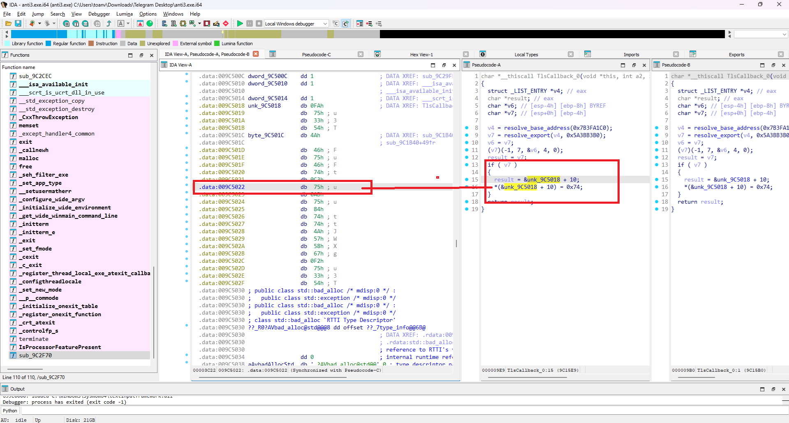

Quay trở lại main.

Ta thấy 
```int __stdcall WinMain(HINSTANCE hInstance, HINSTANCE hPrevInstance, LPSTR lpCmdLine, int nShowCmd)```

Đây là hàm khởi đầu của một ứng dụng GUI trên Windows, được hệ điều hành gọi khi chương trình bắt đầu chạy.

Gọi hàm tùy chỉnh RegisterWindowClass để đăng ký lớp cửa sổ với hệ thống, sử dụng hInstance. Lớp cửa sổ định nghĩa các thuộc tính và hành vi của cửa sổ.

```
ATOM __thiscall RegisterWindowClass(HINSTANCE hInstance)
{
  WNDCLASSEXW v2; // [esp+0h] [ebp-34h] BYREF

  v2.cbSize = 48;
  v2.style = 3;
  v2.lpfnWndProc = main;

  v2.cbClsExtra = 0;
  v2.cbWndExtra = 0;
  v2.hInstance = hInstance;
  v2.hIcon = LoadIconW(hInstance, 0x6B);
  v2.hCursor = LoadCursorW(0, 0x7F00);
  v2.hbrBackground = 6;
  v2.lpszMenuName = 109;
  v2.lpszClassName = &ClassName;
  v2.hIconSm = LoadIconW(v2.hInstance, 0x6C);
  return RegisterClassExW(&v2);
}
```

Tại đây hà main là hàm xử lý chính các hành vi trên cửa sổ mà chúng ta tác động.

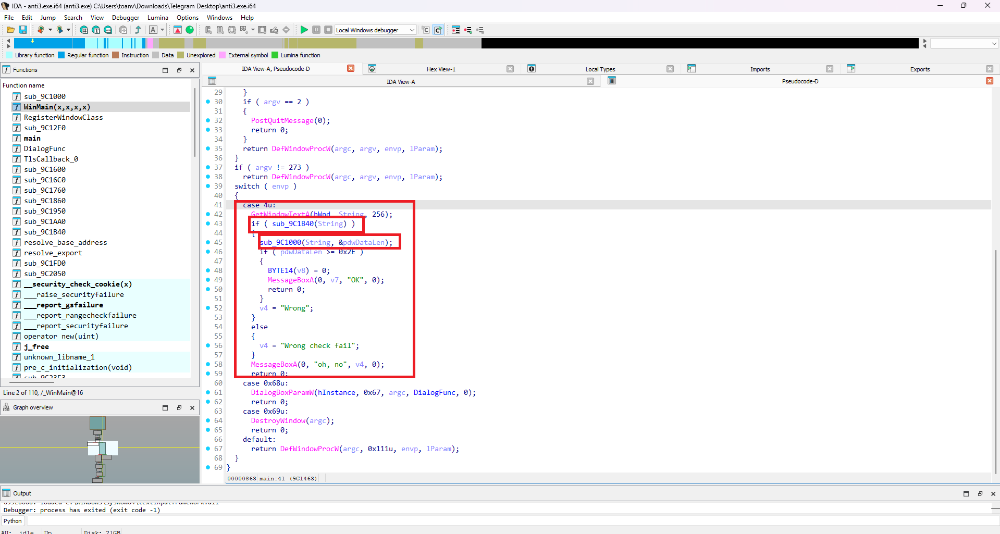

Focus vào mấy cái hàm kia.

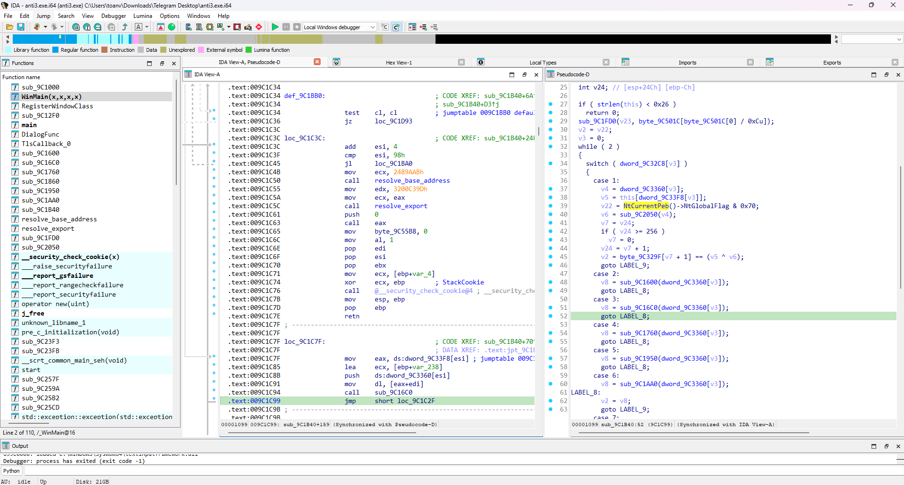


## Block 1 

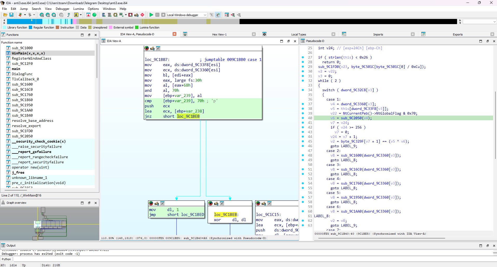 : NtGlobalFlag


Truy cập PEB lấy giá trị NtGlobalFlag bên trong. Khi có debug sẽ được gán giá trị là 0x70.
Gía trị của thằng dl đúng ở đây là 0.

Ta thấy hàm gen_const nhận vào 3 tham số tương ứng rồi nó được xor với _input ra cipher oke chúng ta chỉ cần tìm lại v6 là ngon.

## Block 2

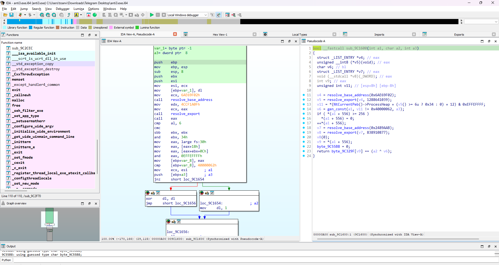 : Flags

Heap Flags chứa hai cờ được khởi tạo cùng với NtGlobalFlag: Flags và ForceFlags.
Ở đây kiểm tra Flags với offset 0xC
Nếu phát hiện debug thì dl = 0 còn không thì dl = 1 

## Block 3 : ForceFlags

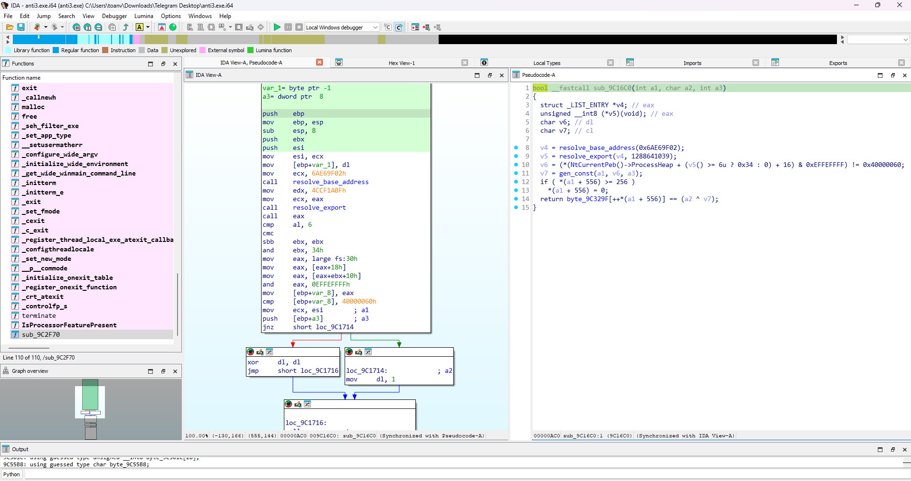
Heap Flags chứa hai cờ được khởi tạo cùng với NtGlobalFlag: Flags và ForceFlags.
Ở đây kiểm tra ForceFlags với offset 0x10
Nếu phát hiện debug thì dl = 0 còn không thì dl = 1 

## Block 4 : Heap Protection

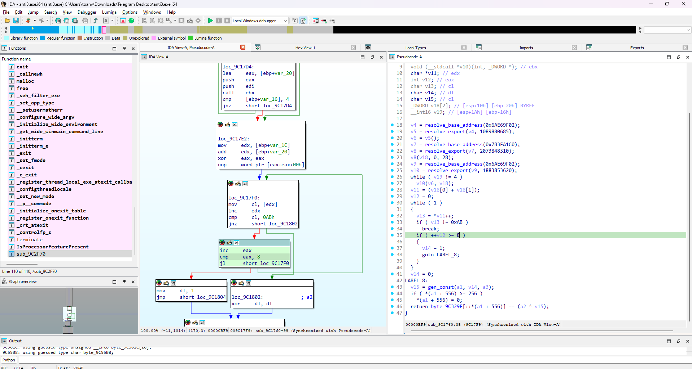

Nếu cờ HEAP_TAIL_CHECKING_ENABLED được set trong NtGlobalFlag, cụm 0xABABABAB sẽ được thêm vào cuối khối heap
Nếu như có 8 khối AB thì sẽ trả về giá trị 1 (tức có debug)
Giá trị của dl bằng 0 khi không debug

## Block 5 : CreateToolhelp32Snapshot

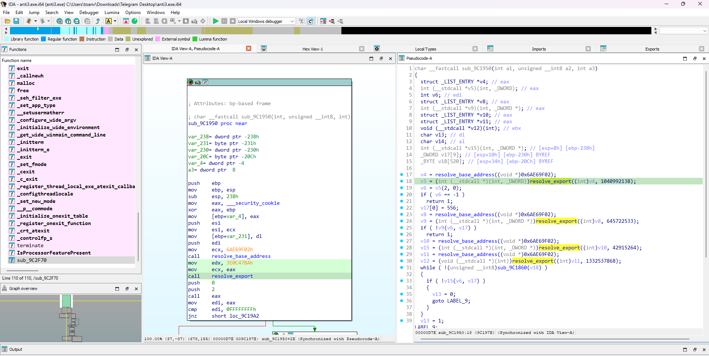

Chương trình kiểm tra xem có process của debugger hay không
Giá trị của dl bằng 1 khi không debug

## Block 6 : BlockInput

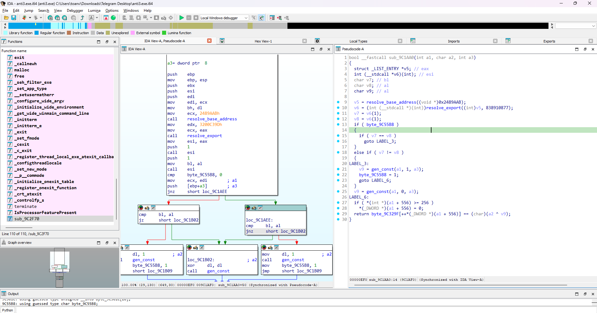

Gọi BlockInput 2 lần với tham số đầu vào đều là 1 nếu không debug thì chỉ có cái v7 là true còn v8 là false.
Giá trị của dl bằng 1 khi không debug

## Block 7 : NtQueryInformationProcess 

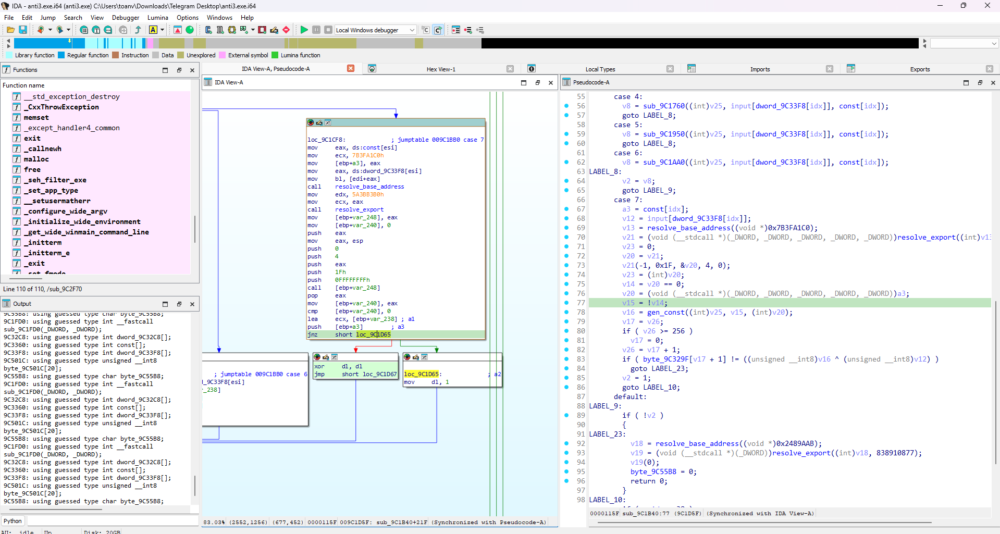

ProcessInformation = 0x1F 1 cấu trúc EPROCESS được gọi đến. Trong cấu trúc này có trường NoDebugInherit. Giá trị của trường này được trả về tại ProcessInformation nếu giá trị trả về tại đây khác 0 báo hiệu chương trình đang chạy dưới debugger.
Giá trị của dl bằng 1 khi không debug


Khi hết các case đều gọi hàm gen_const trả về giá trị để xor. 

Code solve 
[Link code solve](./main.cpp)

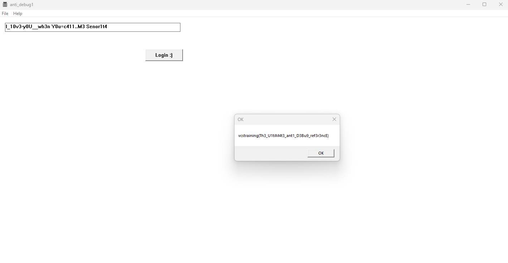
