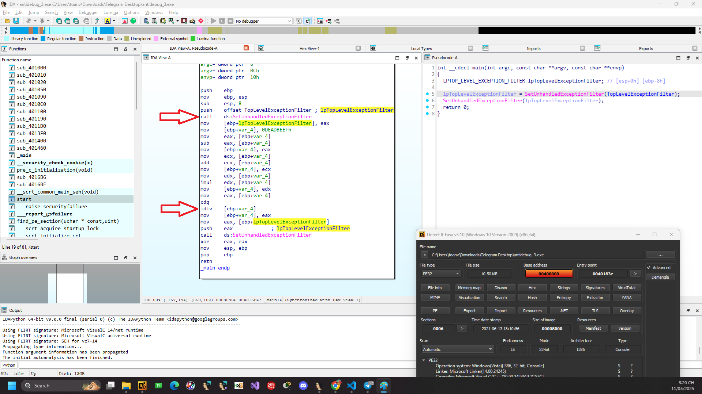
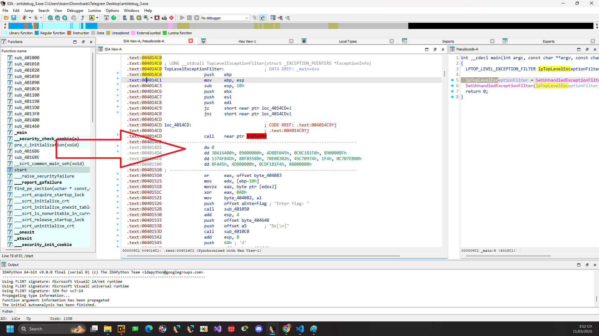
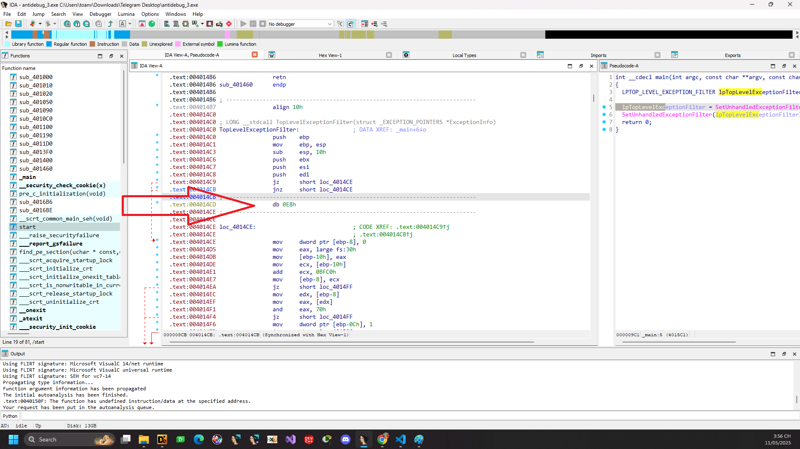
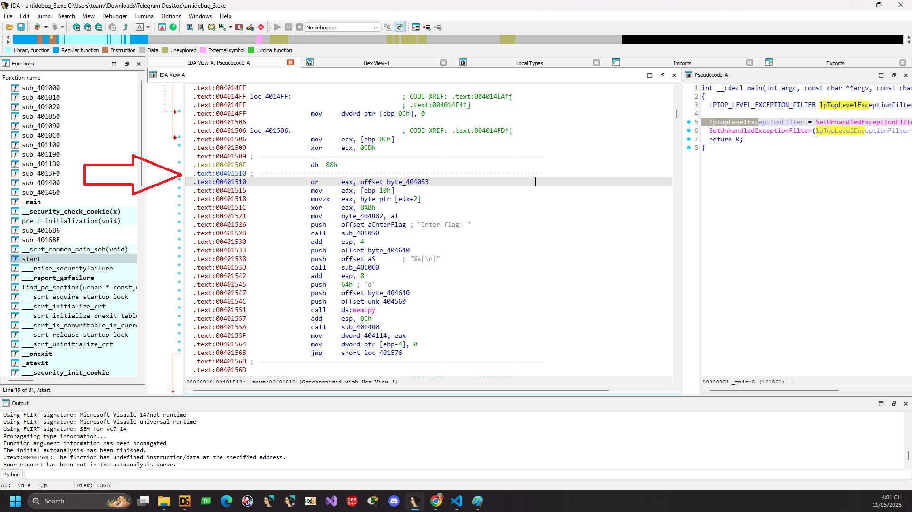
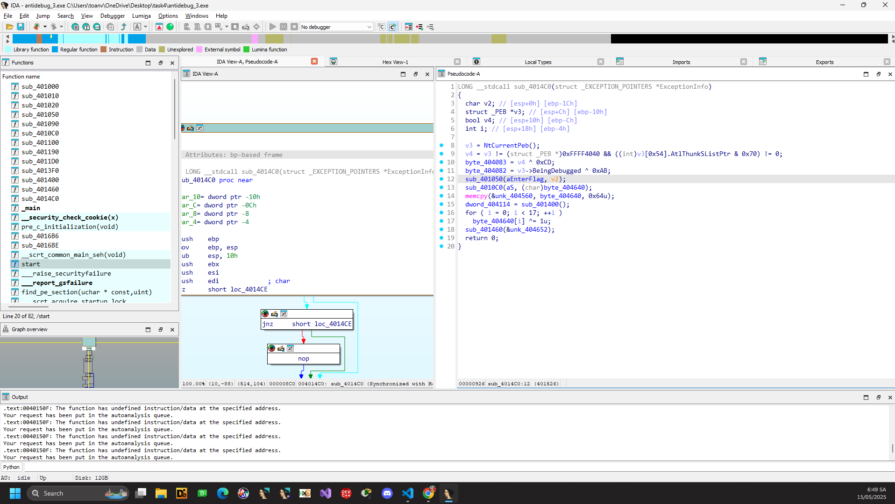
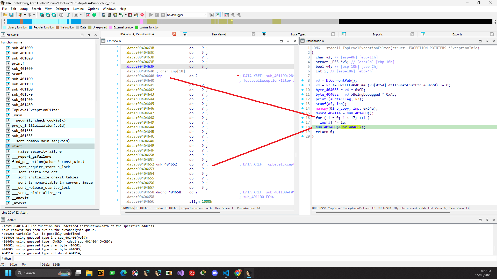
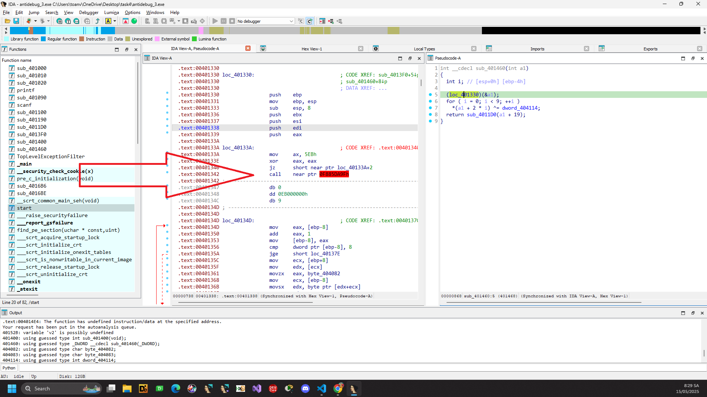
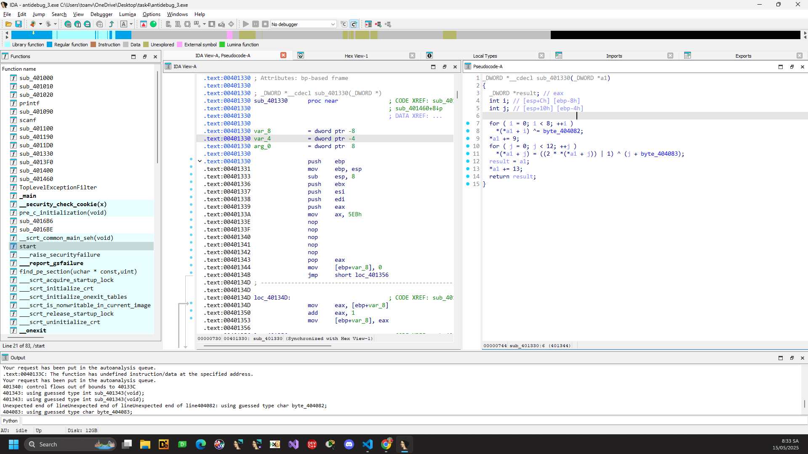
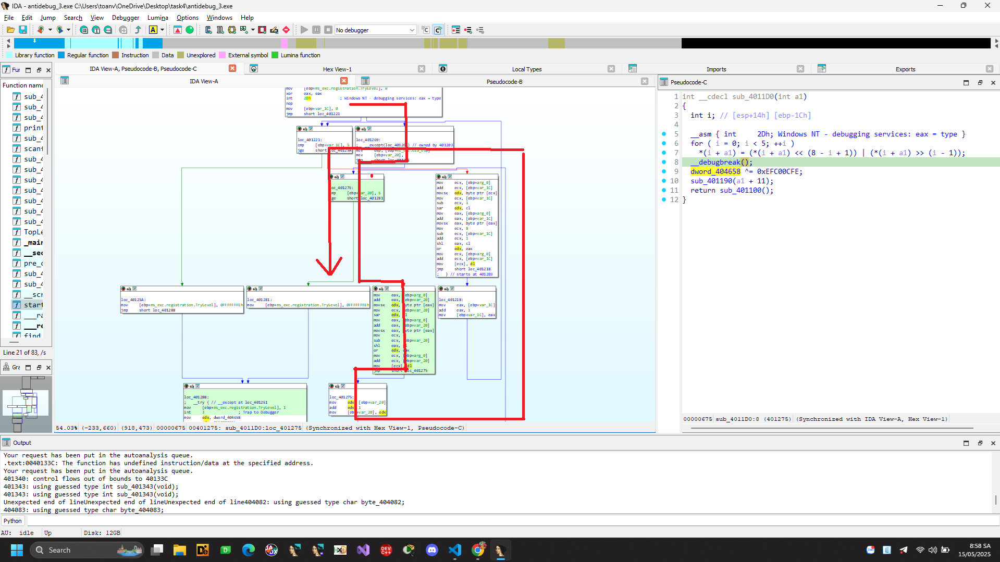
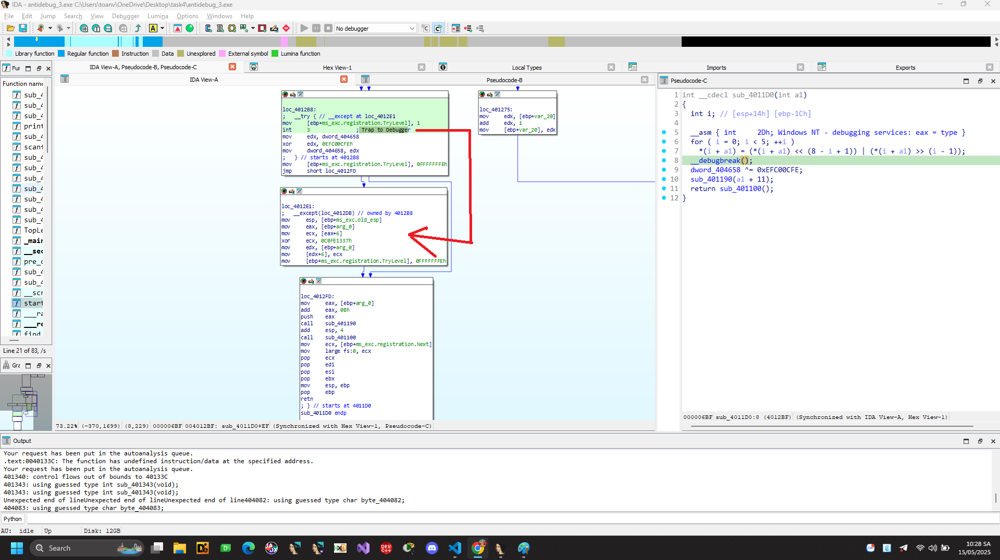

# antidebug_3

File PE 32 bit quăng vào IDA




Trong hàm main chúng ta thấy có 

```
LPTOP_LEVEL_EXCEPTION_FILTER SetUnhandledExceptionFilter(
  LPTOP_LEVEL_EXCEPTION_FILTER lpTopLevelExceptionFilter
);
```
Nó đang kí một hàm xử lý ngoại lệ sẽ được gọi khi một ngoại lệ chưa được xử lý xảy ra trong chương trình.
Trả về con trỏ đến hàm xử lý trước đó nếu cần.

Vậy là chương trình của chúng ta sẽ nhảy đến ```TopLevelExceptionFilter``` nếu có một ngoại lệ nào đó xảy ra và chưa được xử lý trong chương trình.

```C
; Attributes: bp-based frame

; int __cdecl main(int argc, const char **argv, const char **envp)
_main proc near

lpTopLevelExceptionFilter= dword ptr -8
var_4= dword ptr -4
argc= dword ptr  8
argv= dword ptr  0Ch
envp= dword ptr  10h

push    ebp
mov     ebp, esp
sub     esp, 8
push    offset TopLevelExceptionFilter ; lpTopLevelExceptionFilter
call    ds:SetUnhandledExceptionFilter
mov     [ebp+lpTopLevelExceptionFilter], eax
mov     [ebp+var_4], 0DEADBEEFh ; gán giá trị 0xDEADBEEF vào biến cục bộ var_4
mov     eax, [ebp+var_4]    ; gán lại cho eax
sub     eax, [ebp+var_4] ; eax = eax - eax = 0;
mov     [ebp+var_4], eax ; var_4 = eax  = 0 
mov     ecx, [ebp+var_4] 
add     ecx, [ebp+var_4] ; ecx = 0 + 0 = 0
mov     [ebp+var_4], ecx   ; var_4 = 0
mov     edx, [ebp+var_4] ; edx = 0
imul    edx, [ebp+var_4] ; edx = 0 * 0 = 0
mov     [ebp+var_4], edx ; var_4 = 0
mov     eax, [ebp+var_4] ; eax = 0
cdq
idiv    [ebp+var_4] ; chia edx:eax gây lỗi exception 0/0
mov     [ebp+var_4], eax
mov     eax, [ebp+lpTopLevelExceptionFilter]
push    eax             ; lpTopLevelExceptionFilter
call    ds:SetUnhandledExceptionFilter
xor     eax, eax
mov     esp, ebp
pop     ebp
retn
_main endp
```

Vậy thì khi không debug chương trình sẽ hoạt động ở hàm ```TopLevelExceptionFilter```
Trong hàm này chúng ta không thể F5 được vấn đề có thể do chỗ kia, người ta cố tình chèn thêm byte rác vào để không F5 được



Thử U để undefine rồi P để tạo lại function.





Sau một hồi patch, rồi make fun rồi thu được mã giả như hình.


Vọc 1 lát ta đổi tên biến lại cho clear.


```C
LONG __stdcall sub_4014C0(struct _EXCEPTION_POINTERS *ExceptionInfo)
{
  char v2; // [esp+0h] [ebp-1Ch]
  struct _PEB *v3; // [esp+Ch] [ebp-10h]
  bool v4; // [esp+10h] [ebp-Ch]
  int i; // [esp+18h] [ebp-4h]

  v3 = NtCurrentPeb();
  v4 = v3 != (struct _PEB *)0xFFFF4040 && ((int)v3[0x54].AtlThunkSListPtr & 0x70) != 0;
  byte_404083 = v4 ^ 0xCD;
  byte_404082 = v3->BeingDebugged ^ 0xAB;
  printf(aEnterFlag, v2);
  scanf(aS, (char)inp);
  memcpy(&inp_copy, inp, 0x64u);
  dword_404114 = sub_401400();
  for ( i = 0; i < 17; ++i )
    inp[i] ^= 1u;
  sub_401460(&unk_404652);
  return 0;
}
```

byte_404083 phụ thuộc vào v4 check NtGlobalFlag
```
Thông tin mà hệ thống sử dụng để xác định cách tạo cấu trúc heap được lưu tại một vị trí không được tài liệu hóa trong PEB, ở offset 0x68. Nếu giá trị tại vị trí này là 0x70, ta biết rằng chương trình đang chạy trong trình gỡ lỗi (debugger).
```
Vậy thì nếu không debug thì byte_404083 = 0xCD 

Tiếp là cái byte_404082 chúng ta thấy nó check trường BeingDebugged trong PEB.

Nếu không debug thì byte_404082 = 0xAB

Tiếp chúng ta thấy có lời gọi đến sub_401400()

```C
int sub_401400()
{
  unsigned int v1; // [esp+4h] [ebp-8h]
  unsigned int i; // [esp+8h] [ebp-4h]

  v1 = (char *)sub_4013F0 - (char *)&loc_401330 - 16;
  for ( i = 0; i < v1 && (*((unsigned __int8 *)&loc_401330 + i) ^ 0x55) != 0x99; ++i )
    ;
  return v1 - i + 0xBEEF;
}
```
Hàm này tính số byte trong loc_401330 bằng cách lấy địa chỉ sub_4013F0 trừ đi địa chỉ loc_401330 - 16 (16 ở đây là alignment)

Chúng ta thấy hàm này check 0x99 ^ 0x55 = 0xcc = INT3 nếu xuất hiện lệnh INT3 thì vòng for này sẽ được ngắn sớm còn không thì nó sẽ chạy hết 

Vậy giá trị trẻ về đúng ở đây là v1 - v1 + 0xBEEF = 0xBEEF

Quay lại hàm TopLevelExceptionFilter chúng ta thấy 17 kí tự đầu được xor với 1 kí tự 18 giữ nguyên và truyền pointer tại kí tự 19 vào sub_401460



```
int __cdecl sub_401460(int a1)
{
  int i; // [esp+0h] [ebp-4h]

  (loc_401330)(&a1);
  for ( i = 0; i < 9; ++i )
    *(a1 + 2 * i) ^= dword_404114;
  return sub_4011D0(a1 + 19);
}
```
Tiếp nó lại truyền vào hàm loc_401330


Tương tự ở hàm này chương trình lại cố trèn byte rác vào. Chúng ta lại U, C rồi patch rồi P lại để tìm lại mã giả thử. Sau một hồi thu được mã giả như hình.



```C
_DWORD *__cdecl sub_401330(_DWORD *a1)
{
  _DWORD *result; // eax
  int i; // [esp+Ch] [ebp-8h]
  int j; // [esp+10h] [ebp-4h]

  for ( i = 0; i < 8; ++i )
    *(*a1 + i) ^= byte_404082;
  *a1 += 9;
  for ( j = 0; j < 12; ++j )
    *(*a1 + j) = ((2 * *(*a1 + j)) | 1) ^ (j + byte_404083);
  result = a1;
  *a1 += 13;
  return result;
}
```

Vậy là từ kí tự thứ 19 đến kí tự thứ 26 thì bị xor với byte_404082.

Kí tự 27 giữ nguyên.

Tiếp từ 28 đến 39 được xử lí ```*(*a1 + j) = ((2 * *(*a1 + j)) | 1) ^ (j + byte_404083);```

Kí tự 40 giữ nguyên.

Oke hết quay lại

```C
int __cdecl sub_401460(int a1)
{
  int i; // [esp+0h] [ebp-4h]

  (sub_401330)(&a1);
  for ( i = 0; i < 9; ++i )
    *(a1 + 2 * i) ^= dword_404114;
  return sub_4011D0(a1 + 19);
}
```
Mỗi 2 byte của a xor với dword_404114
Vậy đoạn này là từ kí tự 41 đến 41 + 8 * 2 = 57

Kí tự 58 bỏ qua. Truyền tiếp là 40 + 19 = 59

```C
int __cdecl sub_4011D0(int a1)
{
  int i; // [esp+14h] [ebp-1Ch]

  __asm { int     2Dh; Windows NT - debugging services: eax = type }
  for ( i = 0; i < 5; ++i )
    *(i + a1) = (*(i + a1) << (8 - i + 1)) | (*(i + a1) >> (i - 1));
  __debugbreak();
  dword_404658 ^= 0xEFC00CFE;
  sub_401190(a1 + 11);
  return sub_401100();
}
```
Tương tự như lệnh INT 3, khi lệnh INT 2D được thực thi, một ngoại lệ kiểu EXCEPTION_BREAKPOINT cũng sẽ được kích hoạt. Tuy nhiên, với INT 2D, Windows sẽ sử dụng thanh ghi EIP (Instruction Pointer) làm địa chỉ của ngoại lệ, sau đó tăng giá trị của EIP lên (tức là bỏ qua một byte sau lệnh INT 2D).

Windows cũng sẽ kiểm tra giá trị của thanh ghi EAX khi INT 2D được gọi. Nếu EAX có giá trị là 1, 3, hoặc 4 trên tất cả các phiên bản Windows, hoặc 5 trên Windows Vista trở lên, thì địa chỉ ngoại lệ (exception address) sẽ được tăng thêm một byte nữa.

Điều này có thể gây vấn đề cho một số debugger, vì sau khi EIP bị tăng, byte lệnh nằm ngay sau INT 2D sẽ bị bỏ qua, và chương trình có thể tiếp tục thực thi từ một lệnh đã bị "hỏng".


Như vậy luồng đúng của chúng ta khi gặp INT2 sẽ là 



```C
mov     eax, [ebp+arg_0]        ; eax = địa chỉ mảng arr
add     eax, [ebp+var_20]       ; eax = địa chỉ phần tử arr[index]
movsx   edx, byte ptr [eax]     ; edx = giá trị byte ở arr[index], mở rộng dấu sang 32-bit

mov     ecx, [ebp+var_20]       ; ecx = index
sar     edx, cl                 ; dịch phải edx theo index bit (dịch có dấu)

mov     eax, [ebp+arg_0]        ; eax = địa chỉ mảng arr
add     eax, [ebp+var_20]       ; eax = địa chỉ phần tử arr[index]
movsx   eax, byte ptr [eax]     ; eax = giá trị byte ở arr[index], mở rộng dấu sang 32-bit

mov     ecx, 8                  ; ecx = 8
sub     ecx, [ebp+var_20]       ; ecx = 8 - index
shl     eax, cl                 ; dịch trái eax theo (8 - index) bit

or      edx, eax                ; edx = (byte >> index) | (byte << (8 - index))

mov     ecx, [ebp+arg_0]        ; ecx = địa chỉ mảng arr
add     ecx, [ebp+var_20]       ; ecx = địa chỉ phần tử arr[index]
mov     [ecx], dl               ; ghi lại kết quả vào arr[index] (lấy byte thấp nhất của edx)

jmp     short loc_401275        ; 
```

Vậy đây là chỗ xử lí 5 kí tự từ 59 - 63;

Bỏ qua 64.

Tiếp là từ 65 đến 69
Gặp int3 nó sẽ nhảy sang except


Được xor với  0x0C0FE1337h

Bỏ qua 70

Từ 71 đến 100

```
int __cdecl sub_401190(int a1)
{
  int result; // eax
  int i; // [esp+0h] [ebp-4h]

  for ( i = 1; i < 30; ++i )
  {
    *(i + a1) ^= *(i + a1 - 1);
    result = i + 1;
  }
  return result;
}
```

Mà ta lại có 
```C
int sub_401100()
{
  int result; // eax
  char v1[4]; // [esp+0h] [ebp-Ch]
  int i; // [esp+4h] [ebp-8h]

  *v1 = 0;
  for ( i = 0; i < 100; ++i )
  {
    if ( inp[i] == byte_404118[i] )
      ++*v1;
  }
  result = printf(Format, v1[0]);
  if ( *v1 == 100 )
    return printf(aYouGotItFlagKc, &inp_copy);
  return result;
}
```

Oke extract byte_404118 ra rồi solve thôi


```Python
byte_404118 = [
  0x74, 0x6F, 0x69, 0x35, 0x4F, 0x65, 0x6D, 0x32, 0x32, 0x79, 
  0x42, 0x32, 0x71, 0x55, 0x68, 0x31, 0x6F, 0x5F, 0xDB, 0xCE, 
  0xC9, 0xEF, 0xCE, 0xC9, 0xFE, 0x92, 0x5F, 0x10, 0x27, 0xBC, 
  0x09, 0x0E, 0x17, 0xBA, 0x4D, 0x18, 0x0F, 0xBE, 0xAB, 0x5F, 
  0x9C, 0x8E, 0xA9, 0x89, 0x98, 0x8A, 0x9D, 0x8D, 0xD7, 0xCC, 
  0xDC, 0x8A, 0xA4, 0xCE, 0xDF, 0x8F, 0x81, 0x89, 0x5F, 0x69, 
  0x37, 0x1D, 0x46, 0x46, 0x5F, 0x5E, 0x7D, 0x8A, 0xF3, 0x5F, 
  0x59, 0x01, 0x57, 0x67, 0x06, 0x41, 0x78, 0x01, 0x65, 0x2D, 
  0x7B, 0x0E, 0x57, 0x03, 0x68, 0x5D, 0x07, 0x69, 0x23, 0x55, 
  0x37, 0x60, 0x14, 0x7E, 0x1D, 0x2F, 0x62, 0x5F, 0x62, 0x5F
]

# Step 1: XOR the first 17 bytes with 1
for i in range(0, 17):
    byte_404118[i] ^= 1

# Step 2: XOR bytes 18-25 with 0xAB
for i in range(18, 26):
    byte_404118[i] ^= 0xAB

# Step 3: Transform bytes 0-11 using values from 27-38
j = 0
for i in range(27, 39):
    #   *(*a1 + j) = ((2 * *(*a1 + j)) | 1) ^ (j + 0xCD);
    offset = j + 0xCD
    val = byte_404118[i] ^ offset
    val = val & ~1  
    byte_404118[i] = val // 2
    j+=1

# Step 4: XOR bytes 40-57 in pairs
key = [0xEF,0xBE]
for i in range(40, 58, 2):
    byte_404118[i] ^= key[0]
    byte_404118[i+1] ^= key[1]

# Step 5: Circular bit shift left with j = 1..5
j = 0
for i in range(59, 64):
    # or      edx, eax                ; edx = (byte >> index) | (byte << (8 - index))
    byte_404118[i] = ((byte_404118[i] << j) & 0xFF) | ((byte_404118[i] >> (8 - j)) & 0xFF)
    j += 1

# Step 6: XOR specific bytes with constants
i = 65
key1 = [0x37,0x13,0xFE,0xC0]
byte_404118[i] ^= key1[0]
i += 1
byte_404118[i] ^= key1[1]
i += 1
byte_404118[i] ^= key1[2]
i += 1
byte_404118[i] ^= key1[3]

# Step 7: XOR from end to beginning (indexes 99 → 71)
for i in range(99, 70, -1):
    byte_404118[i] ^= byte_404118[i - 1]

# Final: Print all bytes as characters
print("".join(chr(b) for b in byte_404118))

```

```Flag: kcsc{unh4Ndl33xC3pTi0n_pebDebU9_nt9lob4Lfl49_s0F7w4r38r34Kp01n7_int2d_int3_YXV0aG9ydHVuYTk5ZnJvbWtjc2M===}```