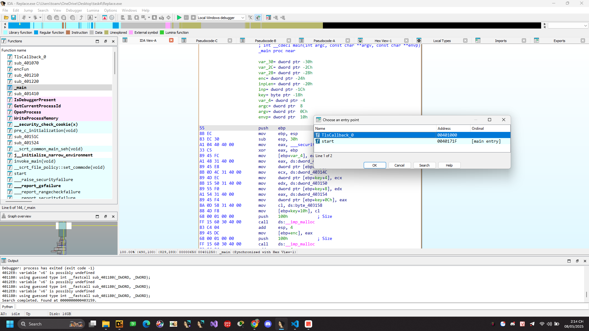
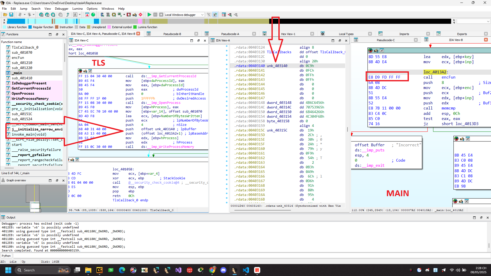
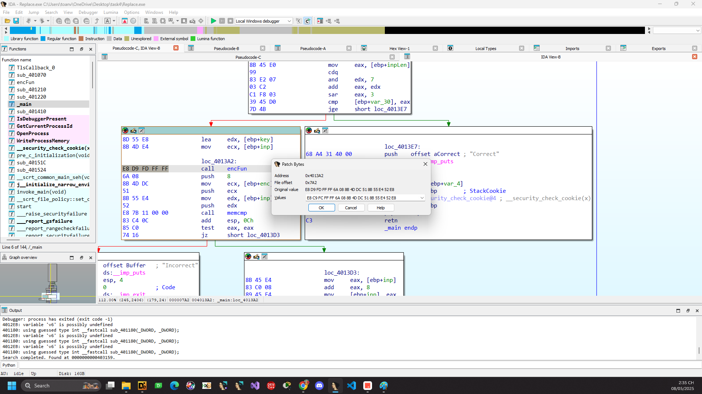

# Replace.exe

File PE, 32 bit chúng ta thả vào IDA phân tích


```C
int __cdecl main(int argc, const char **argv, const char **envp)
{
  FILE *v3; // eax
  int v4; // ecx
  char v6; // [esp+0h] [ebp-30h]
  int j; // [esp+0h] [ebp-30h]
  unsigned int i; // [esp+8h] [ebp-28h]
  char *enc; // [esp+Ch] [ebp-24h]
  signed int inpLen; // [esp+10h] [ebp-20h]
  char *inp; // [esp+14h] [ebp-1Ch]
  char key[20]; // [esp+18h] [ebp-18h] BYREF

  strcpy(key, "VdlKe9upfBFkkO0L");
  enc = malloc(0x100u);
  inp = malloc(0x100u);
  memset(inp, 0, 0x100u);
  memset(enc, 0, 0x100u);
  memcpy(enc, &unk_40315C, 0x30u);
  sub_401410("FLAG : ", v6);
  v3 = __acrt_iob_func(0);
  fgets(inp, 256, v3);
  inpLen = strlen(inp);
  v4 = inpLen % 8;
  if ( inpLen % 8 ) ; Thêm padding
  {
    for ( i = 0; i < 8 - v4; ++i )
      inp[inpLen - 1 + i] = '\n';
    inpLen += 8 - v4;
  }
  for ( j = 0; j < inpLen / 8; ++j )
  {
    encFun(inp, key); ; encrypt inp rồi số sánh với enc
    if ( memcmp(inp, enc, 8u) )
    {
      puts("Incorrect");
      exit(0);
    }
    inp += 8;
    enc += 8;
  }
  puts("Correct");
  return 1;
}
```

```C
int __fastcall encFun(_DWORD *enc, _DWORD *key)
{
  int result; // eax

  *enc ^= key[1] + *key;
  result = enc[1] ^ (key[3] + key[2]);
  enc[1] = result;
  return result;
}
```
Ok như vậy là cũng khá rõ ta thấy nhập vào input rồi thêm padding "\n" sau cho chia hết cho 8. Rồi sau đó gọi hàm encFun rồi so sánh với enc.

Thử viết code giải mã bằng Python nhưng không ra được kết quả có thể đọc được.


Phim tắt Ctrl + E để liệt kê các điểm entry point.



Thấy có hàm TlsCallBack_0

Định nghĩa trên mạng https://unprotect.it/technique/tls-callback/


TLS (Thread Local Storage) callback là một cơ chế trong Windows cho phép chương trình khai báo một hàm đặc biệt, hàm này sẽ được gọi tự động mỗi khi một luồng (thread) được tạo ra. 

Hiểu đơn giản: TLS callback giống như một đoạn mã được chạy sớm mỗi khi có thread mới được khởi tạo – thậm chí trước cả khi chương trình chính bắt đầu chạy (trước cả ```main()``` hay ```WinMain()```).

Dùng TLS callback để chống debug:
Kỹ thuật chống debug bằng TLS callback lợi dụng điểm sau:
Thông thường, khi debug một chương trình, trình debug sẽ bắt đầu tại entry point (điểm bắt đầu chính của chương trình).
Tuy nhiên, TLS callback có thể chạy trước entry point, vì vậy nếu trong TLS callback có chèn mã kiểm tra xem có trình debug hay không (ví dụ dùng API như ```IsDebuggerPresent())```, chương trình có thể:

Có thể phát hiện debugger và dừng chương trình luôn.

```C
BOOL __stdcall TlsCallback_0(int a1, int a2, int a3)
{
  BOOL result; // eax
  HANDLE hProcess; // [esp+4h] [ebp-10h]
  DWORD dwProcessId; // [esp+8h] [ebp-Ch]
  SIZE_T NumberOfBytesWritten; // [esp+Ch] [ebp-8h] BYREF

  result = IsDebuggerPresent();
  if ( !result )
  {
    dwProcessId = GetCurrentProcessId();
    hProcess = OpenProcess(0x1FFFFFu, 0, dwProcessId);
    return WriteProcessMemory(hProcess, &loc_4013A2 + 1, &unk_403140, 4u, &NumberOfBytesWritten);
  }
  return result;
}
```
Hàm IsDebuggerPresent() được sử dụng để kiểm tra xem chương trình hiện tại có đang được debug bởi một debugger hay không. Nếu chương trình đang được debug, hàm này sẽ trả về giá trị TRUE. Nếu chương trình không đang được debug, hàm này sẽ trả về giá trị FALSE.

Hàm [OpenProcess()](https://learn.microsoft.com/en-us/windows/win32/api/processthreadsapi/nf-processthreadsapi-openprocess) được sử dụng để mở một handle tới một tiến trình đang chạy trên hệ thống. 
Mở chương trình với full quyền PROCESS_ALL_ACCESS (0x1fffff) ghi 4 byte dữ liệu từ unk_403140 vào địa chỉ loc_4013A2 + 1. bằng WriteProcessMemory()



Vậy thì khi không có bị debug runtime chương trình như bình thường thì nó sẽ sửa đổi opcode chỗ call encFun đang từ ```E8 D9 FD FF FF``` thành ```E8 C9 FC FF FF```.

Bây giờ có 2 cách 1 là debug luôn ở chỗ TlsCallback_0 rồi chỉnh cờ rồi F9 đến main là xong. 
2 là patch luôn rồi phân tích tĩnh ở đây e sẽ làm phương án 2 patch lại.


Như vậy thì thay vì gọi encFun thì gọi sub_401070 truyền vào inp và key thành enc rồi mới đem đi so sánh.

```C
int __fastcall sub_401070(unsigned int *inp, _DWORD *key)
{
  int result; // eax
  unsigned int i; // [esp+14h] [ebp-18h]
  int v4; // [esp+1Ch] [ebp-10h]
  unsigned int v5; // [esp+24h] [ebp-8h]
  unsigned int v6; // [esp+28h] [ebp-4h]

  v6 = *inp;
  v5 = inp[1];
  v4 = 0;
  for ( i = 0; i < 0x20; ++i )
  {
    v4 -= 0x61C88647;
    v6 += (key[1] + (v5 >> 5)) ^ (v4 + v5) ^ (*key + 16 * v5);
    v5 += (key[3] + (v6 >> 5)) ^ (v4 + v6) ^ (key[2] + 16 * v6);
  }
  *inp = v6;
  result = 4;
  inp[1] = v5;
  return result;
}
```
https://chatgpt.com/share/681c642a-2d74-800e-a9c0-c11deab0ead4
Dùng con ChatGPT giải mã thử 
```Python
def str_to_key(s):
    """Chuyển chuỗi 16 ký tự thành 4 số nguyên 32-bit (little endian)."""
    assert len(s) == 16, "Key must be 16 characters (128 bits)"
    return [int.from_bytes(s[i:i+4].encode(), 'little') for i in range(0, 16, 4)]

def tea_decrypt_block(block, key):
    """Giải mã 1 block (8 byte) bằng thuật toán TEA với 32 vòng."""
    v0 = int.from_bytes(block[:4], 'little')
    v1 = int.from_bytes(block[4:], 'little')
    delta = 0x9E3779B9
    sum_ = (delta * 32) & 0xFFFFFFFF

    for _ in range(32):
        v1 = (v1 - ((key[3] + (v0 >> 5)) ^ (sum_ + v0) ^ (key[2] + (v0 << 4)))) & 0xFFFFFFFF
        v0 = (v0 - ((key[1] + (v1 >> 5)) ^ (sum_ + v1) ^ (key[0] + (v1 << 4)))) & 0xFFFFFFFF
        sum_ = (sum_ - delta) & 0xFFFFFFFF

    return v0.to_bytes(4, 'little') + v1.to_bytes(4, 'little')

# Dữ liệu mã hóa từ .rdata
enc_bytes = bytes([
    0x19, 0x2C, 0x30, 0x2A, 0x79, 0xF9, 0x54, 0x02,
    0xB3, 0xA9, 0x6C, 0xD6, 0x91, 0x80, 0x95, 0x04,
    0x29, 0x59, 0xE8, 0xA3, 0x0F, 0x79, 0xBD, 0x86,
    0xAF, 0x05, 0x13, 0x6C, 0xFE, 0x75, 0xDB, 0x2B,
    0xAE, 0xE0, 0xF0, 0x5D, 0x88, 0x4B, 0x86, 0x89,
    0x33, 0x66, 0xAC, 0x45, 0x9A, 0x6C, 0x78, 0xA6,
    0x00, 0x00, 0x00, 0x00  # padding hoặc NULL bytes
])

# Key dạng chuỗi
key_str = "VdlKe9upfBFkkO0L"
key = str_to_key(key_str)

# Giải mã toàn bộ
plaintext = b''
for i in range(0, len(enc_bytes), 8):
    block = enc_bytes[i:i+8]
    if len(block) < 8:
        break  # bỏ qua block cuối nếu không đủ 8 bytes
    plaintext += tea_decrypt_block(block, key)

# Hiển thị kết quả
print("Decrypted (raw bytes):", plaintext)
try:
    print("Decrypted (ASCII):", plaintext.decode())
except UnicodeDecodeError:
    print("Decrypted (partial ASCII):", plaintext.decode(errors='ignore'))
```

```PTITCTF{bdc90e23aa0415e94d0ac46a938efcf3}```