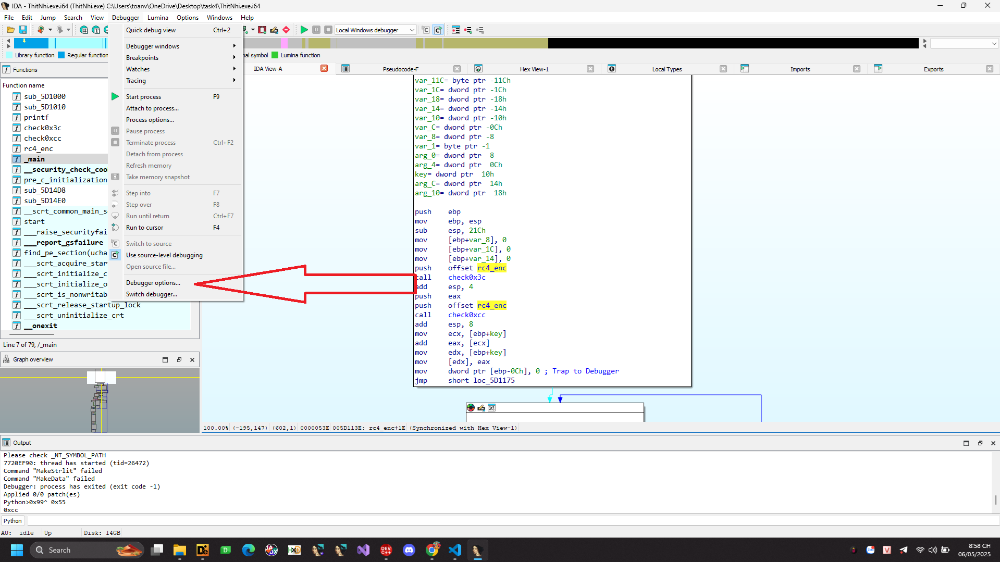
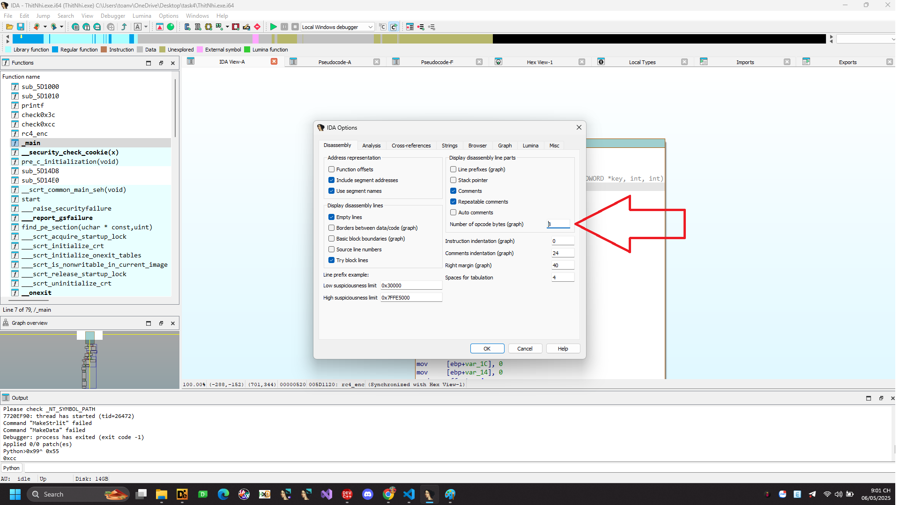

# ThitNhi.exe

File PE, 32 bit chúng ta thả vào IDA phân tích

```C
int __cdecl main(int argc, const char **argv, const char **envp)
{
  FILE *v3; // eax
  int numBytecode; // eax
  int i; // [esp+0h] [ebp-3Ch]
  unsigned int key; // [esp+4h] [ebp-38h] BYREF
  char inp[16]; // [esp+8h] [ebp-34h] BYREF
  _DWORD res[3]; // [esp+18h] [ebp-24h] BYREF
  __int16 v10; // [esp+24h] [ebp-18h]
  _BYTE enc[16]; // [esp+28h] [ebp-14h]

  puts("Enter Flag :");
  v3 = _acrt_iob_func(0);
  fgets(inp, 14, v3);
  enc[0] = 125;
  enc[1] = 8;
  enc[2] = -19;
  enc[3] = 71;
  enc[4] = -27;
  enc[5] = 0;
  enc[6] = -120;
  enc[7] = 58;
  enc[8] = 122;
  enc[9] = 54;
  enc[10] = 2;
  enc[11] = 41;
  enc[12] = -28;
  enc[13] = 0;
  memset(res, 0, sizeof(res));
  v10 = 0;
  numBytecode = check0x3c(main);
  key = check0xcc(main, numBytecode) ^ 0xDEADBEEF;
  rc4_enc(inp, 13, &key, 4, res);
  for ( i = 0; i < 13; ++i )
  {
    if ( enc[i] != *(res + i) )
    {
      printf("Failed", i);
      return 1;
    }
  }
  printf("Success!! Here is your Flag : Flag{%s}", inp);
  return 0;
}
```

Sau 1 hồi phân tích và rename các biến chúng ta được code clear như hình.


Các hàm chúng ta cần để ý là check0x3c,check0xcc,rc4_enc, cuối cùng input được rc4 với key.

```C
int __cdecl check0x3c(unsigned __int8 *a1)
{
  int v2; // [esp+0h] [ebp-Ch]
  int v3; // [esp+4h] [ebp-8h]

  v3 = 0;
  do
  {
    ++v3;
    v2 = *a1++;
  }
  while ( v2 != 195 );
  return v3;
}
```


```C
int __cdecl check0xcc(int a1, unsigned int a2)
{
  unsigned int i; // [esp+4h] [ebp-8h]

  for ( i = 0; i < a2; ++i )
  {
    if ( (*(i + a1) ^ 0x55) == 0x99 )
      return 0x13;
  }
  return 0x37;
}
```

```C
void __cdecl __noreturn rc4_enc(int a1, int a2, _DWORD *key, int a4, int a5)
{
  unsigned int v5; // eax
  int v6; // [esp+200h] [ebp-1Ch]
  int k; // [esp+204h] [ebp-18h]
  int v8; // [esp+208h] [ebp-14h]
  int j; // [esp+20Ch] [ebp-10h]
  int i; // [esp+210h] [ebp-Ch]
  int v11; // [esp+214h] [ebp-8h]
  char v12; // [esp+21Bh] [ebp-1h]
  int savedregs; // [esp+21Ch] [ebp+0h] BYREF

  v11 = 0;
  v6 = 0;
  v8 = 0;
  v5 = check0x3c(rc4_enc);
  *key += check0xcc(rc4_enc, v5);
  for ( i = 0; i < 256; ++i )
  {
    *(&savedregs + i - 284) = i;
    *(&savedregs + i - 540) = *(key + i % a4);
  }
  for ( j = 0; j < 256; ++j )
  {
    v11 = (*(&savedregs + j - 540) + v11 + *(&savedregs + j - 284)) % 256;
    v12 = *(&savedregs + v11 - 284);
    *(&savedregs + v11 - 284) = *(&savedregs + j - 284);
    *(&savedregs + j - 284) = v12;
  }
  v11 = 0;
  for ( k = 0; k < a2; ++k )
  {
    v8 = (v8 + 1) % 256;
    v11 = (v11 + *(&savedregs + v8 - 284)) % 256;
    v12 = *(&savedregs + v11 - 284);
    *(&savedregs + v11 - 284) = *(&savedregs + v8 - 284);
    *(&savedregs + v8 - 284) = v12;
    v6 = (*(&savedregs + v11 - 284) + *(&savedregs + v8 - 284)) % 256;
    *(k + a5) = *(&savedregs + v6 - 284) ^ *(k + a1);
  }
}
```

Opcode (viết tắt của operation code) là mã lệnh đại diện cho một lệnh máy cụ thể trong ngôn ngữ máy hoặc hợp ngữ (assembly). Nó nói cho CPU biết phải thực hiện hành động gì như cộng, trừ, di chuyển dữ liệu, so sánh, nhảy, v.v.


Giả sử trong kiến trúc x86, đoạn hợp ngữ: mov eax, 1 có thể được dịch ra mã máy là: B8 01 00 00 00

B8 là opcode đại diện cho lệnh MOV EAX, imm32 (di chuyển một số 32-bit vào thanh ghi EAX).

01 00 00 00 là dữ liệu (giá trị 1).


Hàm check0x3c đếm số lượng opcode đến khi gặp lệnh ret hay 0x3C thì trả về kết quả là số lượng lệnh.

Hàm check0x0cc cũng kiểm tra opcode nhưng nếu gặp giá trị 0x99 ^ 0x55 = 0xcc hay INT 3. 

0xCC là mã máy của lệnh INT 3 (Interrupt 3) trong kiến trúc x86. Đây là một lệnh ngắt phần mềm dùng để thiết lập breakpoint (điểm dừng) trong quá trình debug.


Khi đặt breakpoint trong debugger như OllyDbg, x64dbg, IDA Pro,… thì debugger thường ghi đè byte tại vị trí đó thành 0xCC.

Nên thực chất hàm này có thể check chúng ta có đặt breakpoint hay không để từ đó trả về các giá trị khác nhau.


Oke, clear đến tiếp phần sử dụng trong IDA để thấy lệnh INT 3 trực quan hơn trong IDA chúng ta tiến hành 1 số cài đặt.




Để view opcode chúng ta cài đặt tiếp


Thêm số lượng mà chúng ta mong muốn




Ví dụ ta đặt break point ở đây và debug xem thử 


Chúng ta đã thấy IDA chèn lệnh INT3 trước breakpoint chúng ta đặt để dừng chương trình lại.

Điểm của check debug bằng INT3 là không ổn định không chính xác rất có thể trong code ban đầu của chúng ta có 0xCC


Oke chúng ta quan tâm tiếp đến cái key


Như vậy như đã nói từ trước thì có 0xCC trong code ban đầu vì thế dù chúng ta có đặt breakpoint hay không thì return value ở đây chính xác phải trả về 0x13

Tức là key của chúng ta là 0x13 ^ 0xDEADBEEF = key = 0xdeadbefc

Đi tiếp vào hàm rc4_enc 


Chúng ta thấy *key được cộng với 1 giá trị mà check0xcc trả về check thì trong hàm này không hề có 0xCC chứng tỏ giá trị đúng mà hàm này trả về khi gọi là 0x37.

tức là key của chúng ta final cuối là 0xdeadbefc + 0x37 = 0xdeadbf33 lưu ý đây là dạng little endian.

Clear lúc này chúng ta đã có enc và key tiến hành viết code giải mã rc4 bằng python.


```Python3
def rc4_ksa(key):
    key_length = len(key)
    S = list(range(256))
    j = 0

    for i in range(256):
        j = (j + S[i] + key[i % key_length]) % 256
        S[i], S[j] = S[j], S[i]
    return S

def rc4_prga(S, n):
    i = j = 0
    keystream = []
    for _ in range(n):
        i = (i + 1) % 256
        j = (j + S[i]) % 256
        S[i], S[j] = S[j], S[i]
        keystream.append(S[(S[i] + S[j]) % 256])
    return keystream

def rc4_decrypt(enc, key):
    S = rc4_ksa(key)
    keystream = rc4_prga(S, len(enc))
    return bytes([c ^ k for c, k in zip(enc, keystream)])

key = [0x33, 0xbf, 0xad, 0xde]
enc = [0x7D, 0x08, 0xED, 0x47, 0xE5, 0x00, 0x88, 0x3A,0x7A, 0x36, 0x02, 0x29, 0xE4]

plaintext = rc4_decrypt(enc, key)
print("Decrypted:", plaintext)
```

```Flag: Decrypted: b'D1t_m3_H4_N41'```


Hoặc chúng ta biết RC4 là thuật toán mã hóa đối xứng nhìn lại code hàm main

```C
int __cdecl main(int argc, const char **argv, const char **envp)
{
  FILE *v3; // eax
  int numBytecode; // eax
  int i; // [esp+0h] [ebp-3Ch]
  unsigned int key; // [esp+4h] [ebp-38h] BYREF
  char inp[16]; // [esp+8h] [ebp-34h] BYREF
  _DWORD res[3]; // [esp+18h] [ebp-24h] BYREF
  __int16 v10; // [esp+24h] [ebp-18h]
  _BYTE enc[16]; // [esp+28h] [ebp-14h]

  puts("Enter Flag :");
  v3 = _acrt_iob_func(0);
  fgets(inp, 14, v3);
  enc[0] = 125;
  enc[1] = 8;
  enc[2] = -19;
  enc[3] = 71;
  enc[4] = -27;
  enc[5] = 0;
  enc[6] = -120;
  enc[7] = 58;
  enc[8] = 122;
  enc[9] = 54;
  enc[10] = 2;
  enc[11] = 41;
  enc[12] = -28;
  enc[13] = 0;
  memset(res, 0, sizeof(res));
  v10 = 0;
  numBytecode = check0x3c(main);
  key = check0xcc(main, numBytecode) ^ 0xDEADBEEF;
  rc4_enc(inp, 13, &key, 4, res);
  for ( i = 0; i < 13; ++i )
  {
    if ( enc[i] != *(res + i) )
    {
      printf("Failed", i);
      return 1;
    }
  }
  printf("Success!! Here is your Flag : Flag{%s}", inp);
  return 0;
}
```

Chúng ta thấy chúng ta đã có enc và key được gen ra nếu như chúng ta có thể debug đúng flow chuẩn của chương trình và trả về các giá trị của hàm check0xcc như mong muốn chúng ta có thể truyền enc là inp từ đó mà flag có thể được giải mã và lưu ngược lại res.

Oke clear chúng ta tiến hành debug, nhìn ngay code biết len flag = 13 giả sử ban đầu em tiến hành nhập 13 chữ a trước.


Oke input chúng ta nhập được lưu vào eax, tiến hành patch lại input của chúng ta bằng các byte trong encrypt theo đúng thú tự là được là ```7D 08 ED 47 E5 00 88 3A 7A 36 02 29 E4``` đúng 13 giá trị của enc.


Patch lại.


Sau đó chúng ta F9 cho chạy qua hết hàm rc4 này.


