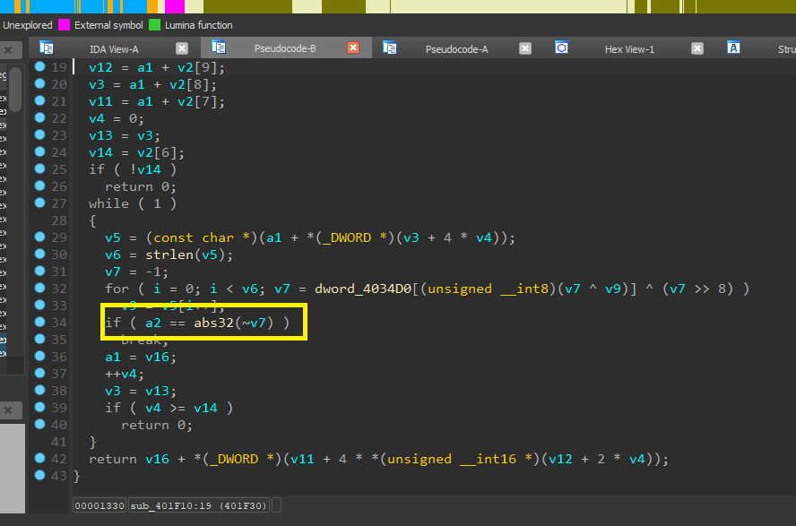

# TASK WEEK 5: AUTO RESOLVE API

Các công cụ dùng

1. IDA 7.7
2. [mandiant/flare-ida](https://github.com/mandiant/flare-ida/tree/master)
3. [hashdb](https://github.com/OALabs/hashdb-ida)
4. Mẫu sử dụng là [anti3.exe](./file/anti3.exe)

## 1. Cài đặt công cụ

Các link ở bên trên chúng ta tiến hành clone về và bắt đầu cài đặt.


Cài đặt với hashdb


Copy file hashdb.py vào thư mục IDA mục plugins là thành công.

Cài đặt với shellcode_hash_search.py - mandiant/flare-ida

Sau khi clone về tiến hành

Copy nội dụng plugins trong thư mục clone về rồi copy vào plugins của IDA.


Copy nội dụng python trong thư mục clone về rồi copy vào python của IDA.


## 2. Sơ sơ lý thuyết hoạt động của mấy cái này


```HashDB``` là dùng request lên server để lấy kết quả về chi tiết đọc ở đây https://hashdb.openanalysis.net/ (hướng dẫn sử dụng tài liệu api ở đây)

```shellcode_hashes``` là dùng cơ sở dữ liệu db trên máy có file ```make_sc_hash_db.py``` là script dùng để tạo cơ sở dữ liệu SQLite lưu các giá trị băm (hash) của tên hàm, phục vụ cho script shellcode_hashes_search_plugin.py trong IDA.


```Python3
python make_sc_hash_db.py <tên_cơ_sở_dữ_liệu> <thư_mục_dll>
```


## 3.Phân tích với mẫu anti3.exe


Chúng ta chú ý vào 2 cái hàm này.

Thứ nhất là ```sub_401DF0```


Hàm này truy cập PEB->Ldr->InLoadOrderModuleList sau đó tính dùng CRC32 compare cuối cùng trả về base address của dll
Sơ đồ


Thứ hai là ```sub_401F10```


Hàm này nhận vào 2 tham số là base address và giá trị hash.


v2 = (_DWORD *)(a1 + *(_DWORD *)(*(_DWORD *)(a1 + 60) + a1 + 120));

Đây là

```
#[repr(C)]
#[repr(C)]
pub struct IMAGE_EXPORT_DIRECTORY {
0    pub Characteristics: u32,
1    pub TimeDateStamp: u32,
2    pub MajorVersion: u16,
2    pub MinorVersion: u16,
3    pub Name: u32,
4    pub Base: u32,
5    pub NumberOfFunctions: u32,
6    pub NumberOfNames: u32,
7    pub AddressOfFunctions: u32,
8    pub AddressOfNames: u32,
9    pub AddressOfNameOrdinals: u32,
}
```

```
v16 = a1;
v12 = a1 + v2[9]; AddressOfNameOrdinals
v3 = a1 + v2[8]; AddressOfNames
v11 = a1 + v2[7]; AddressOfFunctions
v4 = 0;
v13 = v3;
v14 = v2[6];  NumberOfNames
```

Rồi sau đó nó duyệt qua từng cái tính a2 == abs32(~v7) tính bằng CRC32 rồi sau đó trả về địa chỉ của hàm cần tìm.

Mã giả

```C
void* Resolve(uint8_t* base, uint32_t hashWanted) {
    auto nt  = (IMAGE_NT_HEADERS*)(base + *(DWORD*)(base + 0x3C));
    auto exp = (IMAGE_EXPORT_DIRECTORY*)(base +
              nt->OptionalHeader.DataDirectory[0].VirtualAddress);

    uint32_t* names = (uint32_t*)(base + exp->AddressOfNames);
    uint16_t* ords  = (uint16_t*)(base + exp->AddressOfNameOrdinals);
    uint32_t* funcs = (uint32_t*)(base + exp->AddressOfFunctions);

    for (uint32_t i = 0; i < exp->NumberOfNames; ++i) {
        uint32_t crc = CRC32(~0, (char*)(base + names[i]));
        if (abs32(~crc) == hashWanted)
            return base + funcs[ords[i]];
    }
    return NULL;
}
```
## 4. Sử dụng công cụ

### Sử dụng shellcode_hash_search.py

Chạy và import file db vào


Chọn crc32 và bấm ok thử.


Ta thấy sau khi chạy xong các hàm có mã hash đã có comment bên cạnh tên hàm Window API đó.


#### Sử dụng hashdb


Chúng ta thấy có các chức năng đáng chú ý là ```HashDB Hunt Algorithm``` và ```HashDB Lookup```

Chức năng HashDB Hunt Algorithm giúp chúng ta có thể tự detect thuật toán mã hóa hash. Thử click vào hash rồi chọn đợi 1 lúc chúng ta sẽ được kết quả 


Như vậy đã tự detect được đây là hash = crc32 tiến hành chọn tiếp chức năng HashDB Lookup thử 

Thu được kết quả 


## 5. Ý tưởng và phát sinh

Sau khi chạy cả các plugin trên chương trình vẫn có 1 số hash không thể bị detect được là gì, chúng ta biết những db và công cụ trên được update và có lượng dữ liệu khá đầy đủ vậy vấn đề ở đây là gì ? 

Trong đoạn compare hàm 

Chúng ta thấy có lấy not bit và sau đó dùng abs32

a2 == abs32(~v7) hàm này not bit rồi abs32 để chuyển thành số dương, chúng ta thử not bit trước rồi dùng hashdb kiểm tra thử. 


Thành công tìm thấy hàm này là user32.BlockInput

Như vậy đôi khi chúng ta có thể custom hash riêng mà chúng ta muốn, khi đó nếu muốn tiếp tục việc sử dụng resolve api như này có lẽ chúng ta phải xây thêm db theo ý muốn 

Sử dụng công cụ SQLite để view thử file db trong shellcode_hash_search 


Thấy được cấu trúc db, và các bảng các mục 

Hoàn toàn có thể thêm và bổ sung vào hash mà chúng ta muốn.