# Fuka

# Phân tích đề bài, đưa ra ý tưởng giải quyết

Đầu tiên tiến hành debug, sau đó F5 để cho mã giả đẹp và dễ nhìn hơn.

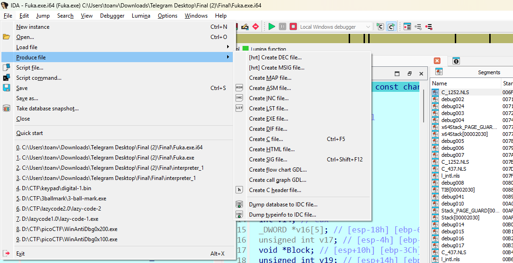

Code nhìn sẽ sáng và rõ ràng hơn 

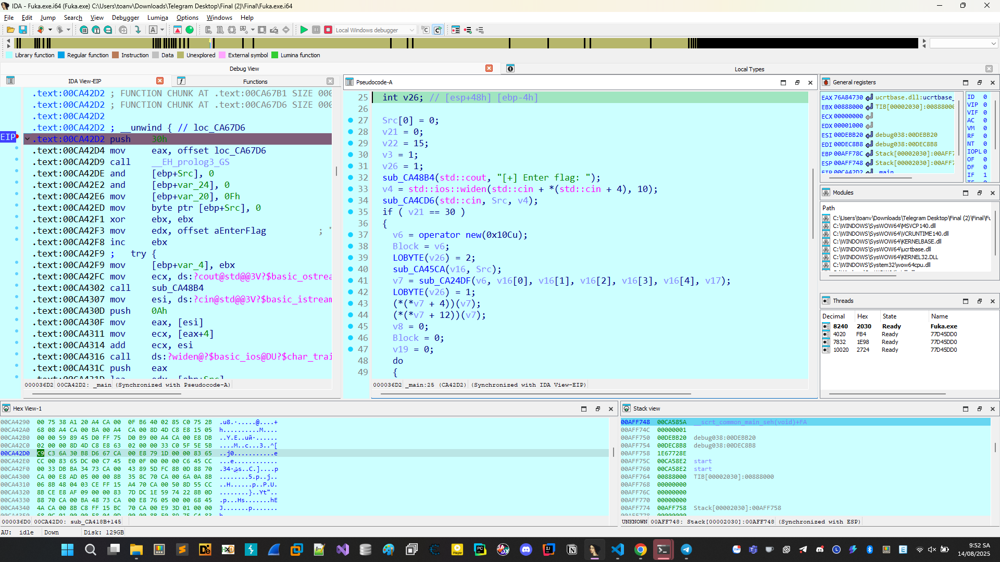

Có vẻ đây là 1 bài check flag bình thường nhưng càng đi sâu vào trong lại thấy càng phức tạp và khó khăn.

Ban đầu dễ thấy đoạn check ```len flag = 30```.

Vì code obf khá kinh nên chúng ta tiến hành nhảy đến đoạn check flag và tìm các trace ngược lại để tìm lại quy trình cũng như cách mà chương trình kiểm tra flag.

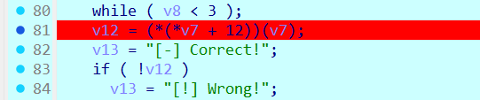

Input: ABCDEFGHIJKLMNOPQRSTUVWXYZ1234
Tiến hành debug và nhảy vào hàm check flag thôi.

Qua một thời gian debug chúng ta tiến hành theo dõi input và output. Chúng ta thu được kết quả tại hàm

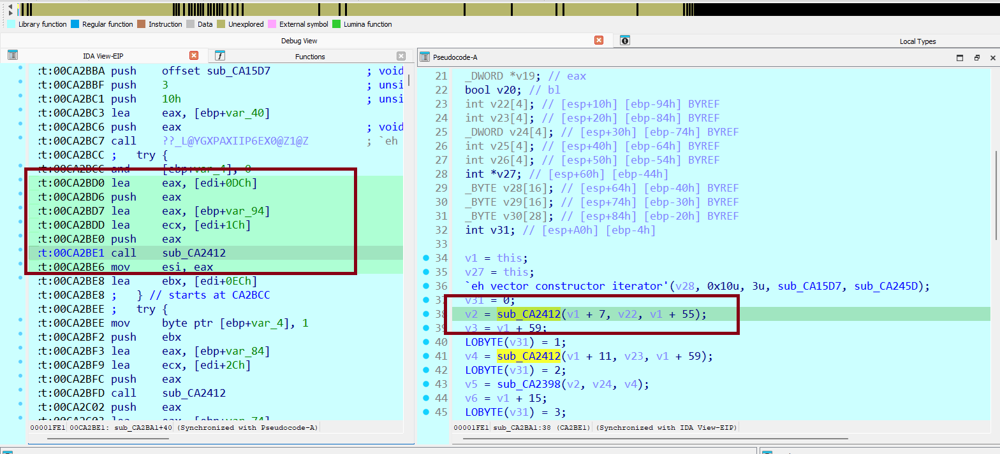

Đây là input:

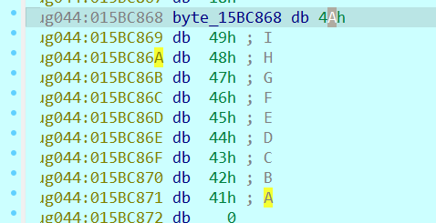

Đây là const: 

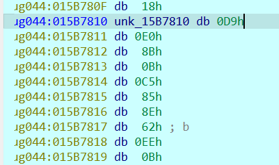

Đây là kết quả:

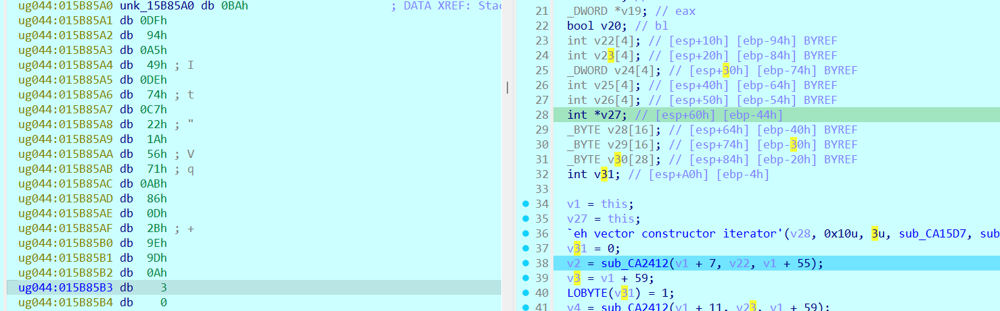

Nhận ra đây có thể làm phép nhân input với const tiến hành kiểm tra với code

```Python
# eax * ecx kết quả trả về eax.
def int_mul_to_hex_string(a_bytes, b_bytes):
    a_int = int.from_bytes(a_bytes, byteorder='little')
    b_int = int.from_bytes(b_bytes, byteorder='little')

    product = a_int * b_int

    num_bytes = (product.bit_length() + 7) // 8
    product_bytes = product.to_bytes(num_bytes, byteorder='big') 

    hex_string = ' '.join(f"{b:02X}" for b in product_bytes)
    return a_int, b_int, product, hex_string

a_bytes = bytes([0xD9, 0xE0, 0x8B, 0x0B, 0xC5, 0x85, 0x8E, 0x62, 0xEE, 0x0B]) # đúng chiều (const0)
b_bytes = bytes([0x4A, 0x49, 0x48, 0x47, 0x46, 0x45, 0x44, 0x43, 0x42, 0x41]) # đúng chiều (input0)
a_int, b_int, product, hex_string = int_mul_to_hex_string(a_bytes, b_bytes)
print("a =", a_int)
print("b =", b_int)
print("a * b =", product)
print("Hex:", hex_string)

# a = 56343458161852729254105
# b = 308176153570658872740170
# a * b = 17363710215189119775006447691992495281570897850
# Hex: 03 0A 9D 9E 2B 0D 86 AB 71 56 1A 22 C7 74 DE 49 A5 94 DF BA
```
Đây chính là phép nhân input. Hàm ```sub_CA2412``` đổi tên là mul chức năng của nó là nhân 2 số nguyên lớn.

Tiếp tục là phép nhân tiếp 

```Python

a_bytes = bytes([0x55, 0x9E, 0x28, 0x98, 0xC4, 0x05, 0xFE, 0xA3, 0x5F, 0x65])
b_bytes = bytes([0x54, 0x53, 0x52, 0x51, 0x50, 0x4F, 0x4E, 0x4D, 0x4C, 0x4B])
a_int1, b_int1, product1, hex_string1 = int_mul_to_hex_string(a_bytes, b_bytes)
print("a =", a_int1)
print("b =", b_int1)
print("a * b =", product1)
print("Hex:", hex_string1)

# a = 478723272345650765274709
# b = 355585009241820801160020
# a * b = 170226819221302923733636002203125150881167934180
# Hex: 1D D1 3C 0C E1 F9 FF C5 75 CB 21 5E 1C C9 EE 82 B4 E3 82 E4
```

Hàm sub_CA2398 thực hiện việc cộng kết quả của 2 phép toán này với nhau tiến hành đổi tên hàm này thành plus

Chuẩn rùi 

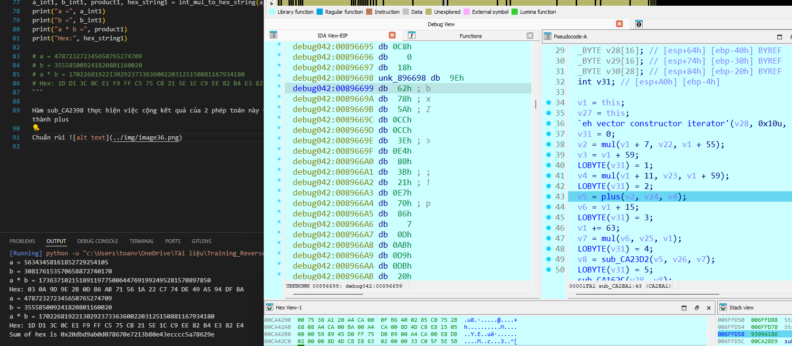

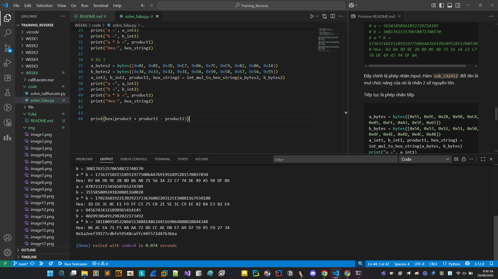

Hàm sub_8F23D2 thực hiện việc trừ ta tiến hành đổi tên


Như vậy là chương trình đã thực hiện việc tính biểu thức = input0 * const0 + input1 * consts1 - input2 * const2

Tiếp tục làm tiếp ta được các thiểu thức:

```
equation1 = input0 * const0_int + input1 * const1_int - input2 * const2_int == result0_int
equation2 = input0 * const3_int + input1 * const4_int + input2 * const5_int == result1_int
equation3 = input0 * const6_int - input1 * const7_int - input2 * const8_int == -result2_int
```

## Khai thác và tìm flag

Tiến hành sử dụng z3 và viết code solve thử 

```Python
from z3 import *
from Crypto.Util.number import long_to_bytes
def bytes_to_int(byte_array):
    return int.from_bytes(byte_array, byteorder='little')
solver = Solver()
input0 = Int('input0')
input1 = Int('input1')
input2 = Int('input2')
const0 = bytes([0xD9, 0xE0, 0x8B, 0x0B, 0xC5, 0x85, 0x8E, 0x62, 0xEE, 0x0B]) 
const1 = bytes([0x55, 0x9E, 0x28, 0x98, 0xC4, 0x05, 0xFE, 0xA3, 0x5F, 0x65])
const2 = bytes([0x01, 0xB1, 0x3D, 0xC7, 0x06, 0x7C, 0xC9, 0x82, 0x06, 0x14]) 
const3 = bytes([0x77, 0xC8, 0xE3, 0xE9, 0x8B, 0x0F, 0x2F, 0xD3, 0xAB, 0x10]) 
const4 = bytes([0xF1, 0xBD, 0x01, 0x43, 0x24, 0x1A, 0x57, 0xA0, 0xFC, 0x56])  
const5 = bytes([0x3D, 0x18, 0xB7, 0x93, 0x8A, 0xC7, 0x31, 0x9C, 0xE8, 0xAF]) 
const6 = bytes([0xD9, 0x54, 0x6C, 0x74, 0x31, 0x78, 0x70, 0xE6, 0x6D, 0x06]) 
const7 = bytes([0xFB, 0xDB, 0x27, 0x14, 0xC5, 0x48, 0xF7, 0x14, 0x7D, 0x5C]) 
const8 = bytes([0xEF, 0x95,  0x37, 0x7D, 0x7F, 0x73, 0xB9, 0x7F, 0x38, 0x87]) 
result0 = bytes([0x33, 0xF2, 0x32, 0x07, 0x96, 0xA2, 0x37, 0x9B, 0x9C, 0x5B, 0xE0, 0x3A, 0x8B, 0x96, 0x18, 0xD7, 0x4D, 0xB2, 0xF6, 0x24])
result1 = bytes([0xFD, 0x4B, 0x48 , 0X79, 0X21, 0X23, 0X47, 0XDE, 0X48, 0X17, 0XBC, 0X8D, 0X69, 0X42, 0X43, 0XD1, 0XAF, 0X71, 0X3B, 0X48])
result2 = bytes([0xE3, 0x0C, 0x05, 0xD4, 0xB8, 0x47, 0xD0, 0xFA, 0x70, 0x72, 0x78, 0x44, 0xF6, 0x78, 0xEC, 0xE8, 0x91, 0x29, 0xC6, 0x3B])
const0_int = bytes_to_int(const0)
const1_int = bytes_to_int(const1)
const2_int = bytes_to_int(const2)
const3_int = bytes_to_int(const3)
const4_int = bytes_to_int(const4)
const5_int = bytes_to_int(const5)
const6_int = bytes_to_int(const6)
const7_int = bytes_to_int(const7)
const8_int = bytes_to_int(const8)

result0_int = bytes_to_int(result0)
result1_int = bytes_to_int(result1)
result2_int = bytes_to_int(result2)

# Thiết lập các phương trình
equation1 = input0 * const0_int + input1 * const1_int - input2 * const2_int == result0_int
equation2 = input0 * const3_int + input1 * const4_int + input2 * const5_int == result1_int
equation3 = input0 * const6_int - input1 * const7_int - input2 * const8_int == -result2_int

# Thêm các phương trình vào solver
solver.add(equation1)
solver.add(equation2)
solver.add(equation3)

# Kiểm tra xem có nghiệm hay không
if solver.check() == sat:
    model = solver.model()
    print(f"{long_to_bytes(model[input0].as_long()).decode()}",end="")
    print(f"{long_to_bytes(model[input1].as_long()).decode()}",end="")
    print(f"{long_to_bytes(model[input2].as_long()).decode()}",end="")
else:
    print("Khong duoc roi hu hu")
```

Sau khi chạy xong thu được flag FAKU{N3V3R_9onn4_91v3_yOU_uP!}, nhưng đây là fake flag vì khi nhập chương trình không debug thì kết quả trả về đây là flag sai.

Ta tiến hành xem các hàm init thì có 2 hàm khả nghi đó là: 

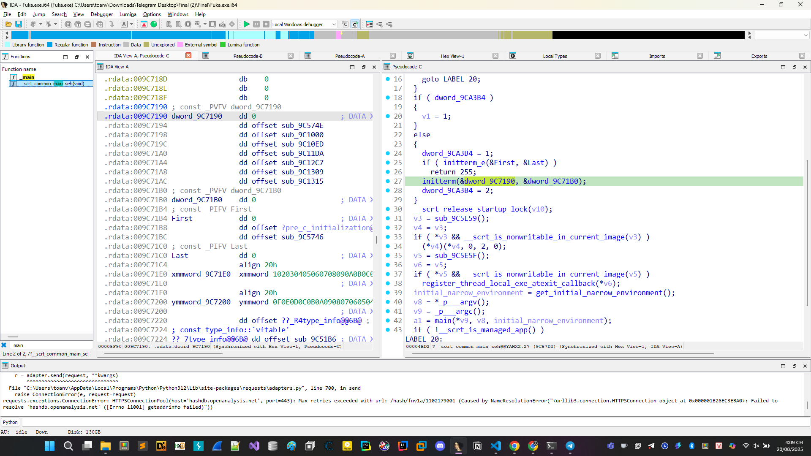

sub_9C1309, sub_9C1315 khi không debug 2 hàm này sẽ thay đổi tham số dẫn đến kết quả của bài toán khác đi.

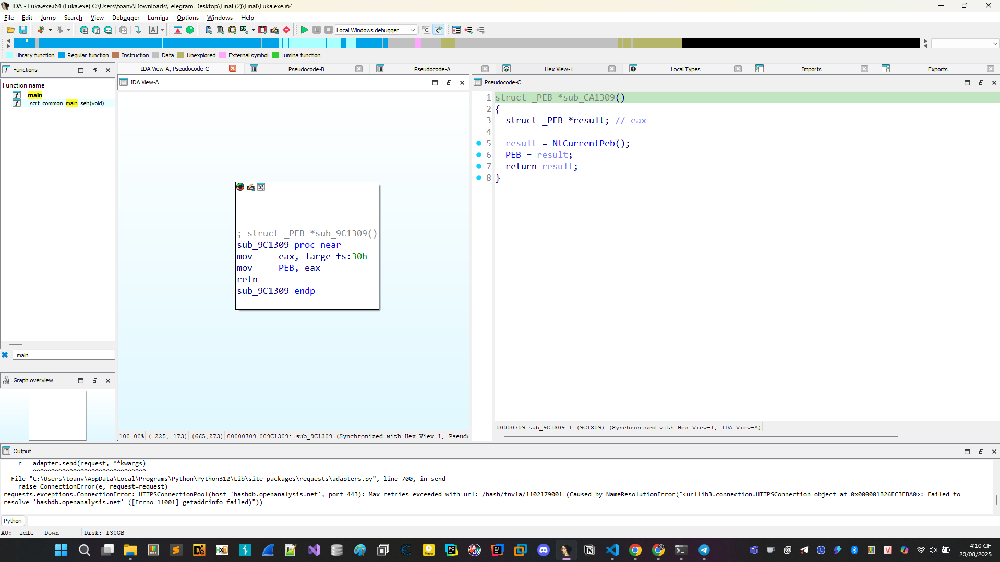

Khởi tạo cấu trúc PEB và lưu vào DWORD để sử dụng tiếp.


Bên trong sub_9C1315 là 3 hàm

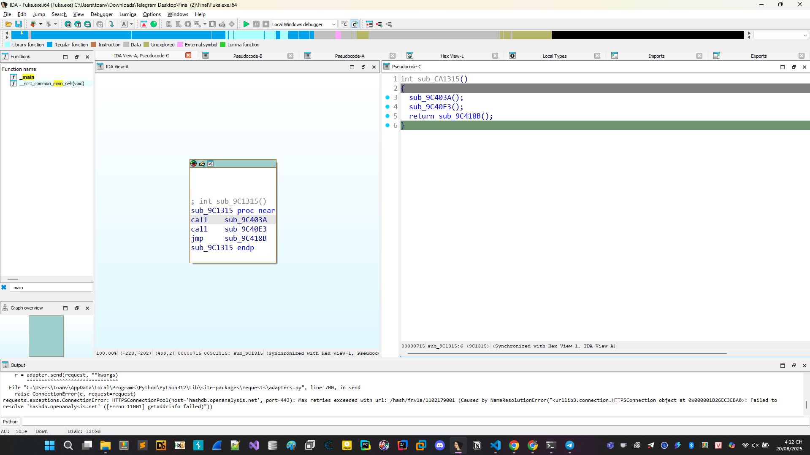


```
int sub_CA1315()
{
  sub_9C403A();
  sub_9C40E3();
  return sub_9C418B();
}
```


```C
int sub_9C403A()
{
  unsigned int v0; // ebx
  void (__stdcall *v1)(_BYTE *); // esi
  _BYTE v3[23]; // [esp+9h] [ebp-17h] BYREF

  v0 = 0;
  v1 = resolveAPI(0x41B1EAB9, 0x29CDD463);
  qmemcpy(v3, "yj)jUj?j?j+jUj?j?jjj", 20);
  do
  {
    v3[v0] = (35 * (106 - v3[v0]) % 127 + 127) % 127;
    ++v0;
  }
  while ( v0 < 0x14 );
  v1(v3);
  return 0;
}
```

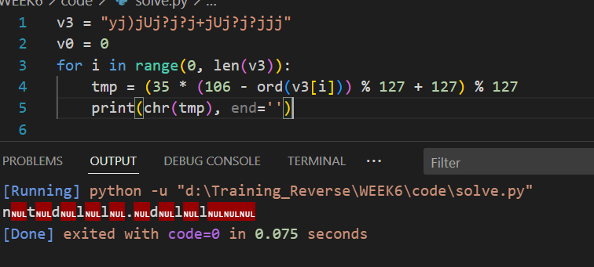

Đoạn này là load dll ntdll.dll

```C
int sub_9C40E3()
{
  int (__stdcall *v0)(int, int *, int, _BYTE *); // eax
  int v1; // eax
  int *v2; // esi
  NTSTATUS (__stdcall *NtQueryInformationProcess)(HANDLE, PROCESSINFOCLASS, PVOID, ULONG, PULONG); // [esp+Ch] [ebp-14h]
  void *v5; // [esp+10h] [ebp-10h] BYREF
  _BYTE v6[4]; // [esp+14h] [ebp-Ch] BYREF
  int v7; // [esp+18h] [ebp-8h] BYREF

  NtQueryInformationProcess = resolveAPI(0xEA2DDA8A, NTDLL_DLL);
  if ( !NtQueryInformationProcess
    || (v0 = resolveAPI(0x6DD8A845, 0x29CDD463), v1 = v0(0x1F, &v7, 4, v6), (NtQueryInformationProcess)(v1) < 0)
    || v7 )
  {
    v2 = sub_9C46ED(&v5);
    if ( v2 != &dword_9CA400 )
    {
      sub_9C4691(&dword_9CA400);
      dword_9CA400 = *v2;
      dword_9CA404 = v2[1];
      v2[1] = 0;
      *v2 = 0;
    }
    sub_9C4691(&v5);
  }
  return 0;
}
```

Tiếp tục hàm này gọi check sử dụng NtQueryInformationProcess với các tham số handle tiến trình hiện tại, 0x1F (check ProcessDebugFlags) sau đó check kết quả trả về tức là chúng ta cần bypass hàm này bằng cách thực hiện chỉnh cờ và nhảy vào đoạn giữa kia.

Hàm cuối cùng ```sub_9C418B```

```
int sub_9C418B()
{
  int v0; // eax
  void *v2[2]; // [esp+Ch] [ebp-38h] BYREF
  _DWORD *v3; // [esp+14h] [ebp-30h]
  void (__stdcall *v4)(_DWORD, _DWORD, _DWORD); // [esp+18h] [ebp-2Ch]
  void (__stdcall *v5)(_DWORD, _DWORD, _DWORD); // [esp+1Ch] [ebp-28h]
  BOOL (__stdcall *v6)(HANDLE, LPCONTEXT); // [esp+20h] [ebp-24h]
  HANDLE (__stdcall *GetCurrentThread)(); // [esp+24h] [ebp-20h]
  BOOL (__stdcall *GetThreadContext)(HANDLE, LPCONTEXT); // [esp+28h] [ebp-1Ch]
  int (__stdcall *v9)(_DWORD, _DWORD, _DWORD, _DWORD); // [esp+2Ch] [ebp-18h]
  int (__stdcall *v10)(_DWORD, _DWORD, _DWORD, _DWORD); // [esp+30h] [ebp-14h]
  int v11; // [esp+34h] [ebp-10h]
  int v12; // [esp+38h] [ebp-Ch]
  char *v13; // [esp+3Ch] [ebp-8h]
  char *v14; // [esp+40h] [ebp-4h]

  v11 = 0;
  v10 = resolveAPI(VirtualAlloc_0, KERNEL32_DLL);
  v9 = v10;
  v14 = v10(0, 716, 4096, 4);
  if ( v14 )
  {
    memset(v14, 0, 0x2CCu);
    v13 = v14 + 716;
    v12 = 0;
    *v14 = 65552;
    GetThreadContext = resolveAPI(0x85CCA27E, 0x29CDD463);
    GetCurrentThread = resolveAPI(0x9BC5A608, 0x29CDD463);
    v6 = GetThreadContext;
    v0 = (GetCurrentThread)(v14);
    if ( (GetThreadContext)(v0) && (*(v14 + 1) || *(v14 + 2) || *(v14 + 3) || *(v14 + 4)) )
      v11 = 1;
    v5 = resolveAPI(VirtualFree_0, KERNEL32_DLL);
    v4 = v5;
    v5(v14, 0, 0x8000);
  }
  if ( !v11 && !PEB->BeingDebugged )
  {
    v3 = sub_9C47C7(v2, &dword_9CA400, dword_9CA408);
    sub_9C459E(&dword_9CA400, v3);
    sub_9C452E(v2);
  }
  return 0;
}
```

Hàm này thực hiện check ```Hardware Breakpoints``` và BeingDebugged trong struct PEB.

Để bypass đoạn này cần nhảy qua đoạn gán v11 và nhảy vào hàm bên trong đoạn !v11 && !PEB->BeingDebugged.

Ba kĩ thuật debug được sử dụng ở bài này là NtQueryInformationProcess, Hardware Breakpoints và PEB.

Tiến hành bypass và debug để lấy lại tham số và viết lại code để lấy được flag

```
from z3 import *
from Crypto.Util.number import long_to_bytes
def bytes_to_int(byte_array):
    return int.from_bytes(byte_array, byteorder='little')
solver = Solver()
input0 = Int('input0')
input1 = Int('input1')
input2 = Int('input2')
const0 = bytes([0xD9, 0xE0, 0x8B, 0x0B, 0xC5, 0x85, 0x8E, 0x62, 0xEE, 0x0B]) 
const1 = bytes([0x55, 0x9E, 0x28, 0x98, 0xC4, 0x05, 0xFE, 0xA3, 0x5F, 0x65])
const2 = bytes([0x01, 0xB1, 0x3D, 0xC7, 0x06, 0x7C, 0xC9, 0x82, 0x06, 0x14]) 
const3 = bytes([0x77, 0xC8, 0xE3, 0xE9, 0x8B, 0x0F, 0x2F, 0xD3, 0xAB, 0x10]) 
const4 = bytes([0xF1, 0xBD, 0x01, 0x43, 0x24, 0x1A, 0x57, 0xA0, 0xFC, 0x56])  
const5 = bytes([0x3D, 0x18, 0xB7, 0x93, 0x8A, 0xC7, 0x31, 0x9C, 0xE8, 0xAF]) 
const6 = bytes([0xD9, 0x54, 0x6C, 0x74, 0x31, 0x78, 0x70, 0xE6, 0x6D, 0x06]) 
const7 = bytes([0xFB, 0xDB, 0x27, 0x14, 0xC5, 0x48, 0xF7, 0x14, 0x7D, 0x5C]) 
const8 = bytes([0xEF, 0x95,  0x37, 0x7D, 0x7F, 0x73, 0xB9, 0x7F, 0x38, 0x87]) 
result0 = bytes([0x43, 0xE6, 0x0E, 0x73, 0xC4, 0xFA, 0x26, 0x37, 0xD7, 0xF8, 0xC3, 0x2C, 0xC8, 0x57, 0x8A, 0x8F, 0xAA, 0x01, 0x86, 0x0D])
result1 = bytes([0xF7, 0x61, 0x51, 0xE7, 0x0A, 0x93, 0x04, 0xB8, 0xCD, 0x0C, 0x78, 0x1C, 0x0E, 0x20, 0x3F, 0xD2, 0x0A, 0x65, 0x05, 0x65])
result2 = bytes([0x83, 0x30, 0xE8, 0xFE, 0x14, 0xCD, 0x10, 0x7E, 0x43, 0x36, 0x86, 0xC3, 0xCA, 0xE1, 0x1A, 0x98, 0xE8, 0x7D, 0xB1, 0x4D])
const0_int = bytes_to_int(const0)
const1_int = bytes_to_int(const1)
const2_int = bytes_to_int(const2)
const3_int = bytes_to_int(const3)
const4_int = bytes_to_int(const4)
const5_int = bytes_to_int(const5)
const6_int = bytes_to_int(const6)
const7_int = bytes_to_int(const7)
const8_int = bytes_to_int(const8)

result0_int = bytes_to_int(result0)
result1_int = bytes_to_int(result1)
result2_int = bytes_to_int(result2)

# Thiết lập các phương trình
equation1 = input0 * const0_int + input1 * const1_int - input2 * const2_int == result0_int
equation2 = input0 * const3_int + input1 * const4_int + input2 * const5_int == result1_int
equation3 = input0 * const6_int - input1 * const7_int - input2 * const8_int == -result2_int

# Thêm các phương trình vào solver
solver.add(equation1)
solver.add(equation2)
solver.add(equation3)

# Kiểm tra xem có nghiệm hay không
if solver.check() == sat:
    model = solver.model()
    print(f"{long_to_bytes(model[input0].as_long()).decode()}",end="")
    print(f"{long_to_bytes(model[input1].as_long()).decode()}",end="")
    print(f"{long_to_bytes(model[input2].as_long()).decode()}",end="")
else:
    print("NO NO")
```

```Flag: ASCIS{Cpp_1s_34SY_bUt_(TT_TT)}```