# Mixihihi.exe

## 1. Phân tích, nêu ý tưởng hướng giải quyết
Tiến hành mở file bằng DIE là file 64 bit, ngôn ngữ C++ nhưng lại dùng .NET Framework của C#.

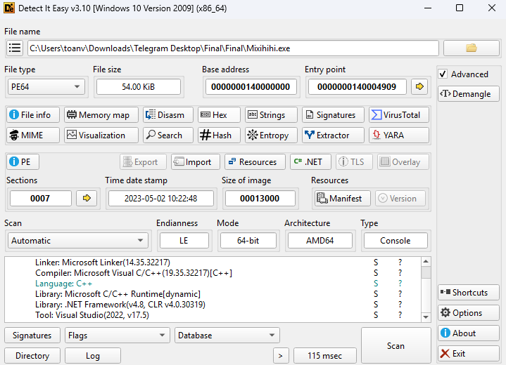

Đầu tiên sử dụng công cụ de4dot để deobfuscate trước khi tiến hành vào phân tích.

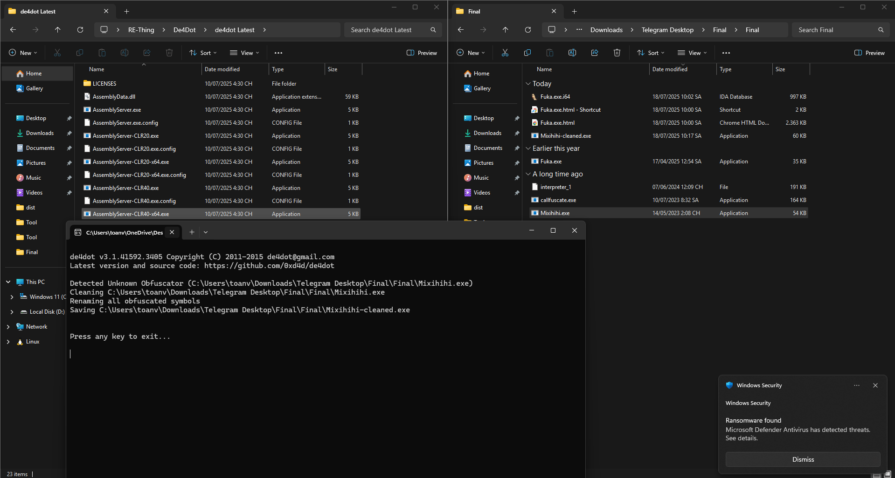

Có được file Mixihihi-cleaned.exe đem vào dnSpy để phân tích.

Tìm chuỗi flag dẫn chúng ta được đến hàm main 

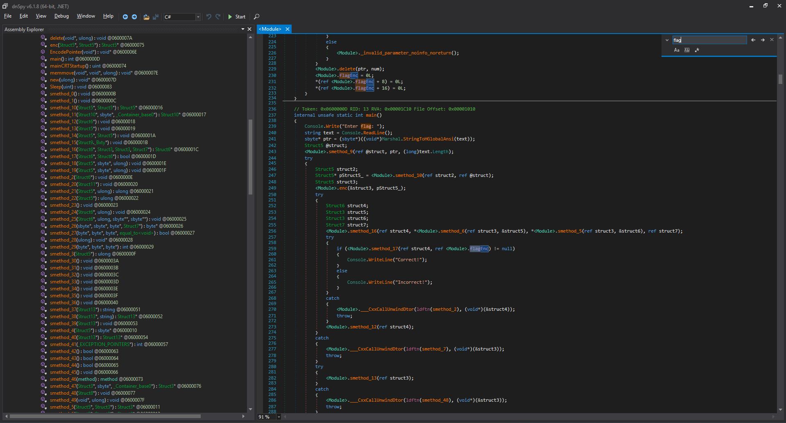

Dễ dàng tìm được flag encrypt, ở đây có thể đoán flag dài 20 kí tự.

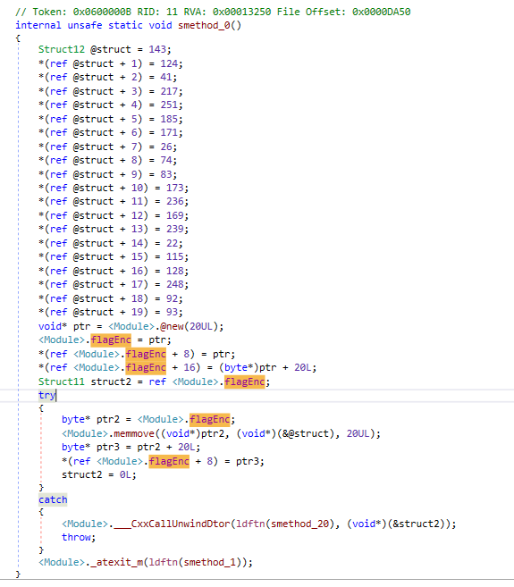

Thấy hàm enc được khai báo như sau:

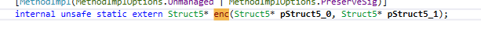

Tức là hà enc được khai báo extern nghĩa là phần thân sẽ nằm trong đoạn native C++. Tiến hành mở bằng IDA để xem đoạn đấy.

Ở trong IDA chúng ta thấy có 2 hàm encrypt là:

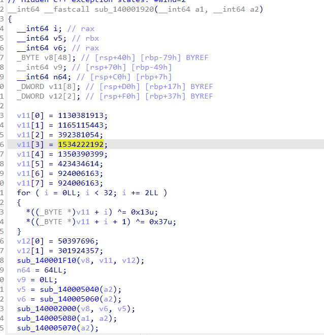

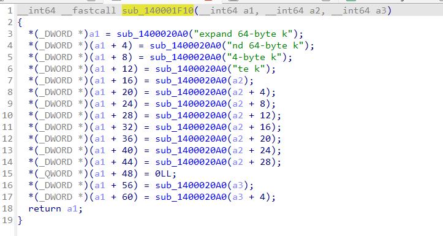

Sau khi tham khảo ChatGPT thì nó đoán do có hàm sử dụng constant "expand 64-byte k" đúng theo thiết kế Salsa20/ChaCha20. Nên có thể đây là 1 dạng mã hóa như vậy. Biết đây là 1 mã hóa có tính chất đối xứng. Chúng ta thử truyền input chính là encrypt rồi xem có ra được flag ở chỗ lúc gen ra enc không. Tiến hành debug thử biết input đầu vào là 20 kí tự ở đây em thử 20 chữ a.

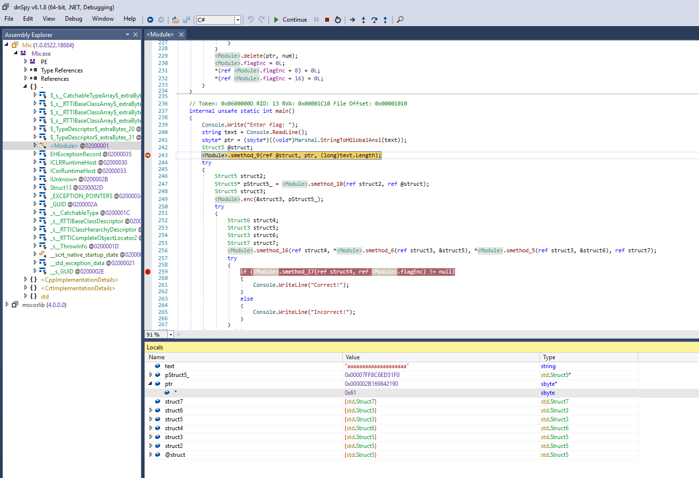

Đến đây chúng ta tiến hành sửa các giá trị được trỏ bằng con trỏ ptr chính là chuỗi input của chúng ta.

Tiến hành patch lại với các byte 
```0x8f 0x7c 0x29 0xd9 0xfb 0xb9 0xab 0x1a 0x4a 0x53 0xad 0xec 0xa9 0xef 0x16 0x73 0x80 0xf8 0x5c 0x5d ```

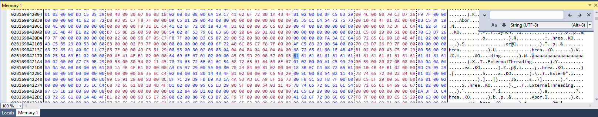

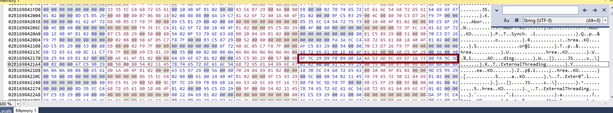

Sau đó đặt break point ngay chỗ check flag với buf enc.

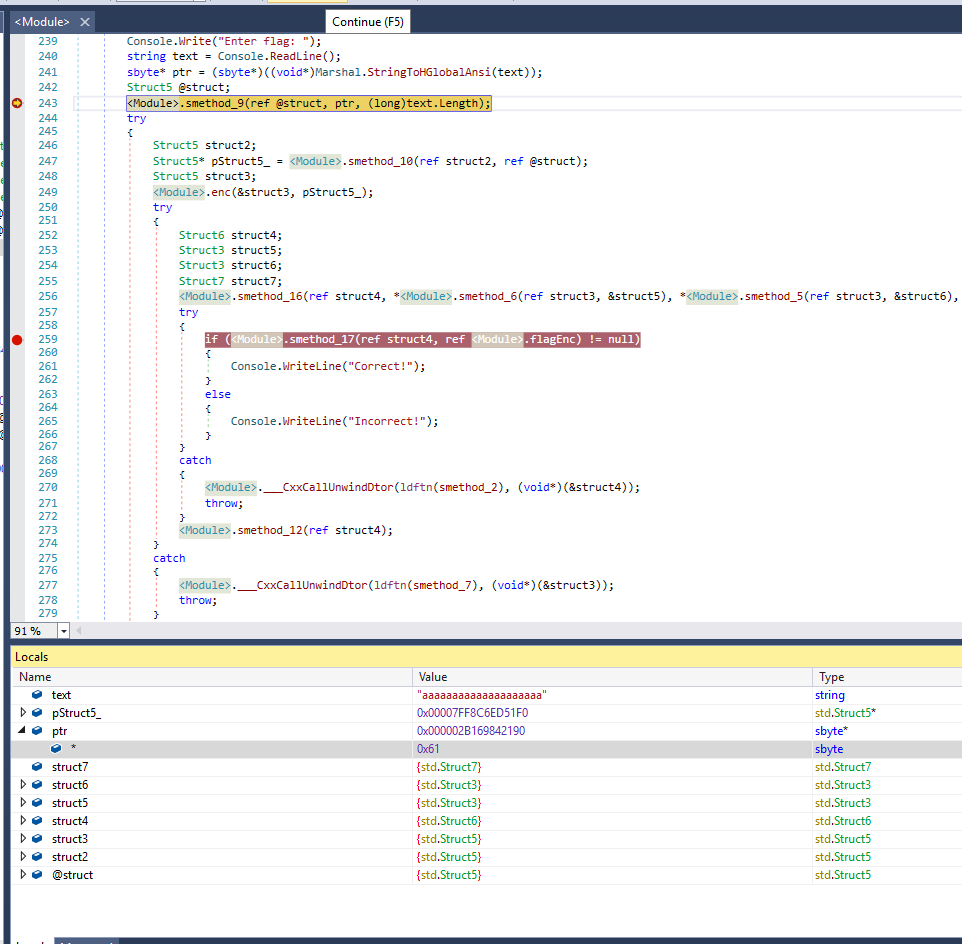

Lúc này struct4 chính là nơi chính enc(enc) của chúng ta tiến hành Goto offset thì thấy được flag.

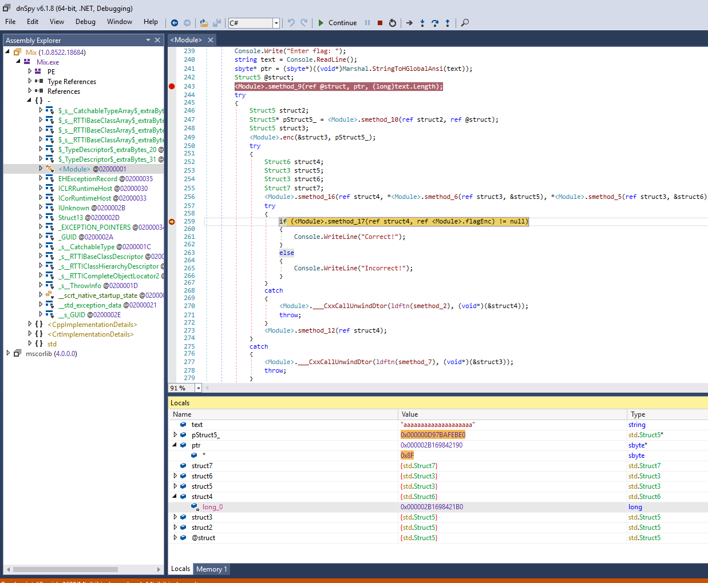

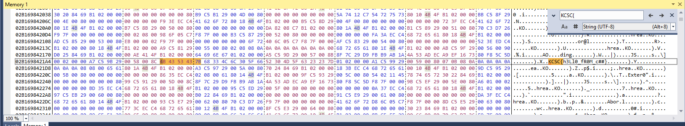

```KCSC{h3Ll0_fR0M_c##}```