# callfuscate.exe

## 1. Phân tích, nêu ý tưởng hướng giải quyết
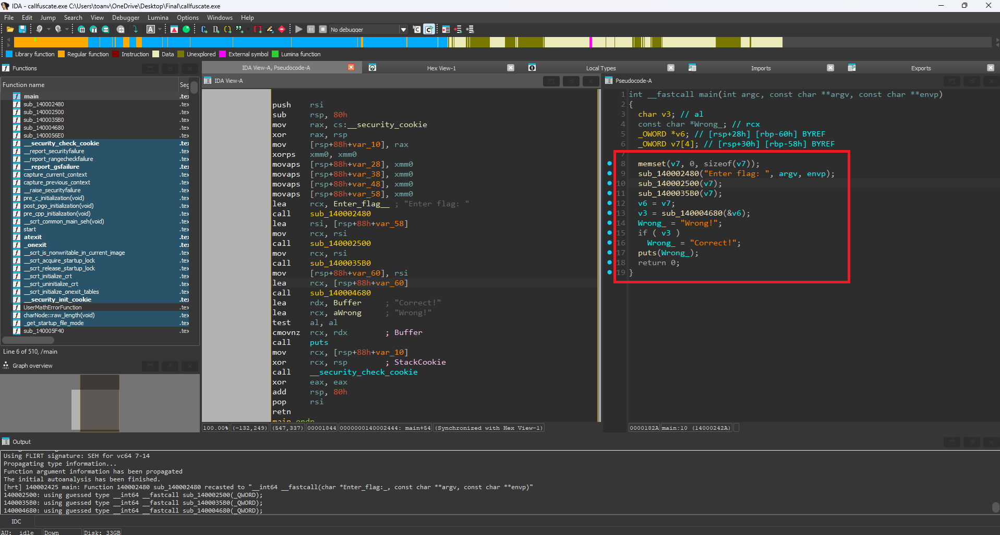

Mới vào chúng ta sẽ thấy chương trình khá đơn giản đi gồm v7 chính là input và lần lượt đi qua các hàm kiểm tra.

```sub_140002480``` là printf => đổi tên cho dễ nhìn

Bấm qua ```sub_140002500``` thì 

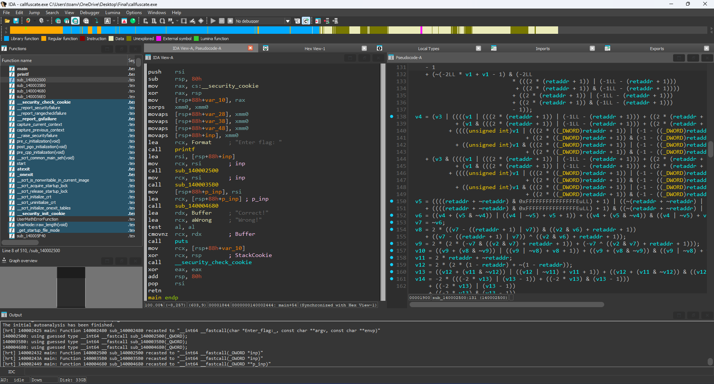
Chúng ta thấy có 1 mớ phép toán kiểm tra khá phức tạp nhưng chỉ là tính toán thôi, không thấy so sánh hay gì cả. Đến đoạn cuối nó thực hiện ret như sau

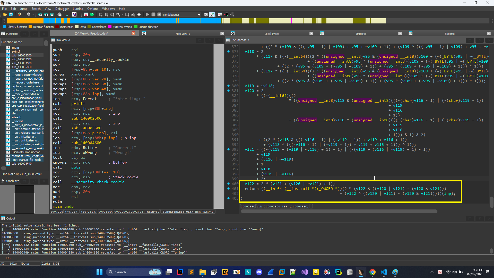

Đây là 1 cách gọi hàm gián tiếp (indirect function call), trong đó các địa chỉ hàm được tính toán phức tạp từ các biểu thức bên trên truyền inp là tham số vào. 

Oke chúng ta sẽ đặt breakpoint xem nó nhảy đến đâu, như nào 

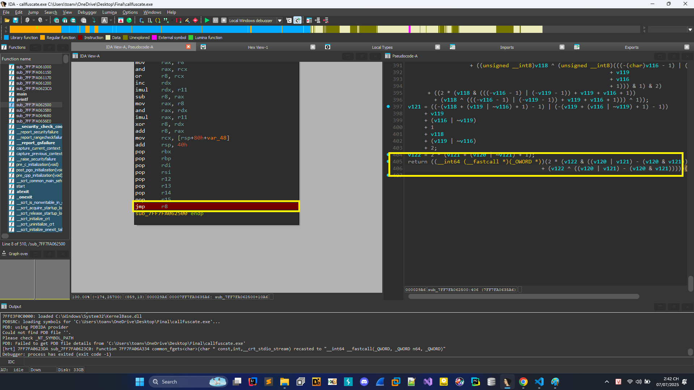

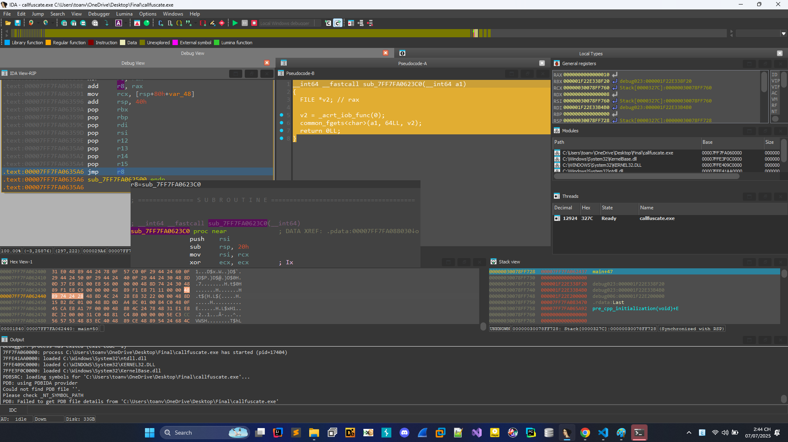

Như vậy đây là hàm scanf/fgets tương tự, việc của hàm này là lấy input từ người dùng. Tiến hành đổi tên ```sub_7FF7FA062500``` thành ```scanf```


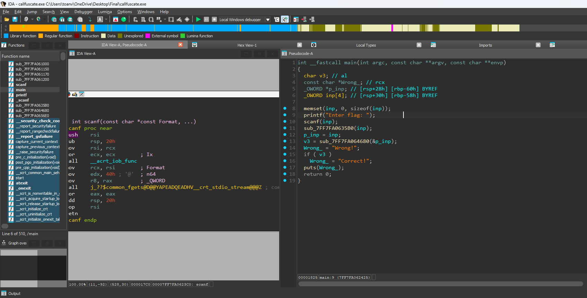

Oke, phân tích tiếp ta thấy ```sub_7FF7FA0635B0``` và ```sub_7FF7FA064680``` đều có logic tương tự chúng ta cũng tiến hành đặt breakpoint và xem thử nó là gì và tiến hành đổi tên thôi.

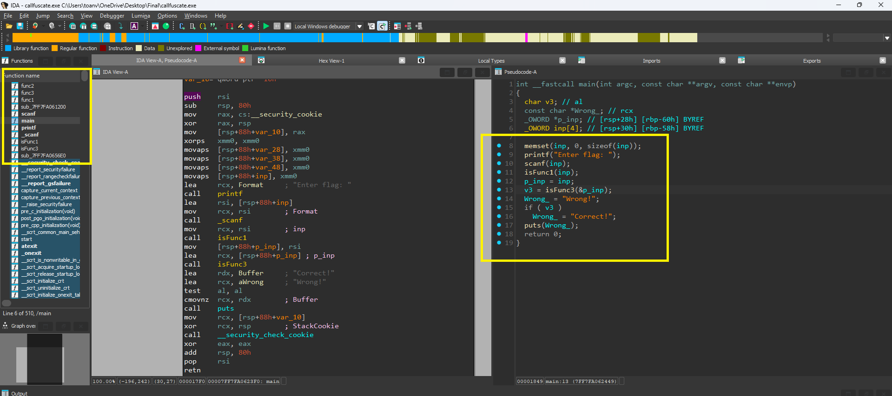

Dưới đây là lần lượt các func1,2,3


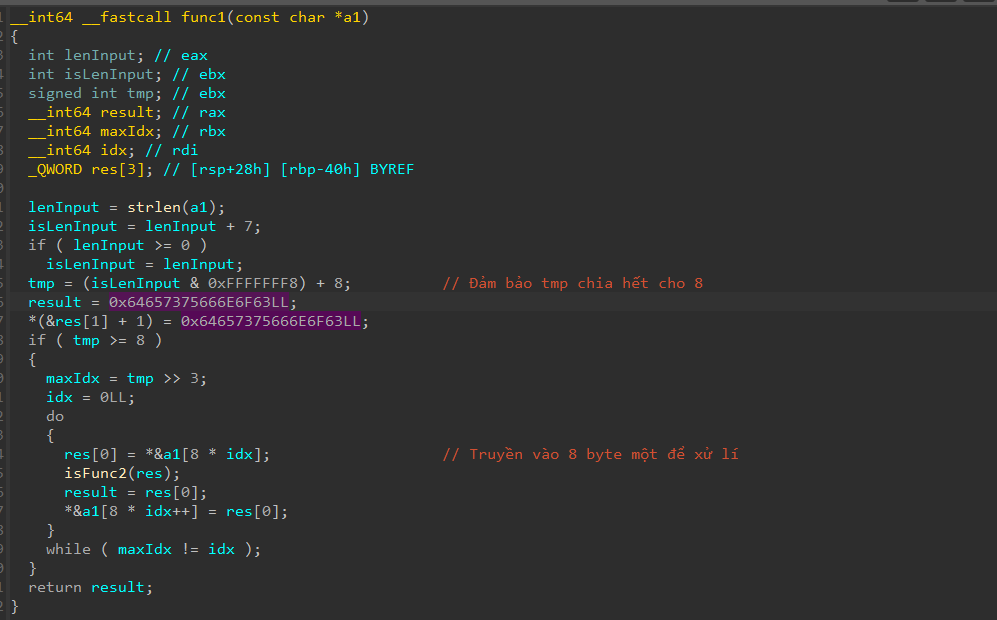
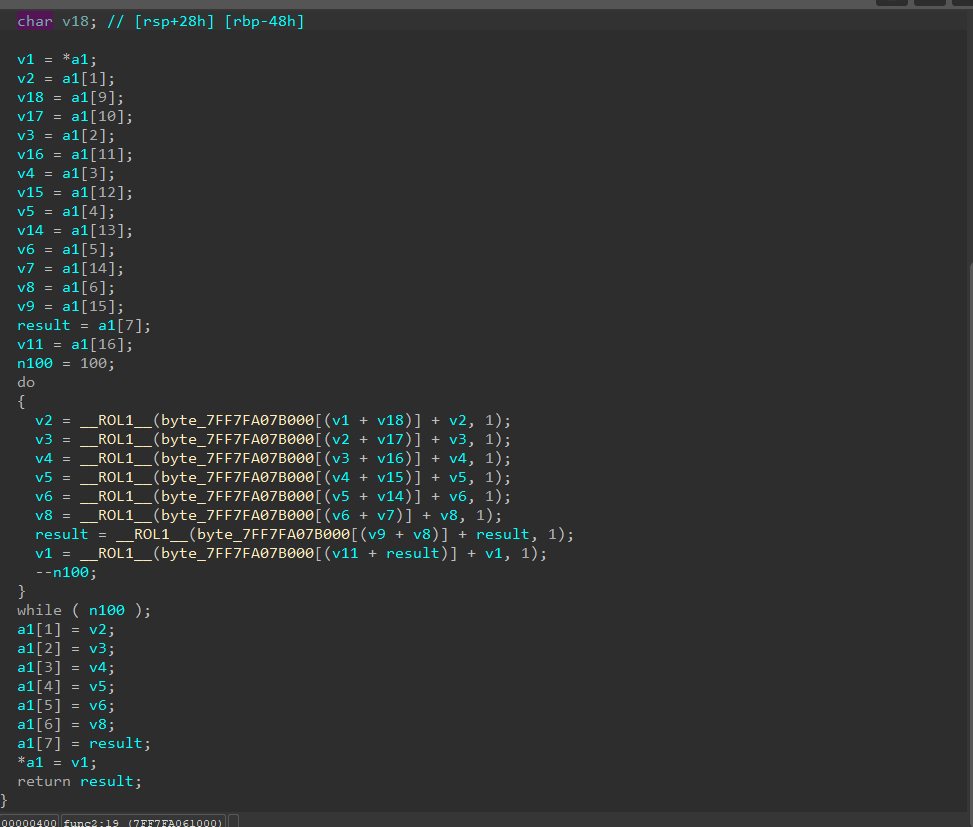
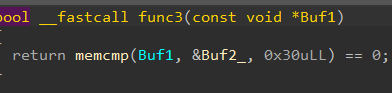


Rồi chúng ta hiểu sơ sơ như sau

1. Dữ liệu được truyền vào từng 8 byte 1 để mã hóa bằng việc dịch trái đủ 100 lần rồi gán lại
2. Kiểm tra giữa liệu được mã hóa bằng memcmp với tham số thứ 3 là 0x30 từ đó tính được len của flag phải là 0x30 = 48 kí tự

Debug thử với input 48 chữ a thử:

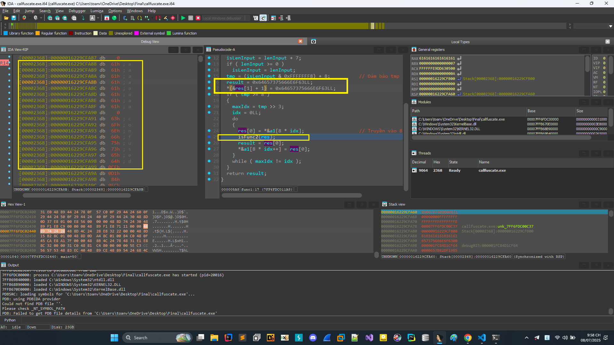

Chia thành 8 byte một rồi nối với chuỗi confused tiến hành truyền vào func2.

## 2. Viết script giải và lấy flag.

Quan trọng nhất là đoạn ở func2:

```C
char __fastcall func2(char *a) {
    int i;

    for (i = 0; i < 100; ++i) {
        a[1] = __ROL1__(byte_7FF6FDC1B000[(unsigned char)(a[0] + a[9])] + a[1], 1);
        a[2] = __ROL1__(byte_7FF6FDC1B000[(unsigned char)(a[1] + a[10])] + a[2], 1);
        a[3] = __ROL1__(byte_7FF6FDC1B000[(unsigned char)(a[2] + a[11])] + a[3], 1);
        a[4] = __ROL1__(byte_7FF6FDC1B000[(unsigned char)(a[3] + a[12])] + a[4], 1);
        a[5] = __ROL1__(byte_7FF6FDC1B000[(unsigned char)(a[4] + a[13])] + a[5], 1);
        a[6] = __ROL1__(byte_7FF6FDC1B000[(unsigned char)(a[5] + a[14])] + a[6], 1);
        a[7] = __ROL1__(byte_7FF6FDC1B000[(unsigned char)(a[15] + a[6])] + a[7], 1);
        a[0] = __ROL1__(byte_7FF6FDC1B000[(unsigned char)(a[16] + a[7])] + a[0], 1);
    }

    return ..... 
}

```

Đơn giản dễ hiểu như sau:
Tiến hành viết ngược lại, ở mỗi lần chúng ta tính giá trị a[i] mới được tính bằng a[i] trước đấy và a[j] trước đấy.

Gỉa sử khi đến đoạn a[0] ở lần lặp thứ 100 được tính bằng a[7] ở vòng lặp 99 và a[0] ở vòng lặp 99

Giờ chúng ta tính lật ngược lại từ a[0] thứ 100 rồi sẽ tính được a[99] rồi từ đấy tìm lại được ban đầu.

[Python Code](../code/solve_callfuscate.py)
```Python
buf2 = [
  0xE5, 0xA8, 0x07, 0x2E, 0xE8, 0x67, 0xB5, 0x0C, 0xF9, 0x05, 
  0xA1, 0xA8, 0xFA, 0x05, 0x0A, 0x66, 0xA0, 0xC1, 0x20, 0x4E, 
  0xE3, 0x7D, 0xD0, 0x04, 0x21, 0x67, 0xEC, 0x9E, 0x7D, 0xBC, 
  0x2D, 0x8D, 0x9B, 0x65, 0xDC, 0x71, 0xE4, 0x57, 0x81, 0x11, 
  0x1A, 0x71, 0x7F, 0x84, 0x2C, 0x88, 0x25, 0x94
]
table = [
  0x63, 0x7C, 0x77, 0x7B, 0xF2, 0x6B, 0x6F, 0xC5, 0x30, 0x01, 
  0x67, 0x2B, 0xFE, 0xD7, 0xAB, 0x76, 0xCA, 0x82, 0xC9, 0x7D, 
  0xFA, 0x59, 0x47, 0xF0, 0xAD, 0xD4, 0xA2, 0xAF, 0x9C, 0xA4, 
  0x72, 0xC0, 0xB7, 0xFD, 0x93, 0x26, 0x36, 0x3F, 0xF7, 0xCC, 
  0x34, 0xA5, 0xE5, 0xF1, 0x71, 0xD8, 0x31, 0x15, 0x04, 0xC7, 
  0x23, 0xC3, 0x18, 0x96, 0x05, 0x9A, 0x07, 0x12, 0x80, 0xE2, 
  0xEB, 0x27, 0xB2, 0x75, 0x09, 0x83, 0x2C, 0x1A, 0x1B, 0x6E, 
  0x5A, 0xA0, 0x52, 0x3B, 0xD6, 0xB3, 0x29, 0xE3, 0x2F, 0x84, 
  0x53, 0xD1, 0x00, 0xED, 0x20, 0xFC, 0xB1, 0x5B, 0x6A, 0xCB, 
  0xBE, 0x39, 0x4A, 0x4C, 0x58, 0xCF, 0xD0, 0xEF, 0xAA, 0xFB, 
  0x43, 0x4D, 0x33, 0x85, 0x45, 0xF9, 0x02, 0x7F, 0x50, 0x3C, 
  0x9F, 0xA8, 0x51, 0xA3, 0x40, 0x8F, 0x92, 0x9D, 0x38, 0xF5, 
  0xBC, 0xB6, 0xDA, 0x21, 0x10, 0xFF, 0xF3, 0xD2, 0xCD, 0x0C, 
  0x13, 0xEC, 0x5F, 0x97, 0x44, 0x17, 0xC4, 0xA7, 0x7E, 0x3D, 
  0x64, 0x5D, 0x19, 0x73, 0x60, 0x81, 0x4F, 0xDC, 0x22, 0x2A, 
  0x90, 0x88, 0x46, 0xEE, 0xB8, 0x14, 0xDE, 0x5E, 0x0B, 0xDB, 
  0xE0, 0x32, 0x3A, 0x0A, 0x49, 0x06, 0x24, 0x5C, 0xC2, 0xD3, 
  0xAC, 0x62, 0x91, 0x95, 0xE4, 0x79, 0xE7, 0xC8, 0x37, 0x6D, 
  0x8D, 0xD5, 0x4E, 0xA9, 0x6C, 0x56, 0xF4, 0xEA, 0x65, 0x7A, 
  0xAE, 0x08, 0xBA, 0x78, 0x25, 0x2E, 0x1C, 0xA6, 0xB4, 0xC6, 
  0xE8, 0xDD, 0x74, 0x1F, 0x4B, 0xBD, 0x8B, 0x8A, 0x70, 0x3E, 
  0xB5, 0x66, 0x48, 0x03, 0xF6, 0x0E, 0x61, 0x35, 0x57, 0xB9, 
  0x86, 0xC1, 0x1D, 0x9E, 0xE1, 0xF8, 0x98, 0x11, 0x69, 0xD9, 
  0x8E, 0x94, 0x9B, 0x1E, 0x87, 0xE9, 0xCE, 0x55, 0x28, 0xDF, 
  0x8C, 0xA1, 0x89, 0x0D, 0xBF, 0xE6, 0x42, 0x68, 0x41, 0x99, 
  0x2D, 0x0F, 0xB0, 0x54, 0xBB, 0x16
]
res = [
  0x0, 0x63, 0x6F, 0x6E, 0x66, 0x75, 0x73, 0x65, 0x64
]
def rotate_left(a, b):
    return ((a << b ) | (a >> (8 - b))) & 0xff
def func1(idx):
    tmp = buf2[idx : idx + 8: 1]
    tmp += res
    return tmp
def func2(a):
    for i in range(100):
        for j in range(256):
            if a[0] == rotate_left((table[(a[7] + a[16]) & 0xff] + j) & 0xff, 1):
                a[0] = j
                break
        for j in range(256):
            if a[7] == rotate_left((table[(a[6] + a[15]) & 0xff] + j) & 0xff, 1):
                a[7] = j
                break
        for j in range(256):
            if a[6] == rotate_left((table[(a[5] + a[14]) & 0xff] + j) & 0xff, 1):
                a[6] = j
                break
        for j in range(256):
            if a[5] == rotate_left((table[(a[4] + a[13]) & 0xff] + j) & 0xff, 1):
                a[5] = j
                break
        for j in range(256):
            if a[4] == rotate_left((table[(a[3] + a[12]) & 0xff] + j) & 0xff, 1):
                a[4] = j
                break
        for j in range(256):
            if a[3] == rotate_left((table[(a[2] + a[11]) & 0xff] + j) & 0xff, 1):
                a[3] = j
                break
        for j in range(256):
            if a[2] == rotate_left((table[(a[1] + a[10]) & 0xff] + j) & 0xff, 1):
                a[2] = j
                break
        for j in range(256):
            if a[1] == rotate_left((table[(a[0] + a[9]) & 0xff] + j) & 0xff, 1):
                a[1] = j
                break
    a = a[:8]
    return a
flag = []
for i in range(0, 48, 8):
    retFunc1 = func1(i)
    tmp = func2(retFunc1)
    flag += tmp
print("".join(chr(x) for x in flag))
```

Thu được flag ```KMA{e81eabf0-db79-463d-b227-ea47dcf6cac6}```
