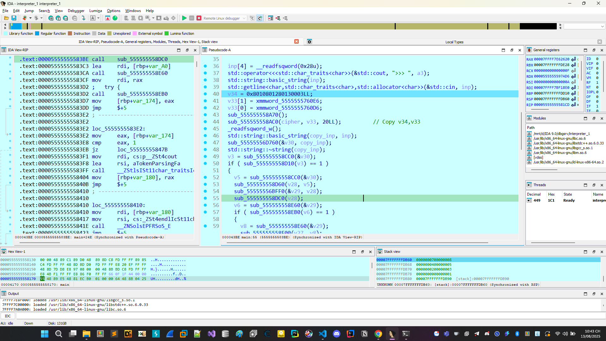
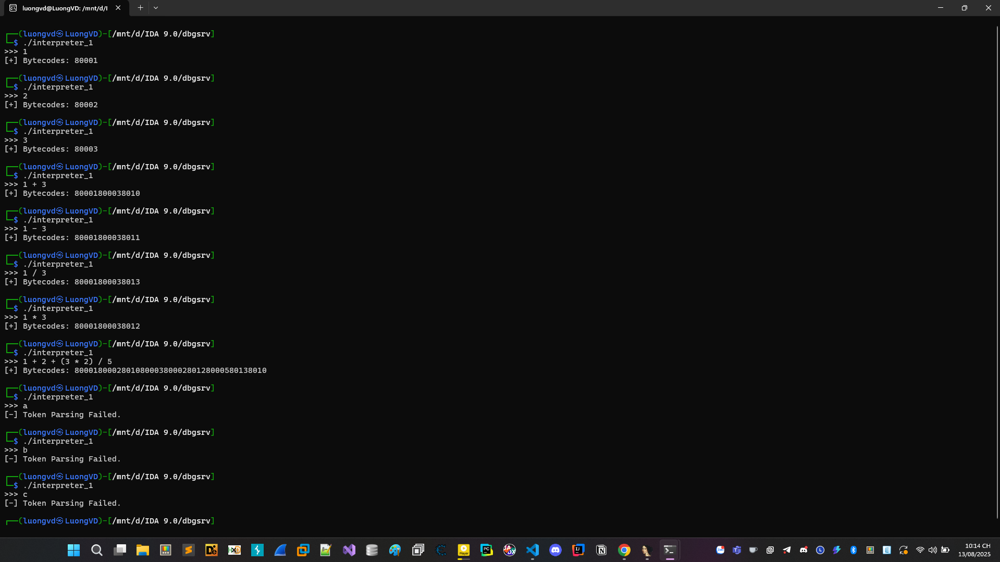
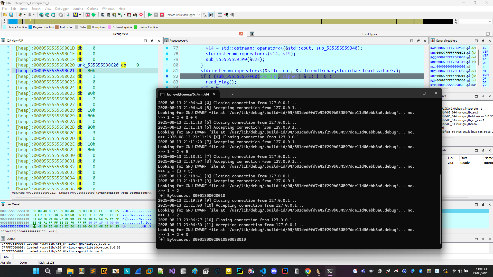

# interpreter_1

# Phân tích đề bài, nêu hướng giải quyết

File code C, 64 bit tiến hành mở bằng IDA.
Mới mở vào bài mở mã giả thì chúng ta thấy bài khá tởm, bài chứa quá nhiều code, cảm giác khá khó để nắm bắt được luồng chương trình, mọi thứ khá mơ hồ.


Khi thử chạy chương trình, một hồi chúng ta nhận ra:


Tóm lại chương trình có thể nhận vào 1 biểu thức +,-,*,/ có thể có ngoặc () sau đó chương trình trả về cho chúng ta mỗi chuỗi bytecodes.

Kết hợp với tên đề bài liên quan đến interpreter và bytecodes tóm lại khi chúng ta nhập thì nó gen ra như kia.

Mọi thứ dần đi vào ngõ cụt, có quá nhiều hàm, mọi thứ có vẻ quá phức tạp và khá dễ loạn, 1 hàm có thể bị gọi bằng nhiều hàm khác cuối cùng chỉ return lại giá trị. Bài này sử dụng kĩ thuật obf để chúng ta khó đọc hiểu source hơn rất nhiều.

Sau nhiều lần thử các input chúng ta nhận ra được 1 quy luật kiểu mơ hồ như sau:

Khi nhập 1 số vào thì dạng của bytecode in ra sẽ là 8000xx với xx là mã hex của số đó

```bash
┌──(luongvd㉿LuongVD)-[/mnt/d/IDA 9.0/dbgsrv]
└─$ ./interpreter_1
>>> 1000
[+] Bytecodes: 80003e8
```

Tiếp khi chúng ta thử các phép tính với 2 số thử chúng ta lại dễ dàng nhận ra được các quy luật

```bash
┌──(luongvd㉿LuongVD)-[/mnt/d/IDA 9.0/dbgsrv]
└─$ ./interpreter_1
>>> 1 + 2
[+] Bytecodes: 80001800028010

┌──(luongvd㉿LuongVD)-[/mnt/d/IDA 9.0/dbgsrv]
└─$ ./interpreter_1
>>> 1 - 2
[+] Bytecodes: 80001800028011

┌──(luongvd㉿LuongVD)-[/mnt/d/IDA 9.0/dbgsrv]
└─$ ./interpreter_1
>>> 1 * 2
[+] Bytecodes: 80001800028012

┌──(luongvd㉿LuongVD)-[/mnt/d/IDA 9.0/dbgsrv]
└─$ ./interpreter_1
>>> 1 / 2
[+] Bytecodes: 80001800028013

```

8010 sẽ là dấu + 

8011 sẽ là dấu - 

8012 sẽ là dấu * 

8013 sẽ là dấu / 

Khi thử với phép tính phức tạp hơn, chúng ta lại nhận ra tiếp được những điều như sau

```bash

┌──(luongvd㉿LuongVD)-[/mnt/d/IDA 9.0/dbgsrv]
└─$ ./interpreter_1
>>> 1 + (2 * 3) / 4
[+] Bytecodes: 80001800028000380128000480138010
┌──(luongvd㉿LuongVD)-[/mnt/d/IDA 9.0/dbgsrv]
└─$ ./interpreter_1
>>> (1 + 2) * 3 + 5
[+] Bytecodes: 80001800028010800038012800058010
```

Với biểu thức đầu là 1 + (2 * 3) / 4

Như kiểu dịch bên trên chúng ta sẽ có được 1 2 3 * 4 / + 

Tiếp với biểu thức (1 + 2) * 3 + 5

Như kiểu dịch bên trên chúng ta sẽ có được 1 2 + 3 * 5 + 


=> Khá giống cách truyển đổi từ trung tố sang hậu tố. 

Lúc này có thể cơ bản nhận định rằng cái chương trình này nó nhận vào input rồi chuyển thành dạng hậu tố với cái mớ bytecode kia.

Oke tiến hành debug và phân tích sâu tiếp 


## Phát hiện và khai thác

Sau khi debug, và check các giá trị 1 thời gian lâu :( chúng ta thấy rằng form của bài này sẽ như sau:


```C
int main() {
    string inp;
    cout << ">>> ";
    getline(cin, inp);
    // Chuẩn bị dữ liệu cipher
    init_cipher(cipher, v33, v34);
    // Parse input
    copy_inp = inp;
    tokenize_result = tokenize(copy_inp);

    if (tokenizer_success(tokenize_result)) {
        tokens = get_tokens(tokenize_result);
        parse_result = parse(tokens);

        if (parser_success(parse_result)) {
            ast = get_ast(parse_result);
            ctx = init_ctx();
            val = get_val(ctx);
            bytecode = generate_bytecode(ast, val);

            if (compiler_success(bytecode)) {
                enc_inp = encode_input(bytecode);
                cout << "[+] Bytecodes: ";
                
                // In từng bytecode
                pos1 = get_pos1(enc_inp);
                pos2 = get_pos2(enc_inp);
                while (!is_end(pos1, pos2)) {
                    code = next_code(pos1);
                    cout << code;
                    advance(pos1);
                }
                cout << endl;

                // Kiểm tra chạy thử
                if (run(enc_inp, cipher) & 1) {
                    read_flag();
                }

                free(enc_inp);
            } else {
                cout << "[-] Compiler Failed." << endl;
            }

            free_ctx(ctx);
            free_ast(ast);
        } else {
            cout << "[-] Token Parsing Failed." << endl;
        }

        free_parse(parse_result);
    } else {
        cout << "[-] Tokenizer Failed." << endl;
    }

    free_tokenize(tokenize_result);
    free_cipher(cipher);
    return result_code;
}
```


Oke thứ mà chúng ta cần quan trọng nhất là luồng của input và so sánh, so sánh như nào đối tượng như nào. Khi nhìn form này sẽ đỡ hơn. Chúng ta thấy input truyền vào thành enc_inp và được so sánh với cipher, cipher ban đầu được khởi tạo bằng cách copy với v33 và v34.

Logic hàm run khá đơn giản chỉ là kiểm tra chúng có giống nhau hay không thôi. Lúc này tôi sẽ tiến hành đặt breakpoint lấy giá trị và thử dịch ngược lại theo quy tắc mà chúng ta đã nói trước đó.

Gỉa sử mới input là 1 + 2 + 3 chúng ta thấy rằng:



Input bắt đầu bằng số 0, sau đó sẽ là các giá trị số chúng được phân cách bằng 0 rồi các dấu các kiểu. Lúc này cũng đã mường tượng được cái cách mà chương trình mã hóa. Tiến hành lấy cipher là dạng hậu tố và chuyển về trung tố là chúng ta sẽ thành công tìm lại được input để khai thác bài này.

```
[heap]:0000555555597EE0 unk_555555597EE0 db    0                ; DATA XREF: [stack]:00007FFFFFFFDC88↓o
[heap]:0000555555597EE1 db  80h
[heap]:0000555555597EE2 db    3
[heap]:0000555555597EE3 db    0
[heap]:0000555555597EE4 db    0
[heap]:0000555555597EE5 db  80h
[heap]:0000555555597EE6 db    2
[heap]:0000555555597EE7 db    0
[heap]:0000555555597EE8 db    0
[heap]:0000555555597EE9 db  80h
[heap]:0000555555597EEA db    5
[heap]:0000555555597EEB db    0
[heap]:0000555555597EEC db  12h
[heap]:0000555555597EED db  80h
[heap]:0000555555597EEE db    0
[heap]:0000555555597EEF db  80h
[heap]:0000555555597EF0 db    4
[heap]:0000555555597EF1 db    0
[heap]:0000555555597EF2 db  11h
[heap]:0000555555597EF3 db  80h
[heap]:0000555555597EF4 db  10h
[heap]:0000555555597EF5 db  80h
[heap]:0000555555597EF6 db    0
[heap]:0000555555597EF7 db  80h
[heap]:0000555555597EF8 db    7
[heap]:0000555555597EF9 db    0
[heap]:0000555555597EFA db    0
[heap]:0000555555597EFB db  80h
[heap]:0000555555597EFC db    6
[heap]:0000555555597EFD db    0
[heap]:0000555555597EFE db    0
[heap]:0000555555597EFF db  80h
[heap]:0000555555597F00 db    3
[heap]:0000555555597F01 db    0
[heap]:0000555555597F02 db  13h
[heap]:0000555555597F03 db  80h
[heap]:0000555555597F04 db  12h
[heap]:0000555555597F05 db  80h
[heap]:0000555555597F06 db  10h
[heap]:0000555555597F07 db  80h
```


Hậu tố

```
3
2
5
*
4
-
+
7
6
3
/
*
+
```
Trung tố 3 + ((2*5) - 4) + 7 * (6/3)


## Tổng kết

Input thỏa mãn là ```3 + ((2*5) - 4) + 7 * (6/3)```


